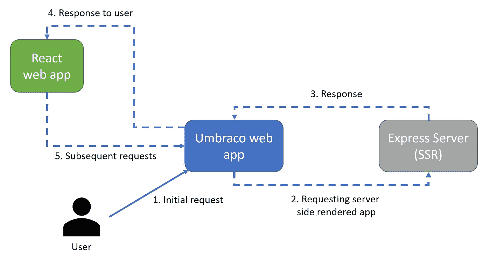
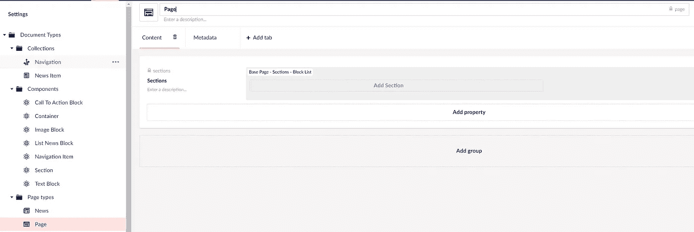

# 用 Umbraco 构建一个包含服务器端渲染的 React 前端

> 原文：<https://betterprogramming.pub/umbraco-v10-with-server-side-rendering-ssr-react-frontend-dde6cb6c2f4c>

## 创建搜索引擎优化友好的网络应用

用 DALL-E (OpenAI)创建

最近，我想尝试一下，如果 Umbraco CMS 可以与 React 前端集成，同时保持搜索引擎友好。如果我们想让网络爬虫尽可能容易地索引我们的网页，解决方案必须包括服务器端呈现(SSR)。该代码是[权威机构](https://authority.se/)概念验证的一部分。

我偶然发现了与 SSR 和 Umbraco 相关的不同来源，如 [this article](https://medium.com/mirum-budapest/building-react-on-an-umbraco-backend-3147d59a292f) 或 [ReactJS。NET](https://reactjs.net/features/server-side-rendering.html) ，但是第一个有遗漏的回购，另一个从 2020 年 6 月开始就没有更新过，也就是说写这个帖子的时候截止到今天不支持 [React 18](https://reactjs.org/blog/2022/03/29/react-v18.html) 。

经过几次尝试和错误，我可以得到一些非常干净的工作，所以我想我应该与你分享我采用的实现。

# 解决方案概述

该解决方案由三个不同的部分组成:

*   Umbraco Web 应用程序
*   服务器端渲染应用程序(Express — Node.js)
*   反应应用程序

解决方案图表

具体来说，第一个请求是从 Express 服务器向涉及 SSR 的 Umbraco `RenderMvcController`发出的，所有后续请求都是从 React 应用程序向各个 Umbraco `ApiControllers`发出的。

Docker-compose 运行应用程序，但可能在本地调试。

# 苏维埃社会主义共和国

第一个请求是由一个翁布拉克`RenderMvcController`提出的。默认情况下，Umbraco 项目中的所有文档类型共享相同的模板，因此对 Umbraco 页面的所有请求将使用相同的功能，即`SsrDataController`中的`IndexAsync`。

从那里，控制器通过调用`Mediator`来检索模型，以便检索我们的 SSR 所需的模型。

一旦模型被检索，它被注入到结果模板`Index.cshtml` 中，并使用`Master.cshtml` 模板。

添加到 React web 应用程序根的`TagHelper` (asp-prerender-data)将依次向我们的 Express 服务器发出 POST 请求，并将模型作为有效负载。

我们的应用程序组件在服务器端被实例化，并提供了渲染页面所需的所有数据(通过 props 注入)。

React 应用程序的 App 组件呈现后，它将作为一个字符串返回给我们的 Umbraco 应用程序，最终注入到我们的视图中，并将视图返回给用户。

如果您检查页面的代码源，您将会看到页面的主体已经存在，并且预先填充了数据。

来自 React 应用程序的所有后续请求都使用指向各种 Umbraco API 控制器的其他端点。

**NB** :当一个组件被预渲染时，`useEffect`钩子没有运行，因此此时没有请求。

**NB2** :如果你的应用包含路由，确保使用`StaticRouter` 而不是`BrowserRouter`，否则`ReactDOMServer`将无法渲染你的组件。这就是为什么我的应用程序的根用一个`Router.tsx`组件包装的原因，这个组件将决定选择哪种路由器类型。

# 翁布拉科

Umbraco 应用程序分为三种文档类型:

*   收集
*   成分
*   页面类型

页面类型非常简单，主要包含属性:

*   [计]元数据
*   区段的块列表>容器>块

# 反应应用程序

React 应用程序是通过 [Create-React-App](https://create-react-app.dev/) 设置的，相当基本，有一个导航栏、主体和一些块类型。没什么特别的。

这里唯一的要求是，React 应用程序显然应该知道一些 Umbraco ApiControllers 返回的响应类型。

# 密码

所有代码都可以在这个 [GitHub repo](https://github.com/clement-joye/umbraco-react-ssr) 中找到，自述文件提供了构建和测试解决方案所需的所有信息。

# 更进一步

在这个示例中，只发出了一个检索页面主体的请求，这足以检索页面的不同部分和块。尽管可能需要其他请求来从导航项目中检索数据，或者例如在加载之后由其他组件发出的后续请求。

为了简化起见，我没有包括这一部分。

# 信用

发起预渲染的请求是受[该报告](https://github.com/dawiddworak88/ASP.NET-Core-React-and-SSR)的启发。