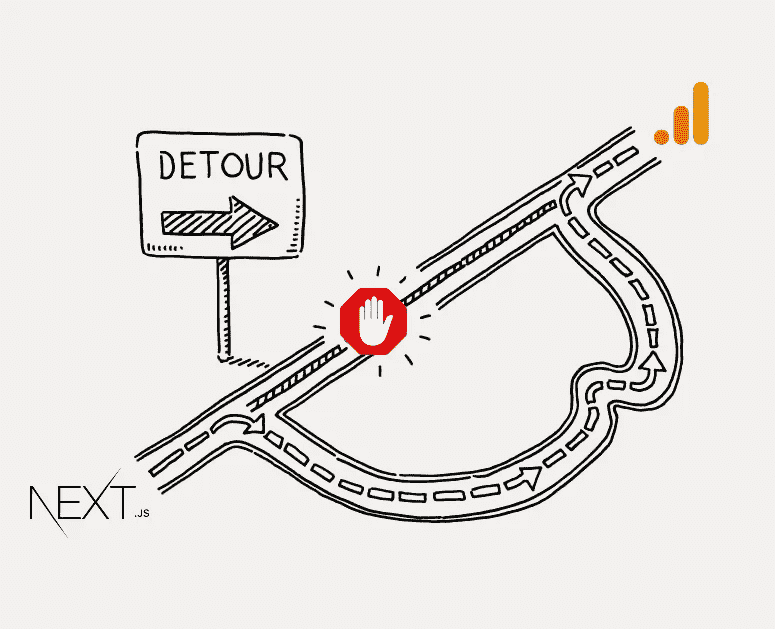
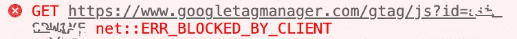
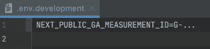
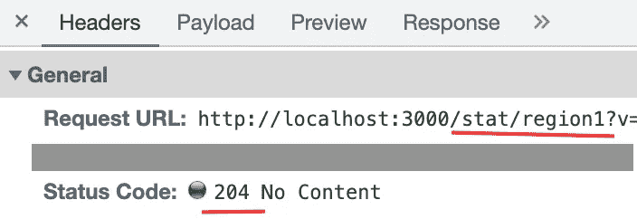

# 用 Next.js 解除对谷歌分析的封锁

> 原文：<https://betterprogramming.pub/unblocking-google-analytics-with-next-js-46b5f18b29b3>

## 通过重新路由欺骗广告拦截器



作者创造的形象

这种解除封锁的方法已经过谷歌分析(Google Analytics)的测试，但应该适用于其他行业标准的分析解决方案，这些解决方案的服务器地址已经被广告拦截器规则封锁。

我成功地将 GA4 与我的由 Next.js 支持的网站集成在一起，并发现了一些技巧。老实说，我做的比我应该做的还要多，所以我决定在这里分享我的成果。

# 问题是

当我想更好地掌握我的网站时，我决定添加谷歌分析脚本，并面临两个问题:

1.  Next.js 应用程序中的一些 Google Analytics 指标收集不正确
2.  谷歌分析脚本被安装在用户浏览器上的许多广告拦截扩展拦截，所以它很少工作

第一个问题与 Next.js 的性质及其针对快速页面加载的优化有关。在某些情况下(比如 PWA)，当我们在同一个 Next.js 应用程序中进入下一个页面时，实际的页面重新加载并没有发生。因此，GA 脚本无法发现差异并报告用户只访问了一个页面，即第一个页面。

第二个问题更复杂，它是关于“智能”广告拦截器规则，阻止常见的第三方分析收集脚本 URL。



广告拦截器阻止了 GA(Google chrome 控制台错误)

虽然我想尊重用户不被“跟踪”的选择，但当一个`gtag`脚本被屏蔽时，我会丢失重要的 SEO 统计数据。这个统计数据应该帮助我更好地理解我可以为用户体验做些什么。

例如，当用户可以通过选择退出 cookies 许可来决定何时加载分析脚本时，比盲目阻止要好得多。

```
{(wantCookie !== 'no') && (<Script src={`...`}/>)}
```

*用逻辑& &操作符*嵌入带有“内联 If”的 GA 脚本的例子

# 解决方案

丢失`PageViews`统计数据的解决方法非常简单。为了在没有实际页面重载的情况下收集这些指标，我们需要使用 React Effect Hook，并在每个`routeChange`事件中手动向 Google 发送`pageView` stat。有一个 [lib](https://github.com/MauricioRobayo/nextjs-google-analytics) 可以做到这一点，稍后我会告诉你如何使用它。

现在，关于讨厌的广告拦截器。在快速搜索后，我寻找销售完整的[解决方案产品](https://dataunlocker.com/)的人，但这可以更容易地免费完成。(P.S .我很抱歉用这个教程毁了某人的商业模式)。我们必须使用本地版本的收集脚本，并代理所有被阻止的网址。

## 第一步

我知道，如果我通过一个本地(网站源)地址代理这些请求，它将不再被阻止。但是我如何创建代理呢？与 [Next.js 重写](https://nextjs.org/docs/api-reference/next.config.js/rewrites)一样，它最终成为一个简单的任务，只需要在`next.config.js`文件中添加几行。看起来是这样的:

```
async rewrites() {
    return [
        {
            source: "/stat/:region",
            destination: "https://:region.google-analytics.com/g/collect",
        },
    ]
},
```

注意，在一个请求中可能有不同的区域(可能是为了更好的响应时间)，所以我们将其配置为一个`:region`变量，以便在数据收集脚本中进行替换。

## 第二步

现在我们需要加载`gtag`脚本(匿名模式)并保存到`/public/js/ga-stat.js`文件。它应该可以通过以下链接获得:

> [https://www.googletagmanager.com/gtag/js?id=YOUR_GA_ID](https://www.googletagmanager.com/gtag/js?id=YOUR_GA_ID)

然后打开并用`*“/stat/”+a*`替换`*“https://”+a+”.google-analytics.com/g/collect”*`，这样最终，它将被第一步中的 config 用正确的区域重写。

本地存储`gtag`脚本是这个解决方案的一个缺点，因为我们可能会丢失来自 Google 的任何父脚本更新，并且必须在之后手动更新。(如果你对此有更好的解决方案，请评论。)

## 第三步

此时，我们需要添加[nextjs-Google-analytics](https://github.com/MauricioRobayo/nextjs-google-analytics)lib 并修改我们的`_app.tsx`文件。代码如下:

```
...
<GoogleAnalytics gtagUrl='/js/ga-stat.js' strategy="lazyOnload" trackPageViews />
<Component {...pageProps} />
...
```

这个库简化了整个 GA-Next.js 集成，帮助我们正确地收集`PageViews`。在这里，我使用第 2 步中的本地`gtag`脚本和`strategy=”lazyOnload”`来最小化 GA 对用户浏览体验的影响。

此外，您必须在`.env.production`和/或`.env.developmpent`文件中设置您的`NEXT_PUBLIC_GA_MEASUREMENT_ID`，以控制您希望 GA 何时工作。



## 确认

一旦你做得正确，控制台中应该不会再出现关于 GA 脚本被阻止的错误。相反，您应该看到对我们的定制路由的成功的数据收集请求。最终，他们被代理到类似 https://redion1.google-analytics.com/g/collect[*的东西。*](https://redion1.google-analytics.com/g/collect)



对自定义 stat 路线的成功请求

# 摘要

将 Google Analytics 添加到 Next.js 应用程序中比将标准的`gtag`代码片段插入到`index.tsx`文件中更加棘手。最后，我设法让它与 PWA 一起正常工作，并通过以下方式避免了由于客户端浏览器扩展而导致的数据收集请求被阻塞:

*   使用 [nextjs-google-analytics](https://github.com/MauricioRobayo/nextjs-google-analytics) 库
*   将`gtag`脚本保存在本地，并对其稍作修改
*   用 Next.js 重写代理被阻止的 URL

我希望我节省了你搜索的时间，下一轮见。