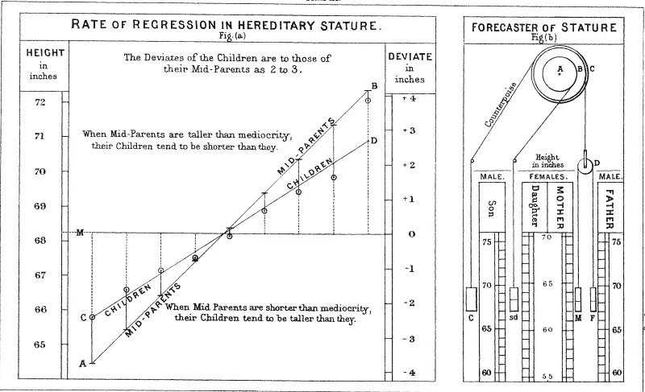
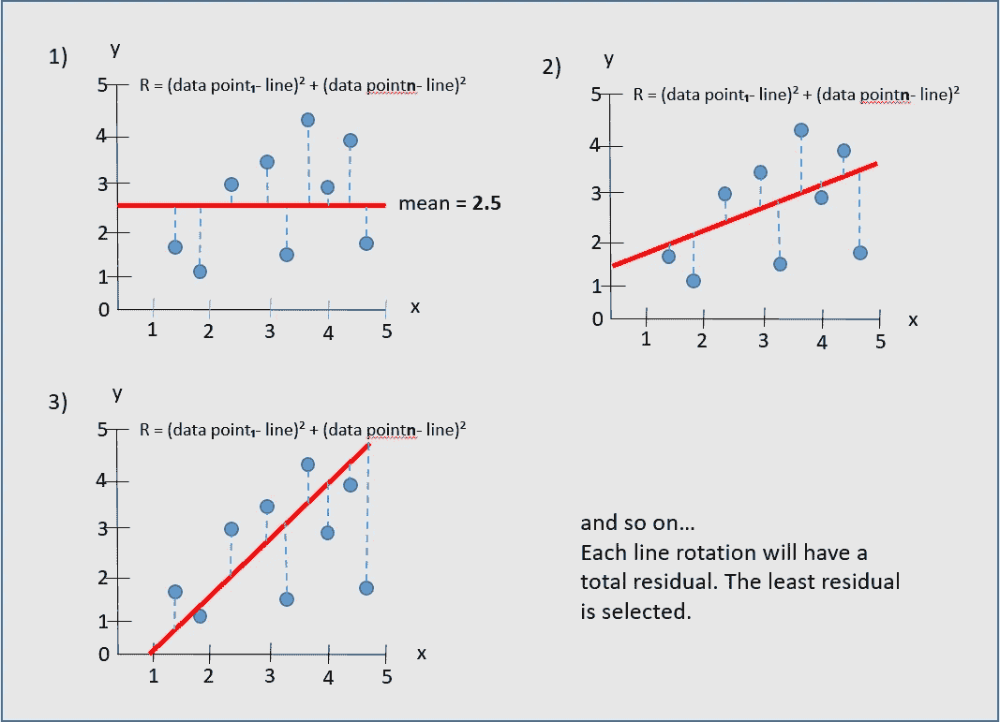
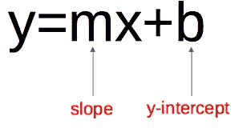
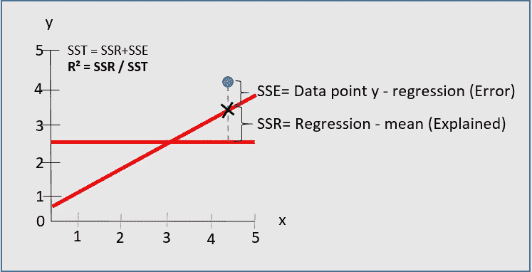
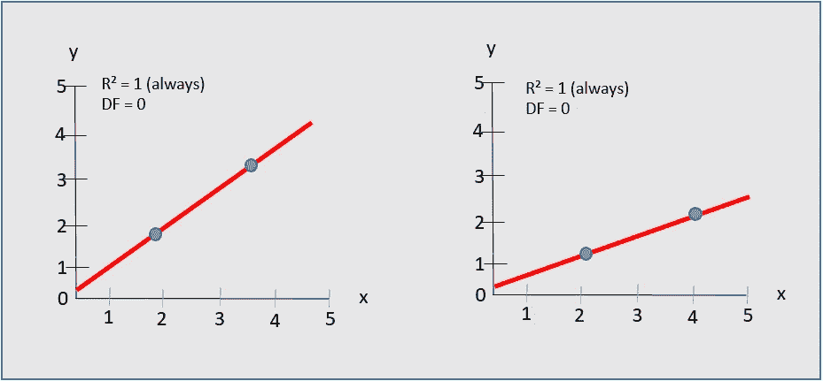
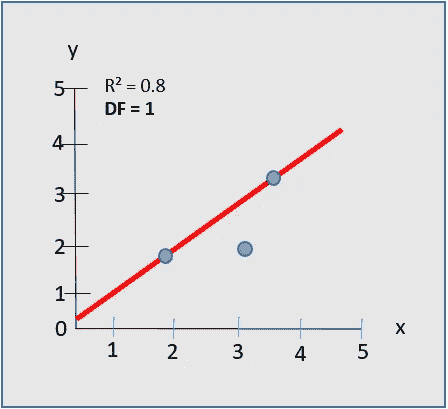

# 了解基本的线性回归概念，开始机器学习

> 原文：<https://betterprogramming.pub/understand-basic-linear-regression-concepts-to-get-started-with-machine-learning-49e2c7a02c39>

## 为什么叫“回归”，如何找到回归线(直觉)，如何衡量它有多好


克里斯·劳顿在 [Unsplash](https://unsplash.com?utm_source=medium&utm_medium=referral) 上的照片。

是时候在我的机器学习之旅中后退两步，深入幕后的数学、算法和直觉了。学习 PyTorch、TensorFlow 等框架以及 Python 语言本身非常有趣。但是我意识到我总是被卡住，不得不绕回来更好地理解事情。我想缩小这个差距。

我将从写线性回归开始。各种计算和公式我就不赘述了。相反，我想把重点放在建立直觉和教授基础知识上。

[线性回归](https://www.oreilly.com/library/view/hands-on-machine-learning/9781492032632/)是机器学习中使用的一种建模方法和算法，用于评估一个因变量与一个或多个自变量之间的相关性。这里有几个例子:

*   年工作经验和薪水——如果你想从一个人的经验预测他的薪水，那么“薪水”就是因变量 *y (* 图中的纵轴/y 轴 *)* ，“经验”就是自变量 *x* (图中的横轴/x 轴*)。*可以使用其他自变量(也称为解释变量)，如“教育程度”(如学士、硕士、博士)。
*   人的身高和鞋码-选择您想要预测的变量，并应用与上述相同的逻辑。

它可以回答诸如值 *y* 为什么会变化这样的问题？为什么在某一天，它高于平均水平？目标是根据其他属性 *x* (例如经验年限)预测(仅是估计)一个值 y(例如薪水)。

# 为什么叫“回归”？

首先，为什么叫“回归”这个名字？我想知道，因为在许多情况下，有一种增长的趋势——一种进步。例如，人越高，他们的鞋码就越大。随着一个公司在广告上花费更多，销售额往往会增加。

原来“回归”这个名字是偶然产生的。

在 1886 年(研究结果发表的那一年)，一位名叫弗朗西斯·高尔顿的英国优生学家(奇怪的是，他是查理斯·达尔文的堂兄弟)研究并测量了数百人相对于他们父母的身高，发现孩子们的身高总会向平均值(T3)回归，或者像弗朗西斯爵士常说的那样，向 T4 的平庸(T5)回归。

> “如果父母比平庸之辈高，他们的孩子往往比他们矮。如果父母比平庸之辈矮，他们的孩子往往会比他们高。”



图一。遗传身材的退化率。摘自[人类学杂记——遗传身材回归平庸](https://galton.org/essays/1880-1889/galton-1886-jaigi-regression-stature.pdf)。

如果用例显示了一个渐进的行为，我们可以称之为“线性进展”或类似的东西。

# 如何求回归线

[回归线](https://www.amazon.co.uk/gp/product/1119293529/ref=as_li_tl?ie=UTF8&tag=wiley01-20)，也称为最佳拟合线，向右上方或下方穿过图表。它表示 y 轴的变化与 x 轴的变化成比例。例如，如果工作经验增加了五年，工资会有多少变化？

要找到这条线并最终找到它的关键属性:

*   y 轴截距 **—** 直线与 y 轴相交的点。
*   斜率-线变化的速率。

你可以遵循几个不太难的[计算步骤](https://www.youtube.com/watch?v=JvS2triCgOY)，但是我不想把重点放在它们上面。

尽管不实用，另一种找到回归线的方法是比较不同位置的多条线，并测量它们到每个数据点的距离(图 2)。

从最差的线开始，代表 *y* 和 *x* 之间的相关性。在 y 轴的平均值处交叉的平坦曲线。想象一下，在没有变量 *x* 的情况下，你必须估计一个 *y* 值。假设您想预测一个人的工资，而不知道他的工作年限或任何其他信息，更安全的估计是 y 轴上的平均值。

下一步是旋转直线，并再次测量与数据的距离。然后你旋转并再次测量。诸如此类。

这个距离叫做*剩余* **。**从直线上的点减去每个数据点，将其平方，然后将它们相加。这就是每行的总残差:*(数据 point₁-线)+(数据 point₂-线)+(数据点 n 线)*。



图二。各种线的旋转表示。图片由作者提供。

你之所以平方距离，是为了让所有的值都是正值。从线下的观测值得到的距离是负的，线上的是正的。如果不平方，双方可以互相抵消。

同样，尝试和比较这样的行是不实际的。即使你这样做了，仅仅通过目测图表也不会清楚线条变化的速率(斜率)。仍然需要计算斜率。

尽管如此，意识到如何不用数学(或只用一点点)就能完成大部分工作，有助于你更好地理解基本原理。

## 求斜率和 y 截距后如何预测 y？

您可以将斜率和 y 轴截距代入图 3 中的等式:



图 3。直线的方程。图片由作者提供。

假设你知道一个人的工作年限，想估算一下他的工资。

*   *y* =？(工资)
*   *x* = 5(经验)
*   *m* = 8(斜率——线条变化的速率)
*   *b* = 2 (y 轴截距——直线在 y 轴的交叉点)

```
y = 8*5 + 2
y = **42** (in thousands)
```

# 线(R )有多好？

找到回归线后，您需要评估它与数据的拟合程度— [它消除了多少预测误差](https://www.khanacademy.org/math/ap-statistics/bivariate-data-ap/assessing-fit-least-squares-regression/a/r-squared-intuition)？ *R* 的值可以在 *0* (0%)和 *1* (100%)之间。

想象两个没有太多相关性的变量。例如，看电视和草生长的速度(这是我能想到的最愚蠢的例子)。数据点是随机的。分散。一个变量不依赖于另一个变量。回归线测量值将具有较低的 *R* 。你不能相信预测。不会很准确。

另一方面，如果根据一个人的身高来关联和预测鞋码，数据点将更接近回归线。你甚至可以通过目测图表看到上升趋势。你会有一个高 *R* 值**。**

要计算 *R* 、**T3，你需要测量回归和均值线之间的距离。中线是它存在的最小可能线。例如，如果只有 *y* 变量(没有 x 轴)，回归线代表平均值。考虑到没有 *x* ，对 *y* 的一个好的预测总是平均值，因为你没有任何其他东西来衡量它。**

当与平均值进行比较时，您想要评估额外的变量 *x* 是否有所不同——有 *x* 比没有*好多少。*回归与均值的偏差称为预期/解释残差或残差平方和(SSR)。

除了与平均线比较，你还需要测量误差。误差是回归线到数据点的距离，即误差平方和(SSE)。

最后， *R* 等于被解释的残差(SSR)取的平方和( *SST=SSR + SSE* )的比例。这意味着 *R = SSR/SST* 。



图 4。r 计算。图片作者。

高 SSR 或低 SSE 意味着高*R**—该模型可以解释数据点和线之间的所有偏差。这个预测非常准确。*

*低 SSR 或高 SSE 意味着低 *R* 。*

# *自由度(DF)*

*[自由度](https://www.youtube.com/watch?v=4otEcA3gjLk)是给予回归线自由变化的数据点数量，从而更准确地评估 *y* 和 *x* 之间的强度。*

*假设你正试图评估 *y* 和一个独立变量 *x* 之间的相关性。先说工资和工作年限。如果只有一两个数据点，强度/ *R* 永远是 100%。不管线的位置如何，总是有可能穿过所有的观察。没有变化的自由。*

**

*图 5。没有自由度。图片由作者提供。*

*当您添加第三个数据点时，模型获得了一定的自由度。 *R* 有可能小于 *1* (100%)。*

**

*图 6。一个自由度。图片由作者提供。*

*公式为 *df = n-k-1* 。*

*   **n* =数据点/观察值的数量。*
*   **k* =自变量个数 *x* 。*

*对于图 6 所示的模型， *DF= 1* 。*

# *结论*

*研究和学习线性回归是机器学习领域的一个很好的起点，因为它是最简单的算法之一。当然，我并没有涵盖所有需要了解的内容，但首先这已经是足够的信息了。*

*我写这篇文章是为了尽可能的清晰，而不是太关注数学。它帮助我更好地理解直觉，希望它对你也一样。感谢阅读。*