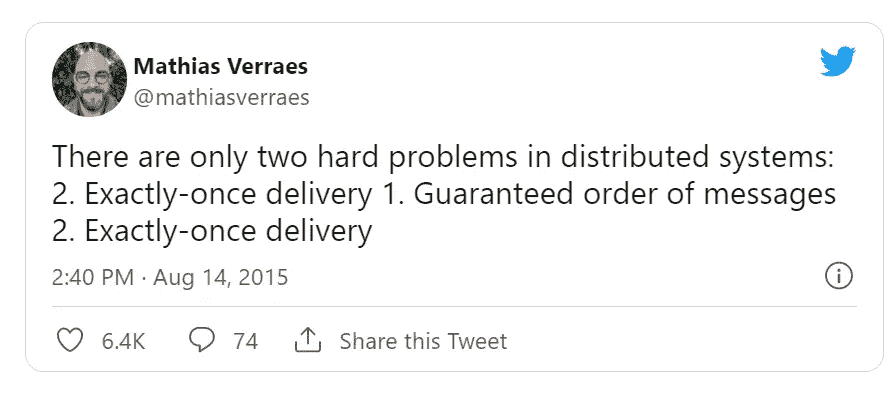

# 了解分布式计算…用鸭子！

> 原文：<https://betterprogramming.pub/understand-distributed-computing-through-ducks-d4d11b93f8e0>

## 分布式计算是一种高级软件策略，对许多人来说很难理解。现在可以简单用鸭子来解释了

S. Tsuchiya 在 [Unsplash](https://unsplash.com?utm_source=medium&utm_medium=referral) 上拍摄的照片

我一直是[的粉丝，这是一个很好的比喻](https://allenheltondev.medium.com/the-mighty-metaphor-your-new-secret-weapon-in-tech-a483957d72f0)。这是让人们理解复杂问题的最佳方式之一。如果你能找到一些你的听众能理解的东西，你就有很高的可能性让他们理解你所说的。

当你谈论像分布式计算这样的高级技术术语时，尤其如此。如果你是云的新手，你或你的一些同事可能听说过短语*分布式计算*，但可能不知道它的确切含义。

不要害怕，今天我们将通过一个比喻来学习什么是分布式计算。一个很好的鸭子。

# 什么是分布式计算？

简而言之，分布式计算是“多台计算机作为一个系统一起工作”的一种奇特说法。当工作量变大时，计算机在它们之间分配工作，使事情变得快速有效。

对于云原生应用程序，您通常会在消息传递系统中看到这种情况。如果您向队列添加一些工作，多台计算机/服务器会查看同一个队列并一起处理它。

## 鸭子呢？

好了，现在我们明白了我们要解释什么，让我们把鸭子带进来。

想象你在公园给鸭子喂面包(*提示:不要真的给鸭子喂面包，这对它们的饮食来说* [*不是最好的*](https://www.thespruce.com/is-feeding-ducks-bread-bad-386564) )。你拿着你的面包，走向一群鸭子。

你把面包一片一片扔给他们，他们会抓着吃。你扔出面包的速度更快，不同的鸭子可以在其他鸭子吃的时候抓住面包片。

几分钟后，你的整条面包就没了。那些鸭子真的很快就能撕开面包。如果只有一只鸭子，那要花更长的时间才能吃完面包。你必须等着孤独的鸭子吃完那片面包，然后再把下一片扔给她。

这就是分布式计算。当一个消息或工作单元进来时，服务器看到它，捡起它，并处理工作。服务器越多，在负载下完成工作的速度就越快。

# 分布式计算的常见问题

表面上看，这听起来很棒。把更多的服务器扔出去，把它们连接起来，你就有了一个超级快的容错系统，对吗？

Weeeeeellll，是也不是。

大量负载过重的服务器将开始相互竞争工作。Mathias Verraes 说得好:

为什么这些难题很难解决？让我们回到鸭子身上。

## 恰好一次交货

恰好一次传递保证消息只被处理一次。听起来应该很容易。

一圈鸭子都在等你扔出一片面包。你扔一片，两只鸭子同时抓住它。他们打了一分钟，但最终，面包碎了，两只鸭子分享了同一块面包。这真的是为了一只鸭子，但你不能控制他们。时机恰到好处，他们俩同时抓住它，最后把它分开了。

这就是分布式计算很难一次交付的原因。你不能让服务器互相关注，看谁得到了什么。有时候时机刚刚好，两台机器会拿起同一个消息处理两次。

## 保证消息顺序

保证订单听起来很像。如果我分别用字母 A、B、C 和 D 发送消息，我希望首先处理 A，然后是 B，然后是 C，最后是 D。

在我们的鸭子场景中，我们又回到了一片一片地扔面包片。鸭子喜欢它，所以我们更快地扔出面包。但是有几只鸭子比其他的大。他们抓起面包，一口吞下，而其他鸭子可能需要几秒钟才能吃完。

一只小鸭子抓起一片面包开始吃。然后大鸭子抓起下一片，整个吞下。几秒钟后，小鸭子吃完了它的一片面包。你扔的面包是按正确的顺序拿的，但它是按不同的顺序完成的。

对电脑来说，这很重要。如果这一系列消息相互依赖才能完成，那么您可能会遇到一些问题。

你不能保证机器处理信息的速度有多快。即使系统中的所有服务器都具有完全相同的规格，环境或网络相关的因素也会阻止它在其他服务器之前完成。这就是分布式系统中难以保证顺序的原因。

# 最后的想法

分布式计算是实现大规模性能的一种不可思议的方式。如果你使用像[无服务器](/7-aws-serverless-design-principles-for-solutions-architects-2be22717713b)这样的云原生技术，管理成百上千台机器的复杂性将从你身上抽离。您将获得规模和性能的优势，而无需担心如何保持计算机的最新和同步。

如果你还没有，鼓励你的团队考虑为你的软件实现一个分布式系统。你的顾客会感谢你的。希望能够以一种有趣而简单的方式描述什么是分布式计算将有助于您建立一种共同的理解，并使您的团队更愿意解决它。

祝你好运，记得永远开心！