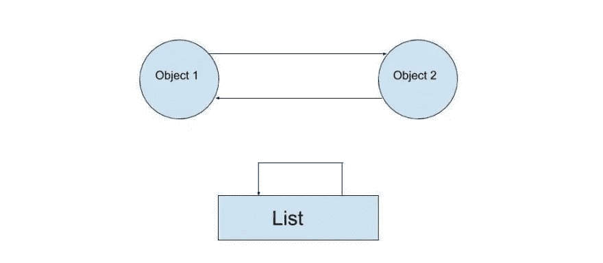

# 了解 Python 中的垃圾收集

> 原文：<https://betterprogramming.pub/understand-garbage-collection-in-python-5bb118d1748e>

## 理解内存管理是如何工作的，尽管您不必亲自去做


马库斯·斯皮斯克在 [Unsplash](https://unsplash.com/s/photos/programmer?utm_source=unsplash&utm_medium=referral&utm_content=creditCopyText) 上拍摄的照片

在像 C 或 C++这样的语言中，程序员负责堆上内存的动态分配和释放。但是在 Python 中，程序员不必预分配或释放内存。

Python 使用以下垃圾收集算法进行内存管理:

*   引用计数
*   循环检测算法(循环引用)

# 引用计数

引用计数是一个简单的过程，当程序中没有引用对象时，被引用对象被释放。

简而言之，当引用计数变为`0`时，对象被释放(释放其分配的内存)。

让我们看看下面的例子:

```
def calculate_sum(num1, num2):
    total = num1 + num2
    print(total)
```

在上面的例子中，我们有三个本地引用`num1`、`num2`和`total`。这里，`total`与`num1`和`num2`不同，因为它在块内只有一个引用——因此它的引用计数是 1。`num1`和`num2`在块外被引用，所以它们的引用计数可能不止一个。

因此，当函数执行完毕时，`total`的引用计数会减少到零。这是因为它被垃圾收集器跟踪。

垃圾收集器发现`total`不再被引用(引用计数字段达到零)并释放其分配的内存。

在函数之外声明的变量不会被销毁——即使在函数完成执行之后。

我们也可以使用`del`语句进行手动删除。`del`语句删除一个变量及其引用。当引用计数达到`0`时，它将被垃圾收集器收集。

引用计数算法也有一些问题，比如循环引用。

# 循环引用

当一个或多个对象相互引用时，就会出现引用循环。



正如你在上面的图像中看到的，`list`物体指向自己，`object1`和`object2`指向对方。此类对象的引用计数始终至少为一。

让我们看看实际情况:

```
import gcgc.set_debug(gc.DEBUG_SAVEALL) lst = []
lst.append(lst)lst_address = id(lst)del lstobject_1 = {}
object_2 = {}
object_1['obj2'] = object_2
object_2['obj1'] = object_1obj_address = id(object_1)del object_1, object_2
```

在上面的例子中，`del`语句删除了变量及其对对象的引用。

让我们使用`gc.collect`来检查被删除的变量。`gc.collect`保存到`gc.garbage`而不是删除。

```
>>> gc.collect()
3
```

当我们删除一个变量时，我们只删除了`__main__`引用。现在我们根本无法访问`lst`、`object_1`、`object_2`，但是这些变量仍然有一个引用。这意味着引用计数是 1—引用计数算法不会收集它。

检查以下参考计数:

```
import sys
print(sys.getrefcount(obj_address))
print(sys.getrefcount(lst_address))2
2
# 1 from the variable and 1 from getrefcount
```

将这个数字乘以 100 万个对象，您肯定会遇到严重的内存泄漏问题。

对于这种引用循环，Python 有另一种算法专门用来发现和破坏循环引用。也是 [Python 的 GC](https://docs.python.org/3.6/library/gc.html) 唯一可控的部分。

# 摘要

Python 有两种垃圾收集算法:一种用于处理引用计数——当引用计数达到零时，它删除对象并释放分配给它的内存。另一个是循环检测算法，它发现并销毁循环引用。

我希望您现在对 Python 中的垃圾收集算法有了相当的理解。

# **参考**

[https://rushter.com/blog/python-garbage-collector/](https://rushter.com/blog/python-garbage-collector/)