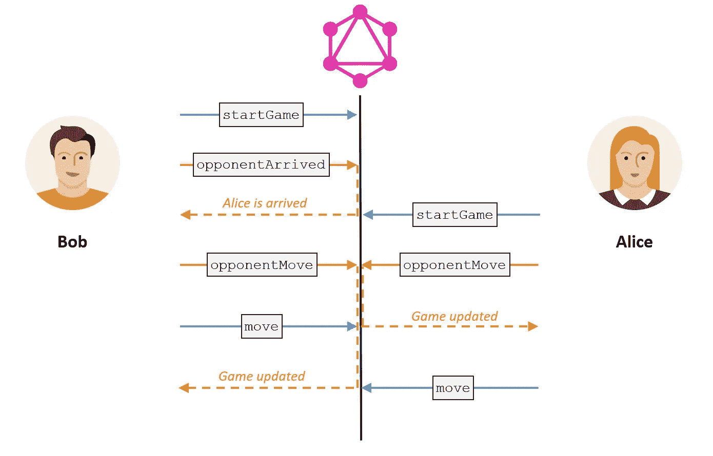
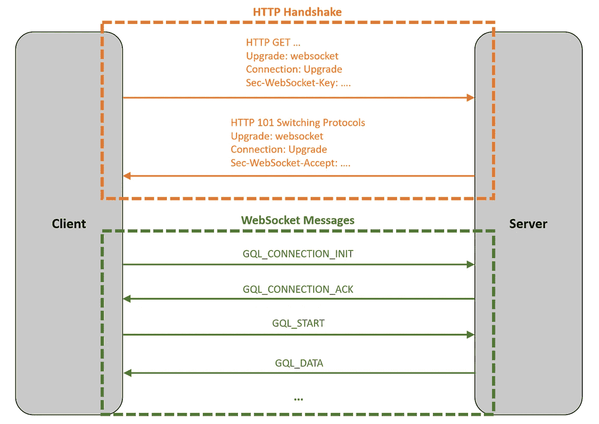
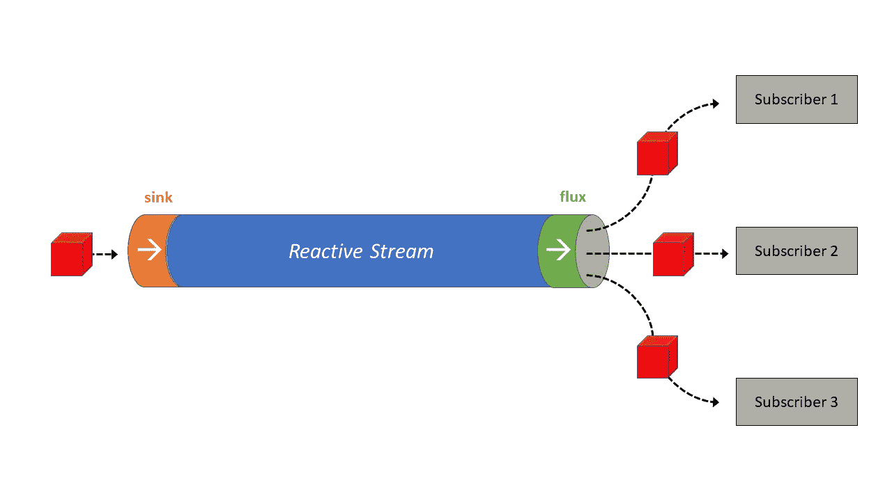

# 通过井字游戏理解 Java 中的 GraphQL 订阅

> 原文：<https://betterprogramming.pub/understand-graphql-subscriptions-in-java-with-a-tic-tac-toe-game-832ba2729e6d>

## 用 Java 和 Spring Boot 实现 GraphQL 订阅的分步指南，并附有一个工作示例


乔恩·泰森在 [Unsplash](https://unsplash.com?utm_source=medium&utm_medium=referral) 上的照片

订阅肯定是更有趣的特性之一，因为它们颠覆了传统的客户端-服务器通信流程:不再是客户端请求一些数据，而是服务器可以随时向客户端发送数据，只要数据可用。人们很容易被这样一个世界迷住，在这个世界里，你不必分分钟检查烤箱里的蛋糕是否做好了，而是烤箱本身告诉你蛋糕已经做好了！

订阅很棒，但是实现起来也很复杂，需要复杂的架构，而且通常很难找到详尽的文档或工作示例。

在本文中，您将学习如何用 Java 实现 GraphQL 订阅，使用 [Spring Boot](https://spring.io/projects/spring-boot) 和 [Kickstart 库](https://www.graphql-java-kickstart.com/)。

# 开始吧！

我们将通过实现一个简单的井字游戏来学习如何使用订阅。

```
❌ │ ⭕ │ 
──────────────
❌ │ ❌ │ 
──────────────
⭕ │ ⭕ │ ❌
```

在游戏中，我们希望使用订阅有两个目的:

*   通知用户另一个玩家加入了游戏并且比赛可以开始
*   通知玩家对手已经走了一步

下图为游戏流程:



游戏流程(突变用蓝色表示，订阅用橙色表示)(图片来源:作者)

你可以在 GitHub 上找到应用程序的[完整 GraphQL 模式；总之，游戏流程很简单:](https://gist.github.com/pixel13/f57695b66823913d46745ca220d142f5)

*   第一个玩家通过调用`startGame`突变开始游戏，然后等待对手。
*   使用`opponentArrived`订阅，当另一个用户进来时，可以通知第一个玩家。
*   当另一个玩家调用`startGame`变异时，服务器通过`opponentArrived`订阅发送一些数据:比赛可以开始了！
*   每个玩家依次下一步棋:在等待的时候，另一个玩家可以使用`opponentMove`订阅来获得对手下一步棋的通知；这个循环一直持续到游戏结束。

与查询和变异相比，订阅需要我们注意一些额外的方面:

*   不同且更复杂的**通信协议**
*   从服务器到客户端的**连续数据流**
*   专用的**认证系统**
*   **外部持久性和通信层**维护订阅的状态

为了简单起见，在我们的示例应用程序中，我们将使用内存解决方案，因此我们将忽略后一点。无论如何，请记住，在真实的生产环境中，您可能需要一个外部代理或消息传递系统(例如， [Apache Kafka](https://kafka.apache.org/) 或 [RabbitMQ](https://www.rabbitmq.com/) )。

# WebSocket 处理

让我们更深入地了解一下通信协议:订阅在客户机和服务器之间打开了一个持久通道。在大多数 GraphQL 实现中，这个通道是使用 WebSocket 协议建立的。对于那些不熟悉这项技术的人来说，它是一种在双方之间创建通道的协议，可用于双向通信。为了建立初始连接，该过程从传统的 HTTP 请求/响应(一个*握手*)开始，然后通过 WebSocket 协议继续通信。

GraphQL 规范没有规定客户机和服务器之间必须交换的消息的细节；反正知名公司 [Apollo GraphQL](https://www.apollographql.com/) 自己写的规范，已经成为事实上的标准。它要求通过 WebSocket 交换的消息使用特定的格式，如下图所示:



典型 GraphQL 订阅中的 WebSocket 消息交换(图片来源:作者)

好了，现在无聊的部分结束了，我们最后来看看代码。

幸运的是，Kickstart 库负责与 WebSocket 通信协议相关的所有方面，并且它还实现了 Apollo GraphQL 规范。我们只需要定义一个实现`GraphQLSubscriptionResolver`接口的 Spring bean。

根据 GraphQL 规范，订阅必须实现[发布-订阅模式](https://en.wikipedia.org/wiki/Publish%E2%80%93subscribe_pattern)，因此 Kickstart 期望 resolver 方法从[反应流](https://www.reactive-streams.org/)返回`Publisher`接口的实现。

井字游戏服务器的订阅服务器框架

# 使用数据流

为了让我们的订阅工作，我们必须知道如何处理一个反应性的流，以及如何馈送它。

有几个很好的 Reactive Streams 规范的 Java 实现:如果您正在使用 Spring，我建议您尝试一下 [Project Reactor](https://projectreactor.io/) ，因为它完全集成了这个框架。让我们看看如何在我们的应用程序中使用它。

在我们的基本实现中，数据流将完全保存在应用程序内部的内存中，因此我们只需要声明几个 Spring beans:

定义反应流两端的 beans

我不会深入到 Project Reactor 的细节中，但是如果你不熟悉反应式编程，你可以把反应式流想象成一个数据流动的管道。

上面定义的两个 beans 代表管道的两端:

*   接收器是数据进入的地方
*   **通量**是数据出来的地方

在我们的应用程序中定义的`Game`对象表示将流经流的数据类型。

几个客户端(订阅者)可以连接到反应流(使用 GraphQL 订阅)并接收流入其中的数据。



用管道表示的反应流(图片来源:作者)

现在我们已经在应用程序中定义了两个 beans，我们可以在解析器中自动连接它们，并使用它们将数据放入或获取到流中。

让我们看看如何为应用程序的两个订阅提供流:

*   为了实现`opponentArrived`订阅，我们需要在第二个玩家调用`startGame`突变时将数据放入流中。
*   为了实现`opponentMove`订阅，我们必须在每次玩家移动时，也就是每次调用`move`突变时，将数据放入接收器。

所以我们只需要在变异解析器中自动连接接收 bean，并调用`tryEmitNext()`方法将数据放入流中:

变异解析器使用 gameSink 将数据放入反应流

现在，我们可以在根订阅解析器中自动连接 flux bean，并将其返回给客户端。

由于两个订阅共享相同的反应流，我们必须区分应该发送给`opponentArrived`发布者的数据和应该发送给`opponentMove`发布者的数据。为此，我们可以使用`Game`对象的`isStarted()`方法:如果游戏还没有开始，我们必须向`opponentArrived`发送数据；否则，我们必须向`opponentMove`发送数据:

订阅解析器返回流量

如您所见，在`opponentArrived()`方法中，流经 flux 的数据也被映射为只返回第二个玩家的名字(根据 GraphQL 模式)。

# 认证订阅

现在我们必须处理最后一个问题:我们的应用程序中有一个共享的反应流，但是可能会有几个用户同时玩这个游戏。我们只想给玩家发送他们自己比赛的信息。如何才能实现？

我们需要为我们的订阅建立一个认证系统，这样我们就可以在通过特定用户建立的 WebSocket 通道发送数据之前，过滤掉属于其他玩家的数据。

我们可以使用 Spring 安全支持来管理订阅解析器中的认证，但是我们需要一个专用系统来认证 WebSocket 连接。

同样，Kickstart 库帮助了我们，它允许我们截取订阅连接期间发生的主要事件。我们所要做的就是实现`ApolloSubscriptionConnectionListener`接口和:

*   覆盖`onConnect()`方法来拦截`GQL_CONNECTION_INIT`消息
*   覆盖`onStart()`方法来拦截`GQL_START`消息

处理订阅认证最常见的方式是使用与`GQL_CONNECTION_INIT`消息一起传输的有效负载。

不幸的是，只有当客户端同时发送`GQL_CONNECTION_INIT`和`GQL_START`消息，以便在服务器端由同一个线程处理时，这个认证系统才能工作。

否则，如果这两条消息是分开发送的，它们可能由两个不同的线程提供服务。在这种情况下，认证将失败，除非在服务器接收到`GQL_START`消息时也进行了处理。

在我们的代码中，我们决定处理这两种情况下的身份验证，以确保服务器将与大多数客户端一起工作。在`SubscriptionConnectionListener`中，我们将实现`onConnect()`和`onStart()`两种方法:在第一种方法中，我们将使用有效载荷处理认证，在第二种方法中，我们将使用原始握手请求的授权头:

处理身份验证的 ApolloSubscriptionConnectionListener 的实现

现在，连接已经过身份验证，我们可以使用订阅解析器中的当前用户身份来过滤掉不应发送给订阅用户的所有消息，例如，仅当当前用户在特定游戏中移动时才发送数据:

与身份验证系统集成的订阅解析程序

就是这样！我们终于有了实现两个订阅的井字游戏 GraphQL 服务器！我们的工作完成了，游戏可以开始了！❌ ⭕️

# 概述

让我们快速回顾一下今天学到的内容:

*   要构建订阅解析器，实现`GraphQLSubscriptionResolver`接口就足够了。
*   订阅解析器必须从反应流返回`Publisher`接口的实现。
*   使用 Project Reactor，我们可以将一个反应流定义为一个 bean，它可以自动连接并在 GraphQL 解析器中使用。
*   订阅中的认证可以通过实现`ApolloSubscriptionConnectionListener`接口来处理。

你可以在 GitHub 上找到井字游戏服务器应用程序的[完整代码](https://github.com/pixel13/tic-tac-toe)以及一个简单的 CLI 客户端来测试它(使用 [Apollo Android](https://github.com/apollographql/apollo-android) 客户端和 [OkHttp 库](https://github.com/square/okhttp)制作)。

感谢您的阅读。

# 资源

[](https://www.graphql-java-kickstart.com/) [## GraphQL Java Kickstart

### 使用 Java 轻松入门 GraphQL 的项目。这些项目依赖于 graphql-java 库作为…

www.graphql-java-kickstart.com](https://www.graphql-java-kickstart.com/) [](https://www.apollographql.com/) [## 阿波罗图表

### Apollo 数据图平台——将 API、微服务和数据库统一到一个数据图中，您可以使用 GraphQL 进行查询

www.apollographql.com](https://www.apollographql.com/) [](https://github.com/reactor) [## 反应堆

### 基于反应流的反压异步消息传递项目。无阻塞反应型粉底…

github.com](https://github.com/reactor) [](https://github.com/pixel13/tic-tac-toe) [## pixel 13/井字游戏

### 这是一个井字游戏的 GraphQL 演示应用程序，用 Java、Spring Boot 和 Kickstart 库实现…

github.com](https://github.com/pixel13/tic-tac-toe)