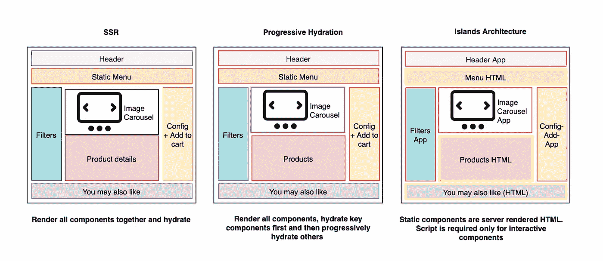
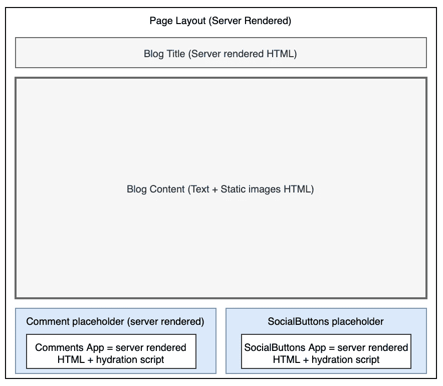
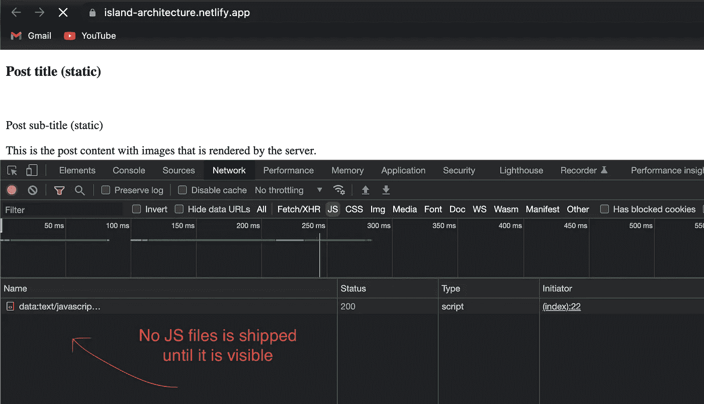
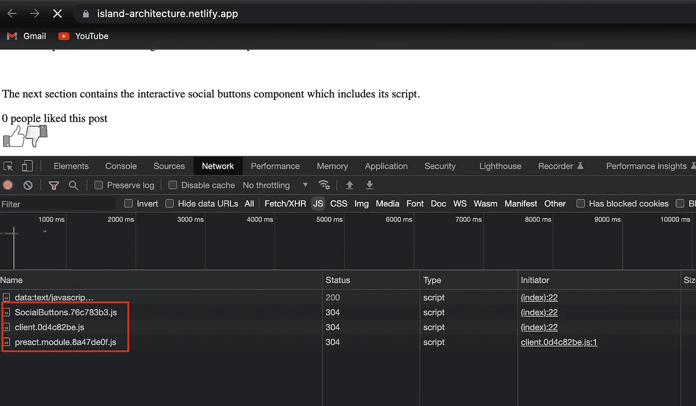

# 理解孤岛架构以及客户端如何接收不到 JavaScript

> 原文：<https://betterprogramming.pub/understand-island-architecture-how-the-client-receives-no-js-9c6dfa6d7732>

## 用我的 GitHub repo 来演示岛屿建筑是如何工作的


“组件岛”模式是由 Etsy 的前端架构师 Katie Sylor-Miller 创建的。当您发布使用您喜欢的框架(如 React、Vue 或 Angular)构建的最新应用程序时，每个组件都包含 JavaScript。

这就是岛屿建筑的由来。即使它是一个静态文件，比如一个导航链接，或者只是一个带有文本的图像。通过孤岛架构，您可以控制项目附带的所有 JavaScript 以及它如何与用户交互。岛式建筑也被称为部分水合。

# 什么是海岛建筑(部分水化)？

短语“孤岛架构”是指静态 HTML 网站上的交互式用户界面组件。一个岛总是单独呈现，一页上可能有几个岛。把它们想象成静态的、不活跃的 HTML 海洋中的孤岛。



“孤岛”架构的核心概念很简单:在服务器上呈现 HTML 页面，并在高度动态的区域周围插入占位符或插槽。这些占位符/槽保存由服务器上适当的小部件生成的 HTML 输出。他们指定一些区域，这些区域稍后可以在客户机上被“水合”成小的自包含部件，重用服务器产生的初始 HTML。

乍一看，这可能感觉像“微前端”。这两种方法都基于将应用程序划分为独立单元的思想。尽管“微前端”通常并不意味着这些单元的组合是使用 HTML 实现的。

# 它是如何工作的？

在大多数情况下，页面包含静态和动态内容。一个页面通常由静态信息和一些独立的交互部分组成。例如:

*   博客帖子、新闻文章和组织主页包括文本和图像以及交互式元素，如社交媒体嵌入和聊天。
*   电子商务网站上的产品页面链接到应用程序中的其他页面，并包括静态产品描述。页面的不同区域提供交互式元素，如搜索和图像传送带。



静态内容在呈现后不需要再水化，也不会触发事件。动态内容(按钮、过滤器和搜索栏)在呈现后需要重新连接到其事件。在客户端，需要再次生成 DOM(虚拟 DOM)。提供给客户端的 JavaScript 包括这些用于再生、再水合和事件处理的例程。

孤岛架构使得在服务器上呈现包含所有静态内容的页面成为可能。但是，在这种情况下，动态内容的占位符将出现在输出 HTML 中。每个小部件都将服务器呈现的输出与 JavaScript 相结合，JavaScript 用于在客户端上合成应用程序。

# 孤岛实施

如今，各种框架都可以支持孤岛架构。其中包括:

# [新鲜的](https://fresh.deno.dev/)

在 Fresh 中，孤岛支持客户端交互。孤岛是在客户端上隔离和呈现的预先动作组件。这不同于所有其他经常在服务器上呈现的新鲜组件。在新项目中，通过在 islands/文件夹中创建文件来定义孤岛。

# [阿童木](https://astro.build/)

Astro 是一个静态站点构建器，能够使用其他框架(如 React、Preact、Svelte、Vue 等)中构建的 UI 组件生成轻量级静态 HTML 页面。需要客户端 JavaScript 的组件以及它们的依赖项是单独加载的。因此，它具有内在的部分水合作用。Astro 还可以基于组件的可见性来延迟加载组件。下一节包括一个使用 Astro 的示例实现。



一旦组件 JavaScript 到达用户的视口，就对其进行加载和水合。为了跟踪可见性，它在内部使用一个 IntersectionObserver。



# [马尔科](https://markojs.com/)

Marko 是一个由易贝建立和维护的开源框架，用于提高服务器渲染性能。它通过集成流式渲染和自动部分水合来支持岛式架构。当 HTML 和其他静态材料准备好了，它们就被传输到客户机。自动部分水合使交互组件能够自水合。

# 岛式建筑的优势

## 表演

网站的大部分内容都被转换成了快速、静态的 HTML，JavaScript 只为需要它的单个组件加载。JavaScript 是每个字节加载最慢的文件之一，因此每个字节都很重要。

## 并行或并发加载

不需要低优先级的“图像传送带”岛来阻挡高优先级的“标题”岛。页眉立即变得可交互，而不必等待更重的传送带加载到页面的更下方，因为两者同时加载并独立水合。

## 区分重要内容的优先级

更好的是，你可以命令 Astro 何时以及如何渲染每个组件。如果图片传送带加载代价太高，你可以添加一个特殊的客户端指令，指示 Astro 只加载出现在页面上的图片传送带。如果用户看不到它，它就不会加载。

## 搜索引擎优化

页面是 SEO 友好的，因为所有静态信息都呈现在服务器上。

# 岛屿建筑的缺点

## 对于高度交互的页面无效

这种架构对于高度互动的页面来说是无效的，比如社交媒体应用，这几乎肯定需要数千个岛。

## 有限的框架

开发人员实现孤岛的唯一选择是使用少数可用的框架之一，或者自己开发架构。将现有网站转移到 Astro 或 Marko 将需要额外的任务。

# 结论

岛架构概念是新的，但由于其性能优势，预计它将加速发展。它强调使用 SSR 进行静态内容呈现，同时通过动态组件提供交互性，对页面性能的影响最小。我们希望未来在这个领域看到更多的公司，以及更广泛的实施解决方案。

您可以查看我的 GitHub 存储库，在那里我做了一些实际的实现来了解孤岛架构是如何工作的。

```
GitHub Link: [https://github.com/coolpinkzz/island-architecture](https://github.com/coolpinkzz/island-architecture) 
Deployed Link: [https://island-architecture.netlify.app/](https://island-architecture.netlify.app/)
```