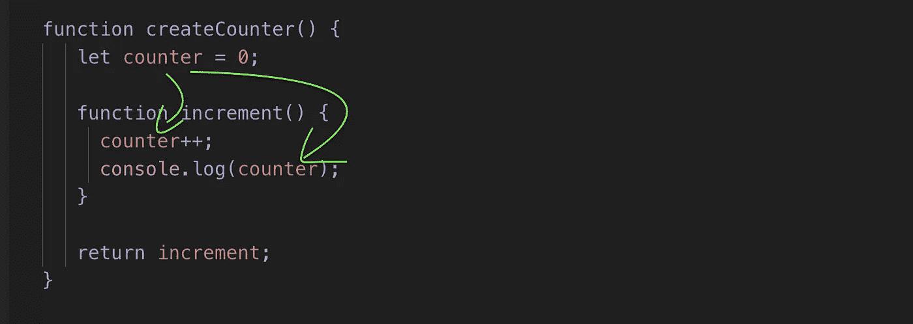

# 在 4 分钟内理解 JavaScript 闭包

> 原文：<https://betterprogramming.pub/understand-javascript-closures-in-4-minutes-adfd30fc568f>

## 闭包是 JavaScript 中的一个重要概念。许多教程使它看起来比实际更复杂。


照片由[克里斯托弗·罗宾·艾宾浩斯](https://unsplash.com/@cebbbinghaus?utm_source=medium&utm_medium=referral)在 [Unsplash](https://unsplash.com?utm_source=medium&utm_medium=referral) 上拍摄。

# 快速定义

在 JavaScript 中，闭包意味着内部函数可以访问属于外部函数的变量。即使外部函数的执行已经完成，这也适用。



由于 JavaScript 中闭包的性质，可以在 increment 函数中访问 counter 变量。

# 例子

## 正则函数的一个例子

在进入闭包之前，让我们看看一个常规函数是如何工作的:

```
**function** hello() {
  **const** sentence = "Hello world"
  console.log(sentence);
}hello(); // prints "Hello world" to the console
```

当调用`hello()`时，花括号之间的代码执行。当执行完成时，您不能再访问变量(例如`sentence`)。这是非常基本的，你可能已经知道了。

然而，在特定的设置下，当一个函数执行完成时，你*仍然可以*访问那些“应该”不可访问的变量。当然，我指的是这种设置的闭包。

## 使用闭包的例子

例如，让我们在函数中创建一个内部函数*，并返回它:*

`outer`函数返回`inner`函数。这意味着你可以将返回的`inner`函数赋给一个变量。例如:

```
**const** greet = outer()
```

现在您可以调用带括号的`greet`(像任何其他函数一样)来执行附加到它的`inner`函数的代码:

```
greet()
```

输出:

```
Hello world
```

但是等一下……因为`greet()`现在执行`inner`函数的代码，这意味着当只定义了`b`时，它试图记录`a+b`:

```
// This function gets executed when calling *greet()***function** inner() {
     **const** b = "World"; 
     console.log(a+b);
}
```

但是你也看到了它工作得很好。这意味着`greet()`必须能够访问`a`，即使看起来不可能。

多亏了闭包，事实确实如此。请记住闭包的含义:即使在外部函数的执行完成之后，内部函数也可以访问外部函数的变量。

记住这一点，`inner`函数实际上知道它在一个名为`outer`的函数中。因此，它保存了属于`outer`函数的变量。这就是为什么`greet()`仍然可以访问值`a`的原因。当`outer()`被调用时，`inner`保存变量`a`以备后用。

干得好！现在您知道了 JavaScript 中闭包的基本工作原理。

# 闭包的真实例子

让我们设置一个计数器:

```
**var** counter = 0;**function** increment() {
  counter++;
}
```

调用`increment()`工作正常。但是有一个问题:变量`counter`也可以在`increment`之外调整，所以它可能会被意外地设置为`1000`，例如，在代码的其他地方。这是不实际的。

为了构建一个可靠的计数器，您需要将它与`increment`函数耦合起来，这样代码的其他部分就不会意外地搞乱它。

这就是闭包派上用场的地方。让我们通过在前面看到的函数结构中使用相同的*函数来重新实现计数器:*

让我们更仔细地研究一下实现，以便充分利用它:

*   `createCounter`是一个外部函数。它将一个`counter`变量设置为`0`，并返回一个名为`increment`的内部函数。
*   `increment`负责递增`counter`变量。
*   由于 JavaScript 中的自然闭包，`increment`可以访问属于`createCounter` *的变量，即使在*的`createCounter`执行完成之后。这样，`increment`就可以把`1`加到`counter`上。

现在，让我们调用`createCounter()`来设置计数器:

```
**let** add = createCounter();
```

在引擎盖下，这一行创建了一个被设置为`0`的`counter`变量。然后名为`increment`的内部函数被返回并存储到名为`add`的变量中。

现在可以调用`add`来增加`counter`。让我们做三次，看看会发生什么:

```
add();
add();
add();
```

输出:

```
1
2
3
```

这样做是因为像前面一样，调用`add()`会执行内部函数`increment`的代码，该函数仍然可以访问`counter`变量:

```
**function** increment() {
     counter++;
     console.log(counter);
}
```

# 结论

在 JavaScript 中，闭包是一个使函数能够访问其作用域之外的变量的特性——即使在外部作用域被破坏之后。


变量 counter 可以在内部函数 increment 中访问。

感谢阅读。希望你觉得有用。

# 资源

[](https://devdocs.io/javascript/) [## DevDocs

### JavaScript API 文档，包括即时搜索、离线支持、键盘快捷键、移动版本等等。

devdocs.io](https://devdocs.io/javascript/)