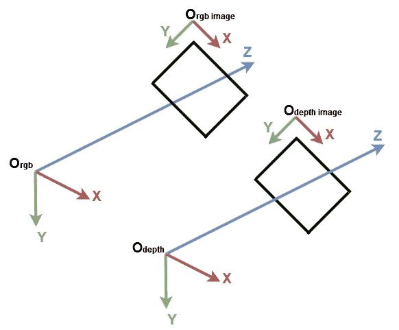
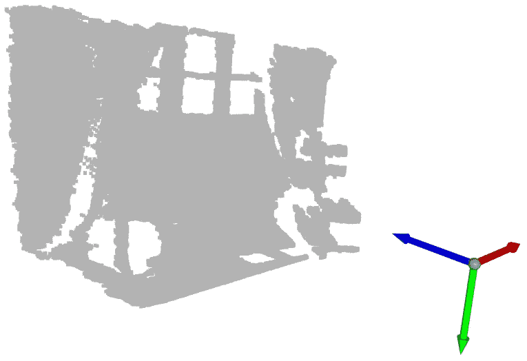
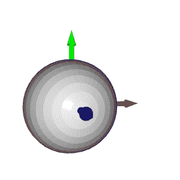
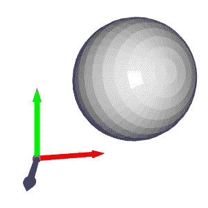
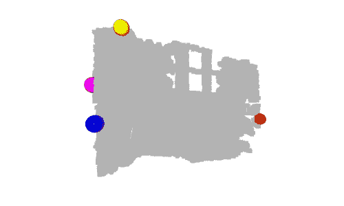
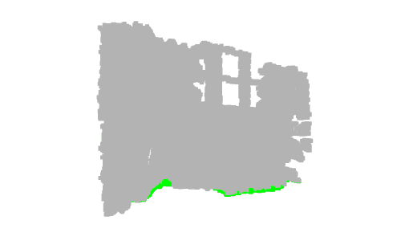
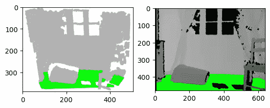

# 理解点云:使用 Python 实现地面检测

> 原文：<https://betterprogramming.pub/understand-point-clouds-a-simple-ground-detection-algorithm-71aaa0dd2b2d>

## 地面检测算法


作者的相机视野

这是我的“点云处理”教程的第三篇文章。“点云处理”教程是初学者友好的，其中我们将简单介绍从数据准备到数据分割和分类的点云处理流水线。

*   [第一篇:点云处理简介](https://medium.com/@chimso1994/introduction-to-point-cloud-processing-dbda9b167534)
*   [文章 2:用 Python 从深度图像中估计点云](https://medium.com/better-programming/point-cloud-computing-from-rgb-d-images-918414d57e80)
*   [第三篇:理解点云:用 Python 实现地面检测](/understand-point-clouds-a-simple-ground-detection-algorithm-71aaa0dd2b2d)
*   [第四篇:Python 中的点云过滤](https://medium.com/@chimso1994/point-cloud-filtering-in-python-e8a06bbbcee5)
*   [第五篇:Python 中的点云分割](https://medium.com/@chimso1994/point-cloud-segmentation-in-python-2fdbf5ea0617)

在[之前的教程](https://medium.com/@chimso1994/point-cloud-computing-from-rgb-d-images-918414d57e80)中，我们从深度数据中计算点云，而没有使用 Open3D 库。在本教程中，我们将首先描述系统坐标。然后，我们将以地面检测为例，对点云进行细致的分析。我们还将介绍有组织的点云，这是一种有趣的三维表现。

```
**Table of contents:**· [1\. Computer vision coordinates systems](#b104)
· [2\. Ground Detection](#bc98)
· [3\. Organized point cloud](#daa8)
· [4\. Conclusion](#248a)
```

# 1.计算机视觉坐标系统

开始之前，理解计算机视觉中的常规坐标系很重要。在 Open3D [1]和微软 Kinect 传感器[2]中紧随其后。在计算机视觉中，图像在独立的 2D 坐标系中表示，其中 X 轴从左指向右，Y 轴从上到下。对于相机，3D 坐标系原点位于相机的焦点，X 轴指向右侧，Y 轴指向下方，Z 轴指向前方。



计算机视觉坐标系统

我们从导入所需的库开始:

为了更好地理解，让我们从 PLY 文件导入点云，使用 Open3D 创建默认的 3D 坐标系并显示它们:



带有坐标系原点的显示点云。蓝色箭头是 Z 轴，红色箭头是 X 轴，绿色箭头是 Y 轴。

知道蓝色、红色和绿色箭头分别代表 Z 轴、X 轴和 Y 轴，可以看到点云是在与 Open3D 坐标系相同的坐标系中表示的。现在，让我们得到具有每个轴的最小值和最大值的点:

我们可以打印它们，但是为了更好的可视化，我们在每个点的位置创建一个球体几何体。默认情况下，Open3D 在原点位置创建 3D 几何图形:



要将球体移动到给定位置，需要平移变换。在下面的例子中，球体被向量[1，1，1]平移:



让我们回到我们的例子，给每个球体分配一种颜色。对于每个位置，我们创建一个球体并将其平移到该位置。然后，我们分配正确的颜色，最后我们将它添加到最后显示。



嗯，我们可以看到对应`y_min` 的黄色球体在墙上，对应`y_max`的绿色球体在地上。事实上，Y 轴代表点的高度:在现实世界中，最高的球是黄色的，最低的球是绿色的。但是，由于 Y 轴指向下方，黄色球体具有最小值，绿色球体具有最大值。

另一个有趣的球体是原点上的青色球体。正如我们在前面的教程中提到的，深度值为 0 的像素是噪声点，因此位于原点的点是从这些噪声像素计算的点(当`z=0`然后`x=0`和`y=0`)。

# 2.地面探测

现在我们展示了一些重要的点，如何检测地面？在前面的例子中，绿色球体在地面上。确切地说，其对应于 Y 轴最高点的中心是接地点。假设为了检测地面，我们将所有带有`y_max`的点的颜色都改为绿色。

如果显示点云，您会注意到并非所有的地面点都是绿色的。事实上，只有一个对应于前一个绿色球体中心的点是绿色的。这是由于深度相机的精度和噪声水平。

为了克服这个限制，我们需要添加一个阈值，这样在`[y_max-threshold, y_max]`中具有 *y* 坐标的点都被视为地面点。为此，在获得`y_max`后，我们检查每个点的 *y* 坐标是否在该区间内，然后，我们将其颜色设置为绿色。最后，我们更新点云的颜色属性并显示结果。



在本例中，我们仅将代表地面的点着色为绿色。在现实世界的应用中，提取地面是为了定义可行走的区域，就像在机器人或视障系统中一样，或者像在室内设计系统中一样，在地面上放置物体。它也可以被删除，因此剩余的点可以像在场景理解和对象检测系统中一样被分割或分类。

# 3.有序点云

在我们的第一个教程中，我们将点云定义为一组 3D 点。集合是一种无序的结构，因此由集合表示的点云称为无序点云。类似于 RGB 矩阵，有组织的点云是一个 2D 矩阵，有 3 个通道表示点的 *x* -、 *y* -、和 *z* -坐标。矩阵结构提供了相邻点之间的关系，从而降低了最近邻等算法的时间复杂度。

举个例子，我们正在写一篇研究论文，我们想把地面检测算法的结果显示成一个图形。不幸的是，无法选择动画人物。因此，我们可以对点云进行截图，或者将结果显示在深度图像上，如下图所示。在我看来，第二种选择是最好的。在这种情况下，需要有组织的点云来保留深度像素的位置。



左图:3D 可视化的屏幕截图。右图:深度图像的结果。

让我们从之前的深度图像创建一个有组织的点云。我们首先像在上一篇文章中一样导入相机参数。我们还导入深度图像并将其转换为 3 通道灰度图像，这样我们可以将地面像素设置为绿色:

为了计算一个有组织的点云，我们按照上一课的方法进行。代替展平深度图像，我们将`jj`和`ii`整形为具有与深度图像相同的形状，如下所示:

如果你打印出创建的点云的形状，你可以看到它是一个有三个通道的矩阵`(480, 640, 3)`。如果你觉得这段代码很难理解，请回到之前的教程，如果仍然不清楚，请不要犹豫，给我你的问题，我很乐意帮助你。

类似地，我们像上面一样检测地面，但不是更新点的颜色和显示点云，而是更新灰度图像的像素并显示它:

# 4.结论

在本教程中，为了适应点云，我们引入了默认坐标系，并实现了一个简单的地面检测算法。实际上，地面检测在诸如导航的某些应用中是一项重要的任务，并且在文献中已经提出了几种算法。实现的算法简单；它将最低点视为地面。然而，它的局限性是深度相机必须平行于地面，而大多数现实世界的应用程序都不是这样。

现在轮到你了，试着检测最近的物体(不是地面)，比如给它们涂上红色。[在下一个教程](https://medium.com/@chimso1994/point-cloud-filtering-in-python-e8a06bbbcee5)中，我们将学习如何预处理点云以减少噪音。你可以在我的 [GitHub 库](https://github.com/Chim-SO/pointcloudprocessing)中找到例子。如果你有任何问题或建议，欢迎在下面给我留言。

[](https://medium.com/@chimso1994/point-cloud-filtering-in-python-e8a06bbbcee5) [## Python 中点云过滤

### 利用 Open3D 进行点云预处理

medium.com](https://medium.com/@chimso1994/point-cloud-filtering-in-python-e8a06bbbcee5) [](https://medium.com/@chimso1994/point-cloud-computing-from-rgb-d-images-918414d57e80) [## 基于 RGB-D 图像的点云计算

### 通过编码从深度图像估计点云

medium.com](https://medium.com/@chimso1994/point-cloud-computing-from-rgb-d-images-918414d57e80) 

# 参考

[1][https://github . com/ISL-org/open 3d/issues/1347 # issue comment-558205561](https://github.com/isl-org/Open3D/issues/1347#issuecomment-558205561)

[2][https://docs . Microsoft . com/en-us/azure/Kinect-dk/coordinate-systems](https://docs.microsoft.com/en-us/azure/kinect-dk/coordinate-systems)