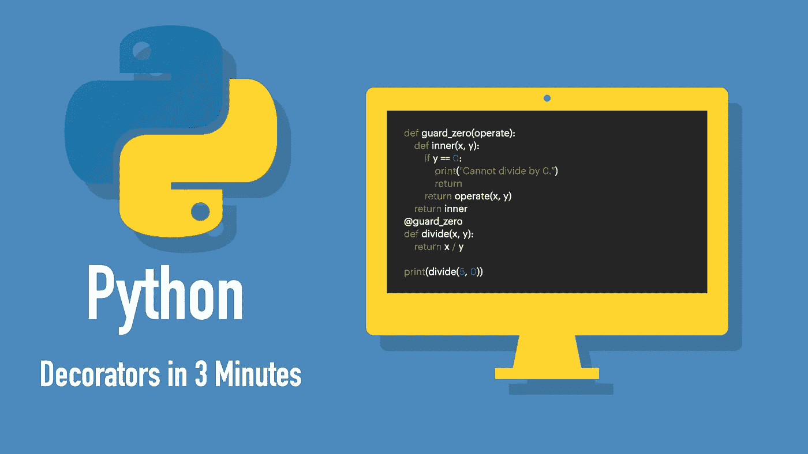

# 3 分钟了解 Python Decorators

> 原文：<https://betterprogramming.pub/understand-python-decorators-in-3-minutes-ec48fdc8e2cf>

## 用 decorators 扩展方法和类的功能



作者照片。

[*装饰器*](https://www.codingem.com/what-are-python-decorators/) 提供了一种可读的方式，让*从外部扩展*一个函数、方法或类的功能。当修饰(即扩展)相似的函数来做完全相同的事情而不在代码中增加不必要的重复时，使用 decorators 特别有用。

下面是一个如何用装饰器扩展函数的例子:

```
@guard_zero
**def** divide(x, y):
    **return** x / y
```

`@guard_zero`装饰器扩展了`divide`方法的功能，以确保`0`不会进行分割。然而，在这一点上，没有所谓的`guard_zero`，因为你还没有实现它。在下一节中，我将向您展示具体的操作方法。

# 如何用 Python 创建装饰器

演示 decorators 的最佳方式是创建并使用它。让我们实现`@guard_zero`装饰器。

在开始时，你只有这种除两个数的方法:

```
**def** divide(x, y):
    **return** x / y
```

这种方法的问题是没有检查值`y`是否为`0`。很明显，你可以通过一点点`if`检查来解决这个问题。但是有一个替代:*装修工*。

让我们从创建一个`guard_zero`装饰器开始:

装饰器就像 Python 中的常规函数。它所做的只是接受`operate`函数作为参数。然后，它通过创建一个内部函数并在那里添加扩展行为来扩展`operate`的功能。最后，它返回`inner`函数，这是`operate`函数的新版本。

此时，`guard_zero`装饰器已经准备好了。您现在可以像这样扩展(即装饰)`divide`函数:

```
divide = guard_zero(divide)
```

这看起来像给变量添加一个新值。但是在这种情况下，您向现有功能添加了新功能。

但是应用装饰器有一个更 Pythonic 化的约定。您可以在定义函数之前添加装饰器，而不是像上面那样用新版本更新函数:

```
@guard_zero
**def** divide(x, y):
    **return** x / y
```

这使得事情更具可读性，信息也更清晰:扩展`divide`方法以防止被`0`除。

现在您可以用不同的输入测试`divide`方法，看看装饰器做了它应该做的事情:

```
print(divide(5, 0))
print(divide(5, 2))
```

输出:

```
Cannot divide by 0.
None
2.5
```

注意输出中的`None`。这是因为当`y`的值为`0`时，`guard_zero`装饰器返回`None`。

为了方便起见，这里列出了所有代码:

概括一下，decorator 方法`guard_zero`将函数`divide`作为它的参数，并创建了它的扩展版本。

# 什么时候应该用装修工？

基于这个例子，你可能仍然想知道，“为什么这么麻烦？”显然，通过在`divide`函数中编写一个简单的`if`检查，可以节省一些代码。

当你可以避免与装饰者重复时，装饰者的力量是显而易见的。

想象一下，有十种相互类似的方法。在每个方法中，您必须确保第二个参数不是`0`。在这种情况下，您可以:

*   花时间分别为每个方法写十个相同的`if`检查。
*   创建一个装饰器，在每个函数前写`@zero-guard`。

在这种情况下，后一种方法是更好的方法，因为您可以在一个地方编写装饰器，并在任何地方添加`@zero-guard`。

# 结论

在 Python 中，可以使用 decorators 从外部扩展函数、方法或类的功能。

例如，您可以编写一个`guard_zero`装饰器来确保`0`不会进行分割。然后，通过在方法定义前添加装饰器，您可以在代码的任何地方使用装饰器:

```
@guard_zero
**def** divide(x, y):
    **return** x / y
```

但是什么时候应该使用装饰者呢？基本上，当你能避免相似方法之间的重复时。不用对多个方法进行完全相同的更改，您可以进行一次更改，然后用它来修饰每个方法。

感谢阅读。我希望你觉得这很有用。