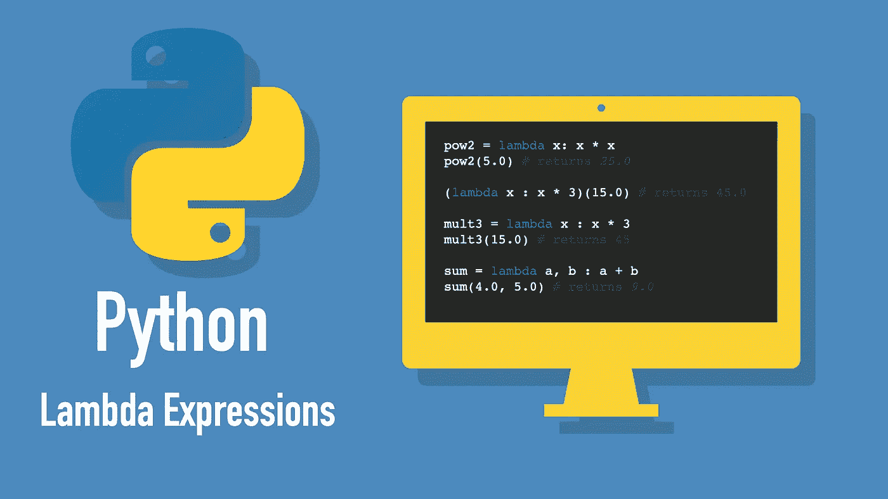

# 3 分钟了解 Python Lambdas

> 原文：<https://betterprogramming.pub/understand-python-lambdas-in-3-minutes-8ce4997134fe>

## Lambda 表达式也称为匿名函数。了解如何以及何时使用它们



作者照片。

在 Python 中，lambda 函数是一个匿名函数(没有名字的函数)，它可以接受任意数量的参数，但只包含一个表达式。例如，下面是一个将一个数乘以 3 的 lambda:

```
**lambda** x : x * 3
```

这个 lambda 并不是特别有用，因为现在没有办法调用它。但是，您可以将它赋给一个变量，然后像调用常规函数一样调用它:

```
mult3 = **lambda** x : x * 3
mult3(15.0) # returns 45
```

你不需要给一个变量赋值一个 lambda。相反，你可以这样称呼它:

```
(**lambda** x : x * 3)(15.0) # returns 45.0
```

当只在短时间内需要该功能，并且您不想通过创建一个单独的方法来完成这项工作而浪费资源时，Lambda 函数尤其有用。

# 如何使用 Lambdas

您已经看到了 lambdas 的一些基本示例，但是让我们更仔细地看看它们是如何工作的。

## 句法

这是 lambda 表达式的基本语法:

```
**lambda** arguments : expression
```

例如，您可以创建一个对数字求平方的 lambda:

```
pow2 = **lambda** x: x * x
pow2(5.0) # returns 25.0
```

作为另一个例子，下面是一个采用多个参数的 lambda 表达式:

```
sum = **lambda** a, b : a + b
sum(4.0, 5.0) # returns 9.0
```

提示:这样使用时，Lambdas 没有用。如果你想给一个变量赋值一个 lambda，只要用`**def**`创建一个普通函数就可以了。

## lambda 如何成为匿名函数？

Lambdas 也称为匿名函数。为了说明原因，让我们跳回平方一个数的例子。这一次，我们不要将 lambda 赋给变量，而是直接调用它:

```
(**lambda** x : x * x)(15.0) # returns 225.0
```

这个例子强调了 lambda 函数是一个匿名函数的事实(也就是说，它没有名字，但是你仍然可以调用它)。

# 何时使用 Lambdas

正如我提到的，你看到的例子有些没用。那么使用 lambdas 的全部意义是什么呢？

Lambda 函数在短时间内需要该功能时非常有用(例如将一个函数作为参数传递给另一个函数)。

让我们来看几个 lambdas 非常有用的例子。

## 示例-过滤数字列表

将一个函数传递给另一个函数的实际例子是当你过滤一个列表时。Python 的内置`filter`方法有两个参数:

*   过滤函数(这是一个λ函数)
*   要过滤的列表

例如，让我们从列表中过滤偶数:

```
numbers = [1, 2, 3, 4, 5, 6]filtered_numbers = list(filter(**lambda** x : x % 2 == 0 , numbers))**print**(filtered_numbers)
```

输出:

```
[2, 4, 6]
```

在上面的代码中，过滤表达式`lambda x : x % 2 == 0`对`numbers`列表中的每个数字进行评估，因此奇数被忽略。

这是 lambdas 真正有用的一个很好的例子。既然你只需要过滤列表的过滤函数，为什么要创建一个你永远不会再使用的单独的`is_even`方法呢？

# 结论

Lambda 函数是匿名函数，可以用来代替常规函数。当只在短时间内需要该功能时，它们非常有用。

Lambda 表达式遵循以下简单语法:

```
**lambda** arguments : expression
```

作为一个实际的例子，您可以使用 lambda 表达式来过滤数字列表中的偶数:

```
list(filter(**lambda** x : x % 2 == 0 , numbers))
```

感谢阅读。我希望你觉得这有用！

# 资源

 [## 文件

### 欢迎光临！这是 Python 3.9.1 的文档。

docs.python.org](https://docs.python.org/3/) [](https://www.w3schools.com/python/python_lambda.asp) [## Python Lambda

### lambda 函数是一个小型的匿名函数。lambda 函数可以接受任意数量的参数，但只能有…

www.w3schools.com](https://www.w3schools.com/python/python_lambda.asp)