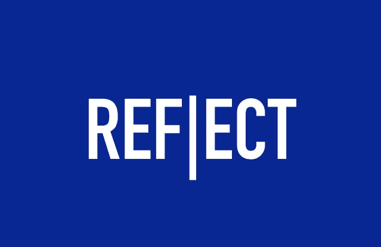
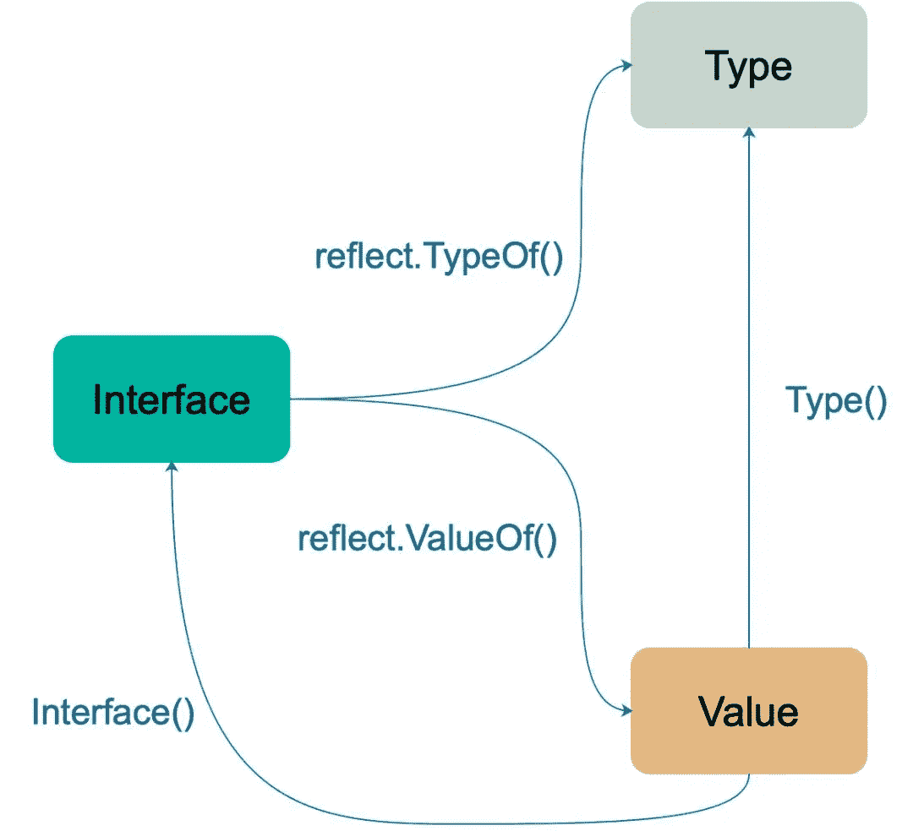
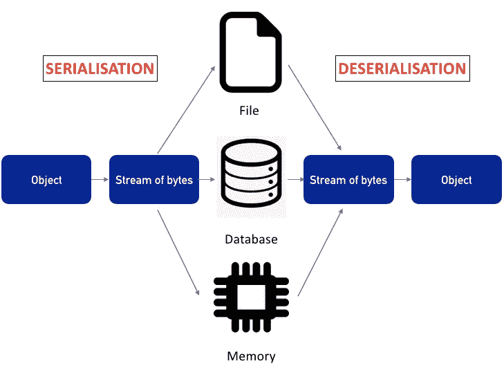

# 理解围棋中的反映

> 原文：<https://betterprogramming.pub/understand-reflect-in-go-24a68fcf1011>

## 这种有帮助的方法有什么利弊？



理解围棋中的反映

Go 是一种强静态类型的编程语言。然而，Go 中的一些特性使它看起来像是动态类型的。例如，如果您不确定您将接收什么类型，您可以为一个开放类型实现`interface`类型。

记住只有`interface`才有`reflect`。

注意`interface`允许 Go 中的多态性。不强制实施任何特定的实现。可以是`string`、`int64`、`float32`，甚至是一个集合(`array` / `map`)。当计算机运行代码(运行时)，`reflect`帮助检查、自省和修改它自己的结构和行为。这个过程允许我们在运行时知道一个对象的类型和内存结构。

# 我们为什么需要`*reflect*`？

1.  无法预定义参数类型。(通常发生在公开开放 API 时)
2.  函数根据参数输入动态执行。

# `reflect`的缺点

1.  影响代码可读性。
2.  在代码编译期间无法检测到错误。作为一种静态类型语言，Go 编译器在编译时会预先检查一些类型的错误。当在`interface`中没有明确定义类型时，服务器在运行代码后有死机的风险。
3.  降低整体性能。使用`reflect`需要服务器做额外的工作来找到参数背后的类型。因此，重要参数尽量避免`interface`。

# 反射的两个基本功能

`reflect`的两个主要功能是`reflect.Type`和`reflect.Value`。

简而言之，`reflect.Type`提供了参数类型的信息，而`reflect.Value`结合了`_type`和`data`，允许开发者读取或编辑参数的值。

```
func TypeOf(i interface{}) Type
func ValueOf(i interface{}) Value
```

然后，您可以使用`fmt.Printf()`和`%T`作为格式化参数来得到`reflect.TypeOf`的结果，如下所示:

`fmt.Printf("%T", 3) //int`

在`reflect.Type`下，`toType`是改变类型的方法。

```
func toType(t * rtype) Type {
 if t == nil {
 return nil
 }
 return t
}
```

另一方面，`reflect.Value`返回存储在`interface{}`中的变量。它有很多方法，包括`SetLen(n int)`(设置变量长度)、`SetMapIndex(key, val Value`(设置 map 中的 kv)、`Int()`(用`int`类型获取值)、`TrySend(x reflect.Value)`(发送数据到一个通道)等。有关完整文档，请参考`src/reflect/value.go`。



Go 中反射的类型和值

# 反射中的三个规则

从 Go 官方网站:

1.反射从接口值到反射对象。
2。反射从反射对象到接口值。
3。若要修改反射对象，该值必须是可设置的。

典型的例子如下:

```
var x float64 = 3.4
v := reflect.ValueOf(x)
v.SetFloat(7.1) // Error: will panic
```

如果您运行上面的代码，服务器将会死机，因为`v`不是`x`本身，而仅仅是`x`的副本。因此，禁止对`v`进行任何修改。

所以，我们需要一个指针来解决这个问题:

```
var x float64 = 3.4
y := reflect.ValueOf(&x)
fmt.Println(“type of y”, y.Type()) // *float64
fmt.Println(“settability of y:”, y.CanSet()) // false
```

`y`仍不代表`x`。您需要`y.Elem()`对其进行修改:

```
z := y.Elem()
z.SetFloat(7.1)
fmt.Println(z.Interface()) // 7.1
fmt.Println(x) // 7.1
```

请注意，指针也会改变所指向的变量；在我们的上下文中，`x`。

# 反射的应用

`reflect`广泛应用于对象序列化、`fmt`相关函数、ORM(对象关系映射)等。

## 1.JSON 序列化



在 Go 中，有两个函数可以序列化和反序列化:

```
func Marshal(v interface{})([]byte, error)
func Unmarshal(data []byte, v interface{}) error
```

两个函数在参数中都有`interface{}`类型，所以当我们调用这些函数时需要`reflect`，这样我们就可以知道参数的所有值和类型，从而应用`get`或`set`方法。

## 2.深度相等函数

在调试函数时，我们经常需要判断两个变量是否完全相同。例如，确定切片中的所有元素是否都相同，或者检查映射的键和值是否相等。这可以通过`DeepEqual`功能实现。

`func DeepEqual(x, y interface{}) bool`

`DeepEqual()`有两个接口参数。你可以在其中输入任意值，检查两个变量*是否与*完全相等后，它将返回`true`或`false`。

等等，*深*等于什么？让我们来看一个例子:

```
type FirstInt int
type SecondInt intfunc main() {
 m := FirstInt(1)
 n := SecondInt(1)fmt.Println(reflect.DeepEqual(m, n)) // false
}
```

在上面的例子中，`m`和`n`都是`int`，值都是 1。然而，这两个变量的动态类型是不同的。第一个变量`m`的类型为`FirstInt`，第二个变量`n`的类型为`SecondInt`。因此，他们并不完全平等。

# 结论

Go 作为一种静态语言，与 Python 这样的动态语言相比，在灵活性上有一定的局限性。但是，通过使用`reflect`赋予类似于动态语言的能力，您可以在用 Go 编写时流畅地获得参数的类型或值。