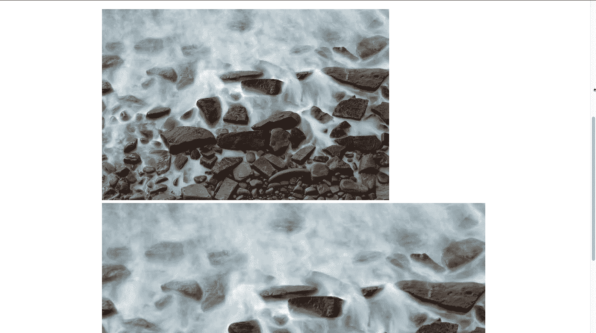
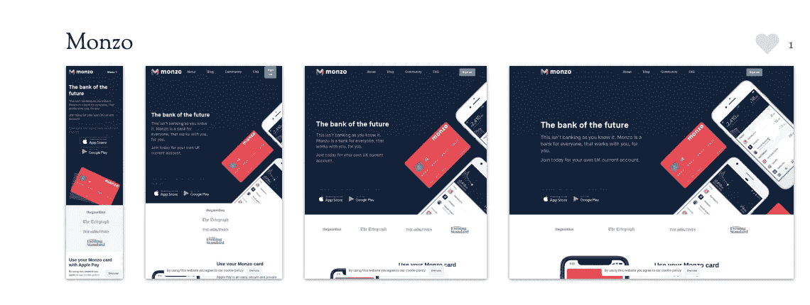
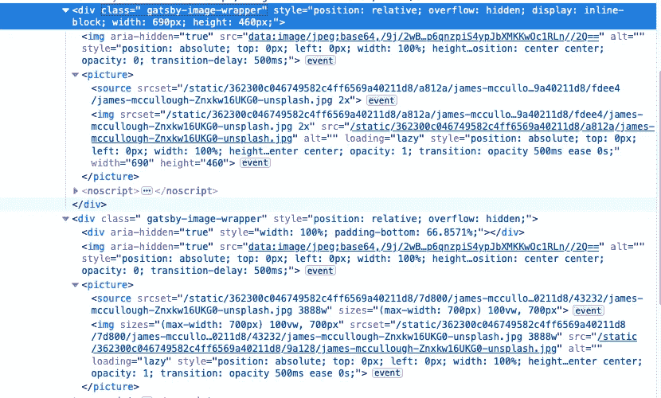
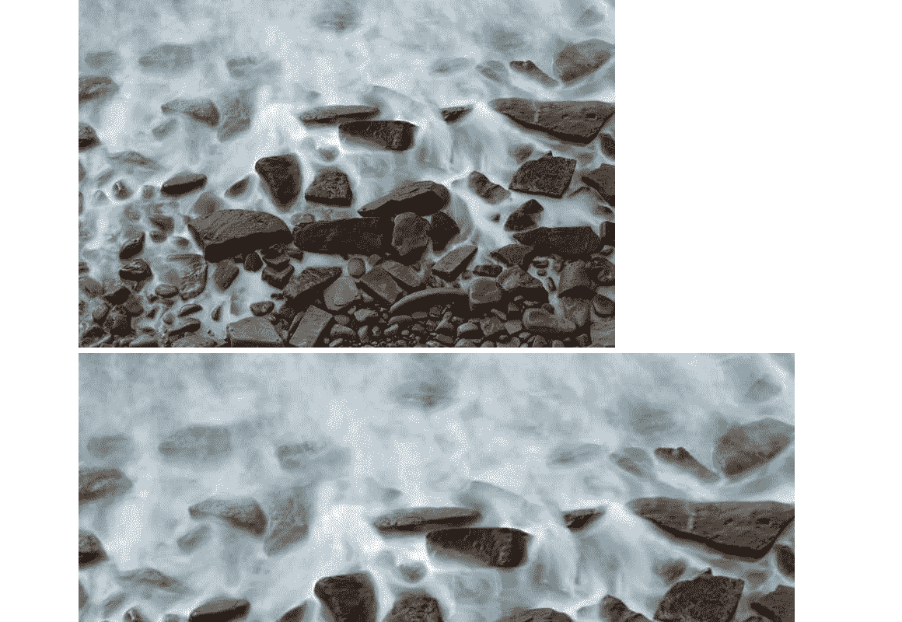

# 透过盖茨比形象理解回应型形象

> 原文：<https://betterprogramming.pub/understand-responsive-images-through-gatsby-image-81f861b91158>

## 盖茨比的专业人员是如何处理的


照片由 [Soragrit Wongsa](https://unsplash.com/@invictar1997?utm_source=unsplash&utm_medium=referral&utm_content=creditCopyText) 在 [Unsplash](https://unsplash.com/s/photos/gallery?utm_source=unsplash&utm_medium=referral&utm_content=creditCopyText) 上拍摄。

如果你说你没有掌握反应图像，我明白了。在这个棘手的问题上，有太多的事情要计划，场景要预测，决策要做出。

这篇文章将偏离响应图像的标准入门。我将带您浏览由`[gatsby-image](https://www.gatsbyjs.org/packages/gatsby-image/)`插件生成的那些媒体的标记。这样，我们将真正理解网络图像在现实世界中是如何优化的，以及这些决策背后的基本原理。

# 为什么要通过盖茨比形象来学习反应型形象？

这个想法来自我最近和盖茨比的经历。我用 Gatsby 重建了我的网站，不得不使用`gatsby-image`插件来渲染图像。

起初，我以为我需要的只是安装插件，它会开箱即用，但我错了。

我必须配置我的图像在 GraphQL 查询中的外观，我不知道固定图像和流动图像之间的区别，也不知道在后者的情况下我应该设置什么样的最大宽度。

在花了一天时间阅读了`gatsby-image` [文档](https://www.gatsbyjs.org/docs/gatsby-image/)之后，我意识到我根本不理解响应式图像。而`gatsby-image`的输出也正是如此。

我相信盖茨比有一个最好的方法来反应图像。你可以花一天时间阅读长篇大论的教程，列举一些人为的例子，或者你可以剖析盖茨比是如何做到的，并从中吸取教训。

# 先决条件

我假设你熟悉盖茨比网站的结构。出于演示目的，我将使用官方入门网站。

如果您还没有创建，您可以使用一个简单的命令来完成:

```
shell
gatsby new image-demo [https://github.com/gatsbyjs/gatsby-starter-hello-world](https://github.com/gatsbyjs/gatsby-starter-hello-world)
```

然后创建一个新的`src/images`目录来存储你的图片。你可以从这个[网址](https://images.unsplash.com/photo-1586713036700-126de261367a?ixlib=rb-1.2.1&q=80&fm=jpg&crop=entropy&cs=tinysrgb&dl=james-mccullough-Znxkw16UKG0-unsplash.jpg)下载我正在使用的图片。

在`index.js`文件中，粘贴以下代码:

简而言之，我们将一幅图像查询和渲染成两个版本:固定的和流动的。

现在，用`gatsby develop`运行开发模式，打开浏览器。你应该看到一个固定的图像，后面跟着一个流动的图像。


固定图像与流动图像。

# 流动图像与固定图像

上面两幅图像代表了`gatsby-image`产生的两种响应图像:固定的和流动的。

在我们的示例中，固定图像被锁定在 690x460，而第二个图像是最大宽度为 700 的流动图像。

对于固定的图像，我只需要指定高度，Gatsby 会自动计算出所需的宽度，以保持纵横比。因为原图是 3888x2592px，所以新的宽度是 3888 * 460 / 2592 = 690。太好了。

显然，固定图像和流动图像看起来很不一样，但是我应该什么时候使用它们呢？

不可否认，我花了一天时间才弄明白，但你不必。你所需要做的就是调整浏览器窗口的大小，你会发现不同之处。



调整浏览器窗口大小时固定图像和流动图像的区别。

随着视口宽度的减小，固定图像的尺寸永远不会改变。宽度可能会缩小，但这是因为浏览器窗口比图像窄，它只能显示图像在屏幕上可见的部分。

而流体图像会调整大小，以便在屏幕上漂亮地显示。

在查询要呈现到组件中的图像之前，问问自己，“我需要固定的还是流动的图像？”

如果你知道你的图像应该总是有一定的大小，查询`fixed`。如果你想改变你的图像的宽度和/或高度，甚至从横向转换成纵向，然后查询`fluid`。

说实话，关于固定图像，其他的就不多说了。此外，我们在这里是为了响应图像。因此，流体类型将是本文的重点。

在我们检查由`gatsby-image`生成的响应图像的标记之前，它有助于理解我们为什么首先要费心。

笔记本电脑、台式机、平板电脑和智能手机的大量出现对技术爱好者来说是一个福音，但也给网页设计者和开发者带来了痛苦。

以下是我们遇到的常见问题:

## 如何在窄屏幕设备上显示图像

这就是通常所说的艺术方向问题。我曾经认为我只需要缩小图像，但它不是那么简单。

比如有些图像有很多小细节。当显示在移动浏览器上时，即使它们被缩小，这些细节也会变得不明显。

一种解决方案是显示裁剪后的版本，只显示图像的重要细节，就像 Monzo 所做的那样:



## 如何在不同的屏幕上提供合适的图像尺寸

在我从事网页设计的早期，每当我必须为移动屏幕做计划时，我只是用这个简单的 CSS 命令缩小一个图像:

```
img {width: 100%height: auto}
```

但是，CSS 只影响图像的*外观*。浏览器加载的仍然是原本用于大屏幕显示的完整图像尺寸。

相信我，这种错误我见得多了。电子商务网站上不小于 2MB 的 DSLR 照片不受屏幕尺寸限制。带宽差。

在这种情况下，我们可以创建多个分辨率，让浏览器根据请求网页的设备选择合适的大小。

## 如何在高分辨率屏幕上显示图像

这个问题和上面的问题类似，但是在一个稍微不同的上下文中。

例如，并非所有的笔记本电脑都是生而平等的。有些是 15 英寸，但像素密度比更高。这些特殊的屏幕需要比你预期的更大的图像才能很好地显示。

在这种情况下，您将提供相同大小但分辨率不同的图像。

发现问题后，我们将详细研究解决方案。

# 响应图像的剖析

这里是由`gatsby-image`生成的固定和流动图像的标记。



盖茨比图像生成的固定和流动图像的标记。

无论图像是固定的还是流动的，它总是被包装在一个名为`gatsby-image-wrapper`的`<div>` 元素中。

包装器中的第一个元素是一个占位符图像。

我们可以看出它是一个占位符，因为它的属性是`aria-hidden=”true”`，图像的尺寸是 20x13。

当浏览器没有完成加载实际图像时，这个占位符有两个用途:

*   使用“模糊”技术实现平滑过渡，这种技术正是 Medium 所普及的。
*   防止图像跳跃。

如果你刷新浏览器，你会看到熟悉的模糊效果。



模糊效果。

说实话，网速慢的时候模糊效果最好，这可能是网速慢的唯一好处。它让我们开发人员享受我们的劳动成果和技术奇迹。

占位符图像的正下方是一个空的`<div>`，只有当图像设置为流体时才会出现。

此元素为图像添加底部填充。它的值与图像的纵横比相同:2592/3888 = 0.6666。

这个空的`<div>`是需要的，因为`gatsby-image-wrapper`和实际图像都没有预定义的宽度和高度。同时，实际图像必须占据其父图像的整个宽度和高度。

如果没有底部填充的空容器，实际的图像将会消失。

最后是`<picture>`元素。

这个标签没有什么特别的，但是它包含了两个重要的元素:`<source>`和``。因为它们在图片布局中非常关键，所以我会把它们放在专门的标题中。

## 元素

`<source>`元素最重要的属性是`srcset`。它提供了一组带有提示的图像，帮助浏览器为不同的视窗宽度选择正确的图像。

注意`srcset`在固定图像和流动图像之间是不同的。

对于固定图像:

福克斯流体图像:

如您所见，`srcset`中的每个图像都用逗号与前一个图像隔开。每个都包含:

*   图像的路径(`/static/362300c046749582c4ff6569a40211d8/25b50/james-mccullough-Znxkw16UKG0-unsplash.jpg`)。
*   一个空格。
*   固定图像的`x`描述符和流动图像的`w`描述符。

`x`指像素密度。`x`描述符指定图像的像素密度。

在本例中，默认图像为 35KB，但当像素密度为标准值的 1.5 倍时(两倍时为 107KB)，图像会扩展到 68KB。

从 35 岁到 68 岁，再到 107 岁，这是一个巨大的飞跃。因此，您可以看到为正确的屏幕设备提供正确的图像的重要性。

同时，`w`描述符中的`w`是指图像的固有宽度，以像素为单位。注意，它是以`w`为单位设定的——而不是我们经常看到的`px`。这是图片的真实尺寸，你可以通过检查你电脑上的文件来确认。

`w`描述符仅适用于流动图像，因为对于固定图像，无论情况如何，我们都只有一个想要显示的单一图像尺寸。

在本演示中，`w`描述符值为 1750w、350w、700w、1050w、1444w 和 3888w。你注意到模式了吗？

3888w 恰好是原图的宽度。

同时，我们将流体图像的`maxWidth`设置为 300。这意味着`gatsby-plugin-sharp`生成的自动大小是我们在 GraphQL 查询中设置的值的 50%、100%、150%和 200%。想得真周到。

同样，在流体图像的情况下，我们在`<source>`元素中有另一个属性:`sizes`。

该属性定义了一组媒体条件和当条件为真时提供的相应图像。

```
<picture><source sizes="(max-width:700px) 100vw, 700px></source></picture>
```

上面的提示告诉浏览器，当浏览器窗口的宽度小于或等于 700 像素时，让图像跨越 100%的视窗。否则，只提供 700 像素宽的图像。

同时，这个提示也满足我们的 GraphQL 查询，该查询指定图像的宽度永远不超过 700px。

## 真实的图像

最后，我们到达最重要的``标签。没有它，实际的图像不会出现。

它的`sizes`和`srcset`属性与`<source>`元素中的属性相同。

这里注意的属性是`src`。你还记得媒体条件告诉浏览器当视窗在 700 像素以上时加载 700 像素宽的图像吗？

这个`src`属性嵌入了那个图像。

实际上，这就是实际图像的全部内容。一张照片有这么多基础。

这就结束了我使用`gastby-image`插件对响应图像的入门。我知道有很多信息要处理，所以慢慢来。如果你在手机屏幕上提供一个巨型图像，世界不会毁灭，但如果你记住响应图像，让`gatsby-image`做繁重的工作，那会好得多。