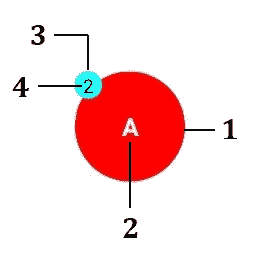
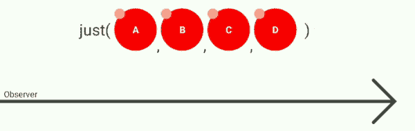
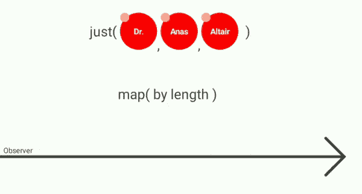
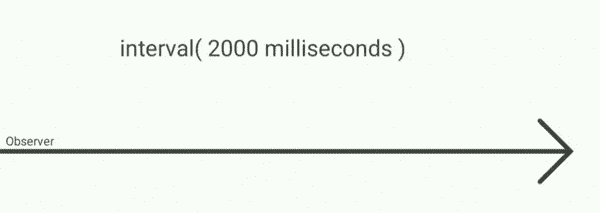
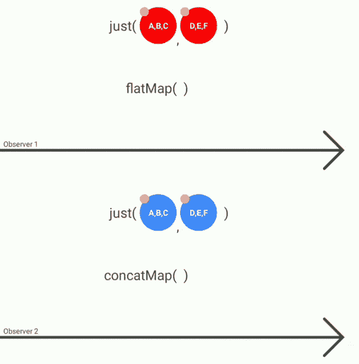

# 以新的方式理解 RxJava

> 原文：<https://betterprogramming.pub/understand-rxjava-in-a-new-way-3f43f2696c8c>

## 用动画图学习 RxJava


反应式编程是编写清晰代码的一种非常重要的方式，而[react vex](http://reactivex.io/)是以反应方式异步处理数据序列的最著名的库之一。

对于 Android 开发者，我们使用的是 [RxJava](https://github.com/ReactiveX/RxJava) 。

您将使用 RxLab 应用程序，通过可视化图表、动画和交互来学习 RxJava。

注意:本文不会涉及 RxJava。它只会帮助你理解和记住如何工作。

# RxLab 是什么？

RxLab 是一款 Android 应用。这是学习 ReactiveX 动画编程、调度程序和时间管理的开源和神奇的工具。

[从 Google Play 下载应用](https://play.google.com/store/apps/details?id=com.github.anastr.rxlab)开始学习，或者从 Github 获取最新更新和源代码:

[](https://github.com/anastr/RxLab) [## anastr/RxLab

### 在 GitHub 上使用动画、调度程序和时间项目学习 ReactiveX 编程的神奇工具。这是一个开放的…

github.com](https://github.com/anastr/RxLab) 

在我们开始之前，我想解释一下这个应用程序是如何产生 emit 的:



这是一个发射器

1.  向发出它的可观察物体发射色点
2.  价值
3.  颜色指向当前线程
4.  正在使用的线程索引

当小圆圈的颜色(3 号)是:

*   红色:主线程
*   青色:计算线程
*   黄色:IO 线程
*   绿色:单线程

让我们从一个简单的操作开始:

# 就()

这段代码将打印日志中从 A 到 D 的字母，但是我想让您看一下交互图:

```
Observable.just('A', 'B', 'C', 'D')
     .subscribe **{** Log.i(TAG, "$**it**")
     **}**
```



`Observable.just`是`observable`对象，在`subscribe`方法中我们放入了`observer`。

在我们的图中，`just()`是`observable`，箭头是`observer`。正如你所注意到的，(A，B，C，D)是发射的。

`just()`操作将获取许多项，然后以相同的顺序和相同的线程(在我们的例子中是主线程)将它们传递给`observer`。当`observable`完成发送它的发射时，它将调用我们的`observer`中的`onComplete`(通过在我们的图中画一条小竖线)，这意味着`observable`已经发送了它所有的发射，`observer`在那之后将不会接收任何发射。

# 地图()

假设我们有`strings`的发射，我们需要将它们映射到这些字符串的长度列表。

```
*Observable*.just("Dr.", "Anas", "Altair")
    .map **{ it**.length **}** .subscribe(...)
```



发射将从`observable`一个接一个地发送到`map`操作，后者将字符串转换成整数(字符串的长度)，然后将它们发送到`observer`。

同样，发出将在相同的顺序和相同的线程中进行。

# 间隔()

如果我们想要每两秒发送一次信号，RxJava 很容易做到:

```
Observable.interval(2000, TimeUnit.MILLISECONDS)
.subscribe(...)
```

这是我们的观察者将会收到的:



带条纹的黄色方块是时间。`observable`会每两秒钟自动发送一次信号。第一次发射将是 0，然后是 1，2，3…它会一直发出信号。

你注意到了吗？默认情况下，`interval`操作将在计算线程上工作，并将向同一计算线程上的`observer`发送一个发射，因此您需要小心处理`observer`内部的发射。或者可以使用`observeOn()`操作来改变螺纹。

# flatMap()和 concatMap()

看到这两个`observable`了吗:

```
*Observable*.just("A,B,C", "D,E,F")
    .flatMap **{** stringEmit **->** *Observable*.fromIterable(stringEmit.*split*(','))
            .subscribeOn(Schedulers.computation())
            .doOnNext **{** *longProcess*(..) **}
    }
**    .subscribe(...)*Observable*.just("A,B,C", "D,E,F")
    .concatMap **{** stringEmit **->** *Observable*.fromIterable(stringEmit.*split*(','))
            .subscribeOn(Schedulers.computation())
            .doOnNext **{** *longProcess*(..) **}
    }
**    .subscribe(...)
```



在这个例子中，我们有两个`observable`和两个`observer`，它们互不影响。

## 平面地图()

第一个只是有两个字符串发出(“A，B，C”和“D，E，F”)。`flatMap`操作将把每个发射转换成一个`observable`。在我们的例子中，它将把“A，B，C”转换成一个`observable`，这个`observable`将发送三个 emit(“A”、“B”和“C”)，我们调用`subscribeOn`来改变新的`observable`将要处理的线程，然后对每个字母 emit 进行长时间的处理。

回到我们的图表，仔细观察`flatMap`操作。它将从上游获取所有发射，并在不同的计算线程上一起处理它们。然后，信件会以随机顺序发送到最后的`observer`(第一个完成长流程的)*。*

## concatMap()

它将做与`flatMap`相同的工作，但是它将从上游获取第一个字符串发射，转换它，并将所有新的`observable`发射发送到`observer`。只有到那时，它才会处理从上游发出的下一个字符串。

`flatMap`和`concatMap`会做同样的工作，但是`concatMap`尊重顺序。

RxLab 中有很多操作我会让你自己去发现(`filter`、`reduce`、`scan`、`zip`、`combineLatest`、`distinct`、`throttle`等等)。

# 结论

RxLab 是一个非常好的应用程序，当你想要一个操作，但忘记了它是如何工作的，或者想看看线程、时间或结果时，可以打开它。

这个项目最终不会帮助你从零开始学习 RxJava，但是会帮助你理解它，记忆它的操作。