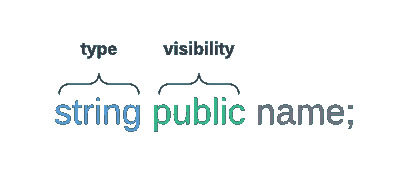
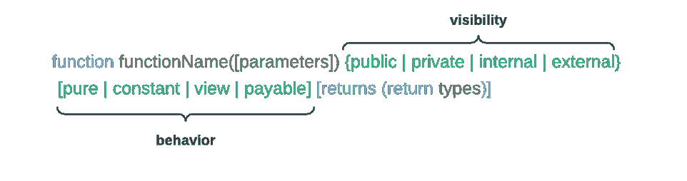

# 通过学习可靠性基础知识了解智能合同

> 原文：<https://betterprogramming.pub/understand-smart-contracts-by-learning-solidity-basics-43cfb25878c0>

## 对基础知识的探究

扬·安东宁·科拉尔在 [Unsplash](https://unsplash.com?utm_source=medium&utm_medium=referral) 上拍摄的照片

分散金融应用的潜力是我学习更多以太坊开发的最初动机。智能合约是我在钻研这个话题时学到的第一个概念。

我准备从头开始学习这项技术。但是仔细研究之后，我意识到以前的面向对象和 web 开发经验已经是一个有益的开始。

在本文中，我将分解 Solidity 中的智能契约，以提高您的理解，并为您开始在以太坊区块链中开发应用程序打下更好的基础。

## 简单介绍

智能合同既不智能也不合法。它是居住在以太坊区块链上特定地址的代码(函数)和数据(状态)组合的计算机程序。

把智能合同想象成部署在世界计算机上的程序，对其他人来说是可见的和可访问的，可能会有所帮助。

部署的契约是不可变的。修改智能协定的唯一方法是部署新实例。

给定相同的交易上下文和以太坊区块链的状态，对于任何运行该合约的人来说，结果将是相同的。

## 执行上下文

在执行时，合同具有有限的上下文，包括:

*   进入他们自己的国家
*   启动执行的事务的上下文
*   以太坊区块链的状态(一些关于最近街区的信息)

智能合约处于休眠状态。它们仅在事务触发时执行。只有当执行成功终止时，交易期间所做的合同状态或帐户更改才会记录到区块链中。

## 简单智能合同

让我们分解一个简单的可靠性智能合同:

简单的智能合约示例。

第 1 行指定了一个版本杂注:`pragma solidity ^0.8.13;`

这是一个编译器指令，用于指示编译器我的合同需要哪个编译器版本。这一行告诉编译器如何处理源代码。

在我的例子中，我指定代码是为最小可靠性版本的`0.8.13`编写的。脱字符号`^`表示我允许小的修改，如`0.8.14`或`0.8.15`，但不允许大的修改`0.9.0`。这是为了确保我的代码不会因为任何重大改变而被编译。

第 3 行定义了合同:`contract Greeting { ...`

数据类型`contract`定义了一个对象。这个定义类似于面向对象语言中的类定义。契约对象可以包含数据和方法。

## 可变能见度

状态变量声明。

在 Solidity 中，每个状态变量都需要一个数据类型和可见性。我的契约的第 4 行声明了一个类型为`string`的`public`状态变量`name`。

`string public name;`

固体中的变量有 3 种可能的可见性级别:

*   **public:** 允许其他契约读取它们的值。编译器会自动为它们生成一个 getter 函数。
*   **内部:**默认可见性级别。这些变量只能从它们的协定和派生协定中访问。
*   **私有:**类似于内部变量，但它们对衍生合同不可见。

第 7 行和第 11 行声明了公共函数。

这是在 Solidity 中声明函数的语法:

Solidity 中的函数语法。

## 功能可见性

与状态变量类似，函数也有可见性级别。

*   **公共:**可通过外部账户交易或合同访问。契约中的其他功能也可以看到它们。
*   **外部:**类似于公共函数。然而，要在契约中调用它们，您必须在它们的调用前面加上关键字`this.`
*   **内部:**只能从合同和派生合同内部访问。
*   **私有:**类似于内部函数，但不能从派生契约中访问。

通过将合同部署到区块链，您可以让公众看到您的合同。内部或私有声明仅定义如何以及何时可以访问您的契约函数。

## 功能行为

一个函数也可以有 3 种可能的行为声明:

*   **常量或视图:**这些函数不会修改任何状态变量值。
*   **纯:**没有任何副作用。它们既不读也不写存储器中的任何变量。
*   **应付款:**应付款功能接受来款。

## 结论

围绕分散技术有很多积极的发展。智能合约在这一领域扮演着重要角色。我希望这篇介绍能让你有信心开始你的去中心化之旅。