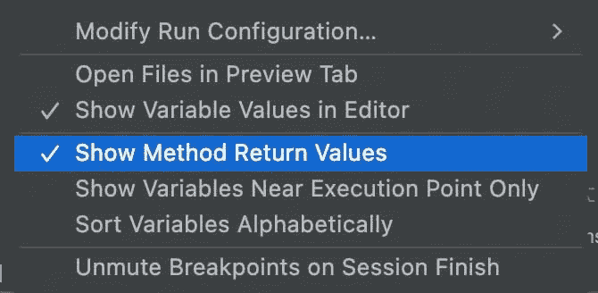
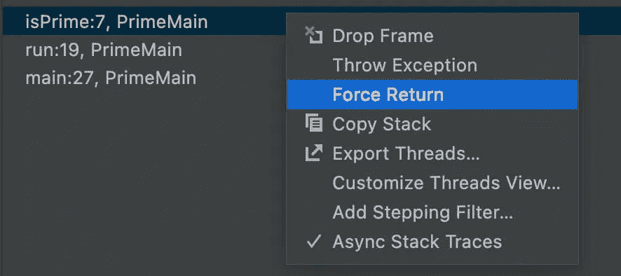
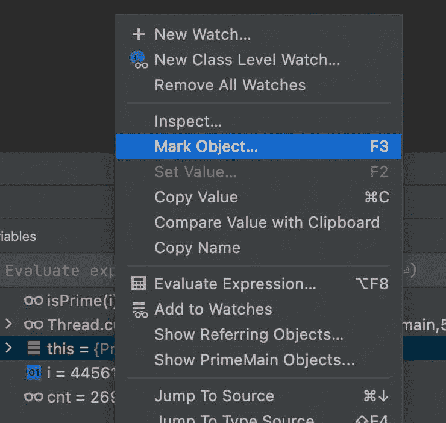
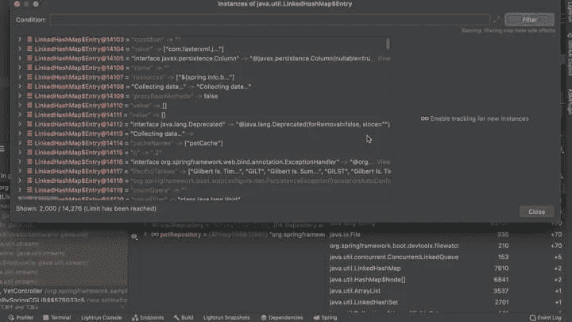
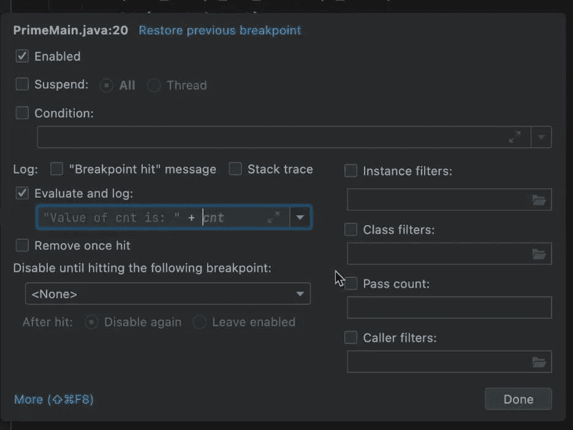
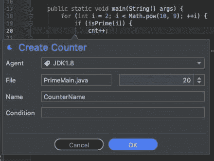
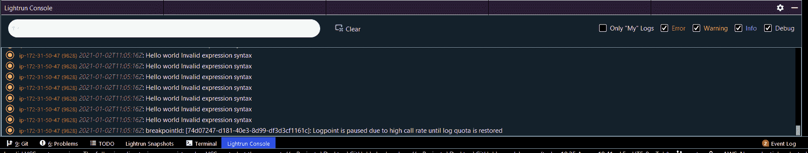
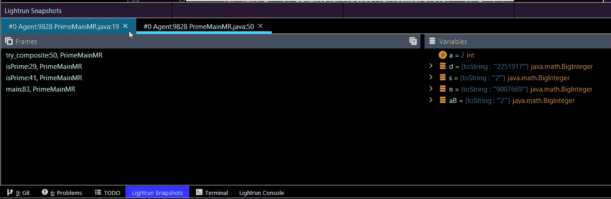

# 理解源代码——深入代码库，在本地和生产中

> 原文：<https://betterprogramming.pub/understand-source-code-diving-deep-into-the-codebase-locally-and-in-production-cba8a6732460>

## 为什么在没有 bug 的情况下应该进行调试

假设您有一个新的代码库要学习，或者有了一个开源项目。你可能是一个经验丰富的开发人员，对他来说这是一个打包简历中的另一个项目。或者，你可能是一个初级工程师，对他来说这是第一个“真正的”项目。

没关系！

有了全新的源代码库，我们仍然一无所知。

经验丰富的学长可能有助于发现一些东西和识别模式。但是我们没有人能读懂并真正理解一个有超过 100 万行代码的项目。我们查看文档，根据我的经验，这些文档通常与实际的代码库有一点相似之处。我们对各种模块进行了分离和假设，但是很难将它们捡起来。

我们使用 IDE 工具来搜索连接，但是这真的很难。这就像一群猫在追逐一根纱线一样。

作为一名十多年的顾问，我每周都会接到新的客户项目。在这篇文章中，我将描述我用来做这件事的方法，以及我如何在 Lightrun 中进一步采用这种方法。

# 寻找用法

编程语言可以帮很多忙。作为 Java 开发人员，我们很幸运，基于代码的探索工具非常可靠。我们可以挖掘代码并找到用法。ide 会突出显示未使用的代码，它们在这方面非常出色。但是这有几个问题:

*   我们需要知道去哪里找，找多深
*   测试或 API 可能会使用代码，但用户实际上并不使用这些代码
*   通过使用很难理解心流。尤其是异步流
*   没有像数据这样的上下文来帮助解释代码流

一定有比随意梳理源文件更好的方法

# UML 生成

另一个选择是从源文件生成 UML 图表。我个人对这些工具的体验并不好。他们应该对“大局”有所帮助，但我经常对这些工具感到更加困惑。

它们将次要的实现细节和未使用的代码提升到令人难以置信的混乱图表中的同等地位。对于典型的代码库，我们需要的不仅仅是高层视图。魔鬼在细节中，我们的感知应该是版本控制中的实际代码库。不是什么理论模型。

# 调试作为一种学习工具

调试器立即解决了所有这些问题。我们可以立即验证假设，看到“真实世界”的用法，并跳过一个代码块来理解流程。我们可以放置一个断点来查看我们是否到达了一段代码。如果到达得太频繁，我们不知道发生了什么，我们可以将这个断点设为有条件的。

我习惯在使用调试器研究代码库时读取表中变量的值。

这个值在这个时间点有意义吗？

如果没有，那我就有东西要看，要弄清楚。有了这个工具，我可以快速理解代码库的语义。在接下来的几节中，我将介绍在调试器和生产环境中学习代码的技巧。

注意，我使用的是 Java，但这应该适用于任何其他编程语言，因为这些概念(大部分)是通用的。

# 野外观察点

我认为大多数开发人员都知道[现场观察点](https://talktotheduck.dev/basics-of-breakpoints-you-might-not-know#heading-field-watchpoint)，只是忘记了它们！

“谁改变了这个值，为什么？”可能是开发人员问得最多的问题。当我们查看代码时，可能有几十个代码流触发了一个变化。但是在田地上放置一个观察点可以在几秒钟内告诉你一切。

在研究代码库时，理解状态突变和传播可能是你能做的最重要的事情。

# 返回值

逐句通过方法时需要理解的最重要的事情之一是返回值。不幸的是，对于调试器来说，当从一个方法返回时，这些信息经常会“丢失”,并且可能会错过流程的关键部分。

幸运的是，大多数 ide 允许我们动态地检查返回值，并查看方法执行后返回了什么。在 JetBrains IDEs 中，比如 IntelliJ/IDEA，我们可以启用“显示方法返回值”，正如我在这里讨论的。

# 作为学习工具的流量控制

为什么需要这条线？

如果它不在那里会发生什么？

这是一组很常见的问题。有了调试器，我们可以[改变控制流](https://talktotheduck.dev/debugging-tutorial-java-return-value-intellij-jump-to-line-and-more)跳转到特定的代码行，或者用特定的值强制方法提前返回。这可以帮助我们检查特定行的情况，例如，如果这个方法是用值 X 而不是 Y 调用的呢？

简单。只需将执行向后拖一点，然后用不同的值再次调用该方法。这比深入阅读层次结构要容易得多。

# 通过对象标记保持跟踪

对象标记是那些未知的调试器功能中的一种，它非常有价值并且非常强大。它对理解“到底发生了什么”有很大的作用

你知道当你调试一个值时，你写下指向对象的指针，这样你就可以跟踪“这个代码块中发生了什么？”。

这变得很难跟踪。所以我们将交互限制在很少的指针上。对象标记让我们通过在固定名称下保存对指针的引用来跳过这一步。即使对象超出范围，引用标记仍然有效。

我们可以开始跟踪对象，以了解流程并了解事情是如何工作的。例如，如果我们正在调试器中查看一个`User`对象，并想要跟踪它，我们可以只保留对它的引用。然后在用户对象就位的情况下使用条件断点来检测访问用户的系统区域。

这对于跟踪线程也非常有用，有助于理解线程逻辑复杂的代码。

# 检查内存中的对象

我遇到的一种常见情况是在调试器中看到一个组件。但是我一直在寻找这个对象的不同实例。例如，如果你有一个名为`UserMetaData`的对象。每个用户对象都有对应的`UserMetaData`对象吗？

作为一个解决方案，我们可以使用内存检查工具，看看给定类型的哪些[对象保存在内存](https://talktotheduck.dev/memory-debugging-and-watch-annotations#heading-memory-usage)中！

查看实际的对象实例值并检查它们有助于将数字/事实置于对象之后。这是一个帮助我们可视化数据的强大工具。

# 使用跟踪点语句来跟踪复杂的逻辑

在开发过程中，我们通常只是添加日志来查看“是否达到了这条线”很明显，一个断点是有好处的，但是我们并不是总想停下来。停止可能会改变线程的行为，这也可能会非常繁琐。

但是添加日志可能会更糟。重新编译、重新运行，并意外地提交到存储库中。对于调试和研究代码来说，这是一个有问题的工具。

幸运的是，我们有[跟踪点](https://talktotheduck.dev/basics-of-breakpoints-you-might-not-know#heading-tracepoints)，它们是有效的日志，让我们打印出表达式等。

# 生产中发生了什么——又名“现实报道”

这对“简单”的系统非常有用。但是在我们的行业中，有一些平台和设置非常难以在调试器中重现。了解我们的代码在本地工作的方式是一回事。它在生产中的工作方式是完全不同的。

生产是唯一真正重要的事情，在多开发者项目中，很难评估生产和假设之间的差距。

我们称之为现实报道。例如，您可以在测试中获得 80%的覆盖率。但是如果你对源代码库中频繁访问的类的覆盖率很低，那么 QA 可能就没那么有效了。我们可以反复研究回购协议。我们可以使用每一种代码分析工具和设置。但他们不会向我们展示真正重要的两件事:

这在生产中实际使用吗？

这在生产中是如何使用的？

没有这些信息，我们可能会浪费时间。比如在处理回购上百万行的时候。你不想浪费你的学习时间去阅读一个不常用的方法。

为了深入了解生产和调试环境，我们需要一个开发人员可观察性工具，比如 Lightrun。你可以在这里[免费安装。](https://lightrun.com/free)

# 用计数器测量

计数器让我们看到一行代码到达的频率。这是我们拥有的最有价值的工具之一。

这种方法达到了吗？

到达代码中的这个块了吗？多久一次？

如果你想知道先把精力集中在哪里，计数器可能是你可以使用的最方便的工具。你可以在这里阅读关于柜台[的内容。](https://docs.lightrun.com/metrics/#counter)

# 有条件的假设验证

我们经常看一个语句，做各种各样的假设。当代码对我们来说是新的时候，这些假设可能是我们理解代码的关键。一个很好的例子是，使用这个特性的大多数用户已经使用这个系统有一段时间了，应该对它很熟悉。

您可以使用附加到任何操作(日志、计数器、快照等)的条件语句来测试这一点。).因此，我们可以使用类似于`user.signupDate.getMillis() < …`的条件。

您可以将它添加到一个计数器中，并计算出不符合您预期的用户数量。

# 没有噪音的日志和管道学习

我认为很明显，在运行时注入日志对于理解我们的系统有很大的不同。但是在生产中，这是有代价的。我正在研究系统，同时查看日志，我所有的“methodX 达到值 Y”日志给我们可怜的 DevOps/SRE 团队增加了噪音。

我们不能这样。研究某样东西应该是孤独的，但是根据定义，生产恰恰相反。

有了[管道](https://docs.lightrun.com/logs/#configure-piping)，我们可以在本地将所有东西记录到 IDE 中，让其他人免受干扰。因为逻辑是沙箱化的，所以如果您记录太多，就不会有开销。所以尽情狂欢吧！

# 便于学习的快照

学习中的一个巨大挑战是理解我们“还”不知道的东西。[快照](https://docs.lightrun.com/snapshots-plugin/)帮助我们更全面地了解代码。快照就像放置任何断点并检查堆栈中变量的值，以查看我们是否理解了概念。它们只是“不会中断”,因此您可以获得所有可以用来学习的信息，但系统会照常运行，包括线程行为。

同样，使用条件快照非常有助于确定特定的问题。例如，当拥有权限 X 的用户使用这种方法时，会发生什么情况？

简单。为权限放置条件快照。然后检查生成的快照，看看变量值是如何受到影响的。

# 一锤定音

开发人员通常与调试工具关系紧张。

一方面，它们通常是拯救我们的工具，帮助我们找到错误。另一方面，当我们意识到在过去的几个小时里我们是彻头彻尾的白痴时，它们是我们看的工具。

我希望这个指南能鼓励你在没有 bug 的时候去找调试器。运行调试器所提供的见解，即使您没有主动调试，也可以“改变游戏规则”