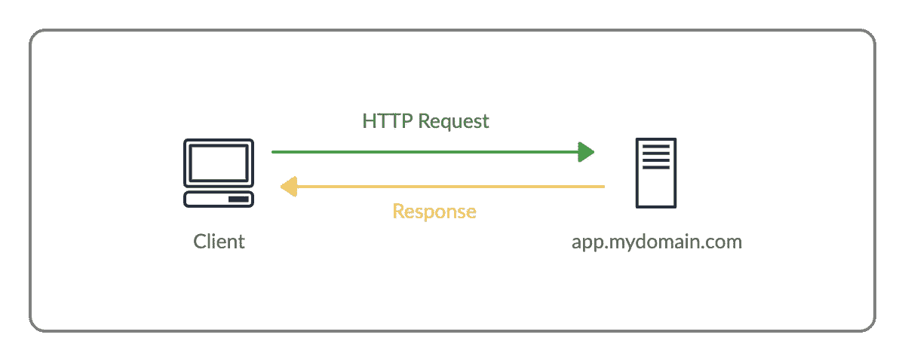
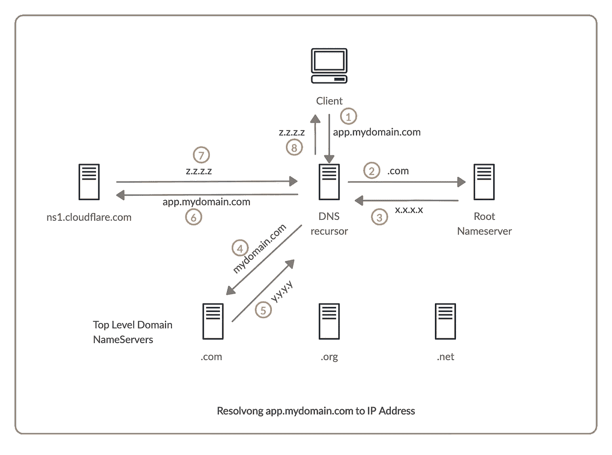

# 理解 HTTP 请求的流程

> 原文：<https://betterprogramming.pub/understand-the-flow-of-a-http-request-1a268ec193f0>

## 当你在浏览器中输入一个网址时会发生什么？

想知道当你在浏览器中点击回车会发生什么吗？这篇文章从开发人员的角度回答了这个问题，包括开发人员应该知道的关于完成 HTTP 请求的所有事情。虽然它只是一个传输文件的协议，但它本质上是互联网的主干。

当你在浏览器的地址栏中输入一个 URL 时，它会手动开始，或者通过应用程序、网站(JavaScript)或其他程序以编程方式开始，并在收到响应时结束，在这两者之间，神奇的事情发生了。

这就是我们通常理解 HTTP 请求的方式(一种过于简化的表示)。

假设你在你的系统上打开`app.mydomain.com/me`。浏览器会自动假定`http://`在你的 URL 的开头。

下面我们来分解一下网址`http://app.mydomain.com/me`:

*   `http://`:用于通信的协议
*   `mydomain.com`:服务器的域
*   `app`:服务器的子域
*   `/me`:路径

HTTP 协议具有普遍共享的标准预定义规则，这使得有意义的通信成为可能，就像英语具有使我们能够通信的标准语法一样。

# 那么一旦你点击了回车，我们的请求如何到达服务器呢？

互联网仅仅是一个全球性的电缆网络，它允许每一个连接到网络的设备与任何其他连接到网络的设备进行通信。

这就是世界如何通过承载全球所有数据的海底电缆连接起来的。(本图仅显示海底电缆。陆地网络没有显示出来，但确实存在。

横跨全球的海底电缆网络

如果这对你来说是新的，不要担心——你并不孤单。很长一段时间，我认为互联网是通过卫星路由的(是的，我知道那很傻！).

假设你在伦敦，你想连接到美国的服务器。这些电缆中的一条将把你的请求从伦敦传送到美国。

但是有一个问题。这种数据包/数据的路由使用 IP 地址而不是域名，就像你的邮件到达时带有你的街道名和住宅地址，而不仅仅是你的名字。

# **那么我们如何找到** `**app.mydomain.com**` **的 IP 地址呢？**

这就是域名系统(DNS)发挥作用的地方。这是互联网的地址簿。你连接到一个 DNS 服务器并请求`app.mydomain.com`的 IP 地址，DNS 服务器返回给你 IP 地址。

您的客户端如何知道 DNS 服务器的地址？

因为一台设备必须知道另一台设备的 IP 地址才能进行通信，所以客户端必须事先知道 DNS 服务器的 IP 地址。当您连接到网络时，会为客户端分配一个 IP 地址。它还被告知 DNS 服务器的地址。此外，您可以手动配置您的设备以使用特定的 DNS 服务器。

DNS 服务器实际上是如何将域名解析为 IP 地址的？

客户端向查询多个名称服务器的 DNS 递归服务器发送请求，直到解析该查询:

每当你购买一个域名，你配置一个域名服务器，负责保存你所有的 DNS 记录。

假设您已经将您的域、`mydomain.com`、名称服务器配置为 Cloudflare ( `ns1.cloudflare.com`)。因此，无论你的域名有什么问题，`ns1.cloudflare.com`都有权利回答。这就是这个域名服务器被称为*权威域名服务器的原因。*

那么你的 DNS 递归器是如何到达你的权威域名服务器的呢？

*   它查询根域名服务器以获取所有 TLD 域名服务器的位置，在我们的例子中(`.com`)。
*   TLD 域名服务器存储该 TLD 所有域名的权威域名服务器的位置(例如，`.com` TLD 域名服务器将存储所有`.com`域名的所有权威域名服务器的位置)。
*   权威名称服务器然后根据您配置的记录返回。例如，我为`mydomain.com`配置了这样的 DNS 记录:

因为我们请求了`app.mydomain.com`，所以它将查找名为`app`的记录。所以它会基于此返回一个 IP 地址。

现在客户端可以连接到服务器，因为它获得了`app.mydomain.com`的 IP 地址。

# **服务器如何响应 HTTP 请求？**

我们运行一个 web 服务器，负责处理这些传入的 HTTP 请求。最常用 web 服务器是 Apache 和 nginx。这些 web 服务器持续监听传入的请求，并对这些请求做出响应。

等等！

一台服务器上必须运行多个进程，那么我们的请求如何到达 Apache 呢？

就像任何设备一样，可能有多个进程，这就是网络端口的用处。所以像 Apache 这样的进程会占用网络端口并监听这些端口。虽然一个进程可以使用多个端口，但是一个端口不能被多个进程使用。

因此，我们还必须指定通信端口。但是我们没有提供港口，不是吗？

正如我所说的，HTTP 协议有一些普遍共享的预定义规则。其中之一是 HTTP 的默认端口是`80`，HTTPS 是`443`，类似地，DNS 有`53`。所以我们的 Apache 必须监听我们服务器的端口`80,443`。

我们有默认端口并不意味着我们不能改变它。比方说，我们可以在`3000`港运行 Apache。但是由于我们使用 HTTP 协议和非标准的 HTTP 端口，我们必须像`http://app.mydomain.com:3000/me`一样明确指定端口。

# **Apache/nginx 如何服务 HTTP 请求？**

这是 web 服务器应用程序的两个最常见的用例:

*   基于路径存储文件夹中的服务器静态文件
*   将请求移交给节点服务器等其他流程，并让该流程处理和提供响应

## **静态文件**

静态站点的 Apache 虚拟主机配置文件

您请求了`app.mydomain.com/me`，它将在`/var/www/my-static-website`中查找文件夹/文件，如果文件存在，它将返回该文件。或者如果一个文件夹存在，它将在那个文件夹中寻找`index.html`(这也可以定制)并返回它。

## **将该请求移交给其他进程**

假设您有 Node、Java、Python 或其他服务器运行在端口`4000`上，您希望该进程处理请求并生成响应。

在这种情况下，Apache 可以充当该服务器的代理。

代理的 Apache 虚拟主机

它会将任何针对`app.mydomain.com`的请求转发给`http://127.0.0.1:4000`，一旦收到响应，它会将其返回给客户端。它不需要局限于本地主机(`127.0.0.1`)，也可以作为其他服务器的代理。

# **为什么不直接在端口 80 上运行我们的 Node/Java/Python 服务器，避免 Apache 的开销？**

典型的情况是，您可能在一台服务器上运行多个网站。由于一个端口只能有一个进程，Apache 接受请求，并根据`ServerName`、**、**执行必要的操作。

但是，如果您托管的是一台拥有独立服务器(如 Node)的服务器，您可以去掉 Apache，直接在端口`80`上运行它。

因此，一旦响应被确定，它就被发送回客户机。

# 嗯，那是 HTTP，但 HTTPS 是什么？

HTTPS 是 HTTP 的升级版。HTTP 中的所有内容都以明文形式传输。我们知道，所有这些数据都是通过各种不同公司拥有的光缆网络传输的，并经过各种政治管辖区。任何人都可以简单地接入这个网络，读取客户端和服务器之间的所有消息。

想象一下，输入您的 Gmail 帐户的密码，从您到 Gmail 服务器的每个人都能够阅读该电子邮件和密码。太可怕了，对吧？这就是没有 HTTPS 的互联网。HTTPS 在客户端和服务器之间提供端到端的加密，所以没有人能读取这些信息。

没有 HTTPS 提供的安全性，大规模的现代互联网是不可能的。

# 结论

所有这些都是为了提供一个简单的 HTTP 请求。