# 了解 MySQL 索引优化神器

> 原文：<https://betterprogramming.pub/understand-the-mysql-index-optimization-artifact-d4d7c6eb31f3>

## MySQL 索引优化教程


照片由 [Unsplash](https://unsplash.com?utm_source=medium&utm_medium=referral) 上的[剂量介质](https://unsplash.com/@dose?utm_source=medium&utm_medium=referral)拍摄

随着用户数量和数据量的增加，查询速度慢是一个不可避免的问题。一般来说，如果出现查询慢，说明接口响应慢，接口超时等问题。

如果是高并发场景，数据库连接可能会满，直接导致服务不可用。

缓慢的查询确实会导致许多问题。如何优化慢速查询？

主要的解决方案是:

*   监控 SQL 的执行，发送邮件和短信报警，快速识别查询缓慢的 SQL。
*   启用数据库慢速查询日志功能。
*   简化业务逻辑。
*   代码重构和优化。
*   异步处理。
*   SQL 优化。
*   索引优化。

今天我重点讲一下索引优化，因为这是解决查询 SQL 慢的最有效的方法。

如何检查一个 SQL 索引的执行状态？

是的，通过在 SQL 前面加上`explain`关键字，我们可以看到它的执行计划。通过执行计划，我们可以清楚的看到表和索引的执行情况，索引是否执行，索引执行的顺序，索引的类型`Wait`。

索引优化的步骤是:

*   使用 explain 查看 SQL 执行计划。
*   确定哪些索引使用不当。
*   优化 SQL，SQL 可能需要多次优化才能达到索引使用的最佳值。

# 什么是解释？

我们来看看 MySQL 的官方文档是如何描述`explain`的:

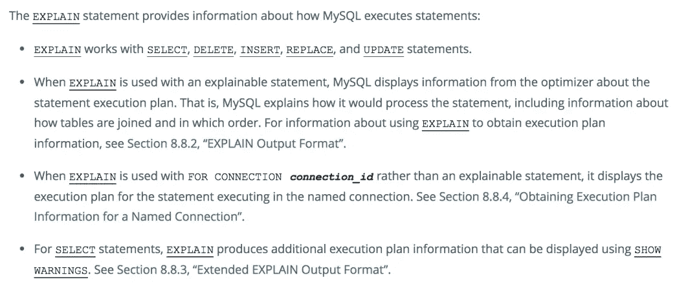

[点击阅读文档](https://dev.mysql.com/doc/refman/8.0/en/explain.html)

## **`**explain**`**:**的语法**

```
{EXPLAIN | DESCRIBE | DESC}
    tbl_name [col_name | wild]

{EXPLAIN | DESCRIBE | DESC}
    [explain_type]
    {explainable_stmt | FORCONNECTION connection_id}

explain_type: {
    EXTENDED
  | PARTITIONS
  | FORMAT = format_name
}

format_name: {
    TRADITIONAL
  | JSON
}

explainable_stmt: {
    SELECTstatement
  | DELETEstatement
  | INSERTstatement
  | REPLACEstatement
  | UPDATEstatement
}
```

**使用一个简单的 SQL 来看看使用`explain`关键字的效果:**

```
explain select * from test1;
```

**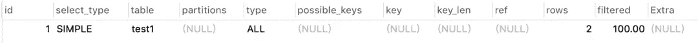**

**从上图可以看出，执行结果中会显示 12 列信息。**

**每个栏目的具体信息如下:**

**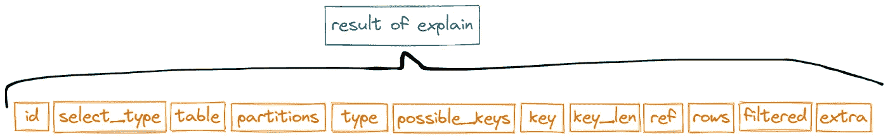**

**说白了，就是需要了解这些栏目的具体含义，才能正常判断指标的使用情况。**

**事不宜迟，我们开始吧。**

# ****`**id**`**之列。******

****该列的值是选择查询中的序列号，如 1、2、3、4 等。，它决定了表的执行顺序。****

****在 SQL 的执行计划中通常有三种情况:****

*   ****相同的 id。****
*   ****不同的 id。****
*   ****拥有相同的 id，同时拥有不同的 id。****

****那么，这三个案例表的执行顺序是什么呢？****

## *******1。相同 id*******

```
**explain select * from test1 t1 inner join test1 t2 on t1.id=t2.id**
```

****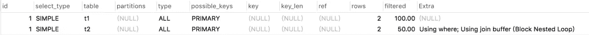****

****我们看到执行结果中的两个数据 id 都是 1，是一样的。****

****这个案例表的执行顺序是什么？****

****答:从上到下执行，先执行表`t1`，再执行表`t2`。****

## ******2*2。*不同 id******

```
**explain select * from test1 t1 where t1.id = (select id from  test1 t2 where  t2.id=2);**
```

****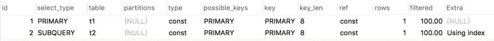****

****我们看到执行结果中两个数据的 id 不同，第一个数据是`1`，第二个数据是`2`。****

****这个案例表的执行顺序是什么？****

****答:将首先执行较大的序列号。这里将自下而上执行，首先执行表`t2`，然后执行表`t1`。****

## *******3。有相同的 id 同时又有不同的 id*和******

```
**explain
select t1.* from test1 t1
inner join (select max(id) mid from test1 group by id) t2
on t1.id=t2.mid**
```

****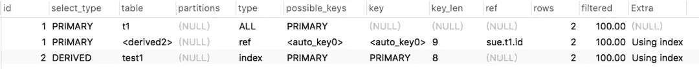****

****我们在执行结果中看到三段数据。前两段数据具有相同的 id，第三段数据与前一段数据具有不同的 id。****

****这个案例表的执行顺序是什么？****

****回答:先执行序号大的那个，自下而上执行。当序列号相同时，从上到下执行。因此，该列中表格的顺序是`test1, t1`。****

******注**:有一个特殊的表列表，内容是`<derived2>`，代表一个派生表，后面会详细描述。****

## ******之列`**select_type**`******

****该列表示`select`的类型。具体包括以下 11 种类型:****

*   ****`SIMPLE`:简单查询。****
*   ****`PRIMARY`:最外层的查询。****
*   ****`UNION`:在`UNION`之后的第二次或以后的查询。****
*   ****`DEPENDENT UNION`:在`UNION`之后的第二次或以后的查询，取决于外部查询。****
*   ****`UNION RESULT`:并集的结果。****
*   ****`SUBQUERY`:第一个子查询。****
*   ****`DEPENDENT SUBQUERY`:第一个子查询依赖于外部查询。****
*   ****`DERIVED`:派生表。****
*   ****`MATERIALIZED`:物化子查询。****
*   ****`UNCACHEABLE SUBQUERY`:结果无法缓存的子查询。****
*   ****`UNCACHEABLE UNION`:无法缓存`UNION`之后的第二次查询或以后的查询的结果。****

****最常用的有以下几种。****

*   ****`SIMPLE`:简单的`SELECT`查询，没有子查询和`UNION`****
*   ****`PRIMARY`:复杂查询中最外层的查询，代表主查询。****
*   ****`SUBQUERY`:子查询包含在`SELECT`或`WHERE`列表中。****
*   ****`DERIVED`:包含在`FROM`列表中的子查询，即派生的子查询。****
*   ****`UNION`:在`UNION`关键字后查询****
*   ****`UNION RESULT`:从`UNION`后的表中获取结果集。****

****让我们来看看这些`SELECT`类型是如何出现的。****

## *******1。简单的*******

```
**explain select * from test1;**
```

****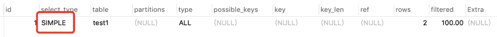****

****只出现在简单的`SELECT`查询中，不包含子查询和`UNION` s，这种类型更直观，我就不多说了。****

## *******2\. PRIMARY 和 SUBQUERY.*******

```
**explain select * from test1 t1 where t1.id = (select id from  test1 t2 where  t2.id=2);**
```

****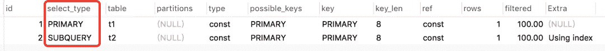****

****我们看到，在这个嵌套查询的 SQL 中，最外面的`t1`表属于类型`PRIMARY`，最里面的子查询`t2`表属于类型`SUBQUERY`。****

## *******3。*衍生******

```
**explain
select t1.* from test1 t1
inner join (select max(id) mid from test1 group by id) t2
on t1.id=t2.mid**
```

****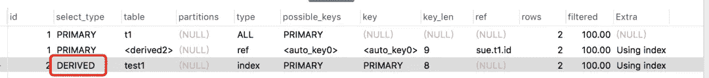****

****最后一条记录是派生表，一般是包含在`FROM`列表中的子查询，这里是 SQL 中的分组子查询。****

## ******4*。联合和联合结果*和******

```
**explain
select * from test1
union
select* from test2**
```

****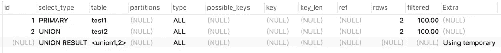****

****`test2`表是`UNION`关键字后的查询，所以标记为`UNION`，`test1`为主表，标记为`primary`。而`<union1,2>`代表与`id=1`和`id=2`的表并集，结果标记为`UNION RESULT`。****

****所以，`UNION`和`UNION RESULT`通常是成对的。****

## ******之列`**table**`******

****该列的值表示输出行引用的表的名称，如 previous: `test1, test2`等。****

****但它也可以是下列值之一:****

*   ****`<unionM,N>` : `M`具有和 id 值的行的联合`N`。****
*   ****`<derivedN>`:用于与该行相关联的派生表结果 id 的值`N`。派生表可能来自`FROM`子句中的子查询。****
*   ****`<subqueryN>`:子查询的结果，id 值为`N`。****

## ******之列`**partitions**`******

****该列的值表示查询将从中匹配记录的分区。****

## ******之列`**type**`******

****该列的值指示连接`type`，并且是索引执行情况的重要指标。****

****这包含以下类型:****

****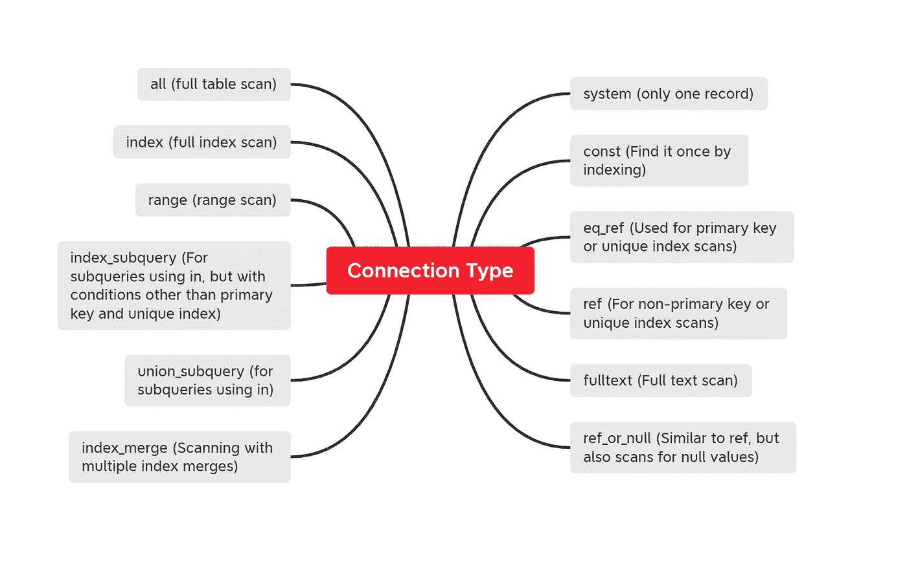****

****执行结果从最好到最差的顺序是从上到下。****

****我们需要关注以下类型:****

****`system > const > eq_ref > ref > range > index > all`****

```
**# test2 table structure
id    code    name
1     001     city1**
```

****并且在`code`字段上建立公共索引。****

****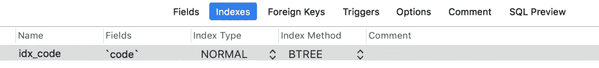****

****让我们来看看几种常见的连接类型是如何逐一出现的。****

## *******1。系统*******

****这种类型只需要数据库表中的一段数据，这是 const 类型的一个特例，一般不会出现。****

## ******2。常量和******

****可以通过一个索引找到数据，这个索引一般用在查询 SQL 中，以主键或唯一索引作为条件。****

```
**explain select * from test2 where id=1;**
```

****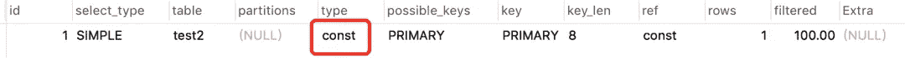****

## *******3。eq _ ref*******

****通常用于主键或唯一索引扫描。****

```
**explain select * from test2 t1 inner join test2 t2 on t1.id=t2.id;**
```

****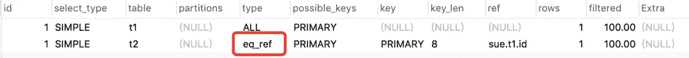****

****`const`和`eq_ref`都是对主键或唯一索引的扫描，有什么区别？****

****答案是:那个`const`只被索引一次，`eq_ref`的主键匹配主键。由于表中有多条数据，在正常情况下，需要对它们进行多次索引以匹配所有数据。****

## *******4。参考*******

****通常用于非主键和唯一索引扫描。****

```
**explain select * from test2 where code = '001';**
```

****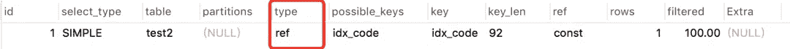****

## *******5。*范围******

****常用于范围查询，如:`between...and`或`in`操作。****

```
**explain select * from test2 where id between 1 and 2;**
```

****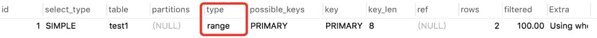****

## *******6。索引*******

****完全索引扫描。****

```
**explain select code from test2;**
```

********

## *******7。全部*******

****全表扫描。****

```
**explain select *  from test2;**
```

****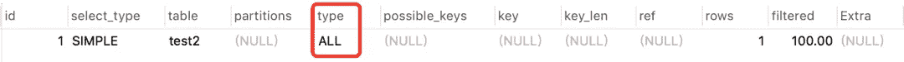****

## ******之列`**possible_keys**`******

****该列表示可能的索引选择。****

****请注意，该列完全独立于表的顺序，这意味着在实践中`possible_keys`一些键可能无法处理结果表的顺序。****

****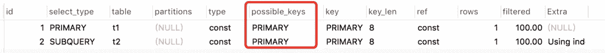****

****如果此列是`NULL`，则没有关联的索引。在这种情况下，您可以通过检查`WHERE`子句来查看它是否引用了一些适合索引的列，从而提高查询性能。****

## ******T4 之列】******

******该列表示实际使用的索引。可能会出现`possible_keys`列是`NULL`，而键不是`NULL`的情况。******

```
****# test1 table structure
id(bigint)    code(varchar30)    name(varchar30)
1             001                foo
2             002                bar****
```

******`code`和`name`字段使用联合索引。******

******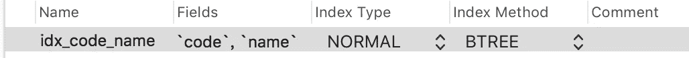******

```
****explain select code  from test1;****
```

************

******该 SQL 不需要使用索引，但实际上使用了全索引扫描索引。******

## ********`**key_len**`**之列。**********

****该列指示所用索引的长度。上面的关键列可以看出索引是否被使用，`key_len`列可以进一步看出索引是否被充分使用。毫不奇怪，它是最重要的一栏。****

****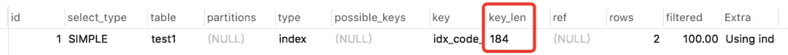****

****`key_len`是怎么算出来的？****

****三个因素决定了`key_len`的值:****

****1.字符集。****

****2.长度。****

****3.是空的吗？****

****常用字符编码占用的字节数如下:****

*   ****GBK: 2 字节。****
*   ****UTF8: 3 个字节。****
*   ****iso 8859–1:1 字节。****
*   ****GB2312: 2 字节。****
*   ****UTF-16: 2 字节。****

****MySQL 公共字段占用的字节数:****

*   ****`char(n)` : `n`字节。****
*   ****`varchar(n)` : `n + 2`字节。****
*   ****`tinyint` : 1 字节。****
*   ****`smallint` : 2 字节。****
*   ****`int` : 4 字节。****
*   ****`bigint` : 8 字节。****
*   ****`date` : 3 字节。****
*   ****`timestamp` : 4 字节。****
*   ****`datetime` : 8 字节。****

****另外，如果字段类型允许`null`，则增加一个字节。****

****上图中`184`的数值是怎么算出来的？****

****首先，我使用我的数据库的字符编码格式:UTF8 占用三个字节。****

```
**184 = 30 * 3 + 2 + 30 * 3 + 2**
```

****然后，将`test1`表的 code 字段类型改为 char，更改为允许为空，然后再次测试。****

```
**explain select code  from test1;**
```

****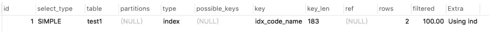****

```
**183 = 30 * 3 + 1 + 30 * 3 + 2**
```

****还有一个问题:为什么这个列表示索引是否被完全使用？****

```
**explain select code  from test1 where code='001';**
```

****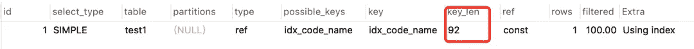****

****上图用的是关节指数:`idx_code_name`。如果索引匹配所有的`key_len`，应该是`183`，但实际上是`92`，说明没有使用所有的索引，索引没有完全使用。****

## ******之列`**ref**`******

****此列表示索引命中的列或常数。****

```
**explain select *  from test1 t1 inner join test1 t2 on t1.id=t2.id where t1.code='001';**
```

****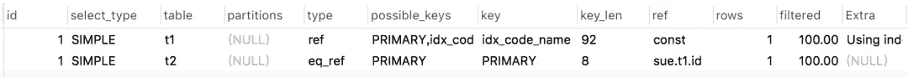****

****我们看到表`t1`命中的索引是 const(常量)，而`t2`命中的索引是列`sue`库的`t1`表的 id 字段。****

## ******之列`**rows**`******

****该列表示 MySQL 认为执行查询必须检查的行数。****

****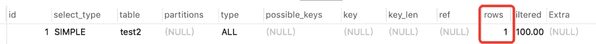****

****对于 InnoDB 表，这个数字是一个估计值，可能并不总是准确的。****

## ******之列`**filtered**`******

****此列表示按表标准筛选的表行的估计百分比。最大值为`100`，表示不过滤行。从`100`开始减小数值表示过滤增加。****

****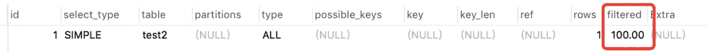****

****Rows 显示检查的估计行数，rows × filtered 显示连接到下表的行数。****

****例如，如果`rows`为`1,000`且`filtered`为`50.00 (50%)`，则与下表连接的行数为 1000 × 50% = 500。****

## ******之列`**extra**`******

****该字段包含关于 MySQL 如何解析查询的其他信息。这个栏目还是很重要的，但是里面的值太多了，就不一一介绍了，只列举几个常见的。****

## *******1。不可能*在哪里******

****表示`WHERE` 之后的条件总是`false`。****

```
**explain select code  from test1 where 'a' = 'b';**
```

****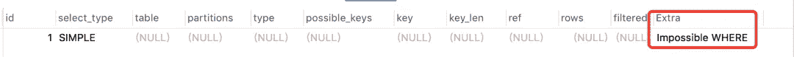****

## ******2*。使用文件排序*和******

****指示按文件排序，这通常发生在指定的排序和索引排序不一致时。****

```
**explain select code  from test1 order by name desc;**
```

****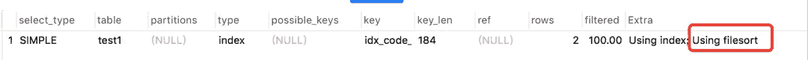****

****这里建立了代码和名称的联合索引。顺序是代码在前，名字在后。这里的顺序是直接按名称降序排列的，与之前的联合索引顺序不同。****

## *******3。使用索引*******

****表示是否使用了覆盖索引，说白了就是表示得到的所有列是否都经过了索引。****

****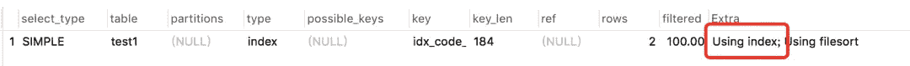****

****在上面的例子中，实际使用的是:使用 index，因为只返回一列代码，所以对其字段进行索引。****

## *******4。使用临时*******

****指示是否使用临时表，通常在`order by`和`group by`语句中可以看到。****

```
**explain select name  from test1 group by name;**
```

****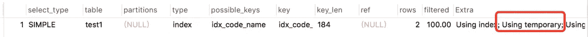****

## *******5。使用*哪里******

****指示使用 where 条件筛选器。****

## ******⑥*⑥。使用连接缓冲区*和******

****指示是否使用连接缓冲。早期连接中的表被部分读入连接缓冲区，并且使用缓冲区中的行来执行与当前表的连接。****

****下面是索引优化的过程:****

1.  ****首先，使用慢速查询日志来定位需要优化的特定 SQL。****
2.  ****使用`explain`执行计划查看索引使用情况。****
3.  ****重点:`key, key_len, type, extra`。一般来说，可以根据这四列找到索引问题。****
4.  ****根据第三步发现的索引问题优化 SQL。****
5.  ****回到步骤 2，再次执行。****

****感谢您阅读这篇文章。****

*****敬请期待更多。*****