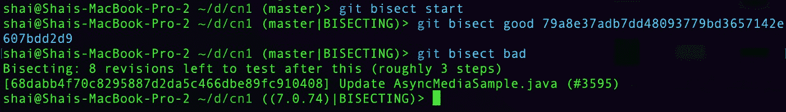
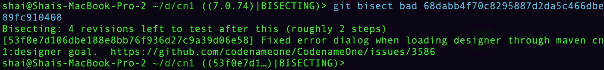

# 使用 Git 二等分理解回归的根本原因

> 原文：<https://betterprogramming.pub/understand-the-root-cause-of-regressions-with-git-bisect-dd16cc17ce69>

## 省下几天打猎的时间


作者图片

在这个系列中，我涵盖了很多神奇的工具，git 二等分可能是这种神奇的最好例子。调试中最难的部分是了解 bug 的大致范围。等分字面上照亮了导致它的具体提交！

在我们开始之前，让我们澄清一件事:等分是一个调试回归的工具。它对普通的 bug 没有任何作用。当我们有一个回归时，我们通常知道这个问题曾经在一个特定的版本中工作过。我们通常会有一个特定的代码版本。我们通常知道它在当前版本中不起作用，但是是哪个提交导致了失败呢？

# 在古代

回到 SVN(或 CVS，SourceSafe 等)的旧时代。)，我们曾经签出一个旧的存储库版本并对其进行测试。如果它失败了，我们将进一步返回，如果它成功了，我们将继续深入到失败的特定提交。我们中那些有幸与有能力的质量保证部门一起工作的人通常可以把这个任务交给他们。最终，这项工作是手工完成的。

当聚焦在这个问题上时，我们会遵循合理的搜索策略，将修改的数量分成两半，并搜索到集合的中间，而不是一次一步。这大大缩短了寻找有问题的修订所花费的时间。但是，仍然有许多修订需要搜索。

在这一点上，你可能想知道:为什么你没有自动化这些事情？

我们有时会这样做，但是由于没有一个版本控制系统像 git 那样占主导地位，这些自动化没有持续下去，而且我不知道这样的自动化使它成为任何版本控制系统。但是 git 二等分在 2000 年实现了，并且是这种启发式的自动化.


# Git 平分:找到 Bug。自动！

没错。正是如此。git 二等分的最简单用法是从以下命令开始:

```
git bisect start
```

这将我们切换到对分模式。我们现在可以定义“好的”版本，在这个版本中，事情通常可以正常工作。例如，在 github.com/codenameone/CodenameOne 的[上](https://github.com/codenameone/CodenameOne/)，我可以使用修订版`79a8e37adb7dd48093779bd3657142e607bdd2d9`作为好的修订版。因此，我们可以使用以下命令来标记它:

```
git bisect good 79a8e37adb7dd48093779bd3657142e607bdd2d9
```

一旦我们这样做了，我们就可以通过标记错误的修订来激活二分遍历。在大多数情况下，这意味着当前的标题修订，这是默认的，但是您可以指定一个特定的修订作为此命令的参数:

```
git bisect bad
```

一旦这样做了，我们可以通过重新定义好的或坏的修订来在修订之间移动。

这里，我们在代号为 One 的 repo 上运行这些命令，得到了以下输出:



注意底部的值`68dabb4f70c8295887d2da5c466dbe89fc910408`。这是我们“跳转”到的当前版本。我们现在可以根据我们的手动测试将这个修订标记为好或坏。

我把它标记为坏的，可以把它标记为好的，这样就可以了。这将平分到我们需要测试的下一个版本，如下所示:



# 这太糟糕了。是吗？

手动检查每一次修改是一件非常痛苦的事情！

当然，这比随意浏览修改日志和跳过修改，同时保持我们在头脑中的位置要好。但也只是好一点。幸运的是，有一个更好的方法:`run`。

平分可以运行一个任意的命令，我们对每一个修订，它遇到的。如果命令返回零(作为进程退出代码)，则修订是好的。如果它返回别的东西，那就不好了。这样，在没有人工干预的情况下，被破坏的修订将被自动识别出来。

通常这对于 shell 命令非常有效，但是作为 Java 开发人员，这有点痛苦。通常，我会有一个显示失败的单元测试。不幸的是，该单元测试在项目的旧版本中并不存在。然后，我还需要编译项目，这样才能工作。因此，尽管使用 run 命令时 git 二等分看起来很酷，但我们如何将它用于像 Java 这样的编译语言呢？

这其实很简单。我们可以创建一个复杂的命令行，但就个人而言，我更喜欢这样的:

```
git bisect run testMyJavaProject.sh
```

然后，我用构建/测试命令实现 shell 脚本。但在此之前，我需要创建一个针对特定 bug 失败的单元测试。我想这是我们大多数人都能轻松完成的事情。既然我们已经有了一个单元测试，那么创建 shell 脚本就很简单了。下面的代码假设您使用 maven 进行构建:

```
#!/bin/shmvn clean
mvn package -DskipTests
mvn test -Dtest=MyTestClass
```

就是这样。请注意，如果编译由于测试类中的依赖关系而失败，您可能会得到错误的修订。所以保持测试简单！

当您完成 git 二等分或出于任何原因希望停止时，只需发出以下命令:

```
git bisect reset
```

# TL；速度三角形定位法(dead reckoning)

Git 二等分可能是我将在本系列中介绍的最简单的工具。但它也是最重要的工具之一。学会有效地使用它可以帮你省去几天繁琐的工作和寻找问题的时间。尽管有这些巨大的好处，这是一个相对模糊的功能。原因是 98%的时间我们不需要它。但是在那 2%里，我们真的很需要。

希望下次你遇到回归时，你会记得它的存在，并利用这篇文章来找出问题。