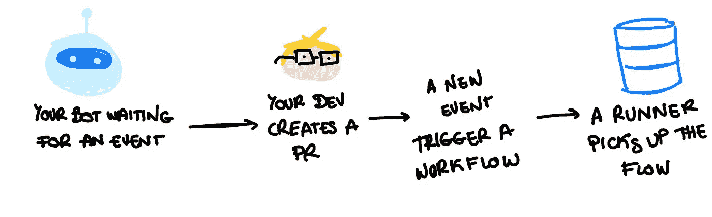
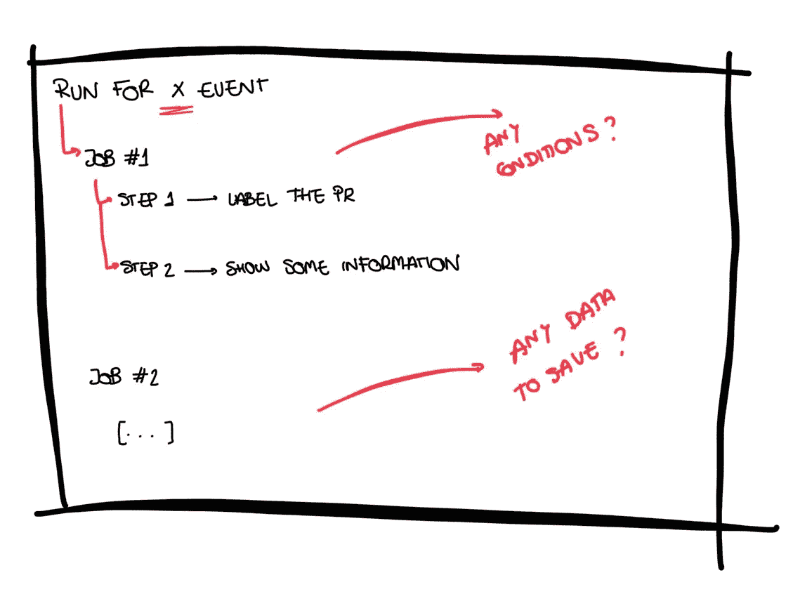

# 了解您的发布管理器，学习 GitHub 中 CI/CD 的基础知识

> 原文：<https://betterprogramming.pub/understand-your-release-manager-learn-the-basics-of-ci-cd-in-github-652b3fe7e0e0>

## GitHub CI/CD 平台的一些基本概念


照片由[扬西·敏](https://unsplash.com/@yancymin?utm_source=medium&utm_medium=referral)在 [Unsplash](https://unsplash.com?utm_source=medium&utm_medium=referral) 上拍摄

听说过 GitHub Actions 吗？也许你没有，但我肯定你听说过 DevOps，CI/CD，以及最近流行的一大堆其他词汇。在本文中，我想揭开 GitHub 持续集成和持续交付平台的神秘面纱。我知道浏览文档并试图理解它可能会令人生畏。

希望到最后，你会对这个平台的工作原理有所了解，而且你不必在日常会议中假装你理解你的发布经理。

在我用一些技术术语分散你的注意力之前，让我们试着用一个类比来理解我们在谈论什么。我们可以将 GitHub Actions 定义为一个装满积木的工具箱，使我们能够组装一个小型工厂，其中一些机器人将为我们执行一些操作。

> 我宁愿构建一次我的工厂，而不是为每个新的拉取请求手动检查相同的动作列表！

那么，…我们的小机器人有多熟练？看你的了！您可以让他们做一些简单的任务，如检查代码的格式、部署最新的特性或标记您的拉请求。但是为了让他们知道该做什么，他们需要一个脚本或者一些说明。

该脚本的主要构件如下:

*   事件——它是指将触发存储库中流程的活动。例如，当有人创建一个 pull 请求或将一个 commit 推送到一个存储库时，一个活动可以源自 GitHub。
*   工作流—工作流是运行一个或多个作业的可配置流程。你可以在你的知识库中找到 YAML 文件格式的文件。
*   作业—作业是工作流中的一组步骤。一个工作流中可以有多个作业。
*   步骤—它们是在作业中执行的单个任务。例如，向您的拉取请求添加标签，或者验证某些文件是否包含在您的拉取请求中。每个步骤要么是将要执行的 shell 脚本，要么是将要运行的操作。
*   行动——或者我喜欢称之为预建的机器人。动作只是 GitHub Actions 平台的一个定制应用程序，它执行一个复杂但经常重复的任务。你可以在 GitHub 的[市场](https://github.com/marketplace?type=actions)找到它们。
*   运行者—运行者是运行您的工作流的服务器。这些运行程序中的每一个都可以一次运行一个任务。
*   数据容器——在运行工作流时，您可能需要存储数据，为此您有缓存、工件或变量。

## 话够了，给我看几张图！

我听到了。这需要消化很多信息。看看下面的模式，我试图展示我们的脚本是什么样子的。这里没有判断。这是我从姐姐那里借来的旧 iPad 的最好版本了。



GitHub 的 GitHub 动作流程

如您所见，我们的机器人正在等待某个事件，一旦有人创建一个拉请求，机器人将开始检查任何符合相应标准的工作流。在浏览了工作流列表后，我们的 bot 将找到一个应该在每次创建新的拉请求时触发的工作流。然后，这个流将被放入一个队列中，一旦一个跑步者空闲，它将开始跑步。



代表 GitHub 中工作流的 YAML 文件的结构。

你还在吗？还在好奇我们如何将它转化成实际的工作脚本吗？看一下上面的图片，它显示了我们之前谈论的工作流的结构。它首先说明触发工作流的事件类型(也可以手动触发)，然后包括要运行的作业，以及完成这些作业所需的每个步骤。

## 脚本实际上是什么样子的？—工作流的一个简单示例

在这里，您可以找到一个简单工作流的示例:

```
name: basic-example
on:
  pull_request:jobs:first-job:
    runs-on: ubuntu-18.04
    steps:
      - name: Checkout
        uses: actions/checkout@v2
      - name: Show Text
        uses: echo Hello World!
```

该脚本显示了一个名为`basic-example`的工作流，它在任何与拉请求相关的新事件中触发。它包含一个名为`first-job`的作业，运行在一个装有 Ubuntu 的容器上，由两个步骤组成。

第一步只是在`$GITHUB_WORKSPACE`下检查您的存储库，并使您的脚本能够运行经过认证的 git 命令。第二步更简单。它在终端打印一条“Hello World”消息。正如您所看到的，创建一个工作流并不像它看起来那么复杂！

我希望这篇文章能帮助你更好地理解 GitHub 动作是什么。你现在可以在喝咖啡的时候吹嘘你的 DevOps 知识了！

如果你想进一步了解这个话题，你可以在 [GitHub 的官方网站](https://docs.github.com/en/actions/learn-github-actions/understanding-github-actions#:~:text=GitHub%20Actions%20is%20a%20continuous,merged%20pull%20requests%20to%20production.)上找到更多信息。