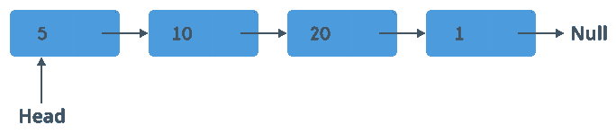
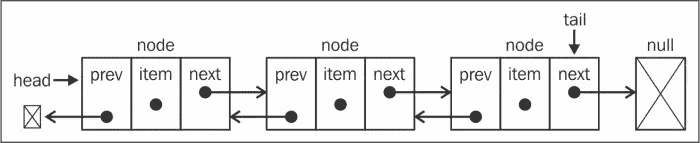
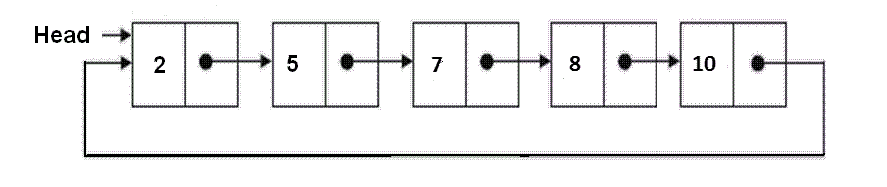

# 使用 ES6 理解和实现 JavaScript 中的链表

> 原文：<https://betterprogramming.pub/understanding-and-implementing-linked-lists-in-javascript-with-es6-24901534a42f>

## 最简单的消化指南

照片由[阿克谢·纳纳瓦蒂](https://unsplash.com/@anphotos?utm_source=unsplash&utm_medium=referral&utm_content=creditCopyText)在 [Unsplash](https://unsplash.com/s/photos/trains?utm_source=unsplash&utm_medium=referral&utm_content=creditCopyText) 上拍摄

## 目录

*   介绍
*   概念和属性
*   链接列表类型
*   优点和缺点
*   **大魔神**时间复杂度
*   真实用例

在我看来，数据结构和算法是计算机科学的核心和基础。我认为它们是我们应该首先关心和了解的最重要的话题。

这是一个数据结构系列的开始，介绍了它们在 ECMAScript 6 规范的 JavaScript 中的实现。

首先，我想介绍一下围绕这一切的概念。我们将开始了解(或让你熟悉)什么是链表——它的类型、一些缺点、一些优点、它的复杂性，以及我们可以和应该使用它们的真实用例。

**注意:** JavaScript 不像 C#和 JAVA 那样实现内置的链表类型，而是使用数组。

这篇文章分为两个主要部分:理解链表和实现它们。

# 谅解

没有理论的实践是盲目的，但是没有实践的理论是贫瘠的。所以我们两者都需要。首先，我们需要消化主要概念。

## 概念和属性

链表

链表是一种动态数据结构，它按顺序存储值。它是由指针连接的单个节点链。

等等。等等。为什么是动态的？因为我们能够在运行时改变链表元素。这意味着分配的内存大小可以在程序运行时修改，换句话说，可以根据需要增加或减少。

**与数组的比较**

链表允许我们轻松地添加或删除元素。相反，阵列使用分配的特定/固定内存大小存储数据。你不能改变它。为了完全掌握它，让我们看看下一个类比。

**类比:链表就像火车车厢**

假设链表就像火车车厢。火车车厢在开始时是以特定的顺序连接的。然而，它们可以轻松地装载、卸载和更换。

它们的增长是动态的，因为我们有能力在列车上的任何位置添加或删除新的列车车厢，还可以更改其内容。

**类比:作为公共汽车座位的阵列**

数组类似于公交车座位。

总线(内存)有固定数量的座位，这些座位是数组的项目。它们不能生长。然而，尽管座位的大小是固定的，但它们可以被不同的乘客使用。因此，这些值可能会在某个时间发生变化。

**节点**

节点是许多常见数据结构的最基本构建块。

对于一个链表，它提供了一种机制来包含一段数据，并通过对象引用指针(这被称为*下一个指针*)将其自身连接到其他节点。

*头和尾*

头，顾名思义，是链表的第一个节点，尾是最后一个。

*节点链*

节点链是如何将节点链接在一起以构建节点链的。

## 主要是用链表操作

**添加**

*   添加到前面
*   添加到末尾
*   在任意位置添加到

**拆卸**

*   移到前面
*   移到最后
*   在任意位置移除

**访问和搜索**

## 链接列表类型

还有其他类型的链表。在本文中，我们将只提到最需要注意的问题。

**双向链表**

与单向链表不同，在双向链表中，每个节点都包含对前一个节点和下一个节点的引用。

双向链表

**循环链表**

顾名思义，它是一个节点链，所有节点都连接在一起形成一个圆圈。

循环链表

优点和缺点让你知道何时何地链表是有用的，或者在什么情况下它们是解决问题的最佳选择。所以让我们把它们列出来…

## 对等

*   这是一种动态数据结构。正如我们上面提到的，它允许在运行时动态地改变元素的大小
*   插入和删除不需要重新组织整个数据结构
*   没有必要定义初始大小
*   其他数据结构，如堆栈和队列，可以使用链表来实现

## 下降趋势

*   不允许随机访问——如果我们想访问一个元素，我们必须从第一个节点开始
*   搜索操作很慢，因为您需要遍历输入来查找任何元素—这些操作具有线性复杂度 *O(n)*

## 大时间复杂度

**添加和删除项目**

这些操作只涉及分配数据和更新几个指针，所以它的复杂度保持不变 *O(1)。*

不管列表中有多少个节点，它总是在固定时间内执行。

**访问和搜索**

这些操作涉及遍历整个输入以访问/搜索列表中的项目。这意味着，它的复杂性是线性的 *O(n)* ***。*** 复杂度会与输入数据的大小成正比增长。

## 真实用例

在现实世界中使用链表最简单的方法是考虑上一个和下一个选项。这里有一些例子。

*   使用链表实现堆栈和队列
*   在使用 previous 和 next 元素的实际应用程序中，比如一个图像浏览器，你会发现由于前一个图像链接到下一个图像，前一个视频链接到下一个视频，在浏览器中我们可以使用一个链表来链接前一个链接到下一个
*   程序中的撤销和重做行为，如 Photoshop、MS Word 或任何使用该行为的程序/软件
*   因此，如你所见，在所有需要 previous 和 next 的实际应用中，我们可以很容易地使用链表

# 履行

既然我们没有盲目地去做，并且知道了链表的一切，我们准备去实现一个链表。

我不喜欢长文。所以在下一点，我们将一步一步地解释如何使用 ES6 特性实现一个链表。

感谢阅读！