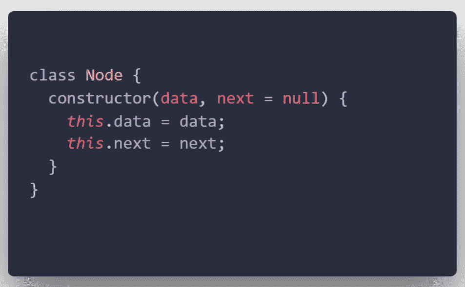
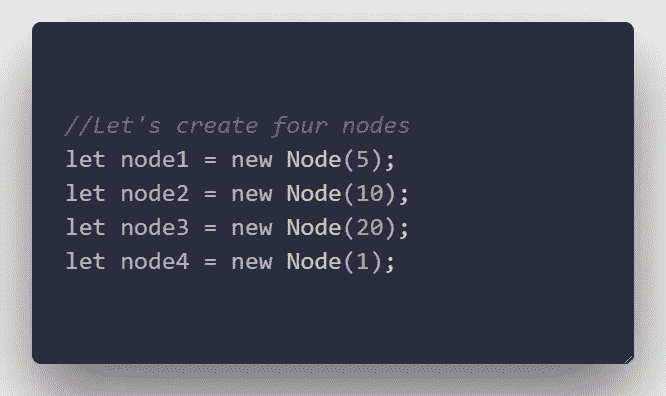
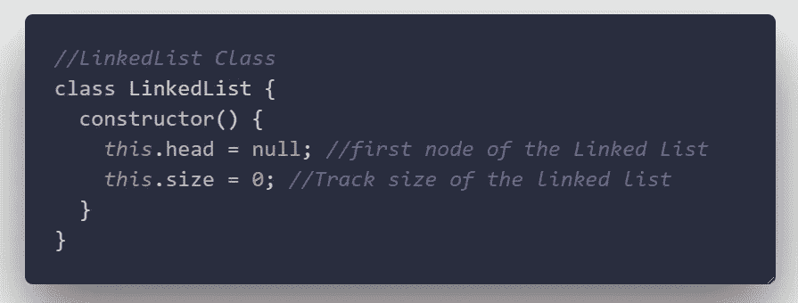
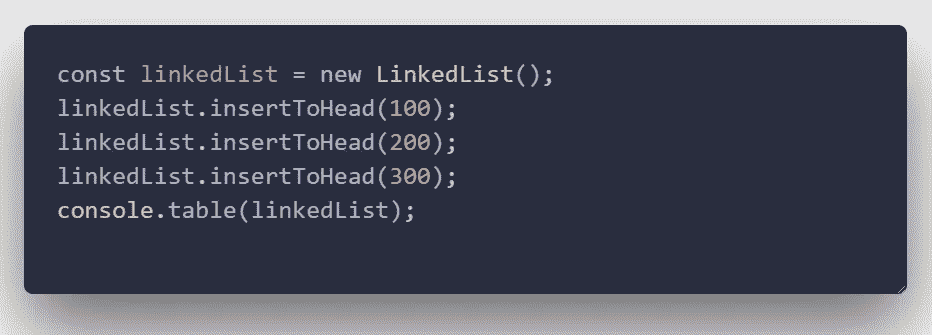
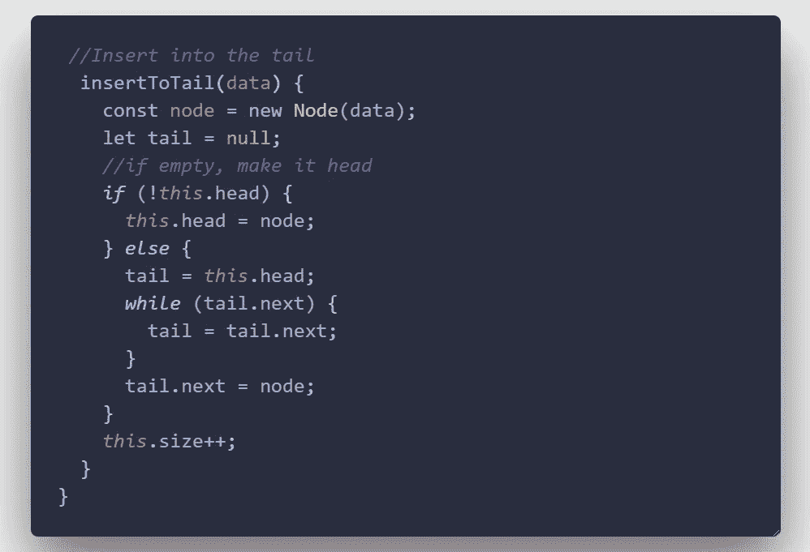
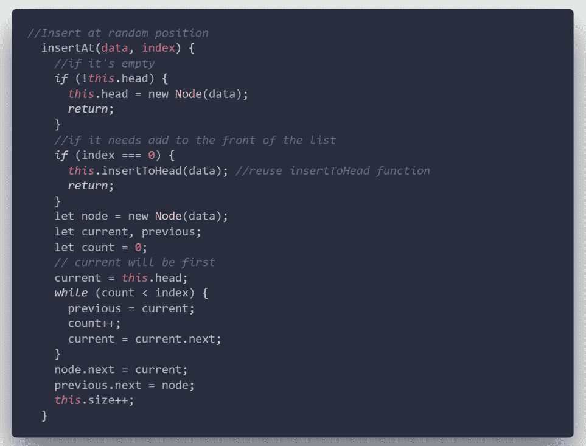
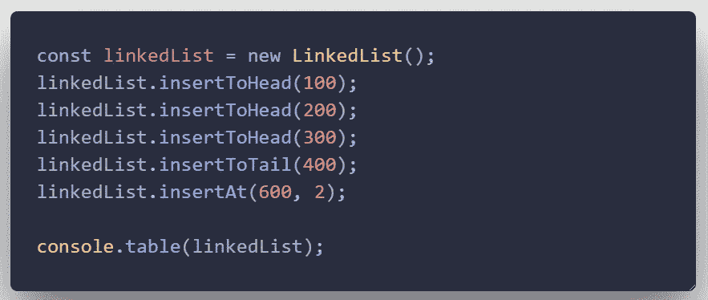
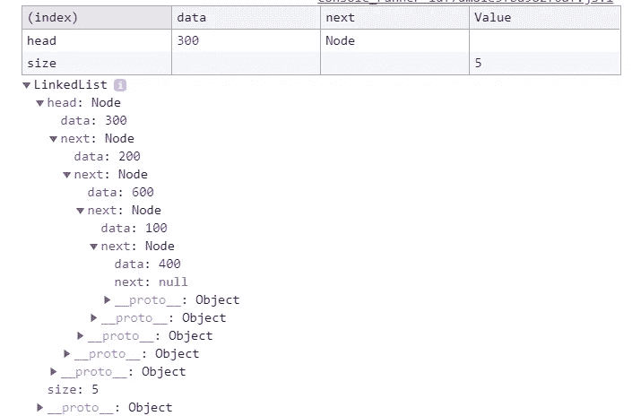

# 使用 ES6 理解和实现 JavaScript 中的链表

> 原文：<https://betterprogramming.pub/understanding-and-implementing-linked-lists-in-javascript-with-es6-c6f8720b38a>

## 让我们深入一个你可能不经常使用的有用的数据结构

照片由[托马斯·汤普森](https://unsplash.com/@tomthompsonphotography?utm_source=unsplash&utm_medium=referral&utm_content=creditCopyText)在 [Unsplash](https://unsplash.com/s/photos/freight-train?utm_source=unsplash&utm_medium=referral&utm_content=creditCopyText) 上拍摄

这是上一篇[的继续，在那篇](https://medium.com/better-programming/understanding-and-implementing-linked-lists-in-javascript-with-es6-24901534a42f)中，我们消化了所有相关的概念、优点和缺点、大的时间复杂度、真实的用例、主要是链表的操作，以及所有类似的理论。如果你还没有读过，我建议你先读一读。

本系列是关于使用 ES6 规范在 JavaScript 中实现数据结构的。

第二部分的目的是完成一个链表的实现。实际上，这两部分本身包含了一个链表，因为前一部分指向这个链表。

# 节点类

在下一段代码中，我们将使用构造函数定义节点类。记住，节点是存储数据和下一个指针的基本构件。

这个类必须处理节点的创建。每次实例化类时，构造函数都有责任初始化两个属性:`data`和`next`。

节点类

现在的挑战是创建接下来的四个节点(只是创建节点，而不是如何连接它们)。

链表

基本上，为了创建四个节点，我们必须实例化节点类四次。

创建节点

此时，我们不关心第二个参数。为什么？因为此时此刻，我们只是在学习如何创建节点，而不必担心它们将如何连接在一起。

# 我们如何连接节点？

在前面的代码中，我们只是独立地创建节点。现在是时候学习如何将它们连接起来形成链表了。

连接节点

我们已经定义了节点类。接下来是定义一个新的类，它将处理`next` 指针属性和链表中的主要操作。让我们创建`LinkedList`类。

链表类

在上面的代码中，我们刚刚定义了一个名为`LinkedList`的类及其构造函数。它的工作是初始化`head` 属性，存储第一个节点和`size`，跟踪链表的大小。

接下来是提供插入到列表的头部、尾部或任意位置的能力。

# 插入头部

插入到标题

我们刚刚创建了一个简单的方法来向链表的头部添加节点。我们向它传递了参数`data` ，并为属性`this.head`设置了一个值，从而创建了节点类的一个新实例。

让我们对它的实现做一些测试，看看结果。

输出将是:

链表输出

# 在尾部插入

我们刚刚学习了如何在头部添加节点。是时候知道如何在尾部添加节点了。

在尾部插入

在上面的`insertToTail`函数中，我们传递了`data`参数，然后我们创建了节点类的一个新实例。之后，我们检查磁头是否是空的。如果是这样，头部本身将被设置为我们刚刚创建的新节点。否则，用头部设置`tail`,然后遍历链表找到尾部并更新尾部的下一个指针。

# 在任意位置插入

最后，我们将看到如何在链表中给定的随机位置插入一个新的节点。为此，我们必须遍历列表，直到找到所需的位置。

在给定的随机位置插入

现在我们将使用下面的测试来测试这个函数。

输出如下所示。如您所见，在给定的索引处，节点(600)被添加到列表的第二个索引处。

# 整个代码

我希望你已经获得了更多关于数据结构的知识，尤其是链表。目前就这些。

感谢阅读！