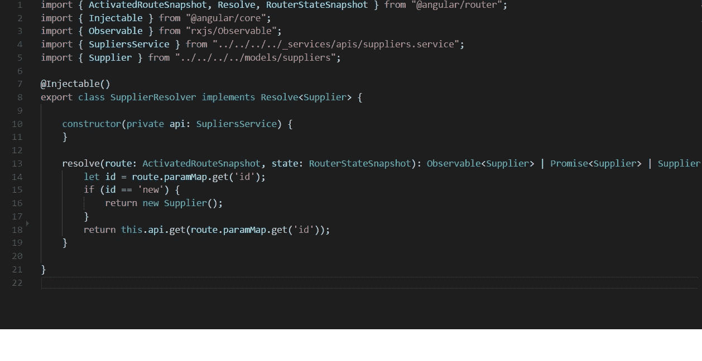
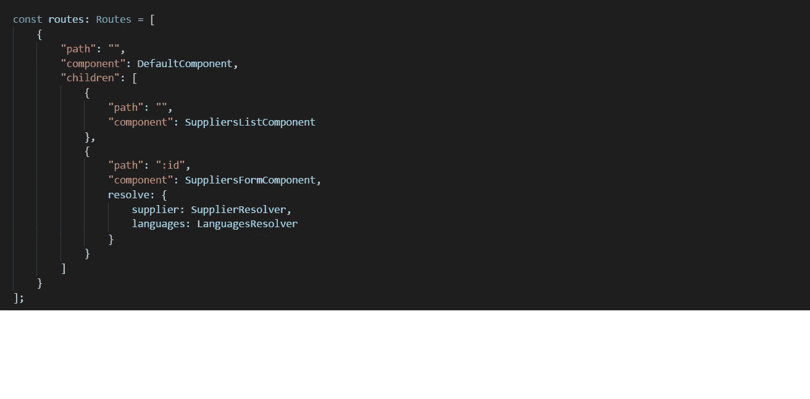
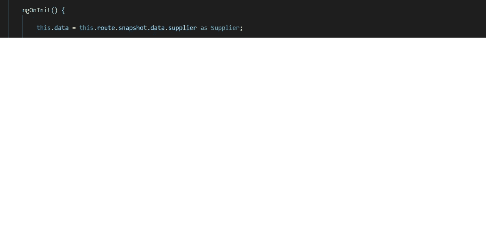

# 角度分解器

> 原文：<https://betterprogramming.pub/understanding-angular-resolver-what-was-the-problem-before-using-resolver-and-why-we-need-it-7502554ab7a3>

## **什么是角旋变器，它有什么好处？**

图片由 [Taras Shypka](https://unsplash.com/@bugsster?utm_source=unsplash&utm_medium=referral&utm_content=creditCopyText) 在 [Unsplash](https://unsplash.com/search/photos/user-experience?utm_source=unsplash&utm_medium=referral&utm_content=creditCopyText) 上拍摄

角度解析器是一种平滑的方法，通过在导航到特定组件之前加载数据来增强用户体验。

通过实现 Resolver，我们将在下一个组件`activatedRoute`被激活之前从服务器获取远程数据，因此不需要 loading spinner(查看或隐藏),因为在从远程服务器获取数据之前，我们不会导航到下一个组件。

指示从服务器加载数据的微调器

到目前为止，我们通过以下方式加载远程数据:

1.  制作一个服务文件来发出一个远程 HTTP 请求。
2.  在组件构造函数中创建该服务的 DI。
3.  订阅服务并在服务回调中隐藏微调器。

有了角度解析器，我们的应用程序有了更平滑和增强的 UX。

我们面临的一个常见问题是，当您导航到一个包含不同子组件的组件时，每个子组件都有一个单独的微调器，指示数据正在从服务器加载。

因此，将为每个子组件分别显示多个微调器。多重纺纱对 UX 不利。

然而，使用 Resolver，根本不需要微调器，因为它不会导航到组件，直到数据被加载。Resolver 的目标是在收集到所有需要的数据之前不会加载组件。

# 解析器路由的步骤

1.  单击链接将导航到要解析的组件。
2.  Angular 执行某些代码并返回一个可观察的值或一个承诺。
3.  您可以将返回值或可观察值收集到一个构造函数中，或者将要加载的组件的`ngOnInit`生命周期钩子中。
4.  根据需要使用导航组件中的数据。

# 如何创建解析程序

1.  创建一个新的服务解析文件并实现 resolve 方法来获取远程数据，如下所示:

2.按如下方式定义路线中的解析程序:

在路线中定义解析

`Supplier`是保存从服务返回的数据的键。

3.在解析数据后将加载的组件中使用解析程序:

在组件中使用解析程序数据

# 参考

[角度解析器 API](https://angular.io/api/router/Resolve)