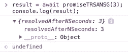
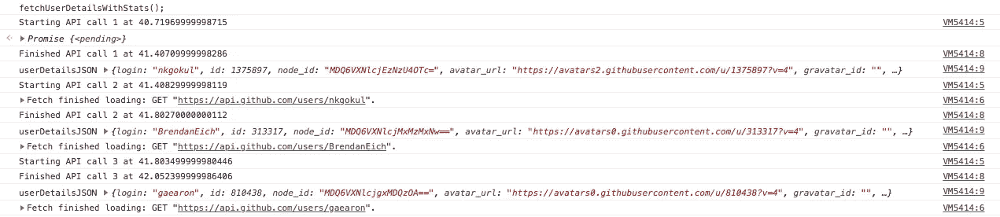
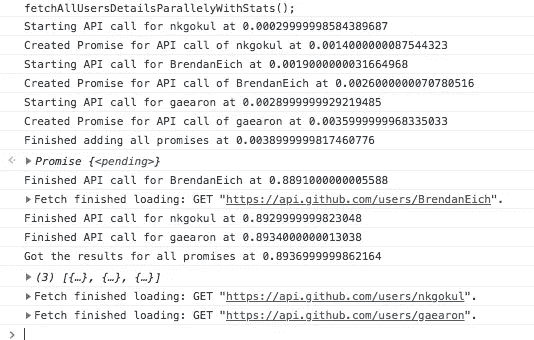
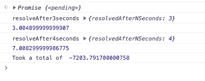
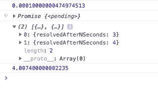
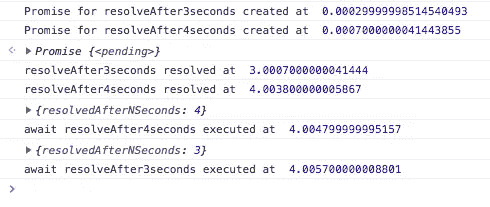

# 理解 JavaScript 中的异步等待

> 原文：<https://betterprogramming.pub/understanding-async-await-in-javascript-1d81bb079b2c>

## 何时以及如何使用 async 和 await 的经验法则和示例


[库赛·阿库德](https://unsplash.com/@qusaiakoud?utm_source=unsplash&utm_medium=referral&utm_content=creditCopyText)在 [Unsplash](https://unsplash.com/search/photos/waiting?utm_source=unsplash&utm_medium=referral&utm_content=creditCopyText) 上的照片

`async`和`await`是承诺的延伸。如果你对承诺的基础知识感到不舒服，请在进一步阅读之前花些时间[理解承诺](https://medium.com/better-programming/understanding-promises-in-javascript-13d99df067c1)。

我确信你们中的许多人已经在使用`async`和`await`。但是，我认为它值得更多的关注。

这里有一个小测试:如果你不能发现下面代码的问题，请继续阅读。

一旦我们完成了`async-await`的基础知识，我们将在后面重新审视这个代码块。一如既往， [Mozilla docs](https://developer.mozilla.org/en-US/docs/Web/JavaScript/Reference/Statements/async_function) 是你的朋友。尤其是检查定义。

来自 MDN:

> “异步函数是通过事件循环异步操作的函数，使用隐式`[Promise](https://developer.mozilla.org/en-US/docs/Web/JavaScript/Reference/Global_Objects/Promise)`返回其结果。但是使用异步函数的代码的语法和结构更像是使用标准的同步函数。”

我想知道是谁写的这些描述。它们简明扼要，表达清晰。分解一下:

1.  该函数通过事件循环异步运行。
2.  它使用一个隐式的`Promise`来返回结果。
3.  代码的语法和结构类似于编写同步函数。

MDN 继续说道:

> 一个`async`函数可以包含一个`[await](https://developer.mozilla.org/en-US/docs/Web/JavaScript/Reference/Operators/await)`表达式，该表达式暂停异步函数的执行并等待传递的`Promise`的解析，然后恢复`async`函数的执行并返回解析后的值。记住，`await`关键字只在`async`函数中有效。"

让我们跳到代码中来更好地理解这一点。我们也将重用我们在这里用来理解承诺的三个函数。

返回一个承诺的函数，该承诺在 n 秒后解决或拒绝。

两个更确定的函数。一个在 n 秒后解决，另一个在 n 秒后拒绝。

由于这三个函数返回承诺，我们也可以将这些函数称为异步函数。看，我们甚至在知道函数之前就编写了它们。

如果我们必须使用标准格式的承诺来使用函数`promiseTRSANSG`,我们应该编写如下代码:

这里有许多不必要的代码，例如，仅仅用于分配处理程序的匿名函数。`async-await`所做的是改进它的语法，使它看起来更像同步代码。

如果我们不得不与上面的`async await`一样，格式应该是这样的:

```
result = await promiseTRSANSG(3);
console.log(result);
```



这看起来比标准的 promise 语法可读性更好。

当我们使用`await`时，代码的执行被阻塞了。这就是为什么您在变量`result`中有承诺解决方案的值。

从上面的代码示例中可以看出，当使用`await`时，结果被直接赋给变量，而不是`.then`部分。

你也可以看出`.catch`部分不在这里。这是因为这是使用`try catch`错误处理来处理的。所以，让我们用`promiseTRRARNOSG`代替`promiseTRSANS`。

因为这个函数既可以解析也可以拒绝，所以我们需要处理这两种情况。

在上面的代码中，我们写了两行，让您可以轻松比较标准格式和`async await`格式。下一节中的例子让您对格式和结构有了更好的了解。

# 使用`async-await`的一般语法

从上面的代码示例中，您可以看出，我们没有使用特定于 promise 的错误处理，而是使用更通用的方法，使用`try` `catch`进行错误处理。

这让我们少了一件需要记住的事情，并且也提高了整体的可读性，即使是在考虑了我们代码周围的`try catch`块之后。

因此，根据您需要的错误处理级别，您可以添加任意数量的`catch`块，使错误消息更加具体和有意义。

# **使用异步和等待的陷阱**

让使用承诺变得更加容易。来自同步编程背景的开发者在使用`async`和`await`时会有宾至如归的感觉。

这也应该提醒我们，因为这意味着如果我们不小心的话，我们正在走向一个更加同步的方法。

JavaScript/ [Node.js](https://nodejs.org/) 的要点在于默认情况下认为是异步的，而不是事后的想法。`async await`通常意味着你在按顺序做事。所以，每当你想使用`async await`的时候，做一个有意识的决定。

让我们开始分析我一开始给你们看的代码。

这似乎是一段无害的代码，它获取了三个用户的 GitHub 详细信息:`“nkgokul”`、`“BrendanEich”`和`“gaearon”`。

没错。这是真的。这就是这个函数的作用。但它也有一些意想不到的后果。

在深入研究代码之前，让我们构建一个简单的计时器。

```
startTime = performance.now();  //Run at the beginning of the codefunction executingAt() {
  return (performance.now() - startTime) / 1000;
}
```

现在，我们可以使用`executingAt`在任何我们想要的地方打印从开始以来已经超过的秒数。

查看输出:



异步等待分析

从输出中可以发现，每个`await`函数都是在前一个函数完成后调用的。我们试图获取三个不同用户的详细信息:`“nkgokul”`、`“BrendanEich”`和`“gaearon”`。

很明显，一个 API 调用的输出不依赖于其他 API 调用的输出。

我们唯一的依赖就是这两行代码。

```
userDetails = await fetch("[https://api.github.com/users/](https://api.github.com/users/)" + name);
userDetailsJSON = await userDetails.json();
```

我们只有在得到`userDetails`后才能创建`userDetailsJSON`对象。

因此，在这里使用`await`是有意义的，它在获取单个用户的详细信息的范围内。因此，让我们制作一个`async`来获取单个用户的详细信息。

既然`fetchSingleUsersDetailsWithStats`是`async`，我们可以使用这个函数并行获取不同用户的详细信息。

当您想要并行运行时，我遵循的经验法则是:

```
Create a promise for each async call. Add all the promises to an array. Then pass the promises array to Promise.all. This, in turn, returns a single promise for which we can use await
```

当我们将所有这些放在一起时，我们得到:

这样的输出是:



承诺与时间戳并行

从输出中可以看出，承诺的创建几乎是即时的，而 API 调用需要一些时间。

我们需要强调这一点，因为与 IO 操作相比，承诺创建和处理所花费的时间是微不足道的。

因此，当您选择 promise 库时，选择功能丰富且具有更好开发体验的库更有意义。当我们使用`Promise.all`时，所有的 API 调用都是并行运行的。

每个 API 几乎需要 0.88 秒。但是，由于它们是并行调用的，我们能够在 0.89 秒内获得所有 API 调用的结果。

在大多数情况下，理解这一点对我们有好处。现在，你可以直接跳到经验法则，或者继续阅读，如果你想深入了解的话。

深入挖掘`await`！

为此，让我们把自己限制在`promiseTRSANSG`函数上。该函数的结果更具确定性，有助于我们识别差异。

# 顺序执行



顺序执行

# 使用 Promise.all 的并行执行



使用承诺的并行执行

# 并行开始执行

一旦`promise`被创建，异步执行就开始了。`await`只是阻塞`async`函数中的代码，直到承诺被解决。

让我们创建一个函数来帮助我们清楚地理解这一点。



并发启动，然后等待

从之前的帖子中，我们知道`.then`是事件驱动的。也就是说，一旦解决了承诺，就会执行`.then`。

所以，让我们用`resolveAfter3seconds.then` 和`resolveAfter4seconds.then`来标识我们的承诺何时真正兑现。从输出中我们可以看到，`resolveAfter3seconds`在 3 秒后被解析，`resolveAfter4seconds`在 4 秒后被执行。这是意料之中的。

现在，为了检查`await`如何影响代码的执行，我们使用了:

```
console.log(await resolveAfter4seconds);
console.log(await resolveAfter3seconds);
```

从`.then`的输出可以看出，`resolveAfter3seconds`比`resolveAfter4seconds`早一秒解决。但是，我们用`await`表示`resolveAfter4seconds`，然后用`await`表示`resolveAfter3seconds`。

从输出中，我们可以看到虽然`resolveAfter3seconds`已经被解析，但是它是在`console.log(await resolveAfter4seconds);`的输出被打印之后才被打印的。

这重申了我们先前所说的。`await`只阻塞`async`函数中下一行代码的执行，不影响承诺的执行。

# 放弃

[MDN 文档](https://developer.mozilla.org/en-US/docs/Web/JavaScript/Reference/Statements/async_function)提到`Promise.all`仍然是串行的，使用`.then`是真正的并行。我无法理解其中的区别，很想听听有没有人知道其中的区别。

# **经验法则**

以下是使用`async`和`await`的经验法则:

1.  `async`函数返回一个承诺。
2.  `async`函数使用隐式`Promise`返回结果。即使你没有明确地返回一个承诺，`async`函数也会确保你的代码通过一个承诺。
3.  `await`阻塞`async`函数内的代码执行，它(`await statement`)是函数的一部分。
4.  在一个`async`函数中可以有多个`await`语句。
5.  使用`async await`时，确保使用`try catch`进行错误处理。
6.  如果你的代码包含阻塞代码，最好把它变成一个`async`函数。通过这样做，您可以确保其他人可以异步使用您的函数。
7.  通过从阻塞代码中生成`async`函数，您可以让用户(将调用您的函数)决定他们想要的异步级别。
8.  在循环和迭代器中使用`await`时要格外小心。您可能会陷入编写顺序执行代码的陷阱，而这本来可以很容易地并行完成。
9.  `await`永远是为了一个单一的承诺。如果您想要`await`多个承诺(并行运行这个承诺),创建一个承诺数组，然后将其传递给`Promise.all`函数。
10.  承诺创建启动异步功能的执行。
11.  `await`仅阻止`async`功能内的代码执行。它只确保当`promise`决议时，下一行被执行。因此，如果异步活动已经开始，那么`await`将不会对其产生影响。
12.  [何时使用承诺，何时使用异步等待？](https://medium.com/better-programming/should-i-use-promises-or-async-await-126ab5c98789)

请指出我是否遗漏了什么，或者是否有可以改进的地方。

如果你喜欢异步等待的深入分析，并且想了解更多关于 Javascript 的信息，加入我们的讨论[https://discord.gg/ENbQbbZy25](https://discord.gg/ENbQbbZy25)或者在推特上关注我[https://twitter.com/gokulnk](https://twitter.com/gokulnk)

你可以订阅我的时事通讯[https://understandingx.substack.com/](https://understandingx.substack.com/)我懒得写，所以你可能暂时不会收到我的来信。