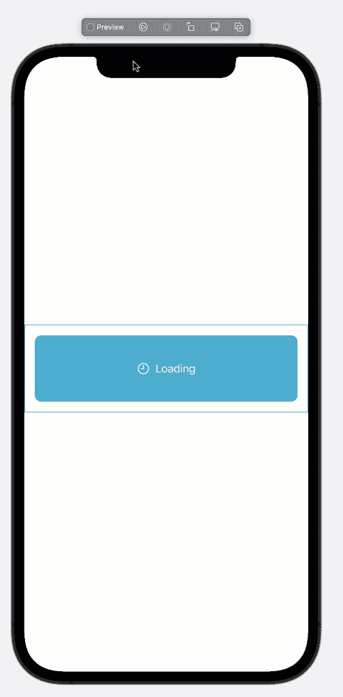
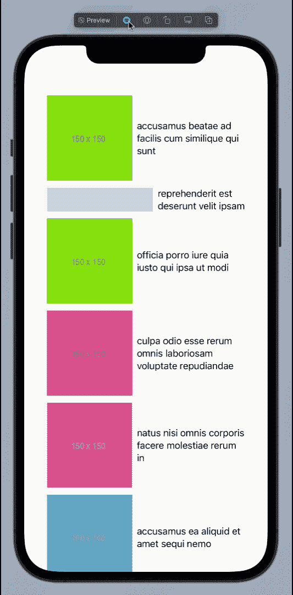

# 理解 SwiftUI 中的 AsyncImage

> 原文：<https://betterprogramming.pub/understanding-asyncimage-in-swiftui-55dd2fb6a86e>

## 首先查看异步加载和显示图像的新视图

图片由 [Taras Shypka](https://unsplash.com/@bugsster?utm_source=unsplash&utm_medium=referral&utm_content=creditCopyText) 在 [Unsplash](https://unsplash.com/s/photos/xcode?utm_source=unsplash&utm_medium=referral&utm_content=creditCopyText) 上拍摄。

在 WWDC 2021 上，苹果推出了大量新的 SwiftUI 功能，这些功能将允许开发者更加流畅地创建 iOS 应用。最令人期待的特性之一是使用`Image`视图显示图像的能力。在 SwiftUI 的早期版本中，这是不可能的，必须使用自定义代码来实现。

在 iOS 15 和 Xcode 13 中，苹果推出了`AsyncImage`，允许你只使用网址下载图片。在本文中，我们将看看如何在 SwiftUI 应用程序中使用`AsyncImage`。

# 履行

`AsyncImage`使用起来非常简单。只需提供一个图像的网址，你就完成了。这显示在下面的实现中:

结果如下所示:

很简单，对吧？

`AsyncImage`还提供了添加占位符视图的功能，该视图在主图像加载时显示。占位符视图可以是任何视图，但是要确保它返回一个`View`类型。下面是一个使用`LoadingView`作为占位符视图的`AsyncImage`的简单实现:

结果如下所示:

`AsyncImage`确实提供了其他几个特性，可以帮助处理图像的不同加载状态。这些状态包括:

*   当映像成功加载时。
*   当图像被加载时。
*   当图像加载失败时。

实现如下所示:

在上面的代码中，我们使用了`AsyncImagePhase`特性来检查下载图像的不同阶段。

在阶段结束时，我们检查是否可以访问图像。如果我们做了，那么我们简单地返回它。如果我们有一个错误，那么我们返回一个`View`来显示这个错误。最后，当图像还没有加载时，我们显示`LoadingView`，错误也是`nil`。

# 在列表中显示图像

`AsyncImage`也可用于在`List`视图中显示图像。不幸的是，在这一点上，`AsyncImage`并没有缓存图像。这意味着相同的图像被再次下载。让我们来看看一些代码:

在上面的代码中，`loadPhotos`使用 Swift 的`async/await`特性来执行和等待异步任务。一旦发出请求，`await`会确保线程被挂起，并可用于其他任务。最后，`URLSession`完成下载资源并填充`photos`数组。

在 SwiftUI 视图中，我们调用`loadPhotos`，如下所示:

新的任务修饰符允许我们在视图出现时执行代码，然后在视图消失时取消。在任务修改器中，我们使用异步闭包调用`loadPhotos`并填充照片。

*注意:为了简单起见，本文没有使用任何架构模式。在实际的应用程序中，你应该使用 MVVM、MVC 或任何其他模式，这样你的视图就不会直接进行网络调用。*

结果如下所示:

# 结论

`AsyncImage`是 SwiftUI 中一个受欢迎的特性，它减少了我们为下载图像而必须编写的定制代码的数量。我们希望它将来能支持更多的功能，包括缓存。

了解 Swift 语言中新的 Async/Await & Actor 功能。请查看以下我的课程:

 [## Async/Await 和 Actors—Swift 中的并发性

### 并发允许多个任务同时运行。理解并发是 iOS 应用的重要组成部分…

www.udemy.com](https://www.udemy.com/course/asyncawait-and-actors-concurrency-in-swift/?couponCode=LAUNCHDAY)