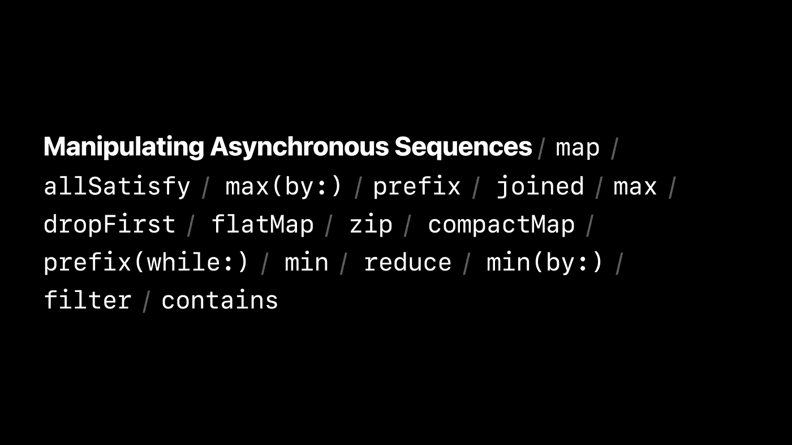
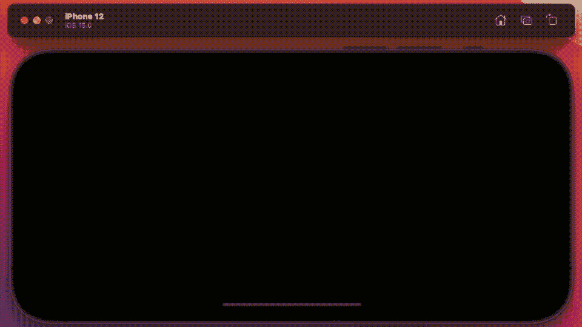
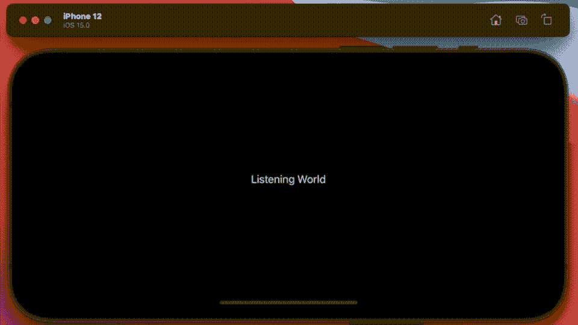

# 了解 Swift 5.5 中的异步序列

> 原文：<https://betterprogramming.pub/understanding-asyncsequence-in-swift-5-5-ed2f7d218337>

## 看看 iOS 15 下新的并发语言特性



WWDC2021 异步序列演示的幻灯片

上周，我[发表了一篇关于 Swift 5.5 中明确为并发编码设计的新语言特性的文章](/working-with-actors-and-concurrency-in-swift-5-5-b013f78b6b2a)。在那篇论文的结尾，我说还有更多，相当多。

请和我一起探讨这个主题，了解更多关于 Swift 5.5 中异步序列的信息。它们是什么？你如何使用它们？以及如何在今天的代码中采用它们。

# 编码

我想从全球变暖开始，为什么不呢。你可以从这个网站上下载一些关于这个主题的有趣数据——在这个网站上，我找到了一个表格，显示了地球的平均温度在过去 100 年中上升了 1 度。

# 读取文件

因此，计划是读取我的温度数据文件，并在读取时显示一个条形图——这在以前的 swift 中是没有的。通常，我需要读入数据，然后显示它——现在我可以使用一些新的语言特性来显示读入的数据。

Bon —我创建了两个函数，在主线程上运行，这就是`@MainActor`的原因。循环一次读取文件`temps`的一行。阅读之后，它将内容分割开来(它是一个 csv 文件),然后将其发布到 SwiftUI 接口。注意这里的 async 和 await 关键字。是的，我正在使用 Combine 框架。

接下来，SwiftUI 接口使用启动函数调用这段代码，我们需要在任务中调用它，同样使用 await 关键字。

它解析发送的值，并使用每个值在条形图上绘制一个新的条形——最终结果如下所示。是的，我知道标题在结尾时会上移——这似乎很恰当。



# 网络流

好吧——这很有价值，但也很有限——毕竟，谁会把东西存储在设备本身的文件中呢？这是从异步流中获取输入的第二个例子。

现在，设置这个非常简单。您定义一个端点，在这里我将使用本地主机，然后在我的 mac 上运行一个本地 web 服务器来连接它。

web 服务器是 OS X 自带的，我在终端会话中用这个命令行启动一个服务器。

```
sudo apachectl start
```

您可以通过在本地主机地址 127.0.0.1 上打开浏览器来测试您的 web 服务器是否正在运行。它应该会返回一个页面说，“它工作了！”。完成后，试着在你的应用程序中运行我刚才引用的代码。您应该会在控制台上看到这样的消息。

```
**event  <html><body><h1>It works!</h1></body></html>**
```

显然，在测试过之后，我强烈建议你不要让它运行，以防万一——用 stop 代替 start。

# 自定义流

Bon —让我们做一些稍微不同的事情—让我们构建一个定制的异步类型的连接。这听起来可能有点疯狂和奇怪，尽管当你仔细想想，你从传感器获得的大量数据都是以数据流的形式出现的。

这次先来一张图。这里有一个快速演示，向您展示我们要去哪里。当然，你听不到，但是当我读到数字 1 到 10 时(稍微加快了一点)，它看起来就像是。



这是它背后的代码。

这是调用它的 SwiftUI 部分背后的代码。

在这段代码中，我定义了一个异步方法 doAudio，它作为一个永不结束的任务运行。我在其中运行了一个 for next 循环，每隔 0.02 秒返回流中的所有元素(音频产生大量数据)。我运行一个计时器来清除我记录的值的数组，这提供了一种滚动效果。

然后，我使用与之前相同的条形图绘制逻辑，除了在 for-next 循环中创建了一个 struct，因为 swift 要求返回的每个元素都是唯一的。

当然，这并不包括完整的代码，音频链接设置——要在一个文件中获得全部内容，请点击这里的。

## 客户经理

在这个例子中，我创建了一个`motionManager`,用于向异步序列提供数据。然后，我使用异步序列将数据作为数组拉回来。我使用了一个 actor 来确保我获取和清除数据的权限是可控的。


然后我用这些数据来抵消我用红色、绿色和蓝色着色的三个圆圈，得到你在这里看到的效果。该记录是真实设备的记录；显然，你不能在模拟器上运行这个。

带有运动检测器代码的 actor 类型如下所示。

调用它的 SwiftUI 代码是这样的。

你可以在这个[项目](https://bitbucket.org/wizard1066/concurrentcode/commits/a0088ca3c19bc7a5d5bcce3e42b024751b3b4d7b)的 bitbucket 上找到全部内容。所有这些都让我想到了这篇文章的结尾。接下来还有更多。