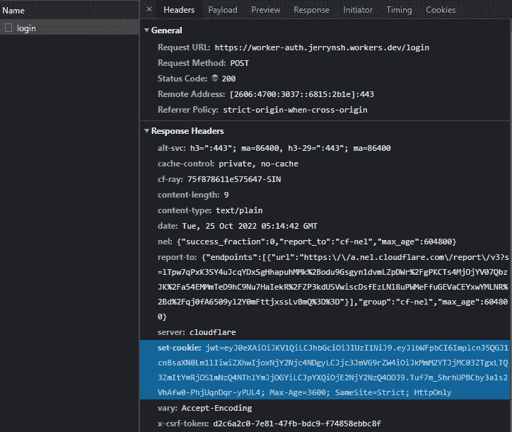
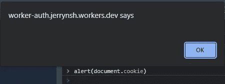
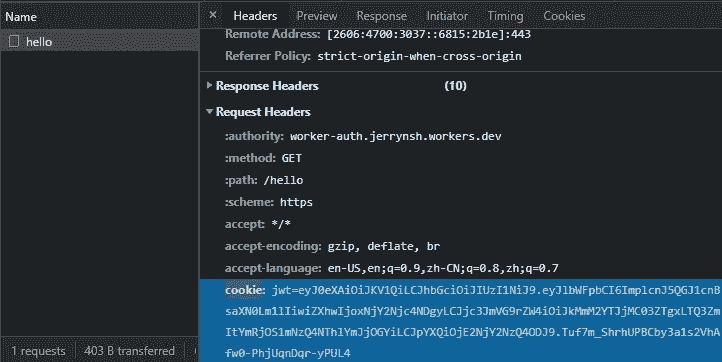
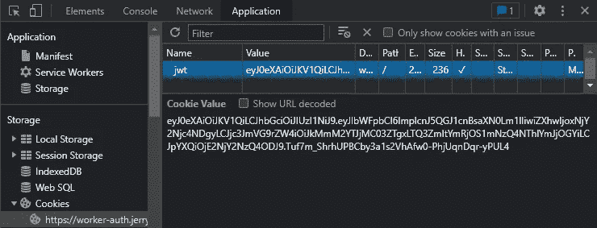
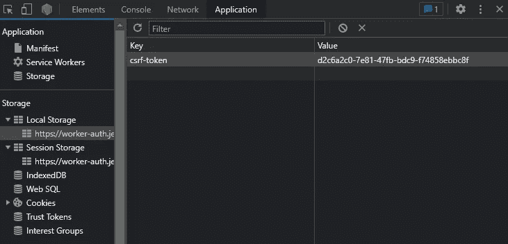
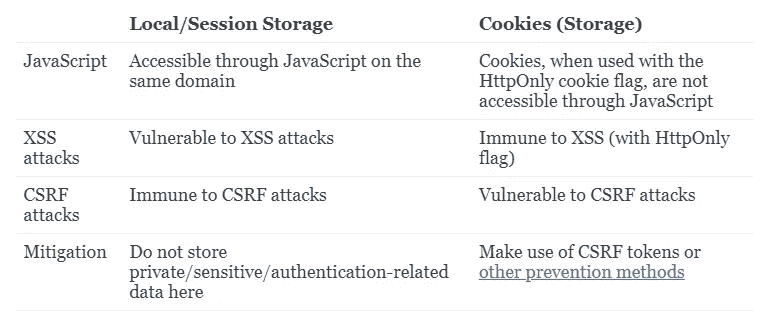
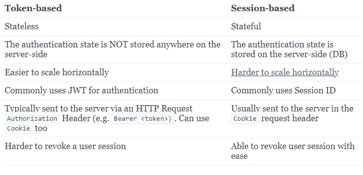
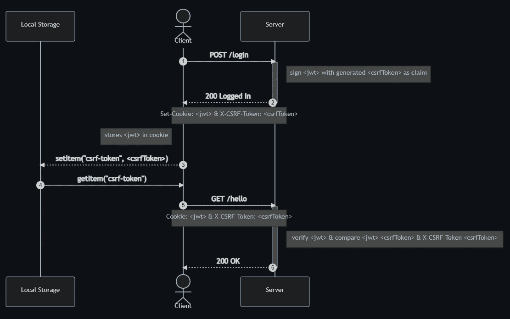

# 了解 Web 应用程序的身份验证和 Cookies

> 原文：<https://betterprogramming.pub/understanding-auth-and-cookies-for-web-applications-33016c588cf9>

## 停止比较 JWT 和饼干


照片由 [Vyshnavi Bisani](https://unsplash.com/es/@vyshnavibisani?utm_source=medium&utm_medium=referral) 在 [Unsplash](https://unsplash.com?utm_source=medium&utm_medium=referral) 上拍摄

关于 cookies、会话、基于令牌的认证和 JWT 有很多混淆。

今天，我想一劳永逸地澄清人们在谈论“ *JWT vs Cookie* 、“*本地存储 vs Cookie*、“*会话 vs 基于令牌的认证*、“*无记名令牌 vs Cookie* ”时的意思。

给你一个提示——我们应该停止比较 JWT 和饼干！

沿着这条线，我将通过什么是 XSS 和 CSRF 攻击，以及如何防止他们使用 JWT 和 CSRF 令牌基于令牌的认证。

我们开始吧！

# 术语速度跑

首先，了解这些术语之间的区别很重要。

如果不明确说明这些，我们就不清楚如何恰当地进行比较。

## 客户

我们的客户端应用程序。在这种情况下，我们特指我们的网络浏览器，如 Firefox、Brave、Chrome 等。

## 计算机网络服务器

在窗帘后施展所有魔法的电脑。

## 请求/响应标头

[HTTP 头](https://developer.mozilla.org/en-US/docs/Web/HTTP/Headers)。请注意，它们不区分大小写。

## 饼干

又名“HTTP cookie”、“web cookie”或“浏览器 cookie”

服务器发送回客户端的一小段信息。

cookie 存储在浏览器的 cookie 存储中，通常用于身份验证、个性化和跟踪。

cookie 是通过请求中的`Set-Cookie`响应头以名称-值对的形式接收的。这样，您的 cookie 将自动保存在浏览器的 cookie 存储中(`document.cookie`)。



如何接收 Cookie 的示例。你不应该公开分享你的 JWT！(这种 JWT 已不再使用)。

带有`HttpOnly`、`Secure`、`SameSite=Strict`旗帜的 Cookies 更安全。

例如，有了`HttpOnly`标志，就不能通过 JavaScript 访问 cookies，从而使其免受 XSS 攻击。



使用 HttpOnly 时，不显示 cookie

阅读更多关于 MDN 的内容，并查看其他旗帜的功能(它们很方便)。

## XSS 攻击

又名“跨站点脚本”攻击。

对于上下文，web 存储(例如，本地存储)可通过同一域上的 JavaScript 来访问。因此，网络存储容易受到 XSS 攻击。

简而言之，XSS 是一种漏洞，攻击者在其中注入将在您的页面上运行的 JavaScript。

基本的 XSS 攻击试图通过表单输入注入 JavaScript，攻击者将一个`alert(localStorage.getItem('your-secret-token'))`放入表单，以查看它是否由浏览器运行，以及是否可以被其他用户查看。

如果你仍然不明白 XSS 是什么，看看这个“XSS 解释”视频。

## CSRF 攻击

又名“跨站点请求伪造”攻击。

Cookies 容易受到 CSRF 攻击。没有饼干=没有 CSRF 袭击。

由于浏览器会自动发送带有所有请求的 Cookies，CSRF 攻击利用这一点来获得对可信站点的认证访问。需要更多吗？用简单的词语阅读 CSRF。

为了保护您的网站在使用 Cookies 时免受 CSRF 攻击(使用`SameSite=None`)，请查看这个 [StackOverflow 答案](https://stackoverflow.com/questions/34782493/difference-between-csrf-and-x-csrf-token/34783845#34783845)。接下来，在维基百科上阅读更多关于 [CSRF 预防的内容](https://en.wikipedia.org/wiki/Cross-site_request_forgery#Prevention)(维基百科一般都太干巴巴了，我不喜欢，但这很好！).

还不明白 CSRF 是什么吗？看看这个“CSRF 解释”视频。

## Cookies 存储

又名“饼干罐”或“饼干”是的。我已经明白为什么它让许多人感到困惑。

存储 HTTP cookies 的客户端存储。

这里有一个重要的注意事项:浏览器通过`cookie`请求头自动发送 cookies(不需要客户端代码)和每个请求。这正是 Cookie(存储)易受 CSRF 攻击的原因。



如果 cookie 设置了 HttpOnly 标志，则在使用 cookie 存储时可以防止 XSS 攻击。



要查看 cookie:F12→“应用程序”→“存储”→“cookie”

## 网络存储

又名“本地/会话存储”

客户端存储。它们通常用于以键值对的形式存储数据。

易受 XSS 攻击。因此，对于存储私有/敏感/身份验证相关的数据来说并不理想。


您可以使用 JavaScript 获取本地存储上的任何项目



要查看本地存储项目:F12 →“应用程序”→“存储”→“本地存储”/“会话存储”

`sessionStorage` —数据仅在页面会话期间保留

`localStorage` —即使关闭并重新打开浏览器，数据仍然存在

[阅读更多关于 MDN](https://developer.mozilla.org/en-US/docs/Web/API/Web_Storage_API) 的信息。

## Cookies(存储)与网络存储



# JWT

又名“JSON Web 令牌”

常用于[认证和授权](https://www.okta.com/identity-101/authentication-vs-authorization/#authentication-vs-authorization-2)。

JWT 是一个开放标准( [RFC 7519](https://tools.ietf.org/html/rfc7519) )。这意味着所有的 jwt 都是令牌。

通常，JWT 存储在本地存储或 Cookies(存储)中。

记住，JWT 没有被加密。

相反，它是以 Base64 编码的。尝试在 [jwt.io](https://jwt.io/) 上解码任何 JWT。

## 那么，为什么要用 JWT 呢？

通常与基于令牌的身份认证一起使用，使用 JWT 时，水平扩展更容易。

为什么？JWT 的验证不需要服务器和数据库之间的任何通信。换句话说，认证可以是无状态的。

[阅读更多关于 Auth0](https://auth0.com/docs/secure/tokens/json-web-tokens) 的内容。

## 别拿 JWT 和曲奇做比较了

JWT 和 Cookie 本身都不是身份验证机制。

JWT 仅仅是一种[令牌格式](https://www.rfc-editor.org/rfc/rfc7519)。

cookie 是一种 [HTTP 状态管理机制](https://www.rfc-editor.org/rfc/rfc6265)。

如前所述，web cookie 可以包含 JWT，并且可以存储在浏览器的 cookie 存储中。

所以，我们需要停止比较 JWT 和饼干。

# 基于会话与基于令牌的身份验证

相反，应该问的问题是，“基于令牌的身份验证和基于会话的身份验证之间有什么区别？”



# Cookie 与不记名令牌

现在，我们知道饼干是如何工作的。让我们尝试一下术语“不记名代币”让我们假设从现在开始我们将使用 JWT 作为我们的认证令牌。

人们称之为“承载令牌”的是一个字符串(例如，JWT)，它被放入任何 HTTP 请求的`Authorization`报头中。与浏览器 cookie 不同，它不会自动存储在任何地方，因此这种 CSRF 是不可能的。

为了使用“不记名令牌”，我们需要将 JWT 显式地存储在客户端的某个地方(Cookies 存储或本地存储)，并在发出请求时将该 JWT 添加到 HTTP `Authorization`头中。

如果您的包含 JWT 的 cookie 设置了`HttpOnly`标志，那么用 JavaScript 从客户端检索您的令牌是不可能的。

"等等，我们用本地存储怎么样？"

请记住，使用本地存储会使我们的 JWT 容易受到 XSS 的攻击。因此，你会经常听到有人强烈反对将 JWT 储存在本地。

此时，使用 Cookie 来存储 JWT 似乎是我们唯一的选择。但是请记住，这使得我们的网站容易受到 CSRF 攻击！

# CSRF 预防

## 相同站点的 Cookies

[同场 cookie](https://developer.mozilla.org/en-US/docs/Web/HTTP/Headers/Set-Cookie/SameSite)可以有效防止 CSRF 攻击。不过，它也有其他的警告。[此处阅读更多内容](https://security.stackexchange.com/questions/121971/will-same-site-cookies-be-sufficient-protection-against-csrf-and-xss/121986#121986)。

接下来的内容假设我们不会使用 SameSite cookies。

## 常见的 CSRF 预防方法

暂且不谈 JWT，这两种是最常见的 CSRF 预防方法:

*   [同步器令牌模式](https://en.wikipedia.org/wiki/Cross-site_request_forgery#Synchronizer_token_pattern)
*   [Cookie-to-header-token 模式](https://en.wikipedia.org/wiki/Cross-site_request_forgery#Cookie-to-header_token)

查看这个 [StackOverflow 答案](https://stackoverflow.com/questions/34782493/difference-between-csrf-and-x-csrf-token/34783845#34783845)快速总结上述两种方法。

酷毙了。但现在问题来了——我们如何才能在 JWT 问题上做到这一点？

## 改进的“cookie-to-header 令牌”方法

老实说，我不太确定这种方法是否有一个合适的名字。我从 Hubert Sablonnière 关于 JWT(JSON Web Token)100%无状态的精彩演讲中发现了这个方法。我强烈建议你去看看。这一小时是值得的。

简而言之，修改后的方法(在我看来)看起来与最初的 [Cookie-to-header token 方法](https://en.wikipedia.org/wiki/Cross-site_request_forgery#Cookie-to-header_token)相似，除了一些调整:

*   反 CSRF 令牌在单独的响应报头(例如`X-CSRF-Token`)而不是`Set-Cookie`响应报头中返回
*   我们在`Set-Cookie`响应头上签名并设置一个 JWT



这个实现可以在[这个 Cloudflare Worker demo](https://worker-auth.jerrynsh.workers.dev/) 和 [GitHub](https://github.com/ngshiheng/worker-auth) 上找到。

1.  用户登录，服务器签署一个带有`csrfToken`的 JWT，作为 JWT 声明的一部分。

```
{
  "email": "[your@email.com](mailto:your@email.com)",
  "exp": 1666798498,
  "csrfToken": "1449bd3e-41c2-45cb-a538-73c7ad80ca2c",
  "iat": 1666794898
}
```

生成的`csrfToken`应该是不可预测的和唯一的每用户会话。

2.然后，JWT 将被字符串化成一个 cookie，并设置到`Set-Cookie`响应头中。另一方面，随机生成的`csrfToken`将被设置在`X-CSRF-Token`响应报头中。

3.响应头中有了`Set-Cookie`头，我们的浏览器会自动将 JWT 存储在 Cookies(存储)中。出现在`X-CSRF-Token`标题中的`csrfToken`将被提取并设置在浏览器的本地存储器中。

4.当一个请求(例如 GET /hello)被触发时，我们的浏览器将从本地存储中获取`csrfToken`。

5.来自 Cookies(存储)的 JWT 和从本地存储检索到的`csrfToken`将在我们的请求头中发送到服务器。

6.服务器将验证 JWT，并检查请求头中的`csrfToken`和 JWT 中的`csrfToken`声明，以验证 CSRF 令牌是否有效。

# 结论

本质上，只要认证不是自动的(比如在带有 Cookies 的浏览器中)，就不必担心 CSRF 攻击。

例如，如果您的应用程序通过`Authorization`头附加认证凭证，CSRF 是不可能的，因为浏览器不能自动认证请求。

最后，我们需要停止鼓吹我们的任何比较都更好。事情不是这样的。相反，我们应该考虑我们正在做出的权衡。

# 或许是个演示？

这篇文章中的截图摘自我制作的这个 Cloudflare Worker 演示。这个演示的源代码可以在 GitHub 上找到[。](https://github.com/ngshiheng/worker-auth)

为了测试 CSRF 攻击，看看这个[小工具](https://littletools.app/form?eyJtZXRob2QiOiJQT1NUIiwiYWN0aW9uIjoiaHR0cHM6Ly93b3JrZXItYXV0aC5qZXJyeW5zaC53b3JrZXJzLmRldi9oZWxsbyIsImZpZWxkcyI6W119)(致谢: [Shrikant](https://sharats.me/) )。

除此之外，我创建了一个名为 `[csrf-attack-demo](https://github.com/ngshiheng/worker-auth/tree/csrf-attack-demo)`的[分支，您可以在本地运行它来模拟 CSRF 对我们演示站点的攻击。](https://github.com/ngshiheng/worker-auth/tree/csrf-attack-demo)

# 参考

我感谢以下所有参考资料:

*   [100%无状态的 JWT (JSON Web Token)作者 Hubert Sablonnière](https://www.youtube.com/watch?v=67mezK3NzpU)
*   [如何在浏览器中存储会话令牌(以及每个令牌的影响)](https://blog.ropnop.com/storing-tokens-in-browser/)

```
**Want to Connect?**This article was originally published at [jerrynsh.com](https://jerrynsh.com/all-to-know-about-auth-and-cookies/)
```