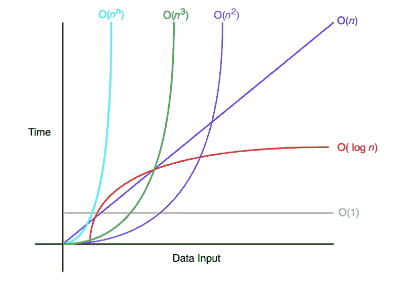

# 用 JavaScript 理解 Big-O 符号

> 原文：<https://betterprogramming.pub/understanding-big-o-notation-c3245b8112dc>

## 衡量算法最坏情况的复杂性


艾莉娜·格鲁布尼亚克在 [Unsplash](https://unsplash.com/s/photos/network?utm_source=unsplash&utm_medium=referral&utm_content=creditCopyText) 上的照片

Big-O 符号衡量算法的最坏情况复杂度。在 Big-O 符号中， *n* 代表输入的数量。用 Big-O 问的问题是这样的:“当 n 接近无穷大时会发生什么？”

下图显示了一些常见的 Big-O 符号:



O(1)相对于输入空间不变。因此，O(1)被称为常数时间。一个 O(1)的例子:

```
function exampleConstantFunc(n) {
    return n*n;
}
```

O(n)是*线性*时间，适用于在最坏情况下必须进行 *n* 运算的算法。这是一个简单的基本循环，在这个循环中，我们执行恒定时间的操作。O(n)的一个例子:

```
function exampleLinear(n) {
    for (var i = 0 ; i < n; i++ ) {
        console.log(i)
    }
}
```

对数时间函数是指执行时间与输入大小的对数成正比的函数。考虑下面的例子:

```
function log(n) {
    for (let i = 1; i > n; i*=2) {
        const result = i;
        console.log(result);  
    }
}
```

我们可以看到，在任何给定的迭代中，I 的值= 2i，所以在第 n 次迭代中，I 的值= 2n。同样，我们知道 I 的值总是小于循环本身的大小(N)。由此，我们可以推出以下结果:2[^n]< n log(2[^n])< log(n)n < log(n)

从前面的代码中，我们可以看到迭代次数总是小于输入大小的对数。因此，这种算法的最坏情况时间复杂度是 O(log(n))。对数时间复杂性的效率在大量输入(如一百万项)的情况下是显而易见的。

对于二次时间算法，我们已经进入了时间复杂性的黑暗面。顾名思义，输入的大小直接影响算法的运行时间。一个常见的例子是嵌套循环:

```
for (int i = 0; i <n; i += c) {
    for (int j = 0; j < n; j += c) {
    // some O(1) expressions
    }
}
```

从前面的例子中可以看出，对于 i = 0，内部循环运行 n 次，对于 i = 1 和 i = 2 也是如此，依此类推。内部循环总是运行 n 次，并且不依赖于 n 的值，因此使得算法的时间复杂度为 O(n 2)。

# 多项式时间(O(n^n))

多项式时间复杂度是算法的运行时间复杂度，运行到 n ^ k 的量级，二次时间算法是某些类型的多项式时间算法，其中 k = 2。下面是这种算法的一个简单例子:

```
for (int i = 0; i <n; i += c) {
    for (int j = 0; j < n; j += c) {
        for (int k = 0; k < n; k += c) {
            // some O(1) expressions
        }
    }
}
```

正如您所看到的，这个例子只是二次时间部分中的例子的扩展。这个案子最复杂的是 O(n^3).

让我们把一个算法的复杂度表示为 f(n)。n 表示输入的数量，f(n)time 表示需要的时间，f(n)space 表示算法需要的空间(额外的内存)。算法分析的目标是通过计算 f(n)来了解算法的效率。然而，计算 f(n)可能具有挑战性。Big-O 符号提供了帮助开发人员计算 f(n)的基本规则。

# 系数法则:去掉常数

我们先来回顾一下系数法则——最容易理解的法则。它只需要您忽略任何与输入大小无关的常量。输入大时，Big-O 中的系数可以忽略不计。因此，这是 Big-O 记数法最重要的规则。

*若 f(n)为 O(g(n))，则 kf(n)为 O(g(n))，对于任意常数 k > 0。*

这意味着 5f(n)和 f(n)都有相同的 O(f(n))的大 O 符号。以下是一个时间复杂度为 O(n)的代码块示例:

```
function a(n){
    var count =0;
    for (var i=0;i<n;i++){
        count+=1;
    }
    return count;
}
```

这段代码的 f(n) = n。这是因为它增加了 n 次计数。因此，该函数的时间复杂度为 O(n ):

```
function a(n){
    var count =0;
    for (var i=0;i<5*n;i++){
        count+=1;
    }
    return count;
}
```

这个块有 f(n) = 5n。这是因为它从 0 运行到 5n。然而，前两个例子都有 O(n)的大 O 符号。简单来说，这是因为如果 n 接近无穷大或者另一个大数，那四个额外的运算就没有意义了。它会执行 n 次。任何常数在 Big-O 符号中都是可以忽略的。

# 求和规则:将大 0 相加

求和规则很容易理解——可以增加时间复杂度。想象一个包含两个其他算法的主算法——该主算法的 Big-O 符号就是其他两个 Big-O 符号的总和。

*若 f(n)为 O(h(n))，g(n)为 O(p(n))，则 f(n)+g(n)为 O(h(n)+p(n))。*

在应用了这个规则之后，记住应用系数规则是很重要的。下面的代码块演示了一个带有两个主循环的函数，这两个循环的时间复杂度必须单独考虑，然后求和:

```
function a(n){
    var count =0;
    for (var i=0; i<n; i++){
        count+=1;
    }
    for (var i=0; i<5*n; i++){
        count+=1;
    }
    return count;
}
```

在本例中，第 4 行的 f(n) = n，第 7 行的 f(n) = 5n。这导致 6n。但是，当应用系数规则时，最终结果是 O(n) = n。

# 产品规则:乘以大操作系统

乘积法则简单地说明了 Big-Os 可以相乘到什么程度。

*若 f(n)为 O(h(n))，g(n)为 O(p(n))，则 f(n)g(n)为 O(h(n)p(n))。*

下面的代码块演示了一个具有两个嵌套 for 循环的函数，对这两个循环应用了乘积规则:

```
function (n){
    var count =0;
    for (var i=0; i<n; i++){
        count+=1;
        for (var i=0; i<5*n; i++){
            count+=1;
        }
    }
    return count;
}
```

在这个例子中，f(n) = 5n*n，因为第 7 行运行 5n 次，总共 n 次迭代。因此，这导致了 5n^2 操作的总数。应用系数法则，结果是 O(n)=n^2

# 多项式法则:大到 k 的幂

多项式规则表明，多项式时间复杂性具有相同多项式次数的 Big-O 符号。数学上，它如下:

如果 f(n)是 k 次多项式，那么 f(n)是 O(n^k).下面的代码块只有一个二次时间复杂度的 for 循环:

```
function a(n){

    var count =0;

    for (var i=0; i<n*n; i++){
        count+=1;
    }
    return count;
}
```

在这个例子中，f(n) = n^2，因为第 4 行运行 n*n 次迭代。

既然我们已经开始了这个对话，到目前为止，我们在这里讨论的大多数时间复杂性类型都是 O(n^k 类型的。例如，对于 n = 1，它是恒定的时间复杂度，而对于 k = 2，它是二次复杂度。多项式时间复杂性的概念将我们引入一类问题，这类问题是根据其解的复杂性来定义的。

这些是类的类型:

*   **P** :多项式时间 O(n^k).可以解决的任何问题
*   **NP** :任何可以在多项式时间内验证的问题。可能存在可以在非确定性多项式时间内解决的问题(例如数独求解)。如果这些问题的解可以在多项式时间内得到验证，那么这个问题就被归为 NP 类问题。NP 类问题是 P 类问题的超集。
*   **NP-完全**:任何一个 NP 问题，只要能在多项式时间内化简为另一个 NP 问题的函数，都可以归为 NP-完全问题。这意味着，如果我们知道某个 NP 问题的解，那么可以在多项式时间内导出另一个 NP 问题的解。
*   **NP-Hard** :如果存在一个 NP-完全问题，可以在多项式时间内化简为 H，那么这个问题可以归为 NP-Hard 问题(H)。

*在大多数现实世界场景中，我们会遇到很多 P 和 NP 问题，NP 类问题的一个经典例子是旅行推销员，其中一名推销员想访问 n 个城市，从他的房子开始和结束他的旅行。在汽油量有限且总行驶里程有上限的情况下，销售人员能在不耗尽汽油的情况下走遍所有城市吗？*

到目前为止，我们已经看到了一些非常简单的例子:它们都有一个单独的循环或者嵌套循环。然而，经常会有这样的情况，我们必须处理来自同一个算法的多个循环/函数调用/分支。让我们看一个例子，在这种情况下，我们如何计算复杂性。

这种代码的总体复杂性是这两部分复杂性的总和。因此，在这种情况下，总的复杂性将是 O(n + log n)，它渐近地将是 O(n)。

这里，最坏情况的复杂度将由两个分支中最差的一个决定，即 O(n)，但是最好情况的复杂度将是 O(log(n))。

虽然我们的方法只执行一些 O(1)运算，但它不断地改变输入并调用自己，直到输入数组的大小为零。因此，我们的方法最终执行了 n 次，总时间复杂度为 O(n)。