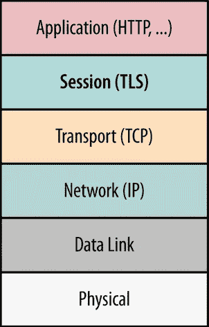
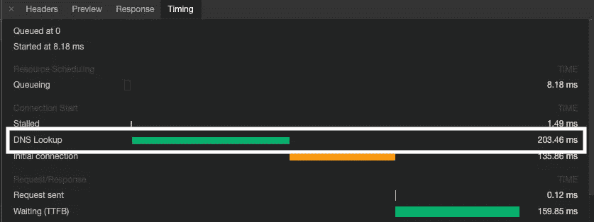
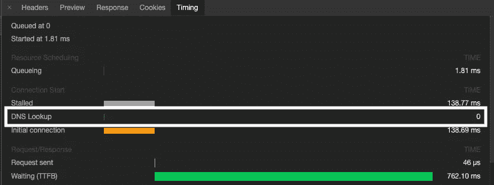
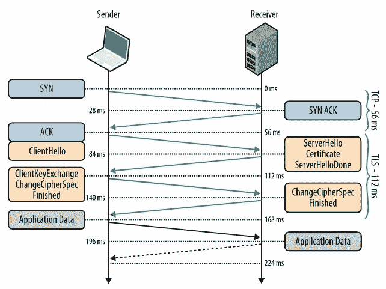
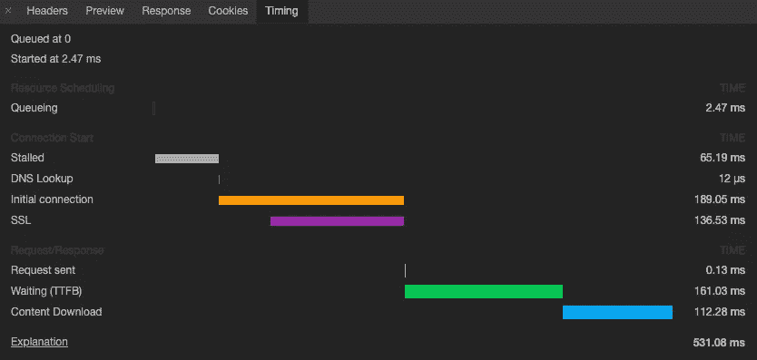
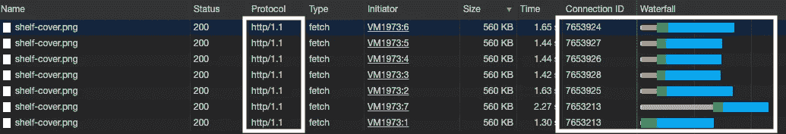
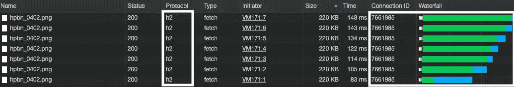

# 了解浏览器网络并优化 HTTP/1.1 和 HTTP/2 的请求

> 原文：<https://betterprogramming.pub/understanding-browser-networking-and-how-to-optimize-the-requests-for-http-1-1-and-http-2-f6371f0af650>

本文不是提供优化 web 应用程序的网络性能所需的待办事项列表，而是旨在提供对浏览器如何管理 HTTP 请求的更深入的理解。

# 传输控制协议

TCP 和 IP 是构成所谓的互联网协议套件*的协议。它们是其他更高层协议的基础，如 IMAP、HTTP、HTTPS、SSH 或 TLS。*

*当然，这是非常复杂的，所以我将把每个角色简化到本文的范围内。*

## *互联网协议(Internet Protocol)*

*IP 的作用是寻址和识别主机(通过 [IP 寻址](https://en.wikipedia.org/wiki/IP_address))，
并通过将数据包转发到离目的地更近的下一个网络路由器(不同的数据包可以有不同的路由)将数据包路由到最终目的地。*

## *传输控制协议（Transmission Control Protocol）*

*TCP 最重要的作用是与主机建立连接。*

*它还确保数据包按顺序到达，因为 IP 可能通过不同的路由发送数据包，并且可能以不同于发送顺序的顺序到达。*

*它还处理丢失和重复的数据包，并防止主机因数据过多而使彼此或底层网络不堪重负( [TCP 拥塞控制](https://en.wikipedia.org/wiki/TCP_congestion_control))。*

*冒着让你们中的一些人厌烦的风险，我认为提醒我们自己数据是通过 TCP 成块传输的是很重要的。*

*发送方和接收方首先协商这些数据块有多大。*

*然后，根据网络条件，随着数据流进行调整，以便块具有最佳大小。足够大以便数据快速传输，但又足够小以便网络能够处理。*

*发送方将通过发送大小为 x 的初始(相对较小的)块开始。*

*在发送下一条消息之前，它将等待来自服务器的 ACK 响应，以确认接收者确实收到了数据。*

*接下来，它将尝试发送两倍多的数据。如果运行正常，并在超时前再次收到 ACK，它将再次加倍数量，以此类推。*

*然而，如果请求超时，或者数据包丢失，或者它收到网络或接收器无法处理这么多数据的其他信号，它将减少数据量，并可能稍后再次尝试增加数据量。关于这一点的更多信息，请参见本文。*

# *HTTPS*

*HTTPS 是 HTTP 的扩展。它本质上是安全的 HTTP(纯文本)。*

*除此之外，它还通过加密数据来提供安全的网络通信。为了实现这一点，它依赖于它下面(和 TCP 上面)的另一个协议，称为 TLS。*

*TLS 过去被称为 SSL，所以你会看到两个名字都被使用。*

*下图将帮助您更好地理解哪些协议依赖于哪些协议(底部的*物理层*和*数据链路层*不在本文讨论范围之内)。*

*虽然从理论上讲，HTTPS 不是必需的，但现在它几乎是必须的，浏览器供应商在每个版本中都采取措施鼓励它的使用。*

*本帖中的视频很好地解释了为什么需要 HTTPS。*

**

*TCP / IP 堆栈([来源](https://www.oreilly.com/library/view/high-performance-browser/9781449344757/ch04.html))*

# *浏览器网络请求的步骤*

*了解了基础知识之后，让我们看看当我们通过 AJAX 调用或简单地单击一个链接从浏览器进行 HTTP/HTTPS 调用时，实际上会发生什么。*

# *DNS 查找*

*假设我们打电话到 medium.com，浏览器首先需要将域名*medium.com*转换成 IP 地址。*

*这个过程被称为 *DNS 查找，*，在最坏的情况下，浏览器将不得不接触服务器来获取 IP。*

*对每个请求都这样做会使事情变得非常慢，但由于这些 IP 不会经常改变，它们被缓存在不同的级别:浏览器本身、操作系统、家中的路由器等。因此，并非每次都执行完整的网络往返。*

*浏览器做了更多的事情来避免让用户等待 DNS 查找来解析，例如，可能会在下载后预先解析页面中的所有链接，这样，当用户单击链接时，IP 地址就已经知道了。*

*下面的两个截图显示了两次完全相同的请求的时间，一个接一个。*

*第一次 DNS 查找花费了 203 毫秒，第二次由于缓存而花费了 0 毫秒。请记住，每个域都会发生这种情况。*

**

*Chrome 请求计时标签显示对未缓存域名的请求。*

**

*相同的请求不需要第二次 DNS 查找，因为它被缓存了。*

*这就是为什么你看的每一本关于浏览器网络优化的书和文章都建议你减少这些查找。有大量的资源讨论如何避免 DNS 查找，我在这里不做介绍，但是其中一些非常明显:*

*   *向尽可能少的域名发出请求。*
*   *通过后台调用进行 DNS 预取(尽管如果管理不当可能会导致大量无用的调用，而浏览器可能已经为您做了)。*
*   *使用带有 IP 地址的 URL，而不是域名。没有域名，没有 DNS 查找，但你需要一个静态 IP。此外，如果您使用 CDNs，这实际上是不可行的，并且您会丢失这些请求的 cookie，因为 cookie 是按域名存储的。*

# *TCP 三次握手*

*既然有了 IP 地址，浏览器将通过一个称为 TCP 三次握手的过程与主机建立 TCP 连接。*

*这发生在任何实际数据交换之前，它由客户端发送的 SYN 数据包、服务器的 SYN-ACK 响应和客户端发送的 ACK 数据包组成。*

*只有在 ACK 数据包之后，客户端才能发送实际数据，这意味着，对于每个 TCP 连接，在浏览器能够通过网络实际发送任何数据之前，需要进行一次完整的网络往返。*

*TCP 握手也是客户端和服务器通告它们各自的接收窗口(RWND)的时间，接收窗口基本上是它们在 ACK 包之间的线路上可以拥有的数据量。*

# *TLS 握手*

*如前所述，这一步理论上是可选的，但在实践中，它实际上是必需的，而且您可能已经使用了。*

*要在客户端和主机之间建立安全隧道，必须在双方同意协议版本、选择密码套件和其他一些事情的情况下进行 TLS 握手。*

*下图显示了 TCP 和 TLS 握手的往返过程。*

**

*TLS 握手([来源](https://hpbn.co/transport-layer-security-tls/)*

*你可以[阅读更多关于这个](https://hpbn.co/transport-layer-security-tls/)的内容，但是要记住的是，这需要两次到服务器的往返，通过使用 [TLS 错误启动](https://hpbn.co/transport-layer-security-tls/#enable-tls-false-start)和 [TLS 会话恢复](https://hpbn.co/transport-layer-security-tls/#enable-tls-false-start)将之前建立的连接减少到一次。*

*但是，在交换任何数据之前，每个 TCP 连接至少需要两次网络往返。*

# *HTTP 请求*

*浏览器然后构造 HTTP 请求，该请求需要通过 TCP 连接发送到服务器。*

*这包括一个消息行(如`GET /images/logo.png HTTP/1.1`)、标题列表(如`Accept-Language: en`)和一个可选的消息体，即实际数据。*

*虽然我假设您已经熟悉 HTTP，但是请记住，数据将通过 TCP 以各种大小的块发送，这一点很重要，如上面的 TCP/IP 部分所述。*

# *来自服务器的 HTTP 响应*

*服务器监听相关端口(HTTP 的 80 和 HTTPS 的 443)，接收请求，并根据 web 服务器配置适当地转发请求(例如 [Apache 虚拟主机](https://httpd.apache.org/docs/current/vhosts/))。*

*这可以是磁盘上的静态文件，比如`/images/logo.png`或`/index.html`，在这种情况下，资源将作为响应被发送回来。*

*也可以是类似于`/users/123/status`的东西，一个 web 框架，比如 [Spring](https://spring.io/) 或者 [Django](https://www.djangoproject.com/) ，配置成分别用一个 Java 或者 [Python](https://www.python.org/) 类来处理。*

*然后，该类将计算一个响应，该响应将被发送回客户端。*

# *浏览器处理 HTTP 响应*

*根据内容类型和各种其他 HTTP 头，浏览器将决定如何处理响应。*

*如果它是一个 HTML 页面，它将在屏幕上呈现它，并在找到对 HTML 本身中的其他资源(JS 脚本、CSS 文件等)的引用时发出其他请求。).*

*如果是 PDF 文件，它可能会在不同的标签中打开它，或者提示用户将内容存储为 PDF 文件。*

*您可以从浏览器的开发人员工具的网络计时部分检查上述每个步骤的计时。*

*下面是 Chrome 定时标签的截图。*

**

*Chrome 请求计时标签(关于 Chrome 中计时视图的更多信息[此处](https://developers.google.com/web/tools/chrome-devtools/network/reference#timing-explanation))*

# *多个请求*

*我希望你已经做到了这一步，但是，记住这只是一个请求。*

*除了缓存域的 DNS 查找和先前建立的连接的 TLS 握手中的第二次往返之外，所有其他事情都发生在每个 TCP 连接上。浏览器将如何处理这个问题？*

*这取决于使用的 HTTP 版本，或者更准确地说，是 HTTP/1.1 还是 HTTP/2(也称为 h2)，这几乎是唯一的真正选择。*

# *HTTP/1.1*

*一种极端的做法是为每个请求打开一个 TCP 连接。现在应该很清楚，这不是一个好主意。*

*对于两个请求，它可能会给出好的结果，但是对于 100 个请求呢？TCP 和 TLS 握手 100 次显然不是最优的，更不用说浏览器需要分配多少内存来管理这些请求了。所以这个选项是不可能的。*

*另一个极端是滥用*连接重用*，它将只建立一个 TCP 连接(每个主机)并为每个 HTTP 请求重用它以避免多次握手。*

*这可以通过“connection `keep-alive` header”实现，这是 HTTP/1.1 中的默认设置，它将指示浏览器暂时保持底层 TCP 连接打开，以便它可以在将来的 HTTP 请求中重用。*

*但是有一个问题:请求需要在客户机上以先进先出的顺序进行处理，这意味着首先需要调度第一个到达的请求，只有在前一个请求的完整响应被完全接收后，才能调度队列中的下一个请求。*

*对于浏览器中(几乎)同时触发的多个请求(A，B，…，Z)，这意味着浏览器发送请求 A，并将其余的请求排队。*

*过了一会儿，A 的响应来了，请求 B 可以发送了。当对 B 的响应到来时，它发送下一个，以此类推。*

*这有点长，但请耐心等待。我保证这是值得的。*

*不难意识到，这也不会给多个请求带来好的结果，但是 HTTP/1.1 还有另一个特性，叫做 [HTTP 管道](https://en.wikipedia.org/wiki/HTTP_pipelining)。*

*它允许客户端一个接一个地发送多个请求，而不必在发送下一个请求之前等待完整的响应。*

*服务器甚至可以在多个线程上并行处理这些请求，但是必须按照请求传入的顺序发送回响应。*

*这基本上意味着，如果有十个请求进来，第十个请求先被处理，浏览器就不能把它发送回去。它必须等待前九个请求完成处理，发送它们的响应，然后才发送第十个请求。*

*这种场景被称为[队列头阻塞](https://en.wikipedia.org/wiki/HTTP_pipelining)，很难得到正确的结果(如果第一个请求挂起了怎么办？)，更不用说内存成本了。*

*由于这个原因以及其他问题，HTTP 管道不是真正可行的，除非，也许，您在浏览器之外，并且您可以完全控制实际的套接字。*

*所以回到浏览器如何处理多个 HTTP/1.1 请求，浏览器供应商最终(大部分)完全避免了 HTTP 管道，并在同一 TCP 连接上的客户端排队 HTTP 请求和并行的多个连接之间找到了一个中间点。*

*这意味着浏览器通常会为每台主机打开固定数量的并行 TCP 连接。当然，这个数字会因浏览器而异，但我相信现在 6 是很常见的。*

*因此，如果您有七个请求，它将为前六个请求打开六个并行 TCP 连接，并将第七个请求排队，当它获得其中一个请求的第一个响应时，它将为第七个请求重用该 TCP 连接。*

*然后，它可能会选择让它们打开一段时间，以防更多的 HTTP 调用进入，并最终关闭它们以释放内存。*

*如果你和我一样，你会想亲眼看看这些。*

*下面是同时触发的七个请求(实际上是七次相同的请求)的 Chrome 开发者工具网络标签的截图。*

*Connection ID 列显示了六个不同的 ID，六个 TCP 并行连接各有一个。*

*在瀑布列中，您将看到列表中的最后一个请求是如何首先获得响应的，而在它之前一直停滞不前的那个请求(灰色)会立即重用被释放的 TCP 连接，它们共享相同的连接 ID。*

**

*Chrome 中 7 个 HTTP/1.1 请求的定时截图*

# *HTTP/2(或 h2)*

*如果您完整地阅读了前一部分，您的耐心已经得到了回报，因为现在很容易理解 HTTP/2 的一个关键特性。*

*客户端可以发送多个 HTTP 请求，就像在 HTTP/1.1 中一样，但是服务器需要按照获得请求的顺序发送响应的约束已经没有了。*

*因此，客户机可以间隔 1 毫秒发送 100 个请求，服务器可以按照它选择的任何顺序立即响应先处理的请求，HTTP/2 会将每个响应映射到原始请求。*

*这个特性叫做*多路复用*，你可能已经听说过了。*

*那么，如果浏览器检测到支持 HTTP/2，它们如何处理多个 HTTP 请求呢？你猜对了，一般来说，他们只在每个主机上打开一个 TCP 连接，所有的数据都通过这个连接流动(当然，当他们打开更多的时候，可能会有边缘情况)。*

*这是七个请求的时间截图，但是这次是通过 HTTP/2。*

*请注意，它们的连接 ID 都是相同的，这表明使用了相同的底层 TCP 连接。另外，请注意瀑布，没有停顿，所有的请求都是一个接一个地立即发送的。*

**

*Chrome 中七个 HTTP/2 请求的定时截图*

# *结论*

*那么，您实际上可以做些什么来最小化 web 应用程序中的延迟呢？*

*你会在网上找到很多清单，但这显然要视情况而定。一个主要的决定因素是你是否已经在使用 HTTP/2。*

*让我们来看看您会在这样的清单上找到的常见项目:*

1.  *连接重用。*
2.  *Sprite 图像并捆绑 JS 和 CSS 资源，以便您发出更少的 HTTP 请求(以增加它们通过并行 TCP 连接被接收的可能性)。*
3.  *域分片——如果您仍然无法将请求保持在最低限度，请为您的资源使用多个域(以增加通过并行 TCP 连接接收请求的可能性)。*
4.  *考虑 HTTP 管道。*
5.  *资源内联。*
6.  *[硫化](https://www.npmjs.com/package/vulcanize)。*
7.  *减少 DNS 查找。*
8.  *缓存。*
9.  *Gzip 所有资产。*
10.  *使用一个[内容传送网络](https://en.wikipedia.org/wiki/Content_delivery_network)。*
11.  *不要使用重定向。*
12.  *增加 TCP 的初始拥塞窗口。*

*我希望你现在以一种全新的视角来看待这个列表，并且理解每一项背后的原因。*

*需要注意的一点是，在 HTTP/1.1 中，第 1 项到第 6 项基本上是绕过行首阻塞的方法，而在 HTTP/2 中它们变得完全没有必要。*

*剩下的都是“常青树”，在 HTTP/2 时代依然适用。*

*第 7 点现在应该很明显了，你可以回顾一下上面关于 DNS 查找的部分。*

*数字 8，9，10 不需要太多解释。*

*第 11，我们在这里并没有真正讨论这个问题，但是应该避免重定向，因为它们需要一次额外的网络往返。*

*第 12 个问题已经在 TCP / IP 部分讨论过了，请随时复习。*

# *参考*

*   *伊利亚·格里戈利克所著的《高性能浏览器网络[*一书(方便的话*](https://hpbn.co/)*[可以在网上免费获得](https://hpbn.co/))。**
*   *[这段 YouTube 视频](https://www.youtube.com/watch?v=r5oT_2ndjms&t=2s)*