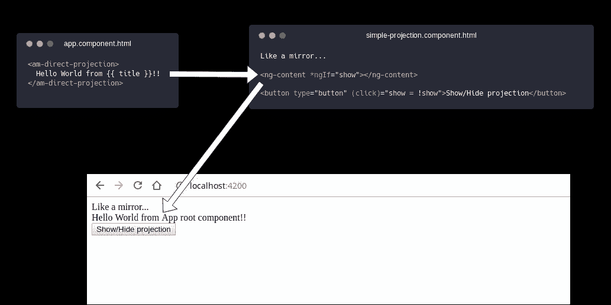
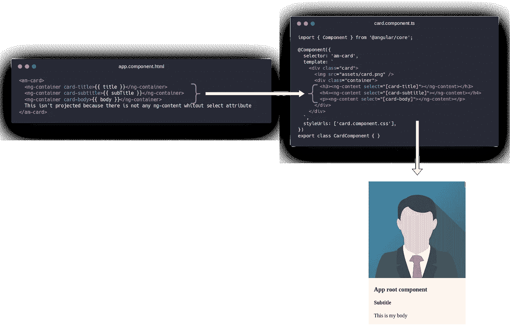
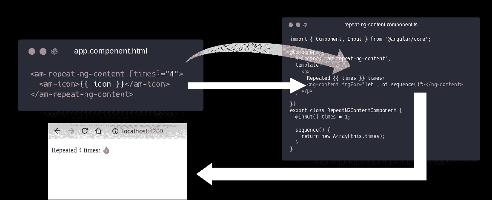
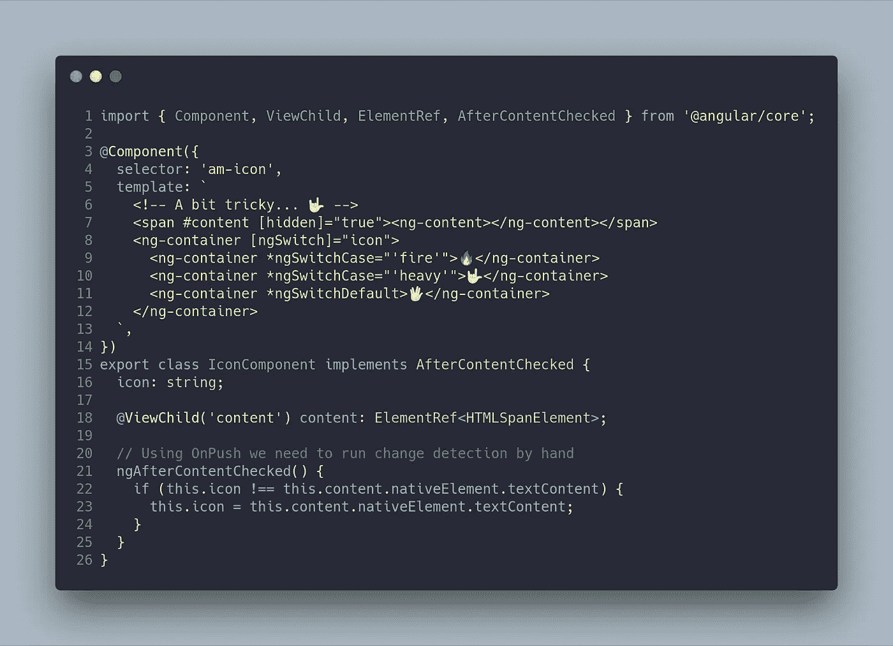
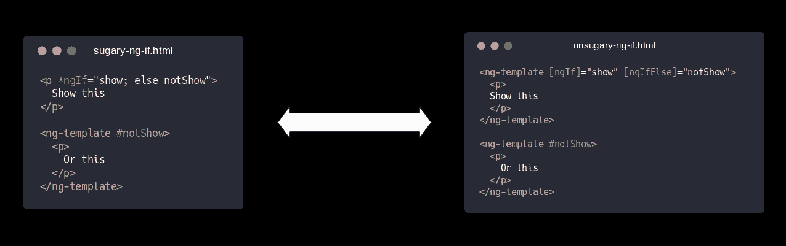
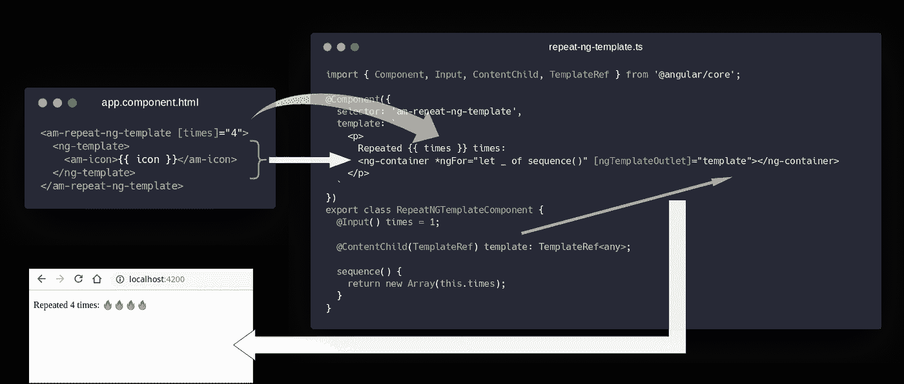
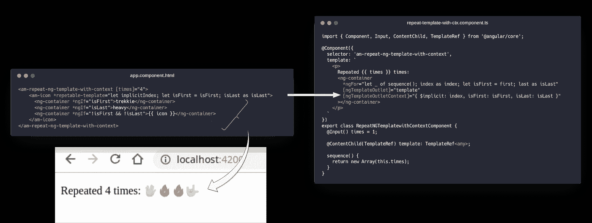
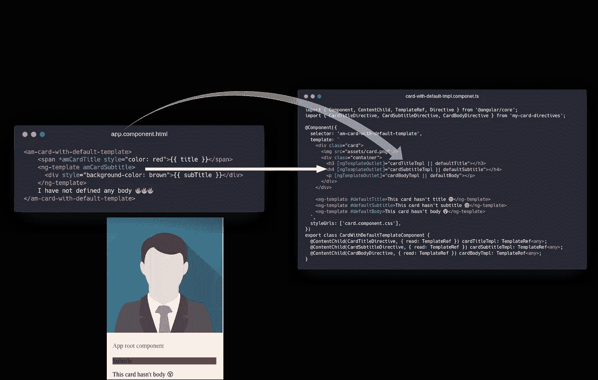

# 从角度理解内容投影

> 原文：<https://betterprogramming.pub/understanding-content-projection-in-angular-81c9a40d63dc>

## 内容投影，是什么？

内容投影(也称为 transclusion)是一种从组件外部导入 HTML 内容并将该内容插入到组件模板中指定位置的方法。

因此，使用内容投影，您可以获得下图所示的结果。

请注意，该组件像镜子一样工作。另一个更复杂的示例如下图所示，其中配置了一封包含用户数据的信函。

## 什么是 ng 容器？

Angular ng-container 是一个分组元素(语法元素),它不会干扰样式或布局，因为 Angular 没有把它放在 DOM 中。

我们可以用**结构指令**来处理它。

结构化指令通过添加、移除或操作 DOM 元素来更改 DOM 布局。

`am-icon`是以下组件:

结果是一个图标，而不是四个，正如我们所料。

# ng-content 是如何工作的？

*   `ng-content`不产生内容。它只是投射现有的内容
*   期望的一致性
*   表演
*   根据前面的规则，它既不能创建也不能破坏计划的组件(生命周期)。
*   只有最后的`ng-content`项目内容。

还有…我能做什么？这里`ng-template`来救援了…

## **什么是 ng 模板？**

顾名思义，它是一个模板元素:一个可以实例化的模型。因此，您可以将模板设置为组件的输入，这非常有用。

## **星号(*)语法**

星号是稍微复杂一点的语法糖。

你通常会看到:`*ngIf`、`*ngFor`、`*anyDirective`、…

那么我们的重复成分呢？

## **那 ngTemplateOutlet 是什么？**

`ngTemplateOutlet` 指令接收一个 ng 模板。它负责创建实例并将其插入 DOM。

# 是啊，就像 JS 里的上下文！

我们可以给实例一个对象，它是由 ng 模板的`ngTemplateOutlet`创建的。该对象可以包含您想要传递给模板的任何内容。在这里，我们揭露了很多库组件的神奇之处(`datatables`、`angular-material`、`ng-bootstrap`等)。).

# 我们可以做很棒的事情！

# 更多更多…

*   [演示文稿](https://caballerog.github.io/ng-transclusion/slides/)
*   这个岗位的 GitHub 分支是[https://github.com/Caballerog/ng-transclusion/](https://github.com/Caballerog/ng-transclusion/)