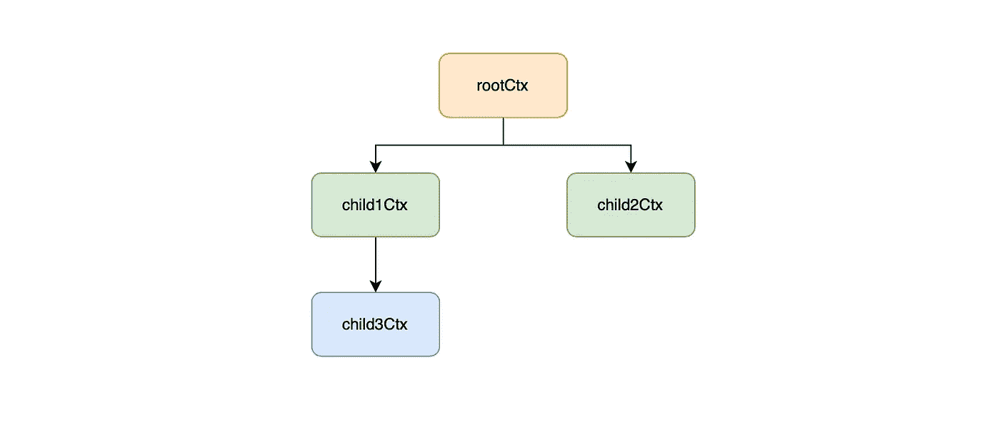

# 理解 Golang 中的上下文

> 原文：<https://betterprogramming.pub/understanding-context-in-golang-7f574d9d94e0>

## 揭秘 ctx 变量

照片由 [William87](https://stock.adobe.com/contributor/200903171/william87?load_type=author&prev_url=detail) 在 [Adobe Stock](https://stock.adobe.com/search?load_type=search&native_visual_search=&similar_content_id=&is_recent_search=&search_type=usertyped&k=baton&asset_id=42509577) 上拍摄

如果你是 Golang 的新手，很可能你几乎在任何地方都见过`context`模块，但有时发现它令人困惑，如果不是抽象的话。

事实是，`context`模块无处不在是有原因的。它在保持应用程序性能方面起着至关重要的作用。

在这篇博文中，我将省去你查看源代码的麻烦，告诉你关于`context`模块你需要知道的一切！

我们开始吧！

# 为什么我们需要上下文模块？

Andrea Piacquadio 在[像素上拍摄的照片](https://www.pexels.com/photo/cheerful-black-waitress-standing-at-counter-3801426/)

想象一下，你是一个在餐馆里接受订单的人。

当一个订单到达时，你把它委托给你的众多厨师中的一个。

如果客户突然决定离开，你会怎么做？

毫无疑问，你会阻止你的厨师进一步处理订单，以防止任何食材的浪费！

这就是`context`模块的作用！

这是传递给你的函数和 Goroutines 的一个参数，如果你不再需要它们，它允许你立即停止它们。

# 什么是上下文模块？

`context`模块的典型用法是当客户端终止与服务器的连接时。

如果服务器正在进行繁重的工作或数据库查询时发生终止，该怎么办？

`context`模块允许这些进程在不再需要时立即停止。

`context`模块的使用可归结为三个主要部分

*   收听取消事件
*   发出取消事件
*   传递请求范围数据

我们分别讨论一下。

# 收听取消事件

Andrea Piacquadio 在[像素](https://www.pexels.com/photo/pensive-ethnic-man-listening-to-answer-in-paper-cup-phone-3760607/)上拍摄的照片

上下文类型只不过是一个实现四个简单函数的接口。

现在，让我们关注前两个，`Done()`和`Err()`。

`Done()`函数返回一个通道，该通道在上下文被取消时接收一个空结构。

在取消的情况下，`Err()`函数返回一个非零错误，否则，它返回一个`nil`值。

使用这些函数，监听取消事件变得很简单。

# 1.正在收听 Done()频道

在上面的例子中，我们模拟了一个 web 服务处理程序。

我们使用`time.After()`来模拟一个需要两秒钟来处理请求的功能。

如果上下文在两秒钟内被取消，`ctx.Done()`通道接收一个空结构。将执行第二种情况，函数退出。

您可以在本地启动此代码。一旦打开，在你的浏览器上访问`localhost:8000`，然后在两秒钟内关闭它。观察你的终端，看看会发生什么。

# 2.检查来自 Err()的错误

或者，您可以在执行一些关键逻辑之前检查来自`ctx.Err()`的错误。

如果上下文被取消，上面的函数将暂停并返回。

# 发出取消事件

照片由 [Pera Urosevic](https://www.pexels.com/@otc242) 在 [Pexels](https://www.pexels.com/photo/traffic-sky-red-clouds-8282820/) 上拍摄

`context`模块提供了三个返回`CancelFunc`的函数。

调用`cancelFunc`向`ctx.Done()`通道发出一个空结构，并通知正在监听它的下游函数。

在我们深入研究它们之前，让我们先讨论一下上下文树和根上下文。

# 1.上下文树

当您调用`WithX`函数时，它们接受一个父上下文并返回父上下文的一个新副本和一个新的 Done 通道。

在上面的例子中，我们创建了一个多重上下文树。

当我们调用`cancelFunc1`时，我们将取消`child1Ctx`和`child3Ctx`，而`child2Ctx`不受影响。

# 2.根上下文

由于函数需要一个父上下文作为参数，`context`模块提供了两个简单的函数来创建一个根上下文。

这些函数输出一个空的上下文，什么都不做。它不能被取消，也没有价值。

它们的主要目的是作为根上下文，稍后将传递给任何一个`WithX`函数来创建一个可取消的上下文。

# 3.用取消

`WithCancel`函数接受一个父上下文并返回一个可取消的上下文和一个取消函数。

如果`databaseQuery`返回一个错误，取消功能将被调用。`operation1`会通过`ctx.Done()`得到通知，然后优雅地离开。

您可以在`ctx.Err()`中找到取消原因。

# 4.with 超时

`WithTimeout`允许您指定超时持续时间，如果持续时间超过，将自动取消上下文。

在上面的例子中，上下文将在三秒钟后自动取消。

因此，如果数据库查询在此之前没有成功，处理程序将退出并返回。

或者，您可以通过`cancel`功能手动取消上下文。

# 5.带电话线

`WithDeadline`函数接受特定的超时时间，而不是持续时间。除此之外，它的工作方式与`WithTimeout`完全相似

上例中的上下文会在三秒后自动取消。

# 传递请求范围数据

照片由[艾伦·马斯](https://www.pexels.com/@allan-mas)在[像素](https://www.pexels.com/photo/cheerful-girl-playing-ball-on-sport-ground-5623049/)上拍摄

因为我们通常跨函数传递`ctx`变量，所以请求范围数据可以使用`WithValue`函数标记这个变量。

考虑一个涉及多个函数调用的应用程序，我们可以通过`ctx`变量向这些函数传递一个 traceID 来进行监控和日志记录。

`WithValue`函数向`ctx`变量中的一个键添加一个值，而`Value`函数检索给定键的值。

# 警告和实践

照片由[罗德尼制片公司](https://www.pexels.com/@rodnae-prod)在[像素](https://www.pexels.com/photo/man-people-woman-street-7045445/)上拍摄

虽然很方便，但是上下文模块经常被误用，很容易给应用程序带来错误。

在结束帖子之前，先说一些必不可少的做法。

# 1.总是推迟取消功能

当您通过`WithCancel`函数生成一个新的可取消上下文时，该模块将

*   如果调用了`cancel`函数，则在后台生成一个新的 Goroutine 来将取消事件传播给所有子节点
*   跟踪父上下文结构中的所有子上下文

如果函数返回时没有取消上下文，那么 Goroutine 和子上下文将无限期地保留在内存中，从而导致内存泄漏。

这也适用于`WithTimeout`和`WithDeadline`，除此之外，当超过截止时间时，这些功能会自动取消上下文。

然而，推迟任何`WithX`功能的`cancellation`仍然是一个最佳实践。

# 2.仅对请求范围数据使用 WithValue

很容易假设我们在最后一次函数调用中用`value2`覆盖了`key1`。

然而，事实并非如此。

`WithValue`函数接受一个父上下文并返回一个上下文副本。因此，它不是覆盖值，而是用一个新的键-值对创建一个新的副本。

因此，您应该将`WithValue`的使用限制在有限的请求范围数据。

传递随后会发生变化的函数参数或值将导致创建多个上下文变量，并导致内存使用量显著增加。

# 结论

由[法比奥·斯卡莱塔](https://www.pexels.com/@fabioscaletta)在[像素上拍摄的照片](https://www.pexels.com/photo/orange-and-white-lighthouse-on-dock-2096728/)

关于上下文模块就是这样！

以上要点总结了`context`模块所能提供的一切！

希望这篇文章对你有所帮助，我们下次再见，再见！

如果你对这样的文章感兴趣，今天就和我一起报名 Medium 吧！

 [## 通过我的推荐链接加入 Medium—Jason Ngan

### 阅读 Jason Ngan(以及媒体上成千上万的其他作家)的每一个故事。您的会员费直接支持…

medium.com](https://medium.com/@nganjason007/membership) 

# 参考

*   [在 Soham Kamani 的《Golang》中使用上下文](https://www.sohamkamani.com/golang/context-cancellation-and-values/)
*   [理解 Parikshit Agnihotry 的 Golang 中的上下文包](http://p.agnihotry.com/post/understanding_the_context_package_in_golang/)
*   [Javad Rajabzade 的 Go Context 入门](https://dev.to/gopher/getting-started-with-go-context-l7g)