# JavaScript 中的上下文、范围、执行上下文和八个 This 值，由 PAW Patrol 解释

> 原文：<https://betterprogramming.pub/understanding-context-scope-execution-context-and-8-different-this-value-in-javascript-3366f2ecac6f>

安德鲁·庞斯在 [Unsplash](https://unsplash.com/search/photos/paw-patrol?utm_source=unsplash&utm_medium=referral&utm_content=creditCopyText) 上拍摄的照片

在向职业培训和大学生解释前端六年多之后，我发现很难理解 JavaScript 中保留字`this`的用法。

随着 [TypeScript](https://www.typescriptlang.org/) 和 [Angular](https://angular.io/) 等框架的出现，这个保留字的问题被隐藏了起来，尽管在这些层下面仍然有 JavaScript，缺乏知识会导致花费数小时来修复错误。

# 背景与范围

我们必须澄清的第一个概念是`context`和`scope`的区别。

这两个术语被许多前端开发人员混淆了。我也花了一段时间去理解它们。

所有的功能都有相关的范围和上下文。

*   `Scope`定义调用函数时对函数变量的访问。
*   `Context`总是保留字`this`的值，它是对拥有代码执行权的对象的引用。

# 执行上下文

JavaScript 是单线程语言，所以同一时间只能执行一个任务。

其余的任务在执行上下文中排队。不幸的是，当他们说“执行上下文”时，他们实际上指的是范围。他们为什么这么做？

在每次调用中，函数都会将其上下文附加到执行上下文中。因此，每个函数都创建了自己的执行上下文(自己的范围)。

一旦调用结束，上下文被销毁，执行上下文将被转移到父上下文。只有一个全局上下文和有限函数上下文。

# 1.“这个”是指全局对象

默认情况下，执行的执行上下文是全局的，这意味着如果代码作为简单函数调用的一部分执行，那么`this`指的是一个全局对象。

如果您在浏览器中运行代码，全局对象就是`window`对象。在 [Node.js 中，](https://nodejs.org/)全局对象可以是特殊的`global`或`module.exports`。

以下代码正在浏览器中运行:

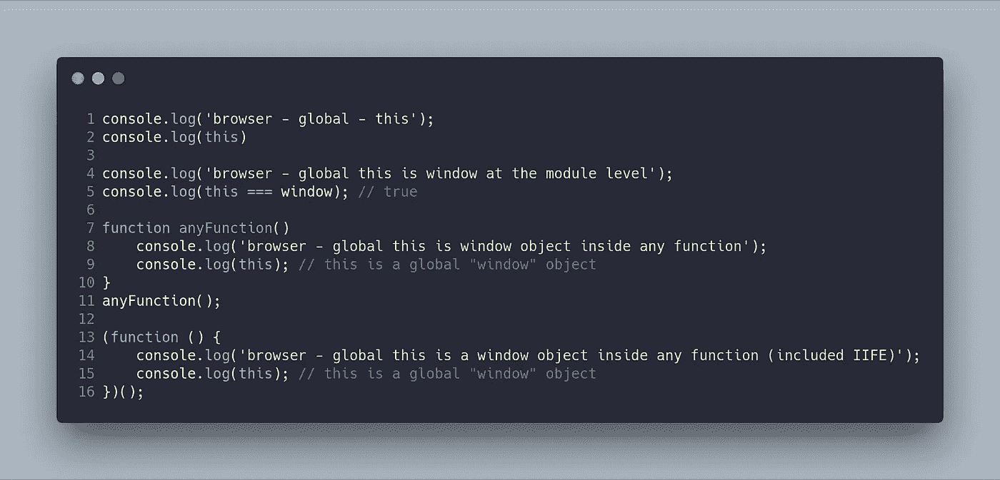

以下代码在 Node.js 环境中运行:

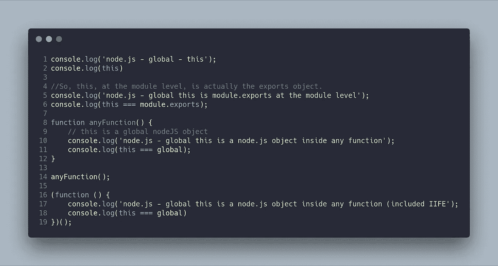

# 2.“这”指的是新的实例

当使用`new`关键字调用一个函数时，该函数被称为构造函数，并返回一个新的实例。

在这种情况下，`this`的值指的是一个新创建的实例。

`new`关键字执行以下四项任务:

1.  它创建新的空对象，例如`obj = { }`。
2.  它将新的空对象的不可见的`prototype`属性设置为构造函数的可见且可访问的`prototype`属性。(每个函数都有一个可见的`prototype`属性，而每个对象都包含不可见的`prototype`属性)
3.  它将使用`this`关键字声明的属性或函数绑定到新对象。
4.  它返回一个创建的对象，除非构造函数返回一个非原始值(自定义 JavaScript 对象)。如果一个构造函数不包含 return 语句，那么编译器会在函数的末尾隐式插入`return this;`。如果构造函数返回一个原始值，那么`return this;`将不会被插入。

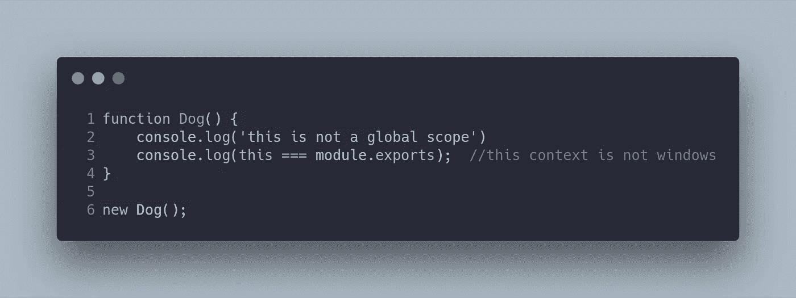

现在我们有了一个新的执行上下文，可以为`Dog`函数定义新的属性。在这种情况下，我们有两个新的爪子巡逻犬:大菱鲆和粗石族。

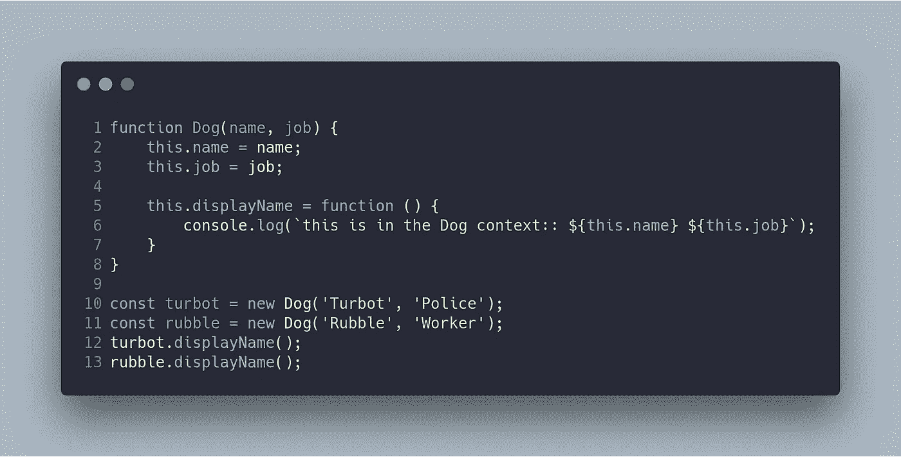

你可能知道，JavaScript 的最大优点是你可以使用每个函数的原型。(我建议您阅读一下 prototype pattern，这种模式在其他面向对象语言中使用，因为它们不是本地的)。

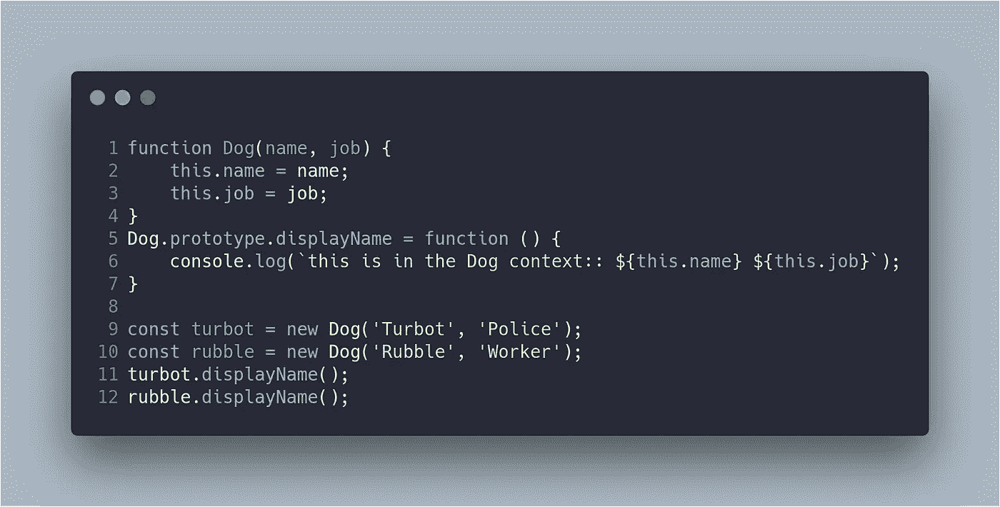

# 3.“这”是指调用程序对象(父对象)

在 JavaScript 中，对象的属性可以是函数或简单的值。

当一个对象的方法被调用时，那么`this`指的是包含被调用方法的对象。

在下面的例子中，您可以看到关于`this`值如何不同，这取决于执行上下文:

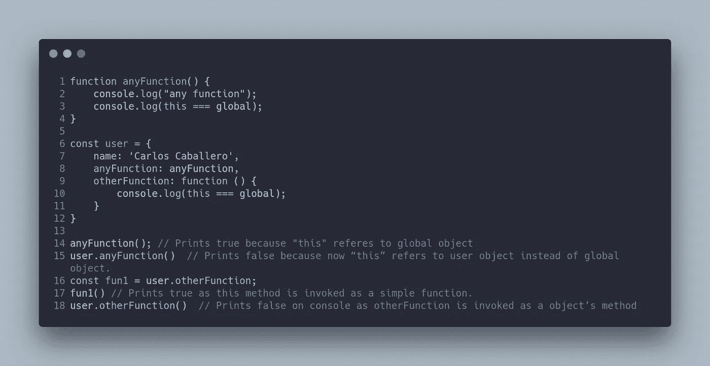

# 4.“This”带有调用或应用方法

JavaScript 中的函数也是一种特殊类型的对象。

每个函数都有`call`、`bind`和`apply`方法。这些方法可用于将`this`的自定义值设置为函数的执行上下文。

在下面的代码中，您可以看到如何使用`call`方法来更改执行上下文。

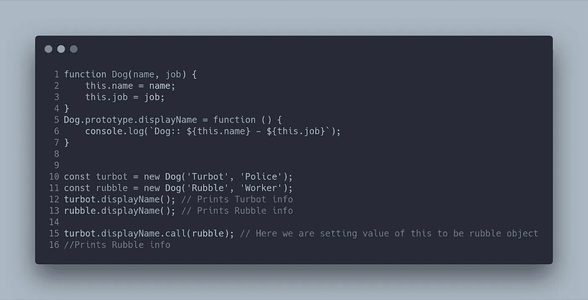

# 5.“This”与 Bind 方法

`bind`方法返回一个新方法，其中`this`引用传递的第一个参数。

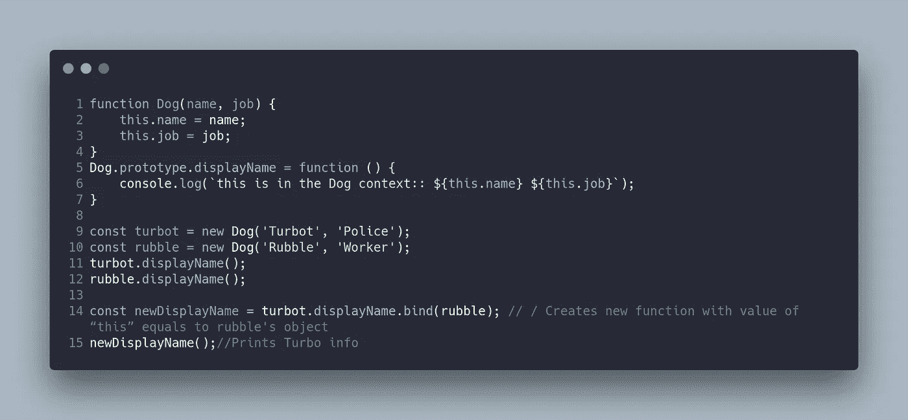

# 6.“这个”有胖箭头功能

作为 ES6 的一部分，有一种定义函数的新方法:使用`fat arrow` ( `=>`)。

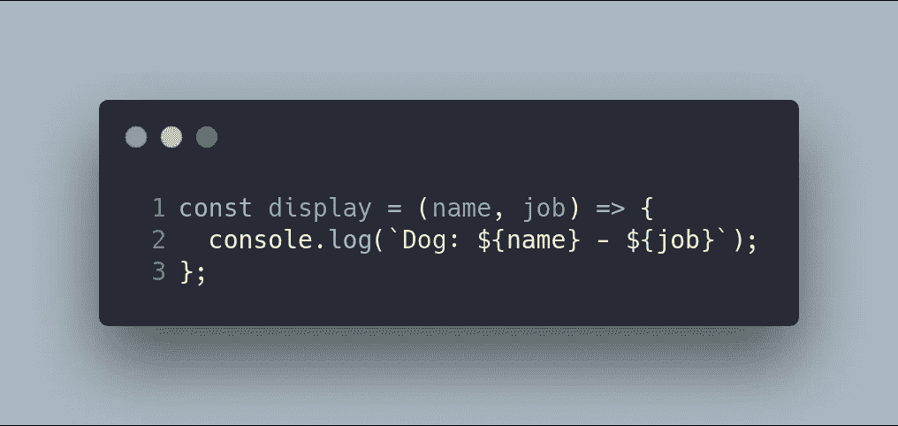

当使用粗箭头时，它不会为`this`创造新的值。

`this`在函数外一直引用它所引用的同一个对象。没有新的执行上下文。

下面的代码显示了这个的值。参见函数`growUp`，它的执行上下文中没有`age`属性。

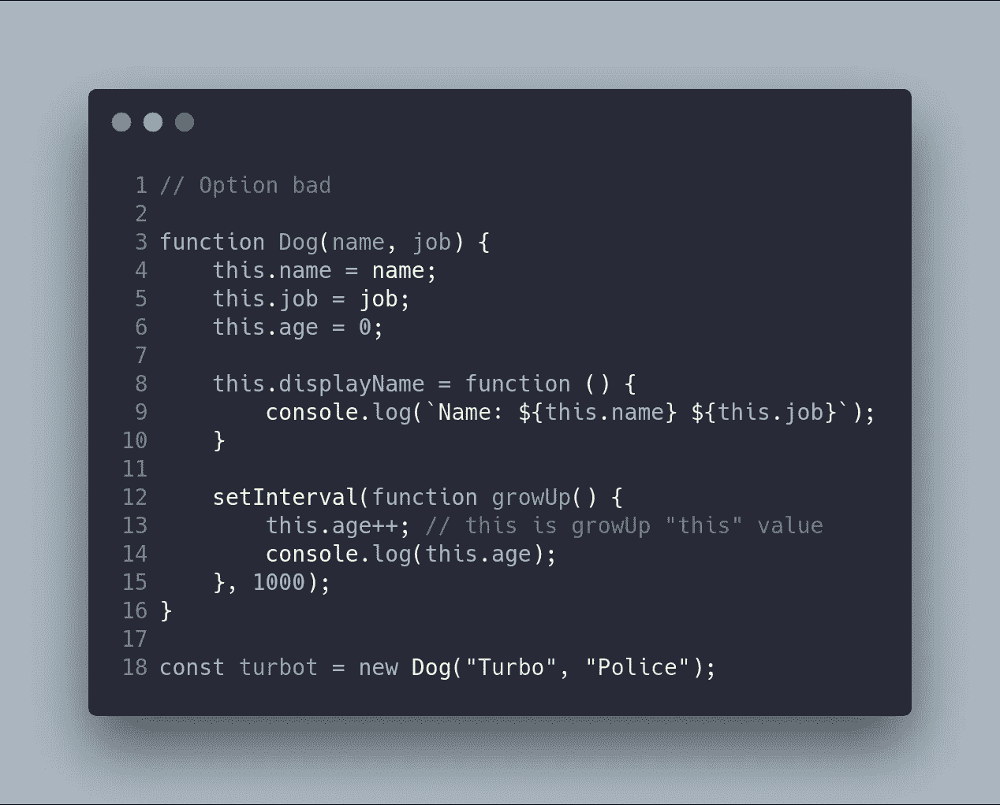

在这种情况下，解决方案是不创建新的执行上下文。因此，我们可以使用粗箭头。

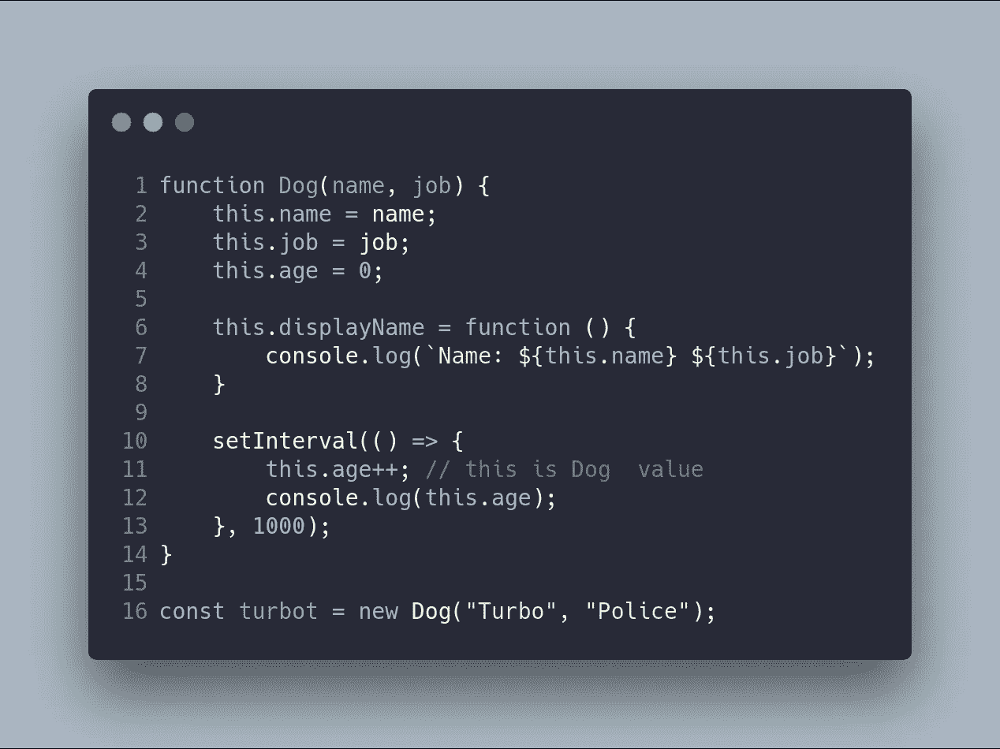

# 7.“This”具有胖箭头功能和应用-调用

当您在粗箭头函数上使用`apply`或`call`方法时，`this`不会改变，因为粗箭头不拥有`this`。

因此，`apply`和`call`方法只调用带参数的原方法，而`thisArg`被忽略。

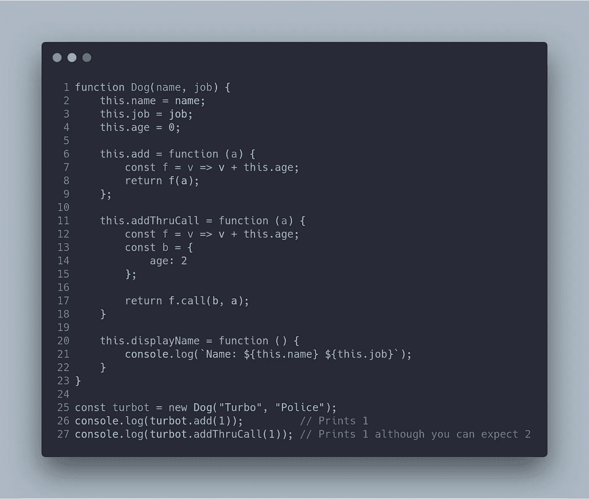

# 8.“This”与类糖语法

当我们使用`class` sugar 语法时，通常会像在任何其他面向对象编程语言中一样使用`this`。

然而，大多数 OOP(面向对象编程)语言不允许在函数中定义函数。

因此，如果我们看一下下面的代码，有一个方法`displayName`。它包括一个名为`innerDisplay`的方法，该方法使用关键字`this`。

如果我们在这个上下文中执行`innerDisplay`函数，我们将创建一个新的执行上下文，因此`this`值将不属于`Dog`类。

然而，为了解决这个问题，我们可以使用本博客中解释的任何技巧。在这种情况下，我们将使用`apply`函数将`innerDisplay`函数的上下文更改为`Dog`的上下文。

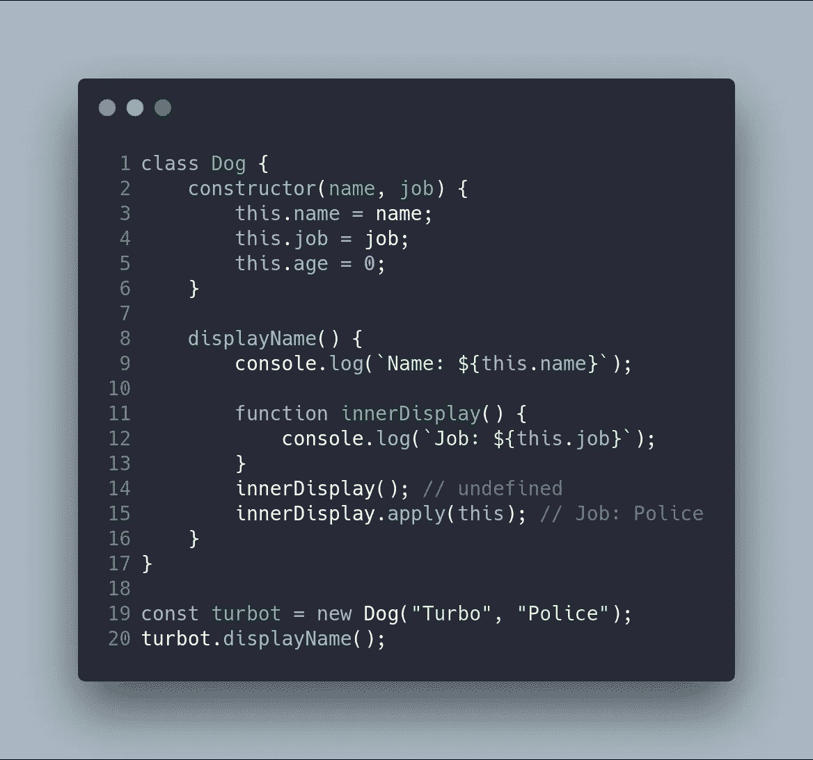

# 资源

[https://www . tutorialsteacher . com/JavaScript/new-keyword-in-JavaScript](https://www.tutorialsteacher.com/javascript/new-keyword-in-javascript)
[https://medium . com/quick-code/understanding-the-this-keyword-in-JavaScript-CB 76d 4 c 7 C5 e 8](https://medium.com/quick-code/understanding-the-this-keyword-in-javascript-cb76d4c7c5e8)
[https://JavaScript sexy . com/understand-JavaScript-this-with-clarity-and-master-it/](https://javascriptissexy.com/understand-javascripts-this-with-clarity-and-master-it/)
[http://www](http://ryanmorr.com/understanding-scope-and-context-in-javascript/)