# 理解逆变 Java 通配符

> 原文：<https://betterprogramming.pub/understanding-contravariance-the-java-wildcard-149853da1559>

## 探索这个奇妙元素的第二个指南


由 [Nicolas Brulois](https://unsplash.com/@nicod5300?utm_source=unsplash&utm_medium=referral&utm_content=creditCopyText) 在 [Unsplash](https://unsplash.com/s/photos/bucket?utm_source=unsplash&utm_medium=referral&utm_content=creditCopyText) 上拍摄

Contravariance 比较棘手，所以慢慢通读文章吧！不要着急。如果你赶时间，把它加到阅读清单上，以后再回来看。

这是系列文章的续篇。如果你先浏览一下上一篇文章会很有用。你会了解到本文所讨论的事情的历史背景。

正如我们在本系列的 A 部分中了解到的:

*   如果 String 是 Object 的子对象(称之为 base-relation)，那么如何使用 contravariance 建立一个关系，其中`HT<Object>`是`HT<String>`的子对象？其中 HT 是持有者数据类型，如`List`、`Map`等。
*   逆变反转基关系，根据逆变，如果 String 是`Object`的子，那么`HT<Object>` 将是`HT<String>`的子。这意味着可以允许父引用存储子引用。

这不是开箱即用的。我们需要使用 Java 通配符。

我们将使用上一篇文章中类似的例子来了解更多。考虑如下所示的类层次结构:

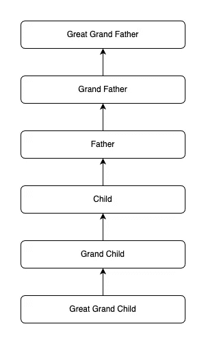

child 的类层次结构

有一个方法接受`List<Child>`作为参数，现在我们想接受一个`List<Father>`、`List<Grandfather>`、`List<GreatGrandFather>`..直到`List<Object>`。但这与我们在协方差中所学的相反。情况描述如下:

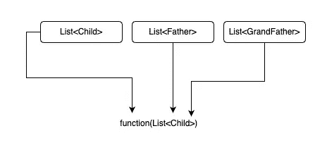

接受类祖先的函数

这是通过如下声明函数来实现的:

```
void accept(List<? super Child> items)
```

一旦完成，该函数将开始接受其自身及其祖先的所有 holder 类型，使其看起来像是`HT<Parent>`是`HT<Child>`的子代。Java 子引用可以分配给父引用，反之亦然。你打出了你的通配符！所以这个名字。请参见下面的代码片段:

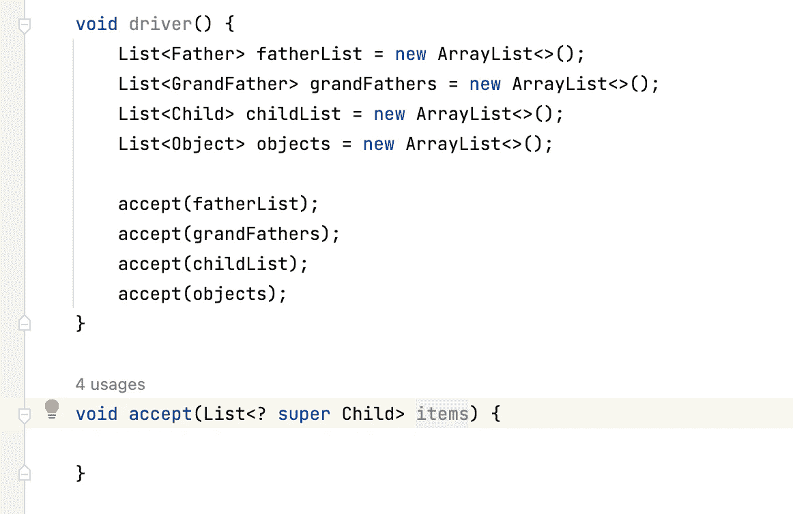

使用逆变将超类分配给子类引用

现在，让我们分析一下`accept()`方法。我们知道这些物品可能包含孩子的任何祖先，包括`Object`。那么，我们能保证从这个逆变列表中读出什么参考吗？不要！我们拥有的唯一保证是我们可以安全地提取对象引用。

# 矛盾的限制

除了`Object`，从逆变持有人客体，我们不允许阅读任何东西。

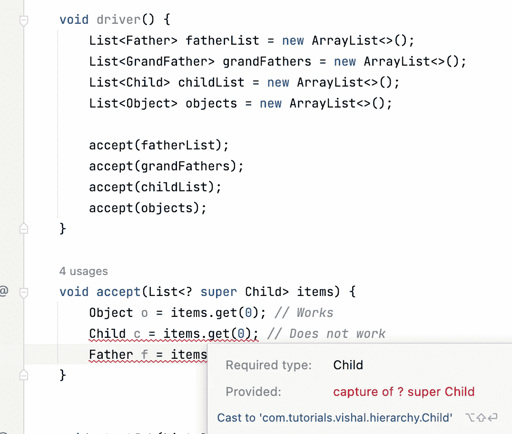

可以有把握地提取仅表示对象引用的样本。

2.第二种表现与我们在上一篇文章的共变列表中看到的相反。我们将能够在“项目”列表中添加一个对象`Child`或`Child`的任何子类，但不能在它上面添加任何东西。为什么？

假设传递给方法的列表是一个`List<Father>`。如果我们允许列表中包含`Child`以上的类，那么开发者可能会无意中污染列表——将`GrandFather`添加到`List<Father>`将是错误的，并可能导致`ClassCastException`。但是，`Child`和`Child`的子类将总是确保列表的一致性。

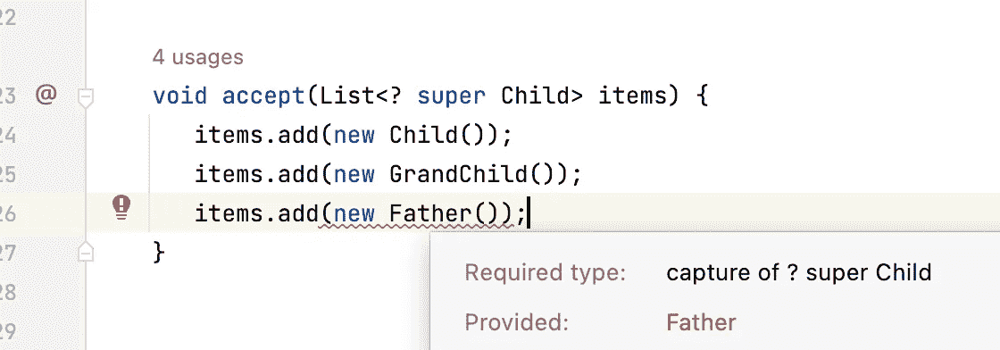

显示逆变列表的示例可以接受子的任何子类，但不能接受它上面的任何子类。

一个问题浮现在脑海中:为什么我们需要这种由方差促成的关系？

假设您编写了一个实用函数，将`List<Child>`的内容复制到另一个函数中。

```
void copy(List<? super Child> dest, List<? extends Child> source)
```

我们知道源将接受任何带有`Child`子类的列表。这很容易理解，因为协方差使得代码更通用，可以为`Child`的多个子类工作。但是`List<? super Child>`有什么帮助呢？

在`dest`中，我们可以通过`List<Father>`、`List<GrandFather>`等。，当您将这些目的地列表传递给`copy()`时，您也会有代码来使用这个列表，对吗？你会意识到列表的使用契约不会因为 contravariance 而中断，并且代码尽可能保持通用。

请参见以下代码:

> Contravariance 允许你的`*copy()*`方法被子超类的 List < >使用，也不会破坏它们的契约，否则你可能不得不为父类、祖父类等编写单独的方法。

## 集合之外的逆变

让我们考虑同一个`Box<T>`的例子:

现在，我们知道了`GrandFather`、`Father`和`Child`之间的关系。使用逆变，我们可以反转包含`GrandFather`、`Father`和`Child`的`Box<>`类的关系。

请注意，每个实例的`Box`实例之间没有现成的关系。

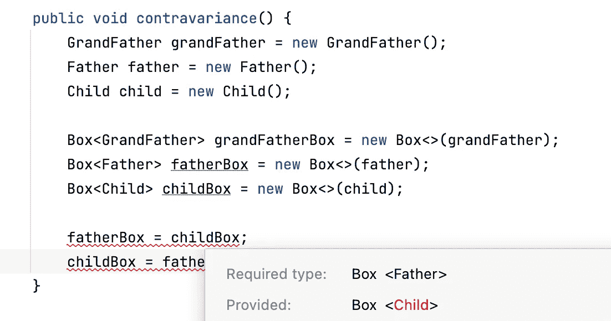

没有关系黑白框实例

但是，在应用逆变之后，我们将能够将`Box<Parent>`分配给`Box<Child>`。

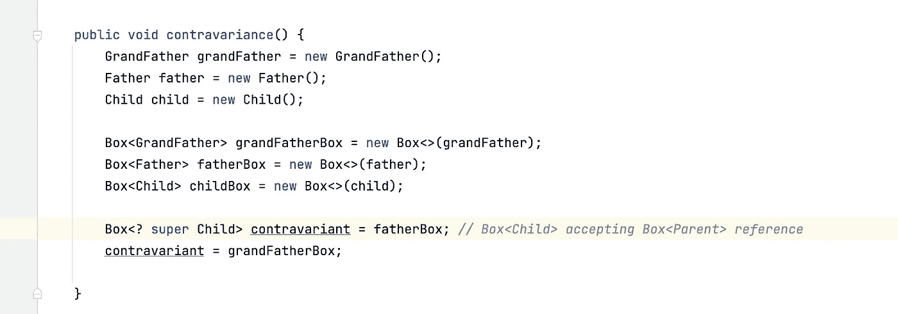

盒类的逆变行为

就像在集合中一样，一旦我们正在访问 Box 的逆变引用，我们将被允许在`setItem()`方法中添加任何 child 的实现，但不能在`Child`之上添加。见下文。`Child`和`Grandchild` 允许，但`Father`不允许。


我们还观察到，从`Box`的逆变参考中，我们无法提取除`Object`以外的任何参考。在集合的情况下也是如此。除了`Object`之外，我们不允许阅读任何东西。

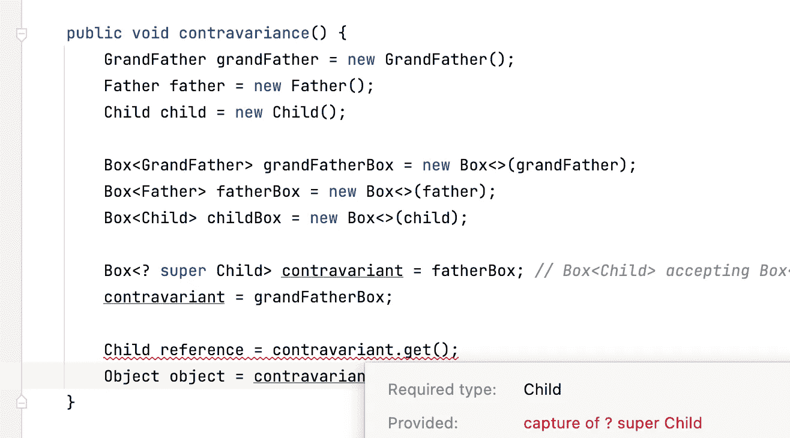

逆变列表只允许读取对象引用

# 我们学到了什么

1.  逆变可用于反转包含对象之间的父子关系。
2.  它可用于使夹具类型只写，并阻止读取除`Object`以外的任何参考值。
3.  逆变列表将允许添加边界类型的任何子元素。例如，`Box<? super Child>`将允许`Child`及其子类型，但不允许层次结构中任何高于`Child`的类型。

# Java 中的逆变与 Kotlin 中的协变

在 Java 中，我们看到使用 super SomeClass>可以获得逆变。但是，这只能在 holder 类之外完成。在上面的`Box`例子中，我们在`Box` 类之外创建的新的`Box`引用被声明为逆变，而不是实际的`Box`类。

这被称为调用点差异。因为差异是在使用地点定义的。因此，它也被称为使用地点差异。

在 Kotlin 中，与我们看到的相反，我们可以通过使用`in`操作符在编写 holder 类本身的时候声明一个类是逆变的。

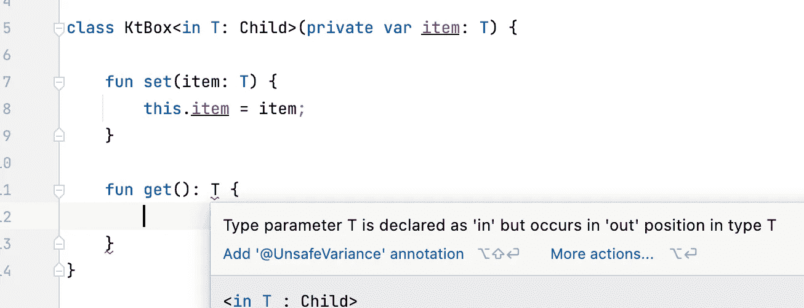

我们看到，当我们编写一个返回结果`T`的方法时，声明一个类`in`开始显示一个错误。换句话说，将`T`声明为`in`将不允许您编写任何接受返回`T`的方法。`T`只能是一个方法的参数，又名，`T`只能在里面。所以这个`in`。

我们在科特林的呼叫站点免费获得以下行为。我们必须在 Java 中为相同的内容创建逆变引用。

1.  我们不允许将任何对象放在层次结构中的`Child`之上。下面的例子展示了在传递`Grandfather`对象的情况下它是如何失败的，并与`Child`和`Grandchild`对象一起工作。

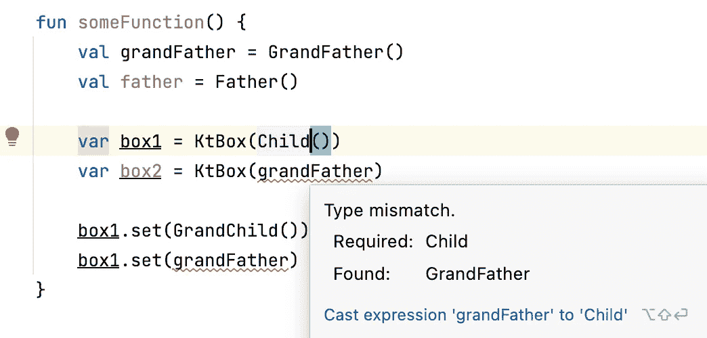

2.`KtBox<Child>`允许存储的引用`KtBox<Parent>`

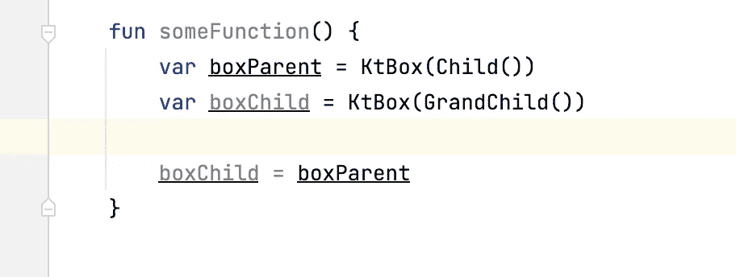

Kotlin 协方差可以在创建 holder 类时定义。因此，它也被称为“申报现场逆变”

## 何时使用逆变的例子，又名`<? super XXXX>`

1.  它与协变 API 相反。如果您想在不想读取任何内容的地方构建拦截器 API，请添加一些项目。例如，一旦用户向您的框架提交工作，您希望在不读取任何内容的情况下向列表中添加几个默认的工作项。

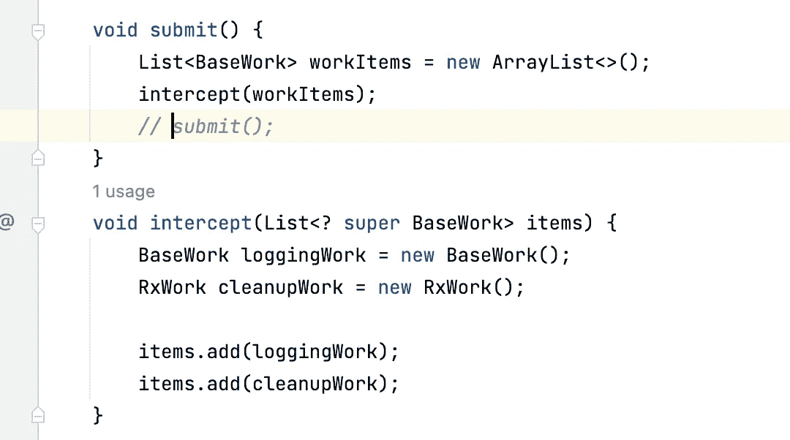

2.对于像`Box<T>`这样的其他容器类型，我们可以使用逆变来禁止从其中读取`T`类型的对象。

# 离别赠言

现在你已经学习了协变和逆变的基本原理，我们可以开始学习如何使用它们来构建高级 API 表面，例如当你需要一种关系时，你应该能够将父引用分配给子引用，反之亦然。