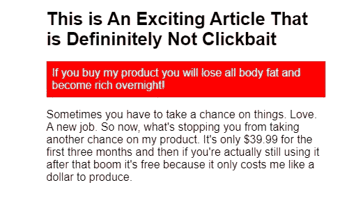
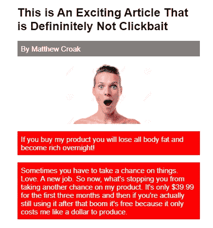
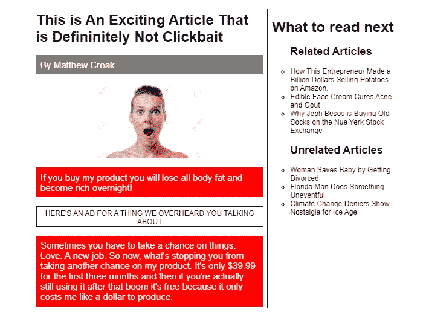
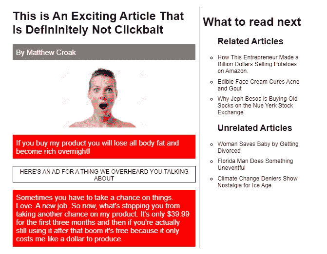

# 理解 CSS 组合子

> 原文：<https://betterprogramming.pub/understanding-css-combinators-a36e013b1bed>

## 如何使用它们，为什么


照片由[émile Perron](https://unsplash.com/@emilep?utm_source=unsplash&utm_medium=referral&utm_content=creditCopyText)在 [Unsplash](https://unsplash.com/s/photos/books-on-code?utm_source=unsplash&utm_medium=referral&utm_content=creditCopyText) 拍摄

样式表通过使用选择器来引用 HTML 中的特定元素。这些选择器可以是类、id、元素本身、[等等](https://www.w3schools.com/cssref/css_selectors.asp)。

在这篇文章中，我们将关注的选择器是[组合器](https://developer.mozilla.org/en-US/docs/Learn/CSS/Building_blocks/Selectors/Combinators)。

> “它们将其他选择器组合在一起，使它们彼此之间以及它们在文档中的位置有一个有用的关系。”— MDN 网络文档

组合子可以通过最大化元素关联来确保你的 CSS 是精确的，而不会淹没你的 HTML。看一下这个例子:

```
<div>
   <div>
      <h1>Team 1</h1>
      <ul>      
         <li>
           <div>
              <h2>Player 1</h2>
              <ul>
                 <li>Average points per game: 20</li>              
              </ul>           
            </div>
         </li>
      </ul>
    </div>
</div>
```

事实上，这个 HTML 结构并不太复杂。但是，如果球队有不止一个球员，或者有不止一个球队——如果你想增加每个球员的统计数据呢？类和 id 可以工作，但是随着 HTML 的增长，它会限制 CSS 的灵活性。

> 随着网站需求的增长，元素的数量也会增加。**你的元素嵌套得越多，访问它们就越困难。**

当您想要对具有共享类的一个元素(或多个元素)进行小的调整时，这也可能会有问题。这可能会导致您创建更多的类或 id，求助于内联样式，或者使用`!important`。

过度使用类和 id 也会在你的 HTML 中产生更多的表示性标记，给你和其他使用代码的人带来更多的工作。组合子通过有效地关联页面上的元素来减轻过于具体的选择器和繁重的标记带来的压力。让我们深入研究我们可以使用的不同类型的组合子。

# 相邻兄弟姐妹

这个组合符由符号`+`标识，并选择提供的标签旁边的元素。

```
h1 + p
```

上面的例子将选择第一个`p`标签跟随在`h1`标签之后。

假设您有一篇博客文章，并且您只希望引言段落具有红色背景和白色文本，如下所示:



*结果可能有所不同

代码如下:

```
p{
  font-size: 20px;
}h1 + p {
  background-color: red;
  color: white;
  padding: 10px;
}
```

使用相邻的兄弟组合符，我们能够分离出第一个`p`标签并应用我们的样式。如果我们想将上面的样式应用到跟在我们的`h1`标签后面的每个 `p`标签上，会怎么样呢？在这种情况下，我们可以使用*通用兄弟* 组合子。

# 普通兄弟姐妹

这个组合子由符号`~`标识。

```
h1 ~ p 
```

上面的代码将选择所有跟在我们的`h1`标签后面的`p`标签。

如果您从上一个示例中取出代码，并将`h1 + p`更改为`h1 ~ p`，您将得到以下结果:


甚至当选择器之间有其他元素(如上面的`img`)时，它也能工作。

*对于相邻的兄弟组合子*，情况并非如此。

仅当元素*直接与第一个标签* 相邻时，相邻兄弟组合符才起作用。但是，我们可以在图像前添加署名(`p`标签)，并给它一个灰色背景:

```
p {
  font-size: 20px;
}h1 ~ p {
  background-color: red;
  color: white;
  padding: 10px;
}h1 + p {
  background-color: grey;
}
```

上面的代码给出了这个结果:



既然我们已经讨论了兄弟姐妹，我们来谈谈孩子。

# 子组合子

第一个子相关的组合子很简单，就是*子组合子*。这个由符号`>`标识的组合子只选择一个元素的直接子元素。

让我们在文章右边的博客页面上添加一个侧边栏，并将它们封装在父页面`div`中。侧边栏将包含接下来要读的内容的`ul`。它将有两个`li`用于相关和不相关的内容。每一个都包含一个代表文章的`li`的`ul`。第一个`ul`应该有一个左边界来把它和主文章分开，并且没有列表样式。嵌套的`ul`不应有边框和默认列表样式。我们可以通过下面的代码实现这一点:

```
div > ul {
  border-left: solid 1px black;
  margin-left: 10px;
  padding-left: 10px;
  list-style: none;
  width:300px;
}
```

通过使用子组合子，我们只选择父标签`div`的直接子标签`ul`(我们的新侧边栏)。这将对包含子`ul`但不包含子`ul`本身的`ul`标签应用左边框和无列表样式。让我们给我们的父节点`div`一个`flex`的显示，这样我们的文章和侧边栏就水平对齐了。这是结果:



*文章不真实

如你所见，只有直接子`ul`有左边框，没有列表样式。嵌套的`ul`没有边框和默认列表样式。那些标签看起来有点压扁了。我们如何让两个`ul`中的每个`li`标签都有一个`10px`的下边距？我们可以用最后一个组合子*后代组合子*来做这件事。

# **后代组合器**

这些组合子由选择器之间的空格来标识，不像子组合子，它们不仅指导子，而且指导选择器的每个后代。

```
ul li {
  margin-bottom: 10px;
}
```

上面的 CSS 将在每个`li`标签下创建一个`10px`的边距，如下所示:



现在，假设我们想要给所有的文章标题加下划线，而不是部分标题(由*相关文章*和*不相关文章*标识的`li`)。让我们添加下面的 CSS，使用一个稍微指定的后代组合符*。*

```
ul li ul li {
  text-decoration: underline;
}
```

结果如下所示。


你可能已经注意到了放在介绍性段落下面的广告。这个广告展示了我们如何*结合组合子*来进一步定位元素。

```
div div > div > p + p {
  color: purple;
  font-size: 15px;
}
```

这组选择器的目标是任何与作为`div`子标签的`p`标签相邻的`p`标签。通过检索包含我们的文章和侧边栏的`div`的子节点`div`来定位`div`。

还和我在一起吗？

我们使用*后代*、*子*和*相邻兄弟*组合子来选择 ad `div`中的第二个`p`标签，因此我们可以应用不同的样式。

组合子有助于保持我们的 HTML 灵活和相对干净。本帖所有代码都可以在这个 [codepen](https://codepen.io/macro6461/pen/yLLaWBv) 中找到。随意摆弄组合子，看看在不使用*任何*类或 id 的情况下，你能把样式推进多远。

[*在此将您的免费媒体会员升级为付费会员*](https://matt-croak.medium.com/membership) *，每月只需 5 美元，您就可以收到来自各种出版物上数千名作家的无限量无广告故事。这是一个附属链接，你的会员资格的一部分帮助我为我创造的内容获得奖励。谢谢大家！*

# 参考

[](https://www.w3schools.com/cssref/css_selectors.asp) [## CSS 选择器参考

### 组织良好，易于理解的网站建设教程，有很多如何使用 HTML，CSS，JavaScript 的例子…

www.w3schools.com](https://www.w3schools.com/cssref/css_selectors.asp) [](https://developer.mozilla.org/en-US/docs/Learn/CSS/Building_blocks/Selectors/Combinators) [## 组合子

### 我们要看的最后一个选择器叫做组合子，因为它们以一种方式组合其他选择器，给出…

developer.mozilla.org](https://developer.mozilla.org/en-US/docs/Learn/CSS/Building_blocks/Selectors/Combinators) [](https://www.docsity.com/en/answers/what-does-the-presentational-markup-of-an-html-describe/108420/) [## HTML 的表示标记描述了什么？- Docsity

### “谈论和阐述我个人的主张，但是，从结构上协助一个好的报告…

www.docsity.com](https://www.docsity.com/en/answers/what-does-the-presentational-markup-of-an-html-describe/108420/)