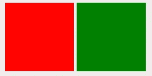
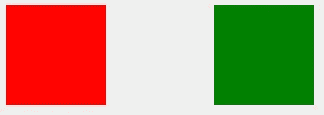
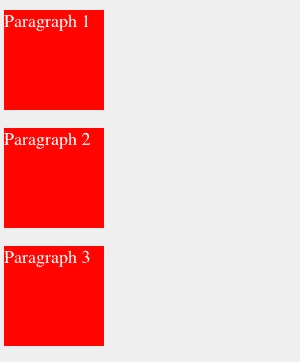
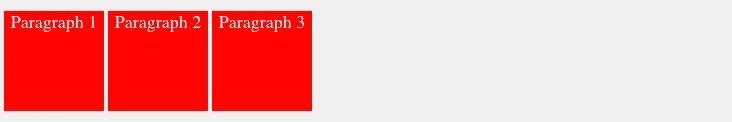

# 理解 CSS 显示:无、块、内联和内联块

> 原文：<https://betterprogramming.pub/understanding-css-display-none-block-inline-and-inline-block-63f6510df93>

## 解释“显示:无”和“可见性:隐藏”之间的区别，了解显示:块、内嵌和内嵌块


照片由 [Alexandru Acea](https://unsplash.com/@alexacea?utm_source=medium&utm_medium=referral) 在 [Unsplash](https://unsplash.com?utm_source=medium&utm_medium=referral) 上拍摄

属性是 CSS 开发中最常用的特性之一。我们的 web 页面将每个 HTML 元素视为一个框，利用`display`属性，我们决定如何显示这些框，或者是显示还是隐藏它们。

> 属性指定了一个元素的显示行为(呈现框的类型)。— [W3](https://www.w3schools.com/cssref/pr_class_display.asp)

`display`属性有多种值。在这篇文章中，我将涉及以下几个部分:

*   `display: none`对`visibility: hidden`
*   `display: block`
*   `display: inline`
*   `display: inline-block`

# 显示:无与可见性:隐藏

我们可以通过声明一个`display: none`值来隐藏元素。另一种方式是声明`visibility: hidden`而不是`display: none`，但两者是有区别的。

为了显示区别，让我们隐藏下面的一个框:

首先我用`display: none`隐藏蓝色的盒子(`#box-2`

```
#box-2 {
  **display: none;** width: 100px;
  height: 100px;
  background: blue;}
```



**显示:无**从视图中删除一个元素

我们的蓝盒子现在从视图中移除了。它实际上仍然存在于 HTML 结构中，但是有了`display: none`，一个元素的行为就像它被完全删除了一样**。结果，绿色方框占据了空的位置，并自动向左移动。**

然而，`visibility: hidden`并没有完全删除一个元素。它只是使元素不可见:

```
#box-2 {
  width: 100px;
  height: 100px;
  background: blue;
  **visibility: hidden;** }
```



蓝色盒子现在看不见了，但它还在

# 块与内联

你有没有注意到一些 HTML 标签像`<div>`、`<p>`、`<ul>`、**、**占据了整个空间，并且每个标签都以新的一行开始，而其他的 HTML 标签像`<span>`、``或`<a>`不需要新的一行，并且可以并排放置？

这是因为不同的`display`行为:*阻塞*或*内联* **。让我们用一个简短的例子来看看不同之处。没有任何 CSS，我创建了一个带有`<p>`和`<span>`标签的 HTML 模板:**

```
<body>
  <p>I'm a paragraph</p>
  <p>I'm a paragraph too</p>
  <span>I'm a word</span>
  <span>I'm a word too.</span>
</body>
```


默认**显示**的**行为<p>和<跨度>**

你能看出区别吗？即使有足够的空间，每个`<p>`标签也从新行开始。`Span`不过，并排显示。

> 每个 HTML 元素都有一个默认的显示值。— [W3](https://www.w3schools.com/css/css_display_visibility.asp)

默认情况下，HTML 元素具有块或内联的显示行为。每个都以新行开始的元素(本例中为`<p>`标签)称为*块级*元素，其他可以并排放置的(`<span>`)称为*内联*元素。

块元素和行内元素之间有一些不同的特征:

## **块级元素**

*   默认情况下采用全角(100%宽度)
*   每个都显示在一个新行中
*   可以设置宽度和高度属性
*   可以包含其他块或行内元素

由于`<p>`标签是块级元素，可以设置宽度&高度属性:

```
p {
  **height**: 100px;
  **width**: 100px;
  background: red;
  color: white;
}
```

如果这里没有声明宽度，那么`<p>`的默认宽度将是 100%。然而，我声明了 100 像素的宽度，下一个`<p>`元素*仍然*从新行开始:



**块级**元素总是需要一个**新行**

## 内嵌元素

*   只占用他们需要的空间
*   并排显示
*   不接受宽度或高度属性，以及上下边距
*   可以是其他行内元素的父元素

我们可以改变元素的显示行为。所以让我们将`<p>`标签的显示行为改为`inline`:

```
p {
  height: 100px;
  width: 100px;
  background: red;
  color: white;
  **display: inline;**
}
```

由于我们的`<p>`标签现在是一个内嵌元素，它们将被并排放置，宽度&高度属性不再有效:


标记为**内联**元素

查看作为块&内联元素的 HTML 标签的完整列表。

# 显示:内嵌块

在某些情况下，两种显示值可能都不足以实现更好的网页设计。此时，第三种显示行为就来了，也使对齐变得更加容易:`display: inline-block`。

从它的名字我们可以理解，`display: inline-block`声明同时显示了内联和块级元素的特点。

换句话说，我们可以想到一个内嵌元素，可以设置 width & height 属性，或者我们可以想到一个块级元素，不必从新行开始。

为了清楚地理解，我给我们的`<p>`标签一个内嵌块行为:

```
p {
  **display: inline-block;**
  height: 100px;
  width: 100px;
  background: red;
  color: white;
}
```

现在它们可以并排放置，并且还可以设置宽度和高度属性:



作为**内嵌块**元素的

标签的结果

你也可以看我下面关于CSS 显示属性的视频:

我希望现在您对显示属性的这些值有了更好的理解。如果你有兴趣学习更多关于编程的知识，可以考虑订阅[我的简讯](https://bit.ly/2KXEBsv)。

也请查看我下面的相关新帖子:

[](https://medium.com/dev-genius/css-display-flex-vs-block-inline-and-inline-block-explained-5fa588a3a960) [## CSS 显示:FLEX vs Block、Inline 和 Inline-Block 解释

### display 属性用于在我们的布局中显示、隐藏或定位 HTML 元素。每个 HTML 元素…

medium.com](https://medium.com/dev-genius/css-display-flex-vs-block-inline-and-inline-block-explained-5fa588a3a960) 

喜欢这篇文章吗？Medium 是一个很棒的平台，可以承载成千上万篇很棒的文章，却不显示任何广告。由于 Medium 是无广告的，热爱这个平台的读者可以通过成为会员来支持它。

你可以成为这里的媒体会员，并无限制地访问媒体上的每一个故事。如果你使用上面的链接，它也会支持我成为一个作家，因为我会从 Medium 赚一点佣金。谢谢:)