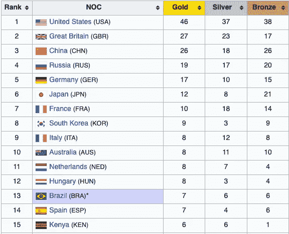
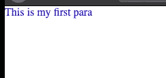

# 理解 CSS 特异性

> 原文：<https://betterprogramming.pub/understanding-css-specificity-d247add91810>

## 尽早获得基础知识，以便您的项目风格可以扩展

2016 年夏季奥运会奖牌榜。来源:维基百科

CSS 特异性是一个有趣的话题。随着项目越来越大，CSS 文件中 CSS 规则的数量也越来越多——事情开始以一种不期望的方式运行。这导致我们很多人对不同的元素使用`!important`条件。

为了理解特异性，让我们修改一些基础知识，我将添加一些我自己的术语。

# 不同的选择器

有三组不同选择器。

1.  #id 选择器
2.  的。类选择器、属性选择器(a[target="_blank"])和伪类选择器(button:hover)。
3.  元素(nav)和伪元素(p::first-line)。

为了简单易懂，我将第一组称为黄金组，第二组称为白银组，第三组称为青铜组。

## 理解特异性

这将是一个实践教程，我们将从下面的基本 HTML 文件开始。

我们添加了一个通用规则，使用*选择器删除任何特定于浏览器的默认填充或边距。*选择器会覆盖任何浏览器默认值。

我们开始吧。

下面的 CSS 会做什么？

它将使`p`标签的字体颜色显示为蓝色——因为在 CSS 中，位于 CSS 文件下方的规则优先于位于其上方的规则。

这个段落是蓝色的

下面的 CSS 会做什么？

我们有两条规则。

1.  `div p`规则包含两个标签。由于标签属于青铜组，我们可以说这个规则有两个青铜选择器(类似于奥运会奖牌的选择器)。
2.  `p` 规则只包含一个标记——一个青铜选择器。

在这个特定的顺序中，评选者得分最高的规则(金、银、铜)优先——就像奥运会中的国家排行榜一样。简而言之，这就是 CSS 特异性。

## 更多示例

下面的 CSS 会做什么？

让我们数一数规则的选择器。

1.  `.main p`是一个属于白银组的类选择器和一个属于青铜组的标签选择器。因此，我们有一枚银牌和一枚铜牌。
2.  `div p`是两个青铜选择器。

颜色会是绿色的。

一银一铜比零金、零银、 *n* 铜选拔更重要。 *n* 的数量有多大并不重要。

让我们再看一个例子。

我们有三条规则。

1.  一个黄金选择器
2.  一枚银牌和一枚铜牌
3.  两个青铜选择器

答案很简单:颜色是黑色的。

它的工作原理与奥运会上包含不同国家的排行榜一模一样。一旦你知道了个人奖牌榜，你就能算出来。

# 结论

只要数一数一个类别中选择器的数量，你就会知道哪个规则优先于哪个规则。如果计数相同，CSS 文件中位于下面的规则将优先。