# 理解机器学习中的决策树

> 原文：<https://betterprogramming.pub/understanding-decision-trees-in-machine-learning-86d750e0a38f>

## 决策树背后的数学以及如何使用 Python 和 sklearn 实现它们


照片由[托德·夸肯布什](https://unsplash.com/@toddquackenbush?utm_source=unsplash&utm_medium=referral&utm_content=creditCopyText)在 [Unsplash](https://unsplash.com/?utm_source=unsplash&utm_medium=referral&utm_content=creditCopyText) 拍摄

# 决策树

决策树是一种监督机器学习，主要用于分类问题。

决策树基本上是贪婪的、自顶向下的、递归的划分。“贪婪”是因为在每一步我们都尽可能选择最好的分割。“自顶向下”是因为我们从包含所有记录的根节点开始，然后将进行分区。

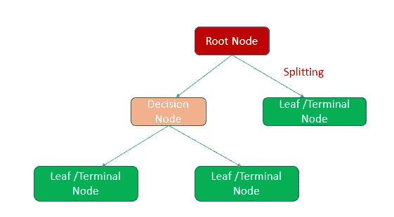

作者图片

**根节点**→决策树中最顶端的节点称为*根节点*。
**决策节点** →分裂成更多子节点的子节点称为*决策节点*。
**叶/终端节点**→不分裂的节点称为*叶节点* / *终端节点*。

# 数据集

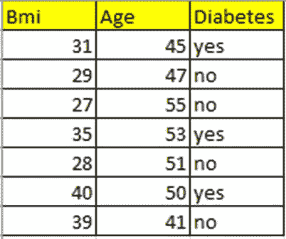

作者图片

我采用了一个小型数据集，其中包含身体质量指数和年龄特征以及目标变量糖尿病。

让我们预测一个给定年龄和身体质量指数的人是否会有糖尿病。

# 数据集表示

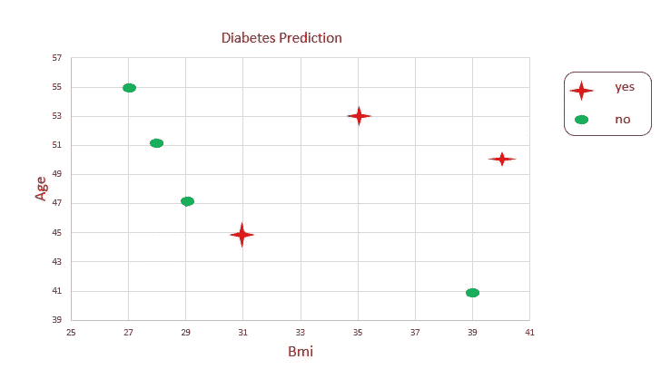

作者图片

我们不能画一条线来得到一个决策边界。我们一次又一次地拆分数据，以获得决策边界。这就是决策树算法的工作原理。

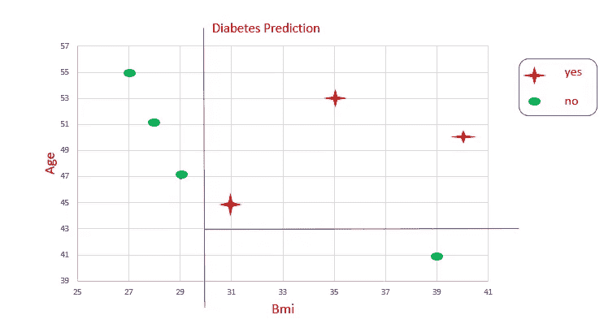

作者图片

这就是决策树中划分的方式。

# 决策树理论中的重要术语

## 熵

熵是随机性或不确定性的度量。熵水平的范围在 `o`和 `1`之间。如果熵为 0，说明这是一个纯子集(没有随机性)。如果熵为 1，说明随机性高。熵用 **H(S)** 表示。

## 公式

**熵**=-(P(0)* log(P(0))+P(1)* log(P(1)))

P(0) →概率`class 0`

P(1) →概率`class 1`

# 熵与概率的关系

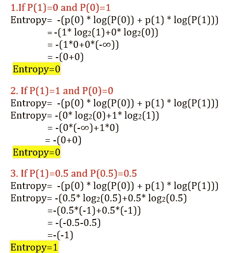

作者图片

如果熵为 0，意味着这是一个纯子集(无随机性)(要么全是，要么全否)。如果熵为 1，则意味着随机性高

让我们画一个图 P(1)-类 1 的概率对熵。

从上面的解释我们知道，如果 P(1)为 0，熵=0
如果 P(1)为 1，熵=0
如果 P(1)为 0.5，熵=1

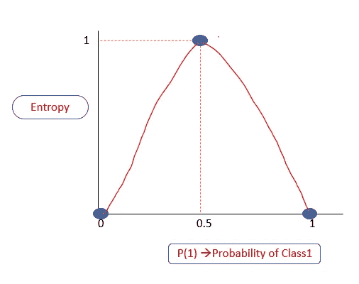

作者图片

熵级别始终介于 0 和 1 之间。

# 信息增益

通过从原始熵中减去每个分支的加权熵来计算分裂的信息增益。我们将使用它来决定决策树节点中属性的排序。

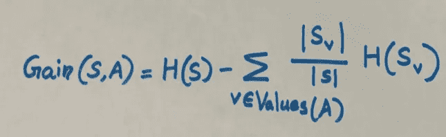

作者图片

H(S) →熵
A→属性
S→示例集{ x }
V→A 的可能值
Sv→子集

# 决策树是如何工作的？

在我们的数据集中，我们有两个属性，身体质量指数和年龄。我们的样本数据集有七条记录。

让我们开始用这个数据集构建一个决策树。

## 第一步。根节点

在决策树中，我们从根节点开始。让我们把所有的记录(我们给定的数据集中有 7 条)作为我们的训练样本。


作者图片

它有三个*是*和四个*否*。
0 类的概率是 4/7。七条记录中有四条属于 0 类
**P(0)= 4/7**
1 类的概率是 3/7。七个记录中有三个属于类别 1。
**P(1)=3/7**

**计算根节点的熵**

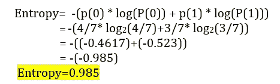

作者图片

## 第二步。分裂是如何发生的？

我们有两个属性身体质量指数和年龄。基于这些属性，分裂是如何发生的？我们如何检查拆分的有效性？

1.  如果我们选择属性身体质量指数作为分裂变量，并且≤30 作为分裂点，我们得到一个纯子集。

[在数据集中的每个数据点考虑分裂点。因此，如果数据点是唯一的，那么 n 个数据点将有 n-1 个分裂点。因此，根据分裂变量和分裂点，我们得到高信息增益，分裂被选中。如果是一个大型数据集，通常只考虑值分布的某些百分点(10%、20%、30%)处的分割点，因为这是一个小型数据集，通过查看数据点，我选择≤30 作为分割点。]


作者图片

纯子集的熵=0。

让我们计算另一个子集的熵。这里我们得到三个*是*和一个*否*。
P(0)=1/4【四个记录中的一个】
P(1)=3/4【四个记录中的三个】

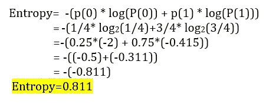

作者图片

我们必须计算信息增益来决定选择哪个属性进行分裂。

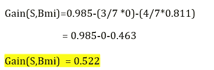

作者图片

2.让我们选择属性年龄作为分裂变量，选择≤45 作为分裂点。

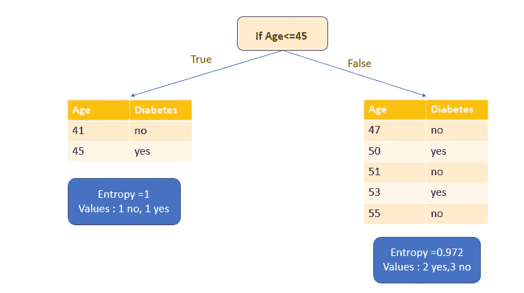

作者图片

首先，我们来计算真子集的熵。它有一个*是*和一个*否*。这意味着高度的不确定性。熵是 1。

让我们计算伪子集的熵。它有两个*是*和三个*否*。

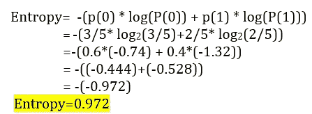

作者图片

让我们计算一下信息增益。

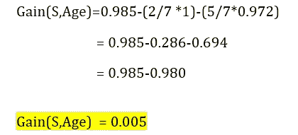

作者图片

我们必须选择具有高信息增益的属性。在我们的例子中，只有身体质量指数属性具有高信息增益。因此选择身体质量指数属性作为分裂变量。

通过属性身体质量指数分割后，我们得到一个纯子集(叶节点)和一个不纯子集。让我们根据属性年龄再次分割这个不纯的子集。然后我们有两个纯子集(叶节点)。

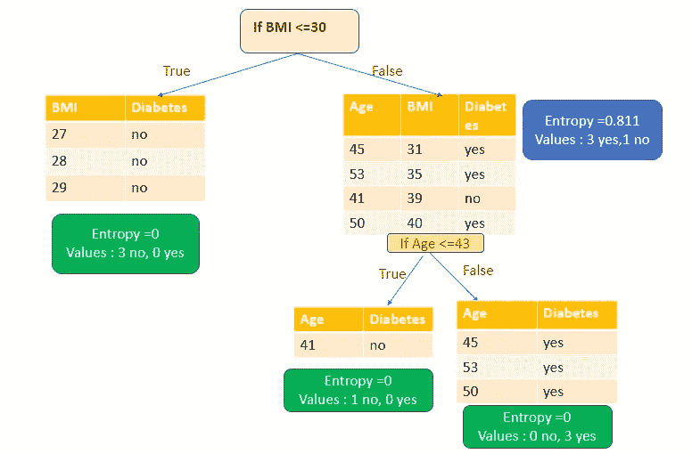

作者图片

现在我们已经创建了一个包含纯子集的决策树。

# 使用 sklearn 的决策树的 Python 实现

1.  导入库。

```
**import** numpy **as** np
**import** pandas **as** pd
**import** matplotlib.pyplot **as** plt
**import** seaborn **as** sns
```

2.加载数据。

```
df=pd.read_csv(**"Diabetes1.csv"**)
df.head()
```

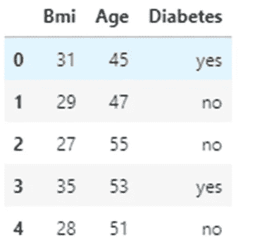

**3。分割 x 和 y 变量。**

身体质量指数和年龄属性作为 *x* 变量。
糖尿病属性(目标变量)作为 *y* 变量。

```
x=df.iloc[:,:2]
y=df.iloc[:,2:]x.head(3)
```

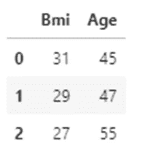

```
y.head(3)
```

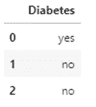

**4。用 sklearn 建立模型**

```
**from** sklearn **import** tree
model=tree.DecisionTreeClassifier(criterion=**"entropy"**)
model.fit(x,y)
```

输出:`DecisionTreeClassifier`(判据=“熵”)

**5。模型分数**

```
model.score(x,y)
```

输出:1.0

(由于我们取了一个非常小的数据集，所以分数是 1。)

**6。模型预测**

让我们预测一个 47 岁的人，身体质量指数 29 岁，是否会有糖尿病。数据集中有相同的数据。

```
model.predict([[29,47]])
```

输出:`array([‘no’], dtype=object)`

预测为*否*，与数据集中相同。

让我们预测一个 47 岁的人，身体质量指数 45 岁，是否会有糖尿病。该数据不在数据集中。

```
model.predict([[45,47]])
```

输出:`array([‘yes’], dtype=object)`

预测为*是*。

7.将模型可视化

```
tree.plot_tree(model)
```

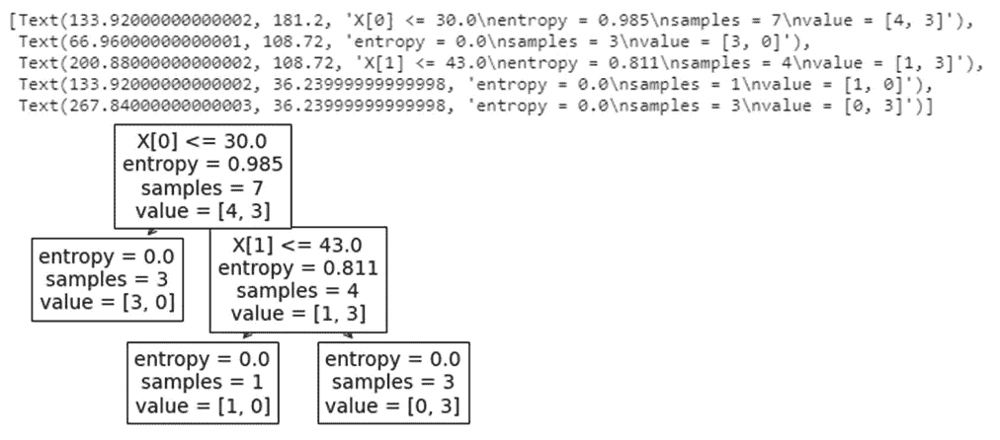

# GitHub 链接

本文使用的代码和数据集可以在我的 [GitHub 链接](https://github.com/IndhumathyChelliah/DecisionTree)中获得。

# 我关于机器学习的其他博客

[](https://towardsdatascience.com/line-of-best-fit-in-linear-regression-13658266fbc8) [## 线性回归中的最佳拟合线

### 相关系数、决定系数、模型系数

towardsdatascience.com](https://towardsdatascience.com/line-of-best-fit-in-linear-regression-13658266fbc8) [](https://towardsdatascience.com/logistic-regression-in-python-2f965c355b93) [## Python 中的逻辑回归

### 详细的逻辑回归

towardsdatascience.com](https://towardsdatascience.com/logistic-regression-in-python-2f965c355b93) [](https://towardsdatascience.com/an-introduction-to-support-vector-machine-3f353241303b) [## 支持向量机简介

### 如何在分类问题中使用 SVM？

towardsdatascience.com](https://towardsdatascience.com/an-introduction-to-support-vector-machine-3f353241303b) [](https://towardsdatascience.com/an-introduction-to-k-nearest-neighbours-algorithm-3ddc99883acd) [## K-最近邻算法简介

### 什么是 KNN？

towardsdatascience.com](https://towardsdatascience.com/an-introduction-to-k-nearest-neighbours-algorithm-3ddc99883acd) [](https://pub.towardsai.net/naive-bayes-classifier-in-machine-learning-b0201684607c) [## 机器学习中的朴素贝叶斯分类器

### 使用 sklearn 的数学解释和 python 实现

pub.towardsai.net](https://pub.towardsai.net/naive-bayes-classifier-in-machine-learning-b0201684607c) 

我希望这篇文章对你有所帮助。

*请关注此空间，获取更多关于 Python 和数据科学的文章。如果你喜欢多看我的教程，就关注我的* [***中***](https://medium.com/@IndhumathyChelliah)[***LinkedIn***](https://www.linkedin.com/in/indhumathy-chelliah/)*[***推特***](https://twitter.com/IndhuChelliah) ***。****

****点击此处成为中等会员:****

*【https://indhumathychelliah.medium.com/membership】T5[T6](https://indhumathychelliah.medium.com/membership)*