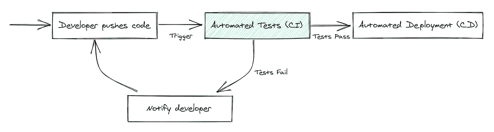
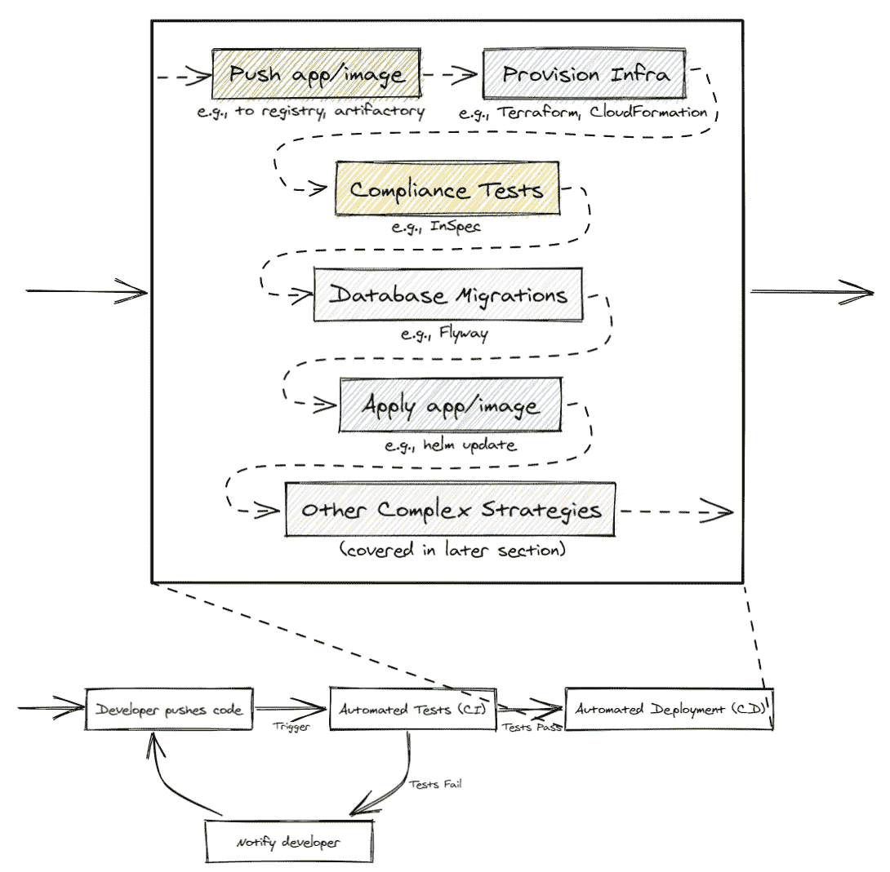
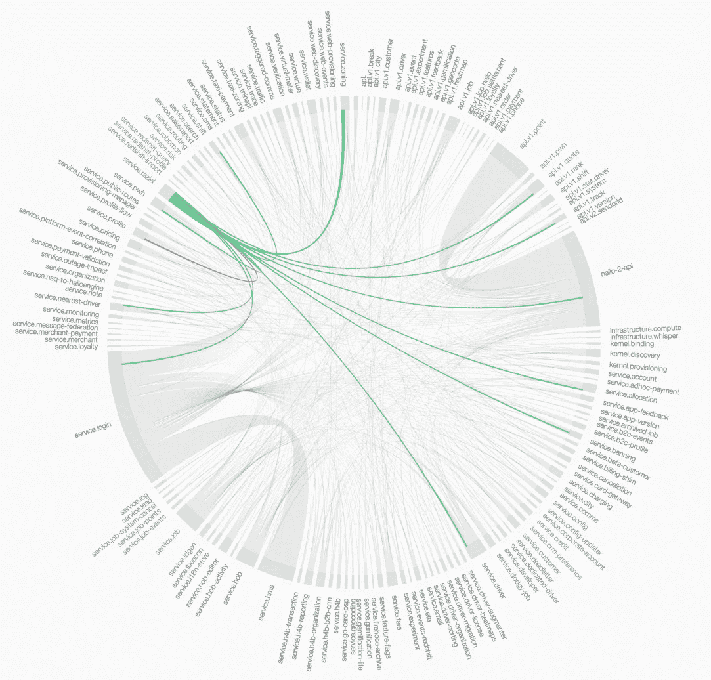
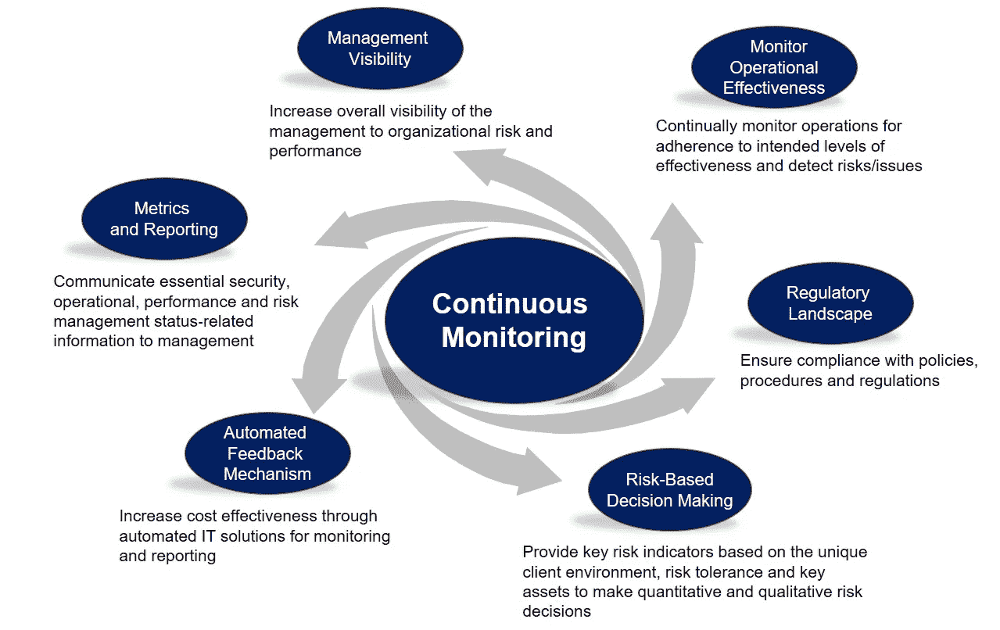
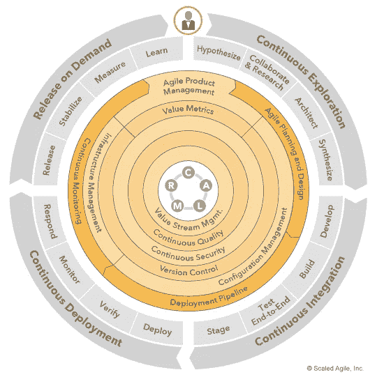

# 了解 2021 年的 DevOps

> 原文：<https://betterprogramming.pub/understanding-devops-in-2021-f3e7e496a257>

## 在过去的十年里，它发生了(很大的)变化

图片由 [ar130408](https://pixabay.com/users/ar130405-423602/) 在 [Pixabay](https://pixabay.com/) 上拍摄。

Patrick Debois 在比利时根特举办了第一届 Devopsdays 会议，距今已有十多年。Gene Kim 的 [*凤凰计划*](https://www.amazon.com/Phoenix-Project-DevOps-Helping-Business-ebook/dp/B078Y98RG8/ref=tmm_kin_swatch_0?_encoding=UTF8&qid=&sr=) 问世至今已经七年有余。

从那以后，工具的数量有了巨大的增长，实践也在不断发展。

DevOps 开始有点简单。Debois 和其他人对瀑布实践感到沮丧，建议改善团队之间的合作，并将精益/敏捷原则引入运营。

从这个单一的起点开始，DevOps 在过去十年中已经发展成为一个完整的行业(拥有多个细分市场)，其中包括敏捷性和速度。

# **DevTestOps 和**持续集成

CI/CD(高度简化)。图片由作者提供。

DevTestOps 是 DevOps 和持续测试的结合，包括在开发过程的早期、经常和整个过程中进行测试——而不仅仅是在最后。

CI/CD 是持续集成和持续部署。作为开发过程的一个重要部分，CI/CD 快速测试新的变更是否有问题，如果没有问题，就尽快部署给客户。

CI 和 CD 是从持续测试和 DevOps 的原则中产生的过程。人们经常把 CI 和 CD 放在一起，但它们是分开的东西。

编写代码并把代码扔给 QA 团队的日子已经一去不复返了——您可以在推送变更后立即运行自动化测试。结果，仍然在测试人员和开发人员之间来回穿梭的组织现在落后了。

公司不再埋头苦干几个月，然后确认并与客户合作。整个过程都是协作的。

即使在测试中，也有很多不同的方法来审查应用程序。我不久前写了一篇关于这个话题的文章:

 [## 所有开发人员都应该知道的 15 种测试方法

### 在软件中，有许多技术概念和定义。当学习新的主题或…

circleci.com](https://circleci.com/blog/testing-methods-all-developers-should-know/) 

人们对此使用的另一个术语是测试“左移”——过程转移得更快，允许对变化和问题有更大的适应性。

行业中的许多工具都致力于创新这一领域。您可以在我写的另一篇提到许多 CI/CD 竞争对手的文章中找到更多信息:

 [## 分析软件行业的趋势

### 声明:观点是我自己的。

medium.com](https://medium.com/static-void-academy/analyzing-trends-in-the-software-industry-73944ac30edd) 

# 持续部署和发布

人们将 CI 和 CD 混为一谈，因为自动化测试的同一个工具也经常处理部署。

毕竟，正如 [Concourse](https://concourse-ci.org/) 所引用的，大多数 CI/CD 工具只是“持续做事的人”。

当然，您的部署可以简单到将文件 SCP 到某个远程机器上。但是随着系统的复杂扩展，部署到所述系统也变得越来越困难。

许多组织在部署代码之前动态地提供基础设施，例如使用 Terraform、CloudFormation 等。他们还对其基础设施进行合规性检查(例如 [InSpec](https://community.chef.io/tools/chef-inspec) )。如果变更涉及修改数据库模式或其他数据，它们也会自动执行数据库迁移(例如 [Flyway](https://flywaydb.org/) )。

一旦部署到生产环境中，他们还可能使用额外的、复杂得多的策略进行测试(将在下一节中介绍)。

因此，“持续部署”管道可能看起来复杂得多:

这只是部署过程中发生的一个例子。

推而广之，这也意味着 CD 与基础架构管理和运营有一些重叠。

# DevSecOps/持续安全性

就像我们更早地转移我们的测试并自动化我们的部署一样，我们也更快地进行安全检查。

毕竟，要发现别人扔在你桌上的大量应用程序中的所有安全缺陷要困难得多。随着时间的推移，这样做更容易、更快、更可靠。

安全左移通常与 CI/CD 齐头并进。除了检查应用程序功能的自动化测试之外，您还拥有检查应用程序安全性的工具和框架。

安全检查通常发生在开发周期的末尾(或者根本不发生)。但是现在，随着系统的每次变化，公司都在主动扫描其应用程序、基础架构和网络。

CI，稍微扩展以显示安全内容。

网络安全的压倒性之处在于，它存在于技术堆栈的每个层面。硬件？[可开发的](https://www.csoonline.com/article/3410046/hardware-and-firmware-vulnerabilities-a-guide-to-the-threats.html)。操作系统？[可开发的](https://en.wikipedia.org/wiki/Privilege_escalation)。网络通信？[可开发的](https://www.cynet.com/network-attacks/network-attacks-and-network-security-threats/)。应用中间件和用户界面？[可开发](https://www.veracode.com/security/application-security-vulnerability-code-flaws-insecure-code)。

甚至你们公司的人都是[可利用的](https://www.imperva.com/learn/application-security/social-engineering-attack/)。因此，尽早发现问题并预防潜在问题对企业来说更好，网络安全培训比以往任何时候都更重要。

我再次详细讨论了这一点，并在我的另一篇文章中提到了各种竞争对手。但是，请记住，即使在另一部分，我也只是触及了安全性的皮毛。

# 生产中的测试/测试轮班-右侧

等等，什么？

没错。这似乎是一个矛盾。但是科技行业已经发展到了我们现在在 CI/CD 测试中遇到限制的地步。

如果你是一家大型科技公司，并且运营着一个庞大的微服务网络，你不可能在部署到生产之前就发现每个问题。

一些问题的出现是因为规模，而测试这些问题需要大量的基础设施成本。

一个微服务依赖地图，昵称为微服务“死星”(来源: [Instana](https://www.instana.com/blog/introducing-dynamic-focus-application-performance-management/) )

想象一下复制和测试的成本。

那么，企业如何绕过这个问题呢？通过生产测试。

他们没有完全摆脱 CI 中的自动化测试。但是 CI 更多的是为了捕捉明显的问题和易得的成果——它是防止部署不可靠或不安全的应用程序的第一道防线。之后的一切都是收集实际数据并在野外进行实验测试。

当然，并不是每个行业都可以进行生产测试。关键任务工作(例如医疗设备、军事、航天等。)不能在部署后冒出现问题或错误的风险。

但是对于我们这些在网络应用或社交媒体应用中折腾的人来说，向一小部分人展示我们的改变(称为 [canarying](https://www.split.io/glossary/canary-deployment/) )并直接从用户那里获得反馈是合理的。

一个因为设备故障而心脏病发作的病人很可怕，但一个不能发布新的鸭脸自拍的社交媒体用户？咩。可以接受。

人们为此采用的一些策略包括:

*   [特征标记](https://launchdarkly.com/blog/what-are-feature-flags/)
*   [自动回滚/持续监控](https://spinnaker.io/guides/user/kubernetes-v2/automated-rollbacks/)
*   [A/B 测试](https://vwo.com/ab-testing-3/)
*   [蓝色/绿色](https://www.redhat.com/en/topics/devops/what-is-blue-green-deployment)
*   [鸭鸣](https://www.split.io/glossary/canary-deployment/)
*   [阴影](https://www.getambassador.io/docs/edge-stack/latest/topics/using/shadowing/)

更多细节可以在本文中找到[。](https://medium.com/static-void-academy/analyzing-trends-in-the-software-industry-73944ac30edd)

# GitOps

最近另一个引人注目的有趣范例是 GitOps，它是由 [Weaveworks](https://www.gitops.tech/) 推出的。

GitOps 本质上是版本控制、作为代码的声明性基础设施和持续部署的结合——无论您的存储库中有什么，都应该被精确地部署到生产中。

通过将基础设施编码到存储库中，您可以获得版本控制的所有优势:跟踪、版本控制、审计和自动化。

来源: [GitOps.tech](https://www.gitops.tech/)

例如，Vercel 可以在 GitHub 上推送你的更改后，立即将你的应用程序部署到它的云上。非常方便快捷。

[CI/CD 领域的另一个竞争对手 ArgoCD](https://argoproj.github.io/argo-cd/) 是针对 Kubernetes 集群的 GitOps。您的存储库包含清单或所需的集群状态。任何更改都会自动触发更新。

因此，对应用程序和基础设施的更改是一起发生的，而不是分开发生的，这样很容易出错。

# 连续监视

连续监控(或 CM)是一种实践，在这种实践中，关于您的应用程序及其周围进程的信息被聚集和使用。

例如，在 Kubernetes 微服务环境中，您的 pod 将与中央控制器一起输出日志。

您可以设置一个配置管理工具(如 Datadog、Splunk 等)。)来聚合这些数据，分析模式，并显示操作员和 sre 的日志。

日志只是其中的一部分。大多数(如果不是全部的话)CM 工具都有插装库，您可以在应用程序代码中直接导入和使用这些插装库，以便将重要的信息或数据发送到数据湖。

来源: [FedRAMP 合规性](https://fedrampcompliance.com/services/continuous-monitoring/)

团队监控他们的 CI/CD。他们还跟踪他们的基础设施变化和活动。因此，从高级网络调用到系统子程序，一切都是我们可以监控和响应的数据。

同样，我会更详细地谈到这一点，并在本文中提到公司。

然而，使这一功能强大的不仅仅是对您系统的可见性。最终，真正给监控带来强大功能的是自动响应收集到的数据的能力，我将在接下来介绍这一点。

# 持续验证

CV 是一个最近才引入的术语。它是所有以前 DevOps 趋势/原则/不管它们是什么的组合。

从代码的概念到超越部署，我们不断地应用自动化和策略来带来端到端的完全可见性、安全性和信心。

到目前为止，即使在实践上面的大多数过程时，仍然有大量的手动步骤:

*   许多公司有他们无法自动化的测试。结果，他们最终部署到多个环境中(例如，“开发”、“试运行”、“UAT”等)。)来手动测试。
*   许多组织通过手动检查来进行部署。操作员或管理员不是在成功测试后直接部署，而是进行额外的尽职调查并给予最终批准。不幸的是，这意味着要么他们无法自动化这些最后的检查，要么他们已经自动化的任何东西都不能确保足够的信心来推动生产。
*   回滚不会自动发生。即使团队使用了持续的监控工具，他们也没有在那些度量上配置任何自动化。因此，如果某样东西在生产中报废了，就要靠团队的反应速度来让它变回绿色。

CM 提供可见性，而 CV 则使用这些数据主动对事物做出反应。因此 ***，*** 我们可以自动化*一切*从工程师将他们的代码成功发布给客户或其回滚。

相应地，对于成功到达客户的新特性，关于应用的所有事情(例如，基础设施、安全性、测试/部署等。)必须是自动的并且处于工作状态。

你可以说 CV 是大多数软件团队努力的北极星。人工干预越少越好。新的功能和变化会立即推送给客户，而不是安排新版本或推出的日期。

任何问题都会自行解决，为工程团队提供下一步行动的反馈。

# 其他领域

自然，其他团队也注意到了 DevOps 的优势。

数据团队通常独立于产品工程团队，通常包括数据分析师、数据科学家和数据工程师等角色。他们正在构建内部工具和产品，使其业务能够利用从面向外部的应用程序中收集的大量数据。

这些团队已经享受到了将 DevOps 原则应用到工作中的好处，例如自动化数据标准化、数据库迁移和其他维护任务。因此，我听到一个广为流传的术语(尽管是非正式的)是 DevDataOps——devo PS 和 DataOps 的交集。

如果数据团队正在试验或研究机器学习/人工智能，他们也能够通过 CI 自动化新模型的训练。

一些 CI/CD 提供商直接针对机器学习团队和项目，像 [CML](https://cml.dev/) (持续机器学习)。

网络团队还通过自动化[网络安全扫描](https://www.ci.security/solutions/continuous-vulnerability-scanning)以及通过将 DevOps 策略与网络自动化软件相结合来自动化网络变更，享受到了 DevOps 的好处。由此产生的首字母缩写当然是 [DevNetOps](https://www.juniper.net/us/en/products-services/what-is/devnetops/) 。

很快，我们将不得不开始想出新的缩写词来拼凑所有的东西。DevSecGitNetDataTest…Ops。

我提议一个新名词:Dev*Ops。

# 开发人员的灵活性和敏捷性

在其核心，DevOps 是所有关于改善协作和加快上市时间，这自然包括哲学和开发人员自己的过程。

2018 年，Gene Kim(凤凰计划的成员)与 Nicole Forsgren 博士和 Jez Humble 合著了一本书，名为 [*Accelerate*](https://www.amazon.com/dp/B07B9F83WM/ref=dp-kindle-redirect?_encoding=UTF8&btkr=1) 。

这本书为我们提供了经验数据和证据，证明 DevOps 原则和实践影响了底线业务指标，如收入、平均解决时间和开发人员生产力。

简而言之，基本上:

*   当更多的过程被自动化并且他们不使用蹩脚的工具时，开发人员会更高兴(看起来很明显)。
*   当没有管理人员或第三方的瓶颈时，开发人员会更加快乐和高效。换句话说，让开发人员专注于工程设计，不要在批准后设置障碍——尤其是在工程团队之外。
*   度量组织中 DevOps 成熟度的四个关键指标如下:平均恢复时间(解决问题的速度)、变更失败率(代码变更破坏某些东西的频率)、部署频率和变更的交付时间(测试代码变更并部署到生产中的速度)。

一直以来，在这四个关键指标上表现出色的公司也拥有更快乐、更高效的工程师，这通常预示着整体业务的成功。

这些要点听起来像是常识，但*加速*最终将客观证据和数据抛在脑后。如果你觉得你公司的一些流程缓慢且令人沮丧，我强烈推荐你读这本书。

更好的是，委婉地向你的经理和主管推荐这本书。最坏的情况:找一份更好团队的新工作。

# “开发工程师”→ SRE、DX、测试自动化等。

你仍然会在网站上看到很多“DevOps 工程师”的招聘信息。

但在大多数情况下，DevOps 是一个如此庞大、包罗万象的领域，以至于我们开始看到更多具体、专业的职位名称。

如果你申请的是普通的“开发工程师”职位，确保你阅读了职位描述，并与你的经理/面试官明确了你的期望。不要无意中以一个工程师的价格签约做五个工程师的工作。

SREs 或站点可靠性工程师是专门关注事故管理、性能和可用性的工程师。这些任务最初是在(巨大的)运营保护伞下进行的，但是系统已经扩展并变得足够复杂，以至于需要专门的专家。

类似地，您还会遇到更多的“内部工具”团队，有时称为开发人员体验(DX)工程师。他们是软件工程师，专门致力于构建更好的内部工具和支持内部团队。过去，这种责任也经常落在开发工程师或运营工程师身上。

由于 DevOps 现在已经渗透到整个行业，每个工程师都需要对 DevOps 有一个基本的掌握，有些职位(如上所述)需要专业知识。

我在这篇文章中写了关于“DevOps 工程”的内容:

 [## 开发人员/运营工程师

### 所有技术职位系列的一部分

medium.com](https://medium.com/static-void-academy/the-devops-operations-engineer-600357ff22ac) 

# 那么 2021 年的 DevOps 是什么？

正如你从这篇文章中看到的，现在它已经不仅仅是“开发和运营”了。这张图最好地展示了这一点:

来源:[扩展敏捷框架](https://www.scaledagileframework.com/devops-practice-domains/)

这些环和部分中的每一个都是 DevOps 中的一个独立部门，许多公司都在其中竞争。毕竟，软件正在吞噬世界。随之而来的是，围绕软件的所有工具、过程和改进也在增长。

花些时间探索不同的公司和团队如何在这些过程中胜出或挣扎，并观察它如何影响他们。

我希望这篇文章有助于说明“DevOps”已经变得多么庞大！