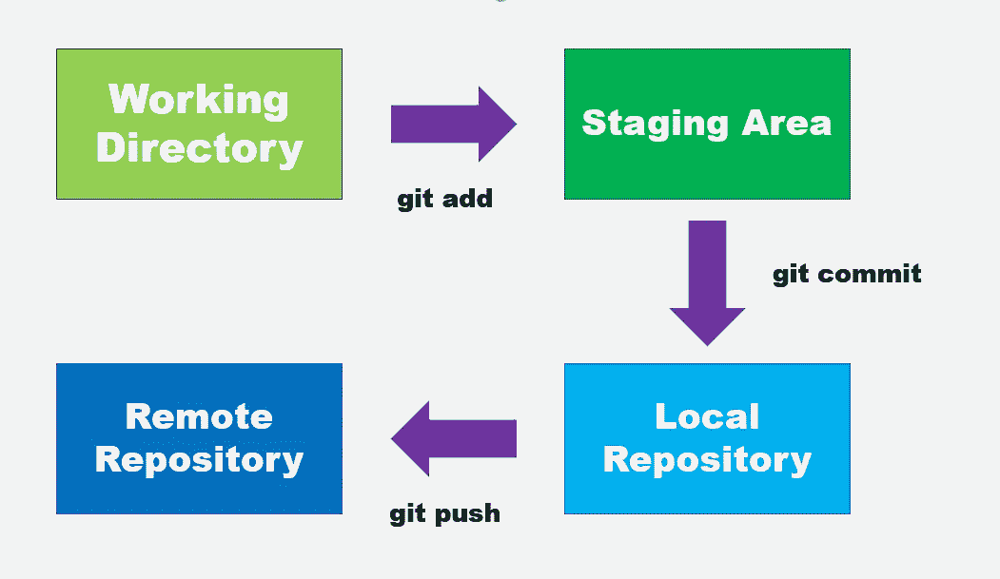

# 用 Git 理解目录树

> 原文：<https://betterprogramming.pub/understanding-directory-trees-with-git-9b245fa782a8>

## 学习查找和设置 git 目录和工作树



作者图片

今天的主题是存储库和目录树如何在 Git 中工作。对于已经熟悉 Git 的开发人员来说，我确信在您对项目进行更改之后，典型的工作流如下所示:

*   运行`git add`来准备您的更改
*   运行`git commit`将暂存的变更添加到本地存储库中
*   运行`git push`将本地存储库的变更推送到远程托管站点(GitHub、Gitlab 等)。)

大多数情况下，根目录是您的 git 目录所在的位置。然而，在某些情况下，git 目录和工作树可以位于不同的位置。

让我们进入下一节，学习基本概念和一些有用的 git 命令，用于与 git 目录和[工作树](https://www.theserverside.com/video/Understand-the-Git-working-tree-status-command-for-easy-DVCS)进行交互。

# Git 命令

## 树命令

通常，您可以使用 tree 命令来获得当前目录的概览。您应该得到子文件夹以及以下内容:

```
C:.
├───config
├───log
├───nemo_utils
├───rasa_server
│   ├───actions
│   │   └───__pycache__
│   ├───data
│   ├───models
│   ├───results
│   └───tests
└───temp
```

如果您也希望获得文件，Linux 用户应该使用-a 标志:

```
tree -a
```

对于 Windows 用户，首选方法是通过/F 开关:

```
tree /F
```

您应该得到以下输出:

请记住，隐藏文件将不包括在输出中。

## ls-tree 命令

另一方面，Git 有自己的 ls-tree 命令[，它接受一个对象](https://stackoverflow.com/questions/10082514/git-ls-tree-output-of-working-directory)。对象引用 Git 引用(每次提交时看到的散列值)。或者，您也可以使用-r HEAD:

```
git ls-tree -r HEAD
```

您应该在控制台上获得以下输出:

```
100644 blob 94354120be    .gitignore
100644 blob d564bc662c    README.md
100644 blob 78bb05dc3c    config/mybot.conf
100644 blob 93088bedcc    logging_loader.py
100644 blob 1c3915e0d6    mybot.py
...
```

与 tree 命令不同，输出基于 git 跟踪的文件。任何不在追踪范围内的文件。这里不会显示 gitignore。

如果您试图使用如下路径:

```
git ls-tree
```

您将得到以下错误:

```
fatal: Not a valid object name
```

## ls-files 命令

或者，您可以使用 ls-files 命令来获取工作树中文件的信息。

```
git ls-files
```

默认情况下，它使用-c 标志，这将列出工作树中的所有缓存文件。还有一些其他选项，例如:

*   `-d` —显示删除的文件。
*   `-m` —显示修改过的文件。
*   `-o` —显示未跟踪的文件。
*   `-s` —显示暂存文件。

例如，要获取所有未跟踪的文件，可以使用以下命令:

```
git ls-files -o
```

## Git 目录和工作树

如果您的 git 目录和工作树不在同一个位置，您可能会遇到以下错误:

```
fatal: not a git repository (or any of the parent directories): .git
```

当您运行任何 git 命令时，git 都会找到。当前目录下的 git 文件夹。如果不存在，它将继续向上搜索，直到找到一个。如果找不到，它将引发[致命错误:不是 git 库](https://komodor.com/blog/solving-fatal-not-a-git-repository-error/)错误。

您可以通过使用以下标志显式指定 git 目录和工作树来轻松解决这个问题:

```
--git-dir — path to git directory
--work-tree — path to working tree
```

例如，如果您的。git 目录位于`folder_a`中，而您的工作树位于`folder_b`中，您应该使用以下命令来获取它的状态:

```
git --git-dir C:/Users/wfng/Documents/folder_a/.git --work-tree C:/Users/wfng/Documents/folder_b status
```

## GIT_DIR 和 GIT_WORK_TREE 环境变量

还有一种方法可以将这些值设置为环境变量。您需要使用以下变量名:

*   `GIT_DIR` — git 目录
*   `GIT_WORK_TREE` —工作树

Linux 用户应该使用 export 命令，如下所示:

```
export GIT_DIR=C:/Users/wfng/Documents/folder_a/.git
export GIT_WORK_TREE=C:/Users/wfng/Documents/folder_b status
```

对于 Windows 用户，则设置相应的命令:

```
SET GIT_DIR=C:/Users/wfng/Documents/folder_a/.git
SET GIT_WORK_TREE=C:/Users/wfng/Documents/folder_b status
```

## 找到您的 Git 目录和工作树

如果你不知道你的 git 目录和工作树的确切位置会发生什么？答案是依靠 rev-parse 命令。对于那些不知道的人来说，git rev-parse 只是 git revision-parse 的简称。这是一个有用的命令，主要用于操作。在这种情况下，您可以使用它来查找 git 目录和工作树的路径。

运行以下命令来查找当前项目的 git 目录的确切位置:

```
git rev-parse --git-dir
```

至于工作树，您应该使用以下命令:

```
git rev-parse --show-toplevel
```

# 结论

让我们回顾一下今天所学的内容。

本文首先简要解释了 git 的典型工作流。然后，它指出了开发人员面临的一个常见问题:当 git 目录和工作树位于不同的地方时。

接下来，它讲述了 ls-tree 和 ls-files 命令，用于获取项目中的暂存、修改、取消跟踪和其他文件。

它进而提出了解决已确定问题的两种解决方案。第一种方法是显式设置路径，而第二种方法是通过环境变量。

最后，它解释了如何通过 rev-parse 命令获得 git 目录和工作树的确切路径。

# 参考

1.  [Git ls-tree](https://git-scm.com/docs/git-ls-tree)
2.  [Git ls 文件](https://git-scm.com/docs/git-ls-files)
3.  [Git 文档](https://git-scm.com/docs)
4.  [stack overflow—git rev parse 做什么？](https://stackoverflow.com/questions/15798862/what-does-git-rev-parse-do)
5.  [Git——指定定制的 Git 存储库和工作树位置](https://www.logicbig.com/tutorials/misc/git/custom-git-dir.html)