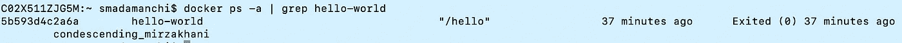

# 了解码头集装箱出口代码

> 原文：<https://betterprogramming.pub/understanding-docker-container-exit-codes-5ee79a1d58f6>

## 最常见的退出代码、它们的含义以及导致它们的原因


Docker 容器退出代码——如何使用它们进行故障排除？

这是我遇到的最常见的问题之一:“为什么我的容器没有运行？”

docker 容器退出代码有助于解决这个问题吗？

回答这个问题的第一步是识别 docker 容器的退出代码。退出代码可能会给出一个提示，说明发生了什么使容器停止运行。本文列出了使用 docker 容器时最常见的退出代码，旨在回答两个重要问题:

*   这个特定的退出代码是什么意思？
*   什么操作导致了这个退出代码？

这将最终有助于回答最初的问题:“为什么我的容器没有运行？”

# 如何找到退出代码

## 选项 1:列出所有退出的容器

```
docker ps --filter "status=exited"
```

## 选项 2:通过容器名进行 Grep

```
docker ps -a grep <container-name>**Example**: docker ps -a | grep hello-world
```

## 选项 3:按集装箱编号检验

```
docker inspect <container-id> --format='{{.State.ExitCode}}'Example: docker inspect ca6cbb290468 --format='{{.State.ExitCode}}'
```

# 退出代码

与 docker 容器相关联的常见退出代码有:

*   **退出代码 0** :没有附加前台进程
*   **退出代码 1** :表示由于应用错误导致失败
*   **退出代码 137** :指示失败，因为容器接收到 SIGKILL(手动干预或‘oom-killer’[内存不足])
*   **退出代码 139** :当容器接收到信号 SEGV 时，指示失败
*   **退出代码 143** :指示失败，因为容器接收到 SIGTERM

## 退出代码 0

*   退出代码 0 表示特定容器没有附加前台进程。
*   这个退出代码是所有其他退出代码的例外。这并不一定意味着发生了不好的事情。
*   如果开发人员想在容器完成工作后自动停止容器，他们可以使用这个退出代码。

下面是一个使用公共 docker 容器的例子——“hello-world”。如果您的系统或虚拟机实例上安装了 docker，请运行以下命令:

```
docker run hello-world
```

你会收到一条信息，“你好，docker！”但是尝试使用以下代码找到容器:

```
docker ps -a | grep hello-world
```

您会注意到容器已经退出，退出代码是 0。这是因为容器没有附加任何前台进程，比如 Java 进程或 shell 进程，它们会一直运行到 SIGTERM 事件发生



退出代码 0

## 退出代码 1

*   指示容器由于应用程序错误或 Dockerfile 中对容器中不存在的文件的错误引用而停止。
*   应用程序错误可能简单到“被 0 除”，也可能复杂到“引用的 bean 名称与现有的、不兼容的相同名称和类的 bean 定义冲突”
*   Dockerfile 中对容器中不存在的文件的错误引用可能只是一个打字错误(下面的例子中有`sample.ja`而不是`sample.jar`)


退出代码 1

## 退出代码 137

*   这表明容器收到了信号删除
*   引发 SIGKILL 的常见事件是 docker kill。这可以由用户手动启动，也可以由 docker 守护程序启动:

```
docker kill <container-id>
```

*   `docker kill`可以由用户手动启动，也可以由主机启动。如果由主机发起，则通常是由于内存不足。要确认容器是否由于内存不足而退出，请对照下面部分的容器 id 验证`docker inspect`，并检查`OOMKilled`是否为真(这将表明它内存不足):

```
"State": {
 "Status": "exited",
 "Running": false,
 "Paused": false,
 "Restarting": false,
 "OOMKilled": true,
 "Dead": false,
 "Pid": 0,
 "ExitCode": 137,
 "Error": "",
 "StartedAt": "2019-10-21T01:13:51.7340288Z",
 "FinishedAt": "2019-10-21T01:13:51.7961614Z"
}
```

## 退出代码 139

*   这表明容器收到了 SIGSEGV
*   SIGSEGV 表示分段故障。当程序试图访问不允许它访问的[内存](https://en.wikipedia.org/wiki/Computer_memory)位置，或者试图以不允许的方式访问内存位置时，就会发生这种情况。
*   从 Docker 容器的角度来看，这要么表明应用程序代码有问题，要么有时表明容器使用的基本映像有问题。

## 退出代码 143

*   这表明容器收到了 SIGTERM。
*   启动 SIGTERM 的常见事件是`docker stop`或`docker-compose stop`。在这种情况下，有一个手动终止，迫使集装箱退出:

```
docker stop <container-id>
OR
docker-compose down <container-id>
```

*   **注意:**有时`docker stop`也会导致退出代码 137。如果绑定到容器的应用程序不处理 SIGTERM，通常会发生这种情况 docker 守护进程等待十秒钟，然后发出 SIGKILL

## **Docker 容器中一些不常见的退出代码(通常使用 shell 脚本)**

*   **退出代码 126** :权限问题或命令不可执行
*   **退出代码 127**:shell 脚本中可能有不可识别字符的输入错误