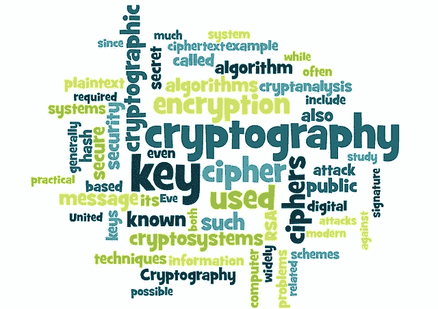
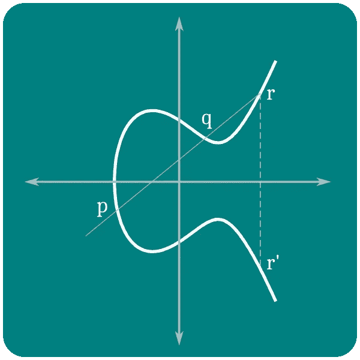

# 了解以太坊和比特币加密

> 原文：<https://betterprogramming.pub/understanding-ethereum-cryptography-3ef7429eddce>

## 了解密码学的基础:私钥和公钥是如何生成的



密码系统

# 钥匙和地址

以太坊有两种不同的账户:外部拥有的账户(EOAs)和合同。以太的所有权是通过私钥、以太坊地址和数字签名建立的。私钥是所有用户与以太坊交互的核心。事实上，帐户地址直接来源于私钥:私钥唯一地确定一个以太坊地址，也称为帐户。

# 私钥

私钥是一个随机生成的数字，允许用户控制与相应以太坊地址相关的所有资金，包括访问授权该地址的合同。私钥用于创建确认交易中资金所有权的数字签名。

始终保持私钥的安全是至关重要的，因为向任何人透露它都将使他们能够控制以太网和契约。创建密钥的备份并防止其意外丢失是很重要的，因为一旦丢失就无法恢复，从而导致由其保护的资金的永久损失。

## 从随机数生成私钥

生成密钥的第一步也是最关键的一步是找到一个安全的熵或随机性来源。生成以太坊私钥需要选择 1 到 2 ⁵⁶.之间的一个数字以太坊软件使用操作系统的随机数生成器来生成 256 个随机位。

私钥可以是任何非零数字，最大为略小于 2 ⁵⁶的大数字——一个庞大的 78 位数字，大约为 1.158 * 10⁷⁷.

要生成私钥，重要的是离线进行，不要与以太坊网络通信。使用编程语言提供的“简单”随机数生成器或编写自己的代码来创建随机数是不可取的。这是因为这种方法可能不提供真正的随机性，并且可能被攻击者利用。最好使用安全的方法，比如操作系统的随机数生成器，保证私钥的随机性和安全性。

# 公共密钥

以太坊公钥是椭圆曲线上满足椭圆曲线方程的一组 x 和 y 坐标。它是从私钥中使用椭圆曲线乘法生成的两个数字中派生出来的。这个过程是不可逆的，这意味着私钥不能从公钥派生出来。

为了生成公钥，在涉及椭圆曲线乘法的方程中使用私钥，这是不可逆的。等式为:K = k * G，其中 K 为公钥，K 为私钥，G 为不变点(生成点)。

> 椭圆曲线乘法不同于普通乘法。这是一个单向函数，在一个方向上很容易执行(乘法)，但在相反方向上不可能执行(除法)。这使它成为从私钥生成公钥的有用工具，因为它确保了私钥不能从公钥派生出来。椭圆曲线加密

非对称或公钥加密基于离散算法问题的概念，它涉及对椭圆曲线上的点执行加法和乘法。这种被称为椭圆曲线加密的加密技术是未来可能使用的一种很有前途的加密技术。

> 以太坊使用与比特币相同的椭圆曲线 secp256k1。



椭圆曲线

以太坊使用一种特定的椭圆曲线和一组数学常数，这些常数在一个名为`secp256k1`的标准中定义。`secp256k1`曲线由以下函数定义，生成一条椭圆曲线:

```
*y* ² *= ( x*³ *+ 7 ) over ( 𝔽 p )*or:y ² |p| = ( x³ + 7 ) |p|
```

`mod p`表示该曲线在素数阶的有限域`p`上，其中`p = 2²⁵⁶–2³²–2⁹–2⁸–2⁷–2⁶–2⁴–1`。这是一个非常大的质数，使得这条曲线非常可靠。

## 以太坊地址格式

以太坊地址是通过获取公钥的 Keccak-256 散列并将其表示为十六进制数来创建的。Keccak-256 哈希的最后 20 个字节用于生成地址。

# 生成公钥

您可以使用 npm 安装 helpeth 命令行工具来创建 ICAP 地址。

```
npm install -g helpeth
```

如果你没有 npm，你可能需要按照[https://nodejs.org](https://nodejs.org/)的说明来安装。

```
helpeth keyGenerate
```

输出:

```
Address: 0xe16c1623c1aa7d919cd2241d8b36d9e79c1be2a2Address (checksum): 0xe16C1623c1AA7D919cd2241d8b36d9E79C1Be2A2ICAP: XE56 QBY1 TCEL SB4U 7BTR QQRC IOUY 8UNS DK2Public key: 0xaa931f5ee58735270821b3722866d8882d1948909532cf8ac2b3ef144ae8043363d1d3728b49f10c7cd78c38289c8012477473879f3b53169f2a677b7fbed0c7Private key: 0x227dbb8586117d55284e26620bc76534dfbd2394be34cf4a09cb775d593b6f2b 
```

我们现在将使用给定的私钥来生成公钥，如下所示:

```
helpeth keyDetails \
  -p 0x227dbb8586117d55284e26620bc76534dfbd2394be34cf4a09cb775d593b6f2b
```

输出:

```
Address: 0xe16c1623c1aa7d919cd2241d8b36d9e79c1be2a2Address (checksum): 0xe16C1623c1AA7D919cd2241d8b36d9E79C1Be2A2ICAP: XE56 QBY1 TCEL SB4U 7BTR QQRC IOUY 8UNS DK2Public key: 0xaa931f5ee58735270821b3722866d8882d1948909532cf8ac2b3ef144ae8043363d1d3728b49f10c7cd78c38289c8012477473879f3b53169f2a677b7fbed0c7
```

> "交换客户端地址协议(ICAP)为以太网地址提供了一个灵活的、校验和可互操作的编码系统。ICAP 地址可以编码以太坊地址或在以太坊名称注册中心注册的普通名称。ICAP 与国际银行帐号(IBAN)编码的兼容性使其成为编码以太坊地址的有用工具。”

## 手动方法

使用椭圆曲线数字签名算法(ECDSA)和`secp256k1`曲线从私钥手动计算公钥是一个复杂的过程，最好留给专门的库或工具来完成。但是，对于那些对数学细节感兴趣的人来说，导出公钥的公式如下:

`Public Key = Private Key * G`

其中`G`是`secp256k1`曲线上的固定生成点，`Private Key`是十六进制格式的 256 位私钥。

该点的坐标在标准中规定，并在大多数实施中广泛使用。`secp256k1`中`G`的坐标为:

```
x = 55066263022277343669578718895168534326250603453777594175500187360389116729240
y = 32670510020758816978083085130507043184471273380659243275938904335757337482424
```

该点用作生成公钥的基点。它也用作参考点，对曲线上的其他点执行数学运算。

该操作使用由`secp256k1`曲线定义的数学运算来执行，例如点加法和标量乘法。请注意，上述公式是该过程的高级表示，实际计算要复杂得多，通常由专门的库或工具来完成。

# 参考

[1]:掌握以太坊:构建智能合约和 DApps，作者 Andreas M. Antonopoulos，Gavin Wood。

# 给你更多

[](/how-to-find-vulnerability-in-smart-contracts-unexpected-ether-89f157ce2888) [## 如何发现智能合同中的漏洞—意想不到的以太

### 黑掉一个游戏智能合约，学习其防范措施

better 编程. pub](/how-to-find-vulnerability-in-smart-contracts-unexpected-ether-89f157ce2888)