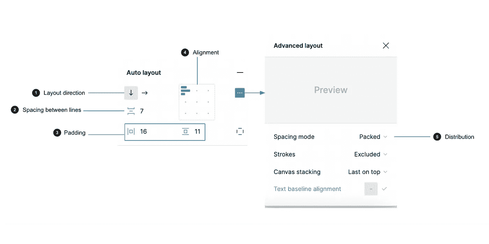
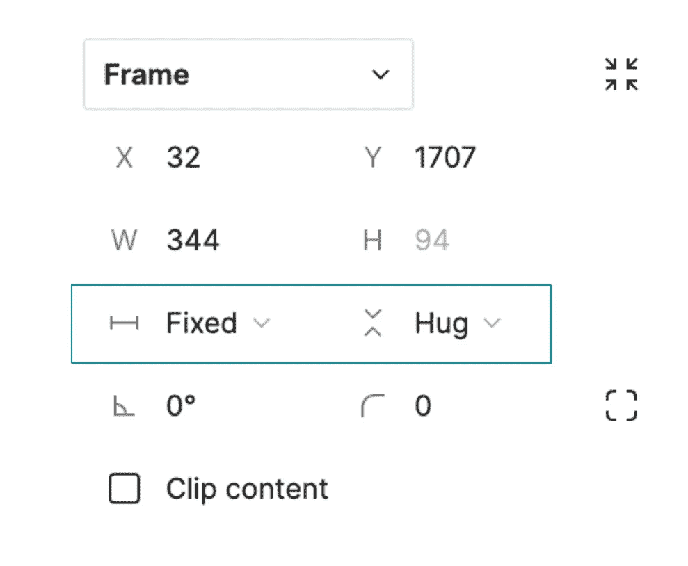
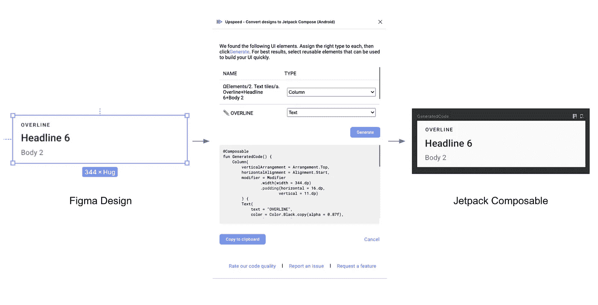

# 将 Figma 属性转换为 Jetpack 合成

> 原文：<https://betterprogramming.pub/understanding-figma-as-a-developer-auto-layout-4d9773daf1d9>

## 根据代码设计:从开发人员的角度理解 Figma:自动布局

在我的[上一篇文章](https://medium.com/p/f3d42e4e3c7)中，我谈到了文本元素的 auto-resize 属性，它描述了文本元素应该如何适应其内容。在这篇文章中，我将谈论自动布局。“自动布局”是一个可以添加到框架和组件中的属性，允许您创建根据需要放大或缩小的设计。

您可以在 Figma 的右边栏中找到应用于框架的自动布局属性。

Figma 自动布局属性

1.  **布局方向:**描述内容流动的方向，水平或垂直。
2.  **行间距:**这描述了子元素之间的间距。
3.  **填充:**这描述了外部框架和它的子框架之间的空间。可以独立设置或统一设置左、右、上、下的填充。
4.  **对齐:**这描述了子元素在父元素中的对齐方式。
5.  **分布:**分布决定子对象如何在框架间分布。 **Packed** 表示孩子将被分组在一起。**之间的间距表示子对象将沿着为框架设置的方向和对齐方式平均分布。**

**除此之外，另一个有助于指示内容应该如何增长或收缩的属性是' **Resizing** '属性。这可以在右边栏的“**框架**”小节中找到。**

****

**resizing 属性为您提供了三个选项:**

1.  ****固定宽度或高度(固定)**:在这种情况下，框架尺寸的值应该保持不变，不管其中的内容是什么。**
2.  ****拥抱内容:**当一个框架被设置为拥抱内容时，该框架应该根据其子对象调整自身大小。**
3.  ****填充容器:**在这种情况下，框架应该拉伸到其父框架的宽度或高度。**

# **翻译到 Jetpack 撰写**

**上面的 Figma 属性可以以多种方式转换成 Jetpack Compose，因为它具有灵活的特性。以下是几个选项。**

1.  ****布局方向**:如果在具有自动布局属性的框架下有多个子元素，可以根据 Figma 中指定的布局方向使用 Compose 的标准布局元素，如[列](https://developer.android.com/reference/kotlin/androidx/compose/foundation/layout/package-summary#Column(androidx.compose.ui.Modifier,androidx.compose.foundation.layout.Arrangement.Vertical,androidx.compose.ui.Alignment.Horizontal,kotlin.Function1))和[行](https://developer.android.com/reference/kotlin/androidx/compose/foundation/layout/package-summary#Row(androidx.compose.ui.Modifier,androidx.compose.foundation.layout.Arrangement.Horizontal,androidx.compose.ui.Alignment.Vertical,kotlin.Function1))。然而，可能存在一个帧只有一个子帧的情况。这是因为，Figma 只能对框架应用自动布局。在这种情况下，您可以将元素封装在一个[框](https://developer.android.com/reference/kotlin/androidx/compose/foundation/layout/package-summary#Box(androidx.compose.ui.Modifier,androidx.compose.ui.Alignment,kotlin.Boolean,kotlin.Function1))中，或者合并属性。**
2.  ****间隔和填充** : [间隔符](https://developer.android.com/reference/kotlin/androidx/compose/foundation/layout/package-summary#Spacer(androidx.compose.ui.Modifier))是一种空白空间布局，可用于在各种元素之间提供空白空间。Jetpack Compose 还大量使用修饰符来帮助您更改可组合组件的大小、布局、行为和外观。例如，[填充修饰符](https://developer.android.com/reference/kotlin/androidx/compose/ui/Modifier#(androidx.compose.ui.Modifier).padding(androidx.compose.ui.unit.Dp,androidx.compose.ui.unit.Dp,androidx.compose.ui.unit.Dp,androidx.compose.ui.unit.Dp))可用于沿着内容的每个边缘添加额外的空间。**
3.  ****对齐和分布**:对齐和分布图属性可以共同用来确定父布局内布局的[排列](https://developer.android.com/reference/kotlin/androidx/compose/foundation/layout/Arrangement)和[对齐](https://developer.android.com/reference/kotlin/androidx/compose/ui/Alignment)。**
4.  ****调整大小:**修饰符提供了多个选项来指定如何调整可组合组件的大小，包括但不限于设置固定的宽度或高度、填充到最大宽度或高度以及包装内容。这些直接转化为 Figma 调整大小选项。**

**使用 [Upspeed Figma 插件](https://www.figma.com/community/plugin/1063494652261429841/Upspeed---Convert-designs-to-Jetpack-Compose-(Android))，这里有一个例子，说明我如何快速将具有这些特性的设计转化为喷气背包堆肥:**

****

**Figma 按代码设计**

# ****总结****

**在这篇文章中，我详细介绍了 Figma 的自动布局属性，以及它如何描述任何设计的调整大小行为。**

**在未来的帖子中，我将更多地讨论 Jetpack Compose 的不同部分，以及开发人员如何更快地构建 UI。**