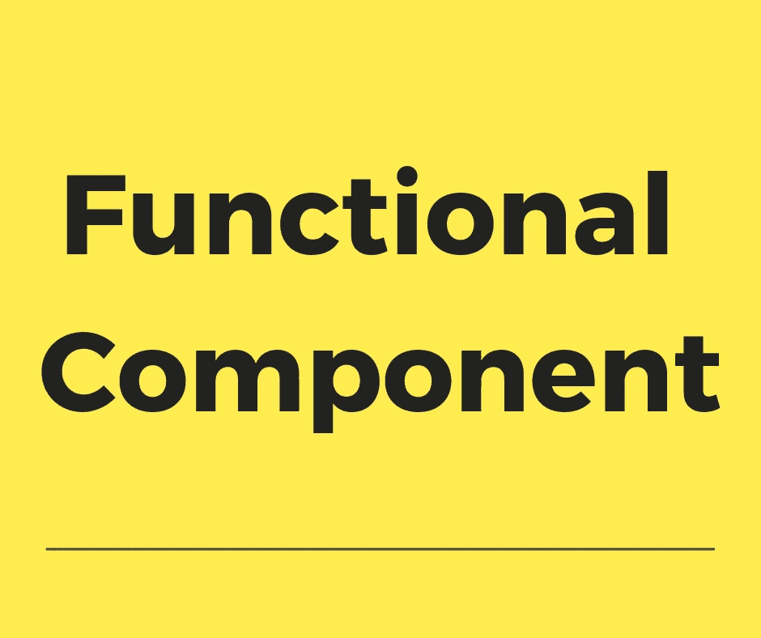

# 理解功能组件和基于类的组件

> 原文：<https://betterprogramming.pub/understanding-functional-components-895321b1af84>

## 何时使用哪个 React 组件的经验法则



[React](https://reactjs.org/) 就是让你的前端代码保持模块化和可重用。

组件在使 React 模块化方面起着至关重要的作用。组件是 React 的构建块。使用正确的组件可以确保前端代码的可重用性和可伸缩性。

React 中有两种类型的组件:

*   功能组件
*   基于类的组件

使用正确类型的组件将对代码的可重用性和性能产生很大的影响。

在这一部分中，我们将探索功能组件和基于类的组件之间的区别，这两种类型的组件的优缺点，以及决定何时使用什么的经验法则。

# 功能组件

假设我们需要创建一个组件来打印欢迎消息。让我们创建一个名为`*welcomeMessage*`的组件。

该组件最简单的形式如下所示:

```
const welcomeMessage = () => {
  return "Hello there"
};export default welcomeMessage;
```

任何 JavaScript 开发人员都可以轻松阅读和理解这些代码，甚至是没有任何 React 背景的人。这只是一个无害的、易读的函数。

您有一个函数定义，然后该函数被导出。这就是包含组件的文件中需要的全部内容。其他都是可选的。

你应该注意到我们甚至没有在 React 中常见的`import React from "react";`。这是因为我们只从这个函数返回一些文本。如果您使用 [JSX](https://reactjs.org/docs/introducing-jsx.html) ，您将需要导入 React 类。

虽然这将符合 React 组件的条件，但在我们的大多数场景中，我们通常会根据组件收到的道具返回一些 JSX。正是这种基于输入属性创建预期输出的能力使得组件可重用。

因此，让我们修改我们的`welcomeMessage`,将道具作为输入，并在此基础上输出欢迎消息。

如你所见，这只是一个纯粹的函数，它将`props`作为输入，并基于输入返回`JSX`作为输出。

在上面的例子中，我们使用的是 ES6 标准。同样的代码也可以这样写:

但是，我不建议使用这种格式。

React 使用 ES6 是有原因的，因此，我们也坚持使用它是有道理的。最好让我们自己与语言的未来方向保持一致。

由于 [Create React App](https://github.com/facebook/create-react-app) (CRA)中的 [Babel](https://babeljs.io/) 设置，我们代码的向后兼容性由默认设置负责。作为一个额外的优势，当您使用 ES6 时，您的代码将与 React 代码很好地融合在一起。

现在，我们可以将道具传递给`App.js`中的`welcomeMessage` 组件，如下所示:

# 功能组件的优势

1.  它们有助于保持代码的简单、易读和可重用。
2.  因为它们是纯函数，所以更容易测试。
3.  他们不能访问`state`，所以你不得不考虑通过`props`，这将使你的组件可重用。如果您认为您的组件可以在项目之外使用，您甚至可以考虑将您的组件发布到 [npm](https://www.npmjs.com/) 。

## 我应该坚持功能组件吗？

这是否意味着使用功能组件总是更好？不尽然，但它们总是组件的一个很好的起点。

如果你真的觉得有必要，你可以把它们转换成基于类的组件。在下一部分中，我们将探索什么时候使用基于类的组件是有意义的，以及使用它们有什么好处。

# 基于类的组件

基于类的组件是扩展了`React.Component`的 JavaScript 类。

`React.Component`中唯一需要的方法是`render`方法。

所以，我们的功能组件`helloUserFunctionalComponent`，是这样的:

现在会变成这样:

如前所述，功能组件是一个很好的起点。我通常从功能组件开始，然后只在以下一种情况下切换到基于类的组件。

## 1.需要利用状态

有些情况下，您需要跟踪组件的状态。在这种情况下，最好使用`state`。

例如 *accordion* ，您需要维护 accordion 在`state`中是否被点击。这对应于 UI 组件的状态。

还有一个场景，我们使用`state`来保存外部数据，我们将在下面讨论。

## 2.需要获取数据

另一个场景是您需要获取数据。在这种情况下，最好还是使用基于类的组件。

不要使用单一的基于类的组件来获取数据和呈现数据，最好使用一种叫做*容器*的方法。在一个容器中，你通常获取数据并将获取的数据存储在`state`中。

然后，您将来自`state`的相关数据传递给一个功能组件作为`props`，它将呈现所提供的数据。

只以数据为道具，进行渲染的组件，可以认为类似于模板。它们也被称为*哑元件*。

## 3.需要生命周期挂钩

基于类的组件提供了各种生命周期挂钩，允许我们挂钩到组件生命周期的各个阶段，并基于此执行操作。

虽然有许多生命周期挂钩，`componentDidMount`将是最常用的一个。例如，在上一节中，我们讨论了数据获取，这通常发生在`componentDidMount()`钩子中。

让我们来看一个场景的代码，在这个场景中，我们需要从一个 API 获取数据，然后呈现它。

我们将为 API 调用使用一个容器，然后我们将使用一个哑组件进行渲染。

容器—一种特殊用途的基于类的组件。

一个用于呈现用户列表的哑组件:

正如你所看到的，因为我们创建了一个单独的`UserList` 功能组件，我们可以重用它来呈现来自任何源的`UserList`，只要传递的`users`道具在用户对象中有一个`profile_link`和`name`属性。

## 4.需要由基于组件的类提供性能优化

如果您从事过前端优化工作，您会观察到，一旦加载了页面并且状态发生了变化，前端的大部分时间都花在了重新呈现组件上。

与渲染时间相比，用于 JavaScript 处理的时间似乎可以忽略不计。确保只在需要时重新渲染组件可以极大地提高前端应用程序的性能。

基于类的组件有一个可选的方法叫做`*shouldComponentUpdate*`，它决定你是否需要重新渲染一个组件。

该方法将`nextProps`和`nextState`作为输入，允许您返回一个`boolean`。如果返回`true`，则表示组件将重新渲染，如果返回`false`，则表示无需重新渲染组件。

如果你在不了解后果的情况下干预这个功能，你可能会遇到比开始时更多的问题。还有一个更简单的选择。

React 提供`React.PureComponent`。在大多数情况下，扩展`React.PureComponent`而不是`React.Component`就足够了。相当于用当前和以前的道具和状态的浅层对比来实现`shouldComponentUpdate()`。

# 摘要

1.  根据经验，从功能组件开始，只有在需要时才过渡到基于类的组件。
2.  由于功能组件无法访问`state`，这可防止您不必要地使用`state`。利用`state`可以让你变懒。从一个功能组件开始让你思考是否真的需要使用`state`。
3.  功能组件使您的代码简单、易读、可重用。
4.  功能组件易于测试。
5.  每当你需要使用`state`时，创建基于类的组件。
6.  每当您希望使用组件基类提供的性能优化时，请使用基于类的组件。
7.  分离数据获取和呈现。或者，换句话说，将你的业务逻辑/上下文与表示分开。
8.  对于数据获取，使用容器模式，因为它将帮助您遵循关注点分离的范例。容器用于获取数据，它们反过来使用其他组件进行渲染。
9.  我记得在某处读到过:“不要用应用程序逻辑或特定于上下文的细节来加重组件的负担。”这是一个很好的基本规则，其他一切都源于此。

感谢阅读！