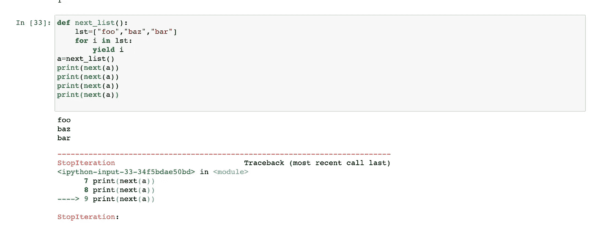
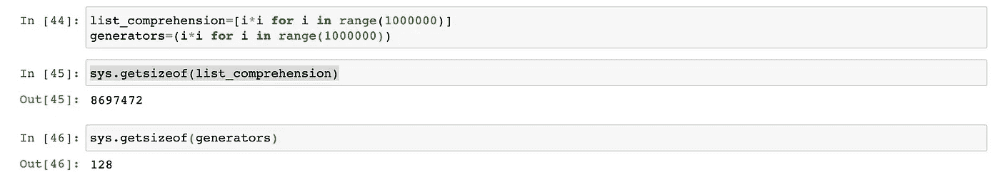
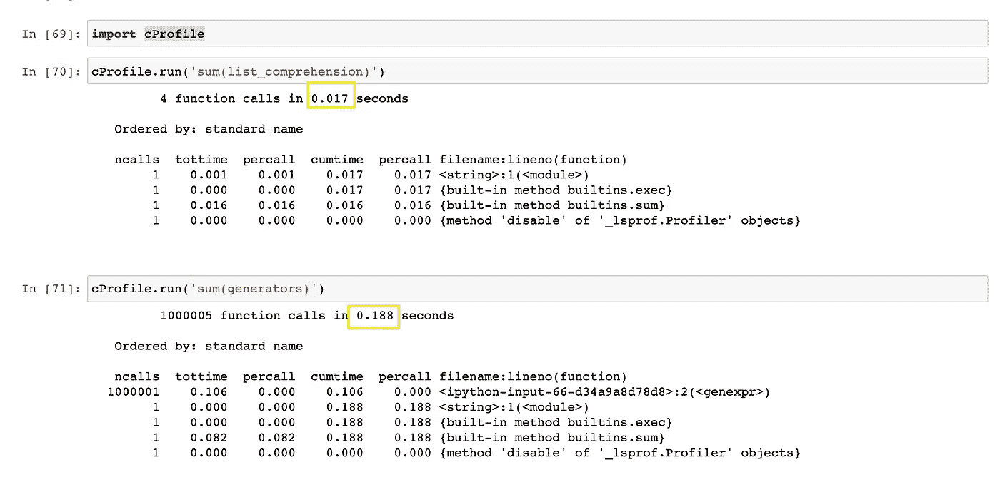

# 理解 Python 中的生成器

> 原文：<https://betterprogramming.pub/understanding-generators-in-python-2c3b9e070c7e>

## 大数据的顺序方法


照片由 [Khiet Tam](https://unsplash.com/@khiettam?utm_source=medium&utm_medium=referral) 在 [Unsplash](https://unsplash.com?utm_source=medium&utm_medium=referral) 上拍摄

假设你有一系列的步骤。你一次走一步就能到达顶峰。你走一步，也许两步，也许三步，也取决于你一跳能跳过多少步。但是如果楼梯没有尽头呢？如果超过 1000 步呢。你不能一次跳过所有的。尽管如此，你可以跳到可管理的部分，然后到达顶端。

Python 中的生成器就是这样。它们按顺序把你带到列表或集合或元组的末尾。数据结构或变量占用内存中分配的空间。

例如，假设我们有一个 4 gb 的大型数据集。一列有几百万行。当你给该列分配一些内存并试图遍历该列的每个单元格时。记忆崩溃开始！你的机器被压得喘不过气来。我们需要更好的方法。

介绍发电机！它们允许我们以块为单位迭代这些大数据结构。

## 发电机

我们先来看一个问题，然后了解生成器。

```
i=0
while True:
    print(i)
    i+=1
```

我们有一个`while`循环，它一直运行到它为真，并且将`i`的值增加 1，从而创建一个无限循环。

```
def run_till_end():
    i=0
    while True:
        return i
        i+=1
```

现在，我们已经定义了一个函数—当我们调用它时，`0`将被返回。虽然，我们在函数定义中有一个无限循环，在返回值后它终止。

但是，我们想要每一个值！

```
def run_till_end():
    i=0
    while True:
        yield i
        i+=1
```

这次我们使用了`yield`来返回输出。`yield`关键字用于从一个函数返回。再次调用该函数时，从最后一条 yield 语句开始执行。如果一个函数有`yield`关键字，它被称为`generator`。

```
a=run_till_end()
print(type(a))
print(next(a)) #0
print(next(a)) #1
```

如果运行上面一行代码，函数类型将是`generator`。使用`next`方法的第一个打印语句将输出`0`。第二个会输出`1`。如果您希望顺序地或成批地输出生成器的值，应该使用下面的方法。

你可能会在列表上遇到同样的问题。您可以使用此方法从列表中顺序调用值:

```
def next_list():
    lst=["foo","baz","bar"]
    for i in lst:
        yield ia=next_list()
print(next(a))
print(next(a))
```

这将产生`foo`和`baz`作为输出。

但是如果你在上面的函数中使用了四次 next 函数呢？在第四次运行时，将抛出错误类型为`StopIteration`的回溯。当生成器穷尽了数据结构的所有值时，它们会抛出这个`StopIteration`异常。



还有另一种创建生成器的方法——它类似于列表理解。

```
list_comprehension=[i for i in range(10)] #create a listgenerators=(i for i in range(10)) #create a generator
```

当你调用这些对象`list_comprehension`和`generators`时，前者会输出一个列表，后者会输出一个生成器对象。


*   列表理解有方括号:`[ ]`
*   生成器理解有左括号: `( )`

# 空间和时间分析

我在为分析做一个清单和一个生成器。两者都有一百万个数的平方值。



这是一个令人惊讶的结果。在一个案例中，8697472 字节被分配给内存，而生成器理解只占用了 128 字节。



说到时间，生成器需要的不仅仅是列表理解。因此生成器理解占用更少的空间和时间。

# 摘要

我研究了 Python 中的生成器概念。文章包括以下主题:

*   Yield 关键字
*   发电机怎么用？
*   空间和时间分析