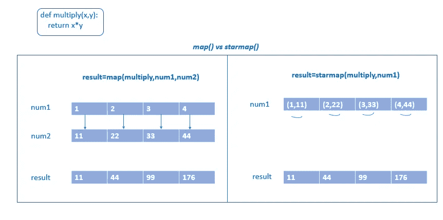

# 用 Python 中的简单例子理解高阶函数

> 原文：<https://betterprogramming.pub/understanding-higher-order-functions-with-simple-examples-in-python-51dcafe9903>

## 掌握映射、过滤和减少功能


照片由[紫琳于 4 月](https://www.pexels.com/@ady-april-386980?utm_content=attributionCopyText&utm_medium=referral&utm_source=pexels)日在 [Pexels](https://www.pexels.com/photo/man-jumping-over-white-fence-1030794/?utm_content=attributionCopyText&utm_medium=referral&utm_source=pexels) 拍摄。

高阶函数是将函数作为参数和/或返回函数作为输出的函数。

一些有用的高阶函数有`map()`、`filter()`和`reduce()`。`map()`和`filter()`是内置函数，而`reduce()`包含在`functools()`模块中。

让我们来学习一下本文中的`map()`、`filter()`、`reduce()`。

# 地图()

`map()`用于将一个函数同时应用到 iterable 中的每一项。
`map()`将返回一个迭代器的映射对象:

```
map(function,iterable…)
```

计算 iterable 中所有数字的平方:

*   `square=map(lambda x:x*2, num)`:我们可以通过`lambda`函数或者`user_defined`函数。`lambda`函数的语法是`lambda *parameters* : *expression*`。
*   `map()`返回一个迭代器的映射对象。我们可以使用列表构造函数(`print(list(square))`)将迭代器(map 对象)转换成类似`list`的可迭代对象。

## map 与 for 循环

使用`for`循环解决相同的问题(数字的平方):

```
num=[1,2,3,4,5]
square=[]
**for** i **in** num:
    square.append(i*2)
print (square)
```

*   我们必须使用一个`for`循环遍历 iterable ( `list`)并将结果追加到一个新列表中。
*   顺序遍历:我们要遍历一个 iterable(长度 *n* ) *n* 次。

## 地图与列表理解

使用列表理解解决相同的问题(数字的平方):

```
num=[1,2,3,4,5]
result=[i**2 **for** i **in** num]
print (result)
*#Output:[1, 4, 9, 16, 25]*
```

列表理解将返回一个列表而不是迭代器，而`map()`将返回一个迭代器的 map 对象。

我们知道迭代器可以创建需要很少内存的按需序列，而链表需要更多内存来存储数据。如果你正在处理大量的数据，列表理解是没有用的。`map()`可用于返回一个 map 对象，它是一个迭代器，并根据需要计算值，不需要一次具体化所有的值。

## 映射与生成器表达式

与列表理解相比，当我们处理大量数据时，会使用生成器表达式。生成器表达式返回迭代器。

使用生成器带来的性能提升是延迟(按需)值生成的结果，这意味着更低的内存使用率。

计算 iterable 中所有数字的平方:

## 什么时候我们应该选择 map()而不是生成器表达式？

`map()`和生成器表达式都只返回一个迭代器。

*   `map`语法:`map(function,iterable)`
*   生成器表达式语法:`(expression for item in iterable if conditional)`

当列表理解/生成器表达式的逻辑太复杂而无法理解时，最好使用`map()`。

在`map()`函数中，我们把函数分开，这样设计的非常清晰。

`map()`和生成器表达式的另一个区别在于`map()`函数。我们可以重用一个`lambda`或函数定义。

## **地图()vs 星图()**

使用`map()`将函数应用于两个可迭代对象:

根据 [Python 文档](https://docs.python.org/3/library/itertools.html#itertools.starmap)，`starmap()`是“当实参参数已经从单个 iterable 分组到元组中时使用的，而不是`[map()](https://docs.python.org/3/library/functions.html#map)`(数据已经被‘预压缩’)”



地图 vs .星图()。作者照片。

# 过滤器()

`filter()`用于从符合特定条件的 iterable 中过滤元素:

```
filter(function,iterable)
```

过滤 iterable 中的偶数:

`filter()`也返回一个迭代器的过滤器对象。它不会立即检查所有的元素，但会在我们请求时返回下一个值
(使用`next()`):

如果我们想一次得到所有结果，我们可以使用`list()`构造函数将其转换成一个列表。

## filter()与 filterfalse()

> "创建一个迭代器，从 iterable 中过滤元素，只返回那些谓词为假的元素."— [Python 文档](https://docs.python.org/3/library/itertools.html)

```
filterfalse(predicate,iterable)
```

过滤不以`“r”`开头的元素:

# 减少()

`functools`模块提供以下功能:

```
functools.reduce()
```

从左到右将两个参数的函数累积应用于 iterable 的项，以便将 iterable 缩减为单个值:

```
functools.reduce(function, iterable)
```

Python 提供了一些内置的归约函数:

*   `max()`返回 iterable 中的最大值。
*   `min()`返回 iterable 中的最小数字。
*   `sum()`返回一个 iterable 中所有数字的和。

查找列表中所有元素的乘积:

```
**from** functools **import** reduce
num1=[1,2,3,4,5]
num2=reduce(**lambda** x,y:x*y,num1)
print (num2)*#Output:120*
```

## 减少()与累积()

> 创建一个迭代器，返回累加和或其他二元函数的累加结果(通过可选的 func 参数指定)— [Python 文档](https://docs.python.org/3/library/itertools.html)

```
itertools.accumulate(iterable.function)
```

求一个迭代式中数的乘积，求累计值:


减少()与累积()

# 关键要点

*   `map()`:对 iterable 中的每个元素应用函数(`map(function,iterable)`)。
*   `filter()`:过滤 iterable 中符合一定条件
    `(filter(function,iterable)`的元素。
*   `reduce()`:获取 iterable 中的连续元素，并以某种方式组合它们(`reduce(function,iterable)`)。

*关注此空间，了解更多关于 Python 和数据科学的文章。如果你喜欢多看我的教程，就关注我的* [***中***](https://medium.com/@IndhumathyChelliah)[***LinkedIn***](https://www.linkedin.com/in/indhumathy-chelliah/)*[***推特***](https://twitter.com/IndhuChelliah) ***。****

**点击这里成为中等会员:*[*https://indhumathychelliah.medium.com/membership*](https://indhumathychelliah.medium.com/membership)*