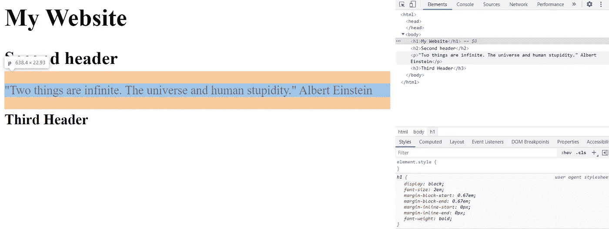
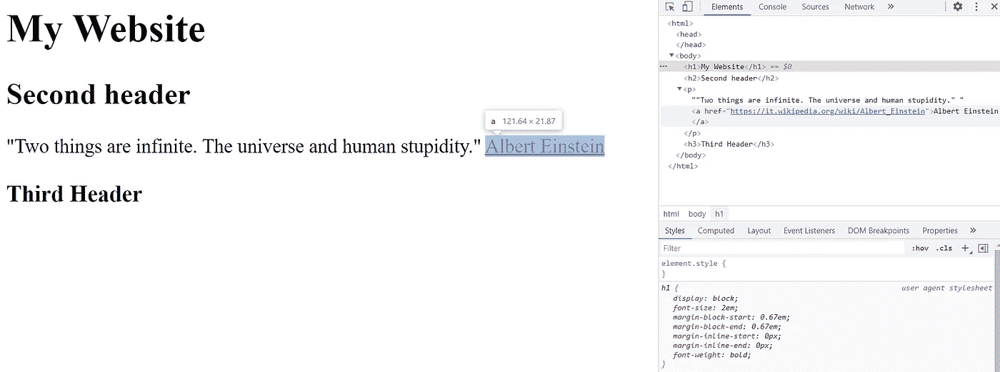
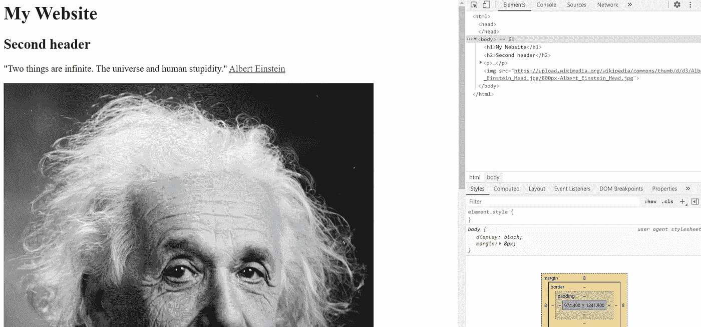
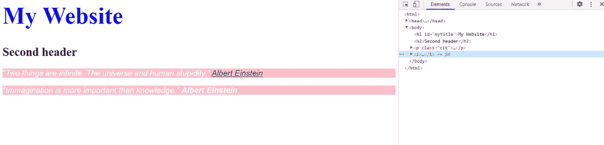
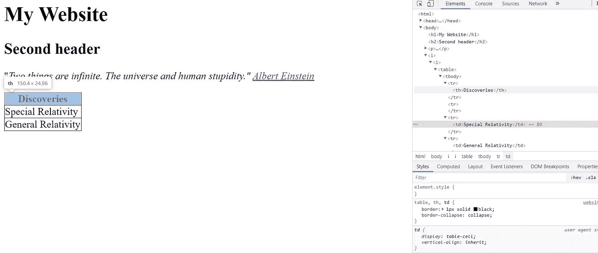
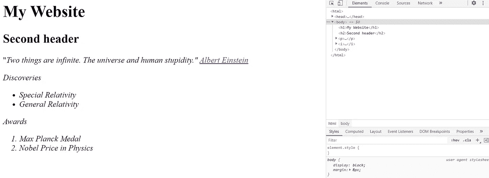
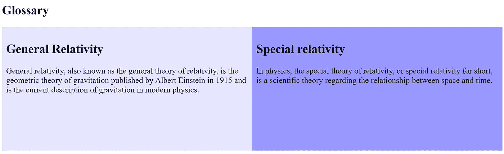

# 理解网页抓取的 HTML 基础

> 原文：<https://betterprogramming.pub/understanding-html-basics-for-web-scraping-ae351ee0b3f9>

## 使用 Python 抓取网站的第一步


卡尔·海尔达尔在 [Unsplash](https://unsplash.com/) 上拍摄的照片。

*这篇文章是建造铲运机系列教程的第一篇。下面，是全系列:*

1.  *网页抓取的 HTML 基础(本帖)*
2.  [*用 Octoparse 进行网页抓取*](https://pub.towardsai.net/scraping-a-wikipedia-table-about-greenhouse-gas-600f2990af56)
3.  [*用硒刮网*](https://www.analyticsvidhya.com/blog/2021/08/an-intuitive-guide-to-web-scraping-using-selenium/)
4.  [网刮配美汤](https://www.analyticsvidhya.com/blog/2021/08/a-simple-introduction-to-web-scraping-with-beautiful-soup/)

*本系列的目的是学习从网站中提取数据。网站中的大部分数据都是 HTML 格式的，那么第一个教程解释这种标记语言的基础知识。第二个指南展示了使用直观的 web 抓取工具轻松抓取数据的方法，这不需要任何 HTML 知识。相反，上一期教程的重点是使用 Python 从 web 上收集数据。在这种情况下，你需要掌握直接与 HTML 页面进行交互，你需要一些以前的知识。*

我在攻读数据科学硕士学位时发现了网络抓取。这不是我的课程之一，但我在一个朋友的学习计划中帮助她做了一个关于这个主题的项目。很难理解我需要什么基础知识来解开这个谜。与此同时，我发现这个任务越困难，我就越觉得有必要解开这个谜。

什么是网页抓取？看文字。 *Web* 是指一个网站，而*刮*是关于数据的提取。通过合并这两个词，你可以理解真正的含义:从网站中提取数据。有许多语言可以完成这项任务。用的最多的是 Python。但是要从一个网站中提取信息，仅仅拥有 Python 的知识并不能让你解决问题。你还需要了解 HTML。

在这篇文章中，我想向你展示 HMTL 的基本知识。不难理解，但是在你开始网页抓取之前，你需要先掌握 HTML。要提取正确的信息，您需要右键单击“inspect”你会发现一个很长的 HTML 代码，看起来是无限的。别担心。您不需要深入了解 HTML 就能提取数据。我会把理论和例子交替使用，这样你会学得很快。

```
**Table of Contents:****1\.** [**Intro to HTML**](#4fb0)**2\.** [**Classes and Id**](#b7c9)**3\.** [**Tables**](#b73c)**4\.** [**Lists**](#6983)**5\.** [**Blocks**](#0ab9)
```

# 1.HTML 简介

HTML 代表超文本标记语言。你可以推断它是一种创建网页的语言。它不是像 Python 或 Java 那样的编程语言，但它是一种标记语言。它通过以尖括号为特征的标签来描述页面的元素。

如果您将它保存到一个以`.html`结尾的文件中，并双击存储的文件，您将得到以下结果:


瞧，现在你有了一个非常简短的 HTML 结构的例子！显示的主要元素有:

*   文档总是使用`<html>`和`</html>`开始和结束。
*   `<body></body>`构成 HTML 文档的可见部分。
*   `<h1>`到`<h3>`标签为标题定义。

我们还可以使用`<p>`标签在第二个标题下添加一个简短的段落:



为了提供更多信息，我们可以在“阿尔伯特·爱因斯坦”这个词上添加一个链接，将访问者直接带到维基百科页面。是专门用于 HTML 链接的标签。它有`href`属性来指定链接:



下一个活动我们能做什么？我们可以插入阿尔伯特·爱因斯坦的图像。这个任务的标签是``，它有属性`src`来指定图像的 URL。当您右键单击要添加到迷你网站的图像时，请记住复制图像地址。



# 2.类别和 ID

您可能会问自己为什么需要这些类和 ID。光是名字就显得那么无聊，但是一旦你明白为什么需要它们，你就离不开它们了。

*   `id`是为元素指定唯一 ID 的属性。例如，您希望在第一个标题中使用特定的颜色和大小。
*   `class`是用相同的类名定义不同元素的属性。为什么有些元素需要同一个类？因为你可能想用同样的字体、颜色和大小写一些短语。

id 和类都在`<style>`标签中定义，属性在花括号(`{}`)中定义。类的语法需要句点(`.`)后跟类名，而 ID 需要 hashtag ( `#`)后跟 ID 名。一旦你在`<style>`标签中创建了类和 ID，你需要在你想要的元素中传递它们。在这种情况下，ID 在`<h1>`标签中被调用，而类在`<p>`标签中。我还包含了分别用于显示斜体和粗体文本的`<i>`和`<b>`标记。



# 3.桌子

HTML 的另一个重要特性是表格，它是由`<table>`标签定义的。在`<table>`标签中，有三个主要标签需要记住:

*   标签`<tr>`用于构建表格的每一行。
*   `<th>`标签用于定义标题。
*   `<td>`标签用于定义行内的单元格。

让我们看一个例子来更好地理解如何构建一个表:



您可能注意到，在`<style>`标签中，我定义了`<table>`、`<th>`和`<td>`标签的属性。我想构建一个有黑色边框的表格，我指定`border-collapse collapse`没有双边框。

# 4.列表

在 HTML 中可以定义两种类型的列表。第一种是以`<ul>`标签开始的无序列表，而另一种是由`<ol>`标签指定的有序列表。

这两种列表的每一项都由`<li>`标签指定。下面，我们可以看到一个例子:



现在你可以看到爱因斯坦的发现和获奖名单。

# 5.阻碍

现在我将向你展示你能在网站上找到的最常见的元素。这些元素通常被称为块或容器。它们有助于将不同的元素组合在一起并应用相同的属性。所以，我们到现在为止所做的元素，

# 到

### ，

，

例如，我们想将页面分成两部分。为了创建这两个不同的块，我需要指定`<div>`标签。在示例中，我们定义了一个名为“row”的类来定义同一行中两个部分的结构，还定义了一个名为“column”的类来指定页面每一半的属性。

此外，我使用了`*`选择器来选择所有的元素，并应用等同于边界框的框大小属性。然后，元素的总宽度和高度包括填充和边框。



为了指定每个块的背景颜色，我在标签

中使用了属性样式。所以，现在你可以看到这个丰富多彩的网页！

# 最后的想法

我希望这篇教程能帮助你掌握 HTML 的主要标签。还有许多其他的标签，但是这个快速的概述应该提供了一个很好的起点。

正如我所说的，web 抓取是一项需要划分为子任务的任务。一旦你知道了这种标记语言，你就可以很容易地使用 Python 库，比如 Beautiful Soup、Scrapy 和 Selenium。

感谢阅读。祝你有愉快的一天。

你喜欢我的文章吗？ [***成为会员***](https://eugenia-anello.medium.com/membership) ***每天无限获取数据科学新帖！这是一种间接的支持我的方式，不会给你带来任何额外的费用。如果您已经是会员，*** [***订阅***](https://eugenia-anello.medium.com/subscribe) ***每当我发布新的数据科学和 python 指南时，您都可以收到电子邮件！***