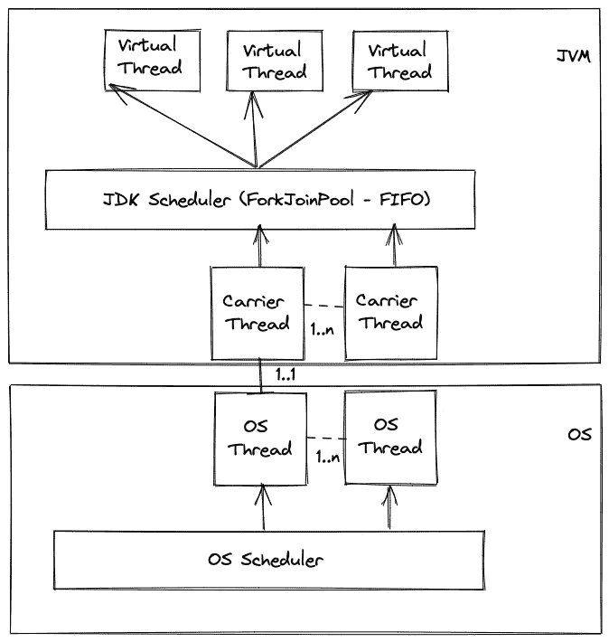
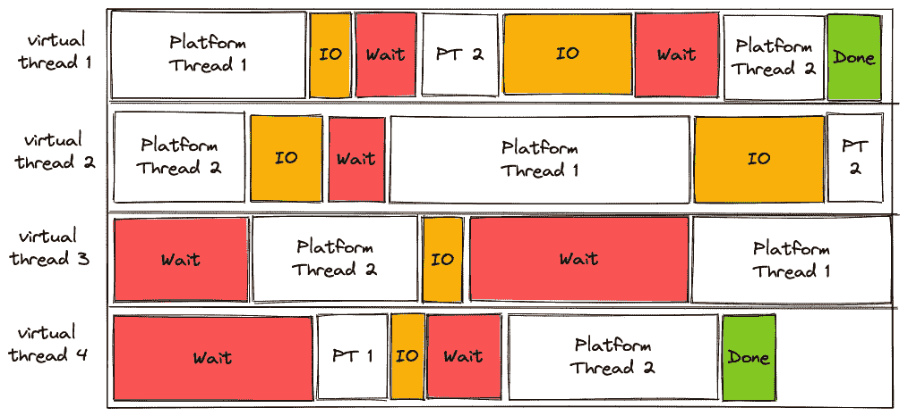

# 理解 Java 虚拟线程

> 原文：<https://betterprogramming.pub/understanding-java-virtual-threads-3b70d8de37a1>

## 关于它如何解决异步编程问题的讨论


由 [Unsplash](https://unsplash.com?utm_source=medium&utm_medium=referral) 上的 [Shubham Dhage](https://unsplash.com/@theshubhamdhage?utm_source=medium&utm_medium=referral) 拍摄的照片

在 JDK 19 版本中，我们可以找到 JDK 开发者工作了很长时间的东西的第一个预览，[项目织机](https://openjdk.org/projects/loom/)。第一个预览版是 JEP 425 的一部分，它允许创建“虚拟线程”因为它仍然是一个预览，当你用 Java 19 编译你的程序时，你必须[启用预览](https://theboreddev.com/how-to-enable-previews-in-java/)。您可以在我们的文章[“如何在 Java 中启用预览”中查看如何在 Java 中启用预览功能](https://theboreddev.com/how-to-enable-previews-in-java/)

最近，虚拟线程的第二个预览版作为 [JEP 436](https://openjdk.org/jeps/436) 的一部分发布。在第一个预览版中引入的一些变化已经被最终确定；我们离获得虚拟线程的完全访问权又近了一步。

在本文中，我们将试图为您提供一个坚实的背景，说明为什么 JVM 生态系统中非常需要 Java 虚拟线程，并为您提供理解 Java 虚拟线程的基础知识。


[潘云波](https://unsplash.com/@panyunbo?utm_source=unsplash&utm_medium=referral&utm_content=creditCopyText)在 [Unsplash](https://unsplash.com/s/photos/platform?utm_source=unsplash&utm_medium=referral&utm_content=creditCopyText) 上拍照

# 平台线程的问题

## 操作系统线程和平台线程之间的奇偶校验

目前，在 JDK 中，Java 线程(也称为“平台”线程)和 OS 线程之间存在一对一的关系。

这意味着当一个线程等待完成一个 IO 操作时，底层操作系统线程将保持阻塞和未使用状态，直到该操作完成。就 Java 生态系统的可伸缩性而言，这一直是个大问题，因为可用的线程限制了我们在主机中的应用程序。

在过去的十年中，我们试图通过使用异步处理库和使用[期货](https://en.wikipedia.org/wiki/Futures_and_promises)来解决这个问题。例如，使用`[CompletableFuture](https://docs.oracle.com/javase/8/docs/api/java/util/concurrent/CompletableFuture.html)`我们可以实现非阻塞的方法，尽管这些模型的可读性在很多情况下不是我们所期望的。如果你有兴趣看一些 CompletableFuture 的例子，你可以阅读我们的文章[“使用 CompletableFuture 的多个 API 调用](https://theboreddev.com/parallel-api-calls-with-completablefuture/)”

# 异步编程的问题是

尽管异步编程是线程限制的可行解决方案，但编写异步代码比顺序代码更复杂。开发人员必须定义回调来基于给定任务的响应应用操作，这使得跟踪和推理代码变得困难。

另一个大问题是调试这些应用程序变得很困难。多线程可以处理给定的请求，因此，调试、记录或分析堆栈跟踪变得很困难。

就灵活性和可维护性而言，异步编程也非常有限。我们必须放弃某些顺序工作流结构，如循环。这意味着一段按顺序编写的代码不容易转换成异步代码。相反的情况也会发生同样的情况。

最后，但同样重要的是，由于随之而来的复杂性，编写显式异步代码更容易出错。

# 创建线程的成本很高

平台线程的另一个问题是，它们很重，制造成本很高。因此，我们需要预先创建它们，并将它们存储在线程池中，以避免每次我们需要线程来运行代码时都创建新的线程。为什么它们很贵？

创建 Java 线程的开销很大，因为它涉及到为线程分配内存、初始化线程堆栈，以及进行操作系统调用来注册操作系统线程。

当我们考虑这两个问题时，操作系统线程的限制和创建平台线程的成本，我们需要有限的线程池来安全地运行我们的应用程序。如果我们不使用有限的线程池，我们就有耗尽资源的风险，这会给我们的系统带来巨大的后果。

# 昂贵的上下文切换

这种设计的另一个问题是上下文切换有多昂贵。当存在上下文切换时，OS 线程从一个平台线程切换到另一个平台线程。操作系统必须保存当前线程的本地数据和内存指针，并为新的平台线程加载这些指针。上下文切换是非常昂贵的操作，因为它涉及许多 CPU 周期。操作系统暂停一个线程，保存它的堆栈，并分配新的线程。这个过程成本很高，因为它需要加载和卸载线程堆栈。

那么，我们如何解决这些问题呢？这就是 [Project Loom](https://openjdk.org/projects/loom/) 及其虚拟线程发挥作用的地方。让我们看看如何！

# 虚拟线程拯救世界

Java 中的虚拟线程得名于对虚拟内存的类比[。这是因为我们有一种拥有几乎无限数量的可用线程的错觉(形象地说)，就像虚拟内存一样。](https://www.techtarget.com/searchstorage/definition/virtual-memory#:~:text=Virtual%20memory%20is%20a%20common,(RAM)%20to%20disk%20storage.)


由[阿曼德·库利](https://unsplash.com/@armand_khoury?utm_source=unsplash&utm_medium=referral&utm_content=creditCopyText)在 [Unsplash](https://unsplash.com/s/photos/illusion?utm_source=unsplash&utm_medium=referral&utm_content=creditCopyText) 拍摄的照片

虚拟线程解决了 JDK 中可伸缩性的一个主要问题，但是它是如何解决的呢？答案主要是通过打破平台线程和操作系统线程之间的关联。

JVM 生态系统中的许多应用程序在达到它们的 CPU 或内存极限之前就崩溃了，这主要是由于平台线程和 OS 线程之间的这种奇偶校验。创建平台线程是非常昂贵的。因此，需要使用线程池。我们总是受到主机中可用的处理单元(CPU)数量的限制。

另一方面，虚拟线程对系统的开销最小。因此，在我们的应用程序中可以有成千上万个。每个虚拟线程都需要一个操作系统线程来完成一些工作，但是在等待资源时，它不会占用操作系统线程。这意味着虚拟线程可以等待 IO，释放它们当前正在使用的平台线程，以便另一个虚拟线程可以使用它来做一些工作，并在 IO 操作完成后继续它们的工作。

这样做的主要好处是什么？答案之一是廉价的上下文切换！我们来看看为什么！

# 廉价的上下文切换

正如我们前面提到的，在 Java 中，上下文切换是非常昂贵的，因为每次发生时都必须保存和加载线程堆栈。

虚拟线程的区别在于，由于它们在 JVM 的控制下，线程堆栈存储在堆内存中，而不是堆栈中。这意味着为唤醒的虚拟线程分配线程堆栈变得更加便宜。将虚拟线程的数据堆栈加载到“载体”线程堆栈的过程称为挂载。相反的过程称为卸载。

现在让我们简单地看一下线程调度。

# 行程安排

操作系统调度传统的平台线程，而 JDK 运行时调度虚拟线程。

在平台线程的情况下，操作系统调度程序负责给每个操作系统线程分配工作。其方法是给每个进程分配[时间片](https://en.wikipedia.org/wiki/Preemption_(computing)#Time_slice)。当这个时间结束时，轮到另一个进程获得 CPU 时间来做一些工作。这就是操作系统试图确保在现有进程中公平分配 CPU 时间的方式。

另一方面，虚拟线程由 JDK 运行时直接调度。它的实现方式是在内部使用一个`[ForkJoinPool](https://theboreddev.com/discover-java-forkjoinpool/)`。这是一个用作虚拟线程调度程序的专用池。这意味着由`[ForkJoinPool.commonPool](https://docs.oracle.com/javase/8/docs/api/java/util/concurrent/ForkJoinPool.html#commonPool--)`返回的公共池是与这个新实例不同的实例。



图片来源:作者

JDK 调度程序不使用时间片。在这种情况下，虚拟线程在等待阻塞操作响应时会让出并放弃它的承载线程。主要的结果是，我们将有一个更好的资源利用，因此，在我们的应用程序的吞吐量增加。

值得一提的是，底层平台线程，在调度方面也称为载体线程，仍然由操作系统调度程序管理。它们现在是一个抽象层，对于编写并发代码的开发人员来说完全不可见。

这里要考虑的另一个方面是，虚拟线程提供了并行执行工作的错觉。正在发生的是处理单元的时间得到更有效的分配。每个处理单元不会并行工作，只是从一个虚拟线程切换到另一个虚拟线程，频率更高，成本更低。

既然我们已经看到了虚拟线程是如何工作的，现在我们可能会有一个问题。每个应用程序都会从虚拟线程的引入中受益吗？不完全是。让我们看看这是为什么。

# IO 绑定的应用程序

在采用虚拟线程后，并不是每个应用程序都能从巨大的性能提升中受益。只有当我们的应用程序受限于 IO 时，我们才会看到巨大的好处。

这是什么意思？IO 绑定的应用程序花费大量时间等待 IO 操作的响应，例如网络调用、文件或数据库访问。这些是现今大多数的应用。

在 IO 绑定的应用程序中，使用虚拟线程的好处是巨大的，因为虚拟线程非常擅长等待，这意味着线程可以在性能方面以非常廉价的方式等待和恢复。

在这种情况下，虚拟线程在等待时会阻塞，但平台线程不会。平台线程将被分配给不同的虚拟线程，以继续做有用的工作，而不是等待。这意味着我们的系统将有更好的资源利用率！

在下面的例子中，我们将两个平台线程映射到操作系统中的一个对应的 OS 线程。我们可以看到，平台线程总是忙于做一些工作，而不是等待 IO 的完成。

每当一个虚拟线程等待 IO 时，它就会放弃以释放它的载体线程。一旦 IO 操作完成，虚拟线程将被放回 [ForkJoinPool](https://theboreddev.com/discover-java-forkjoinpool/) 的 FIFO 队列中，并等待一个载体线程可用。



图片来源:作者

这也意味着我们可以大大提高应用程序的吞吐量。虚拟线程通过增加我们可以并发处理的任务数量来实现这一点，而不是通过减少延迟。说清楚一点，虚拟线程并不比平台线程快。他们只是在等待和分配工作的方式上更有效率。

对于 CPU 受限的应用程序，我们有其他工具来提高其性能，如并行任务或 ForkJoinPool 中的[工作窃取。虚拟线程对性能的影响很小。请记住两者的区别，以免得到意想不到的结果！](https://theboreddev.com/discover-java-forkjoinpool/)

虚拟线程给我们的应用带来了什么好处？有一个很重要的。我们现在可以以同步方式编写非阻塞并发代码。

# 非阻塞操作的同步方式

随着 Java 中虚拟线程的引入，编写并发代码得到了极大的简化。我们的代码变得更容易阅读和理解；这是当今异步编程的一个大问题，它的复杂性有时会失控。

我们现在可以编写并发代码，而不用编排可能异步发生的交互。JDK 运行时将为我们处理它，在现有的虚拟线程中分配可用的操作系统线程。

如果我们使用 Java 中可用的传统并发机制来维护旧的应用程序，会发生什么？

# 向后兼容性

如果您想知道在迁移到 Java 19 之后，如果它使用同步块或任何传统的并发机制，您的代码会发生什么，这是一个好消息。旧的并发代码将与虚拟线程一起工作，而根本不需要修改它。在许多情况下，您甚至可能不需要重新编译和构建新的工件，因为 JDK 运行时会处理所有这些。在其他情况下，充分利用虚拟线程所需的更改很少。

让我们看看 JDK 空气污染指数现在是什么样的！

# 用虚拟线程编程

JEP 425 提出的 JDK 有一些变化。我们将看到，如何编写代码来利用虚拟线程是非常简单的。

您可以像往常一样编写代码。虚拟线程是 JDK 的一个内置特性。因此，你不需要做太多就可以利用它。

一个好处是虚拟线程从`Thread`类扩展而来。不需要新的线程类对象。

唯一的变化是我们如何定义我们创建的线程是代表虚拟线程还是平台线程。为了实现这一点，JDK 引入了一个`[Thread.Builder](https://docs.oracle.com/en/java/javase/19/docs/api/java.base/java/lang/Thread.Builder.html)`来方便地实例化和配置这两者。

`[Thread.Builder](https://docs.oracle.com/en/java/javase/19/docs/api/java.base/java/lang/Thread.Builder.html)`提供了两种实例化线程的方法。其中一个使用`[Thread.Builder.ofPlatform()](https://docs.oracle.com/en/java/javase/19/docs/api/java.base/java/lang/Thread.Builder.OfPlatform.html)`方法创建了一个传统的平台线程。要实例化一个虚拟线程，我们必须使用`[Thread.Builder.ofVirtual()](https://docs.oracle.com/en/java/javase/19/docs/api/java.base/java/lang/Thread.Builder.OfVirtual.html)`来代替。

另一个变化是包含了一个新的`[ExecutorService](https://docs.oracle.com/en/java/javase/19/docs/api/java.base/java/util/concurrent/ExecutorService.html)`。这个新的执行器服务可以通过运行`[Executors.newVirtualThreadPerTaskExecutor()](https://docs.oracle.com/en/java/javase/19/docs/api/java.base/java/util/concurrent/Executors.html#newVirtualThreadPerTaskExecutor())`方法来实例化。

让我们通过几个例子来看看它是如何工作的！

# executors . newvirtualthreadpertaskmexecutor()

这种新方法可以轻松地从现有的并发代码过渡到虚拟线程。让我们看看下面的例子:

```
final LongAdder adder = new LongAdder();
Runnable task = () -> {
    try {
        Thread.sleep(10);
        System.out.println("I'm running in thread " + Thread.currentThread());
        adder.increment();
    } catch (InterruptedException e) {
        Thread.interrupted();
    }
};
long start = System.nanoTime();
try (ExecutorService executorService = Executors.newCachedThreadPool()) {
    IntStream.range(1, 10000)
            .forEach(number -> executorService.submit(task));
}
long end = System.nanoTime();
System.out.println("Completed " + adder.intValue() + " tasks in " + (end - start)/1000000 + "ms");
```

您可以看到上面的示例如何使用缓存的线程池来提交 10，000 个任务，模拟一个小的 IO 操作，该操作需要 10ms 加上打印到控制台和增加计数器的时间。

如果我们运行这段代码，我们会得到以下结果:

```
...
I'm running in thread Thread[#1271,pool-1-thread-1242,5,main]
I'm running in thread Thread[#1260,pool-1-thread-1231,5,main]
I'm running in thread Thread[#928,pool-1-thread-899,5,main]
I'm running in thread Thread[#275,pool-1-thread-246,5,main]
Completed 9999 tasks in 4740ms
```

为了简洁起见，我只包括了最新的元素和最终结果。您可以看到我们如何使用缓存线程池中的平台线程。运行这么简单的东西需要 4.7 秒。

让我们看看使用新的虚拟线程执行器会发生什么:

```
long start = System.nanoTime();
try (ExecutorService executor = Executors.newVirtualThreadPerTaskExecutor()) {
       IntStream.range(1, 10000)
               .forEach(number -> executor.submit(task));
}
long end = System.nanoTime();
System.out.println("Completed " + adder.intValue() + " tasks in " + (end - start)/1000000 + "ms");
```

您会注意到，切换到虚拟线程就像切换到新的 executor 服务一样简单。其余的代码保持不变！太棒了，对吧？

使用虚拟线程的性能如何？这些是我们得到的结果:

```
I'm running in thread VirtualThread[#10029]/runnable@ForkJoinPool-1-worker-10
I'm running in thread VirtualThread[#10031]/runnable@ForkJoinPool-1-worker-10
I'm running in thread VirtualThread[#10027]/runnable@ForkJoinPool-1-worker-10
I'm running in thread VirtualThread[#10028]/runnable@ForkJoinPool-1-worker-10
Completed 9999 tasks in 760ms
```

虚拟线程只用了 760ms！这是为什么呢？正如我们前面看到的，当虚拟线程等待 IO 操作时，平台线程不会被阻塞。因此，在虚拟线程等待时，可以处理其他任务。这对 JVM 生态系统来说是巨大的！

# 虚拟的线程()

现在让我们看一个类似的例子。在这种情况下，我们将使用`Thread.ofPlatform()`和`Thread.ofVirtual()`来指定我们将在测试中使用哪种线程。

我们将首先使用`Thread.ofPlatform()`运行一个例子:

```
long start = System.nanoTime();
int[] numbers = IntStream.range(1, 10000).toArray();
List<Thread> threads = Arrays.stream(numbers).mapToObj(num ->
        Thread.ofPlatform()
                .start(task)
).toList();
threads.parallelStream().forEach(thread -> {
    try {
        thread.join();
    } catch (InterruptedException e) {
        throw new RuntimeException(e);
    }
});
long end = System.nanoTime();
System.out.println("Completed " + adder.intValue() + " tasks in " + (end - start)/1000000 + "ms");
```

我们启动 9，999 个线程来运行我们在上一个示例中使用的相同任务。然后，我们使用`[join()](https://docs.oracle.com/javase/tutorial/essential/concurrency/join.html)`等待它们完成。

如果我们运行这个测试，大约需要 2-3 秒钟来完成。结果如下:

```
I'm running in thread Thread[#10023,Thread-9993,5,main]
I'm running in thread Thread[#10025,Thread-9995,5,main]
I'm running in thread Thread[#10026,Thread-9996,5,main]
I'm running in thread Thread[#10028,Thread-9998,5,main]
Completed 9999 tasks in 2394ms
```

如果我们使用相同的例子，但是实例化虚拟线程，会发生什么？

```
List<Thread> threads = Arrays.stream(numbers).mapToObj(num ->
        Thread.ofVirtual()
                .start(task)
).toList();
```

正如我们在前面的例子中观察到的，虚拟线程提供了更好的吞吐量，如下面的结果所示:

```
I'm running in thread VirtualThread[#10029]/runnable@ForkJoinPool-1-worker-4
I'm running in thread VirtualThread[#10030]/runnable@ForkJoinPool-1-worker-4
I'm running in thread VirtualThread[#10031]/runnable@ForkJoinPool-1-worker-4
I'm running in thread VirtualThread[#9954]/runnable@ForkJoinPool-1-worker-5
Completed 9999 tasks in 722ms
```

同样，虚拟线程以相当大的差异击败了平台线程。

请记住，这些计时是不准确的，因为我们没有运行适当的基准。我们没有预热 JVM，以便给 JIT 编译器时间来执行改进，并且我们也在运行单次执行。这向您展示了使用虚拟线程可以提高多少吞吐量！

我们想提一下，虚拟线程也为在 Java 中引入结构化并发打开了大门。这一改变将使 Java 代码在不同嵌套层次上运行多个并发任务时更加安全。

Java 将很快引入结构化并发和作用域，作为 T2 JEP 429 T3 的一部分。这与科特林在他们的[协程](https://kotlinlang.org/docs/coroutines-overview.html)中所做的非常相似。

# 结论

在本文中，我们看到了虚拟线程将如何解决 Java 生态系统中的一个主要问题。由于主机中操作系统线程数量的限制，操作系统线程和平台线程之间的现有奇偶校验对于某些应用来说是一个巨大的限制因素。

长期以来，异步编程一直是我们的救星。然而，我们看到虚拟线程是导致我们认为异步编程死亡的一个重要因素。在下一个 JDK 版本中提供这一更改后，将采用简单的并发范例。

这就是我们今天的全部内容！我们希望您喜欢这篇文章，并对 JVM 生态系统有所了解。我们认为，在即将到来的变化之后，JVM 生态系统以及这个社区的所有开发人员和语言的未来是光明的。

感谢阅读。