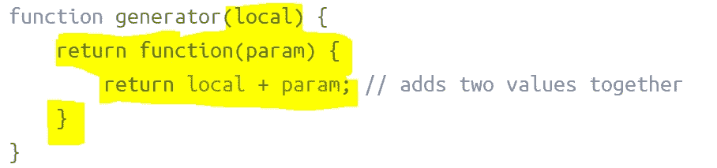

# 理解 JavaScript 闭包

> 原文：<https://betterprogramming.pub/understanding-javascript-closures-87838e459cc8>

## 通过几个例子学习 JavaScript 的基本概念


照片由 [Aaron Burden](https://unsplash.com/@aaronburden?utm_source=medium&utm_medium=referral) 在 [Unsplash](https://unsplash.com?utm_source=medium&utm_medium=referral) 上拍摄

你想学习并掌握 JavaScript 函数闭包吗？你来对地方了！

# 前言

要理解这个教程，你基本上只需要知道什么是函数和变量。阅读完这里的例子后，你会知道*范围*、*词法环境*、*内部*和*外部*函数，当然还有*闭包！*

# 基础

让我们先回顾一些基础知识。函数接受参数并返回结果。例如，名为`add`的函数可以接受两个参数并返回一个和:

```
function add(a,b) {
    return a + b;
}
```

我们也可以使用匿名函数语法(即函数没有名字)重写，将它赋给一个名为`add`的变量:

```
const add = function (a,b) {
    return a + b;
}
```

当我们创建一个函数时，我们可以访问全局范围。这意味着每个函数都可以访问共存的全局变量(即在全局范围内声明的变量):

```
const name = 'I am global variable'; // global scopefunction add (a,b) {
    console.log(name); // 'name' is global variable
    return a + b;
}const result = add(3,5); // console.log will output: 'I am global variable' and add function will return 8 as expected
```

我们也可以在函数内部创建*局部*变量:

```
function add (a,b) {
    const result = a + b; // result is local variable
    return result;
}
```

在这个例子中，`result`是一个作用于`add`函数内部的*局部*变量，这意味着在函数外部，它是不可用的。换句话说，`result`有一个被功能性的开括号和闭括号`{}`绑定的环绕状态——这也被称为*词汇环境*。

# 关闭

闭包是其他函数内部的函数，可以访问它们的*词法环境*。

让我们在另一个名为`add5`的函数中创建一个函数，它显然会接受一个参数并将其值增加`5`:

```
function add5 (a) {          // outer function
    const b = 5;             // local variable
    function add (a) {       // inner function
         return a + b;       // a and b are both available inside
    }
    return add(a,b);
}const result = add5(3);      // returns 8 as expected
```

奇怪的是，这过于复杂了，但是我们马上会简化它。

现在，重点是说明内部的`add`函数可以访问外部函数中定义的局部变量，因为`b`变量和`add` 函数共享`add5`函数的相同范围——两者都在外部的`{}`括号中声明。

让我们做一点重构，去掉局部`b`变量。毕竟在那里完全没必要。此外，我们希望重用我们的代码。我们希望能够轻松地创建像`add1`、`add5`和`add10`这样的函数。我们还将重命名我们的外部函数`generator`。这将帮助我们生成其他函数:

```
function generator(a) {
    return function(param) {
        return a + param;   // a and param are both available inside
    }
}const add1 = generator(1); // set a = 1 and return inner function
const add5 = generator(5); // set a = 5 and return inner function
const add10 = generator(10); // set a = 10 and return inner functionadd1(3); // returns 4 as a = 1 and param = 3
add5(3); // returns 8 as a = 5 and param = 3
add10(3); // returns 13 as a = 10 and param = 3
```

我们新的`generator`函数返回一个将`a`和`param`相加的函数，并且有一个输入参数`a`的词法范围。因此，当每个函数被调用时，*内部*函数仍然可以访问`a`并记住它的值(维护一个引用),从函数被创建时开始。因此，我们可以创建类似于`add1`或`add10`的函数。

为了有一个更好的视图，让我们最终将`a`重命名为`local`，并突出内部函数的词法环境:



这基本上是一个闭包——它是内部函数与外部函数相同范围内的变量的组合(在本例中，它是`generator`函数的输入参数，简称为`local`)。

# 结论

[闭包](https://developer.mozilla.org/en-US/docs/Web/JavaScript/Closures)是 JavaScript 的基本概念。在这篇短文中，我们通过简单的例子展示了如何创建和使用闭包。

当你来自面向对象编程时，这可能是一个有点奇怪的概念，但这是函数式编程中的一个核心概念。

如果你有任何问题或意见，请在下面分享。