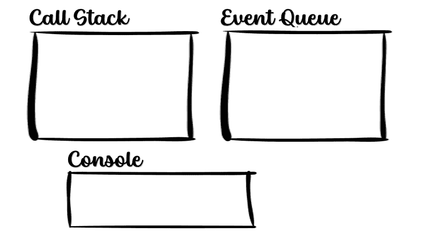
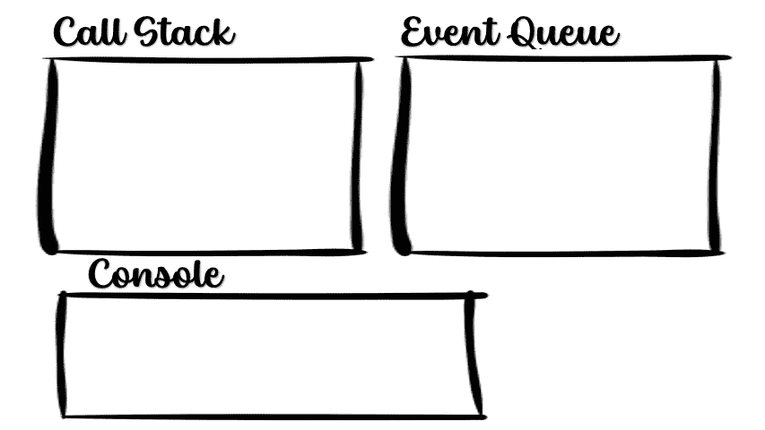

# 理解 JavaScript 事件循环

> 原文：<https://betterprogramming.pub/understanding-javascript-event-loops-6a972c35e509>

## 你有没有想过 JavaScript 是如何运行异步代码的，因为它是单线程语言？嗯，我也是！很疯狂，不是吗？


由 pixabay.com 的

## JavaScript 中的异步代码是什么？

JavaScript 中的异步代码可能作为`setTimeout`或`setInterval`函数的回调、click 或 hover 等事件的事件回调、HTTP 请求的回调或 promise 回调出现。

## 异步代码是如何执行的？

在多线程框架中，在异步函数的情况下，可能会分配一个新线程，到时候，代码将由这个额外的线程执行。同时，其他线程可以执行代码的不同部分。
另一方面，在单线程框架中，我们没有这样做的资源。那么它如何运行异步代码呢？

为了理解这一点，我们需要理解我们所说的这个单线程框架是什么。嗯，是 JavaScript 引擎，它是一个执行 JavaScript 代码的软件组件。浏览器有多个软件来完成多个任务，浏览器支持的最常见的功能之一是 Web APIs。神奇的是:

虽然浏览器的 JavaScript 引擎是单线程的，但浏览器应用程序本身不是单线程的，因此可以分配不同的线程来处理 Web API 函数。

Web API 函数有哪些？点击事件、地理位置服务、计时器、HTTP 请求等。

现在，我们知道我们有几个线程，一个用于 JS 引擎，它自己执行 JS 代码，其他的用于处理 Web API 函数，我们仍然需要理解它是如何作为异步函数实现的？这就是事件队列发挥作用的地方。

## 什么是事件队列？

一连串的动作。对于所有队列，事件队列被实现为先进先出。进入队列的第一个动作将首先弹出。一旦 Web API 线程完成了它必须做的操作(调用了计时器，返回了 HTTP 请求，等等)，这些操作就被输入到队列中，然后它会将相关的回调操作插入到事件队列中。有两种方法可以将操作弹出事件队列。

1.  每次调用栈变空时，JS 引擎将检查事件队列中是否有等待的操作，如果有，它将把它添加到调用栈中。
2.  每次向事件队列添加操作时，JS 引擎都会检查调用堆栈是否为空，如果是，它会将操作传递给调用堆栈。

让我们看看下面的例子:

## 第一个例子

当调用堆栈为空时，一个操作被添加到事件循环中，并立即转移到调用堆栈。

```
console.log("Hi, there");
setTimeout(()=> 
    console.log("I'm Tom"), 3000);
console.log("I'm Jerry!");
```

首先发生的是，第一行将从调用堆栈中弹出并被执行。

```
>> Hi, there
```

现在，将弹出下一个命令— `setTimeout`，正如前面提到的，这是一个 Web API 支持的功能。所以浏览器现在创建一个新线程，在执行计时器的回调之前数到 3。
接下来，将弹出并执行第三个命令，现在我们来看看

```
>> Hi, there
>> I'm Jerry
```

三秒钟后，Web API 将完成它的三秒钟倒计时，超时回调将被推送到事件队列。
由于在这个阶段调用栈是空的，动作将立即转移到调用栈。



希拉·克莱斯勒的 GIF

## 第二个例子:

一个操作进入事件队列并在那里等待，直到调用堆栈为空。

```
this.http.get("[www.tomAndJerry.com/getJerry](http://www.tomAndJerry.com/getJerry)");
FourSecCalculation();
ThreeSecCalculation();
TwoSecCalculation();
```

第一个动作是 HTTP 请求，这是另一个 Web API 操作。这个请求将由 Web API 线程执行和处理，而下一个动作将从调用堆栈中弹出，并使 JavaScript 引擎保持忙碌 4 秒钟。之后，将触发一个耗时 3 秒的动作，然后触发一个耗时 2 秒的动作。

与此同时，HTTP 请求将返回一个响应，Web API 将在事件队列中添加动作，在事件队列中，它将一直等到调用堆栈为空。

只有在两秒钟的计算执行完成后——调用堆栈将变空，JavaScript 引擎才会检查事件队列中是否有操作正在等待。在那里，它将找到 HTTP 响应动作，并将它插入到调用堆栈中。



希拉·克莱斯勒的 GIF

总而言之 JavaScript 引擎确实是单线程的，但是它使用其他服务来处理外部动作/API。一旦一个外部服务(比如 Web API)完成了它的任务，它就会在事件队列中插入一个回调动作。

动作将在队列中等待，直到调用栈为空，然后它将被传递给调用栈并被执行——这就是我的朋友们，异步动作是如何在 JS 中实现的。