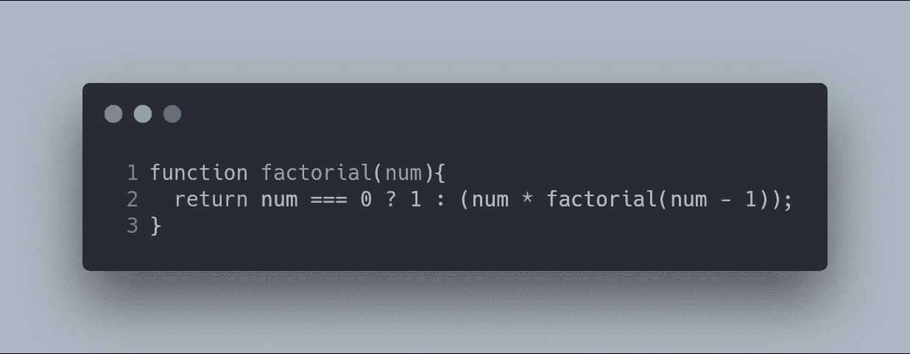
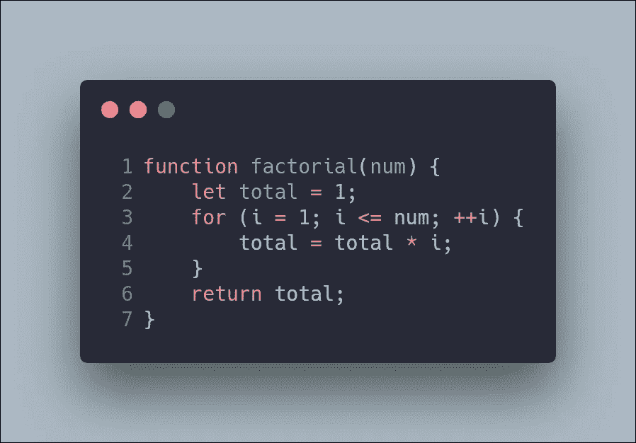
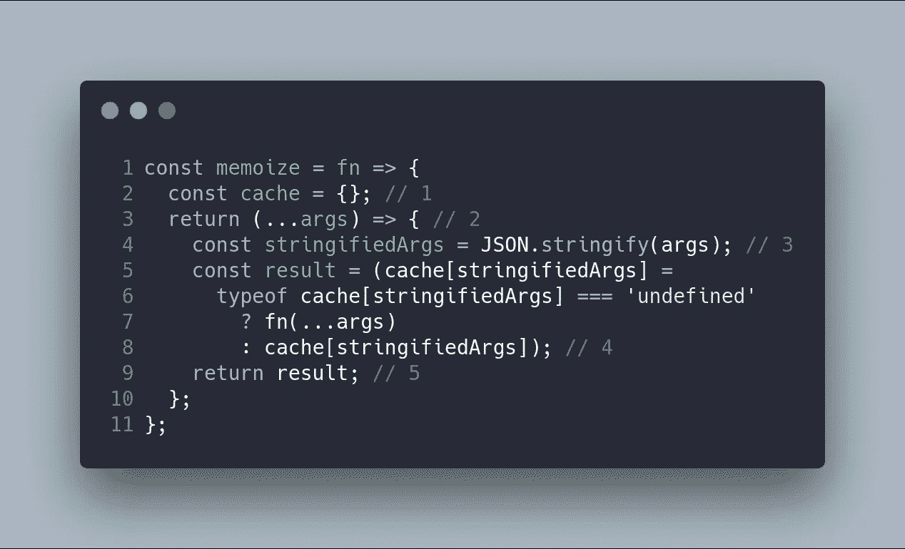
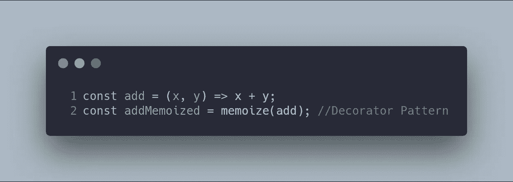
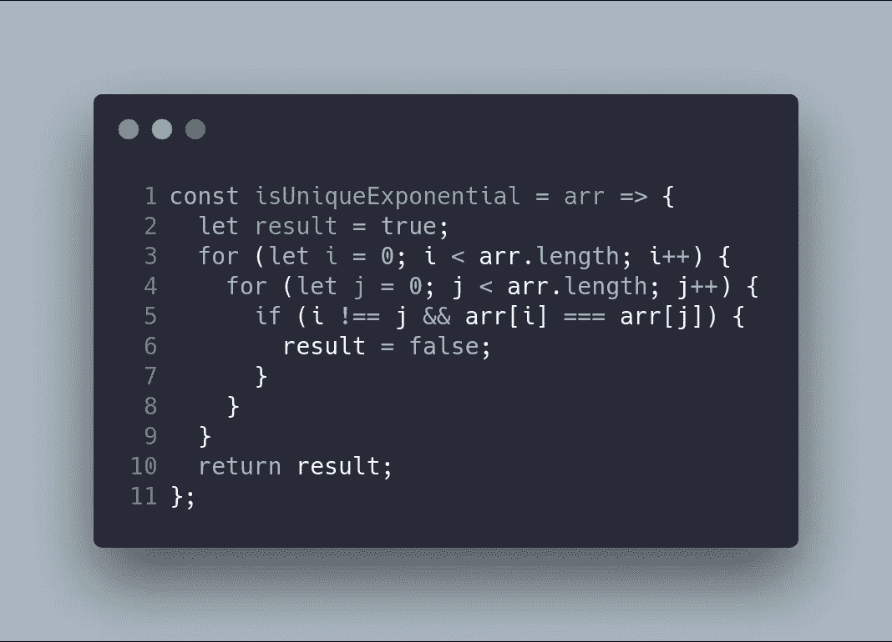
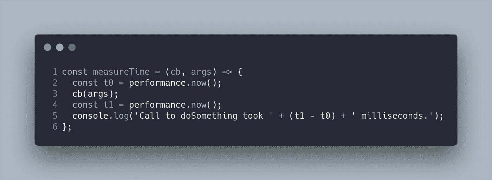
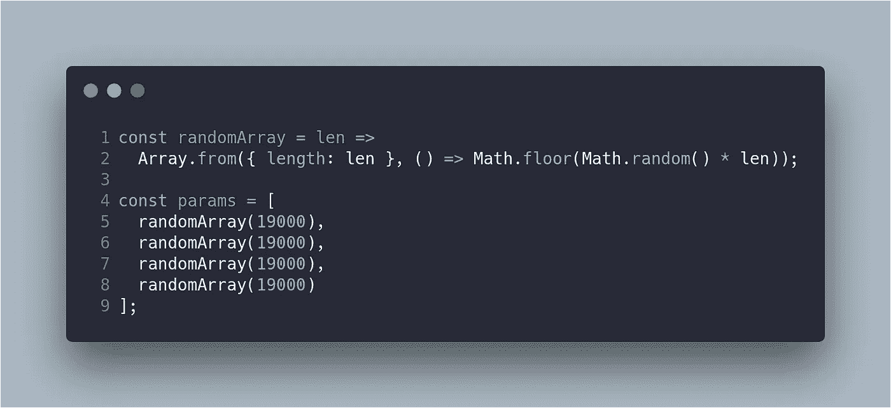
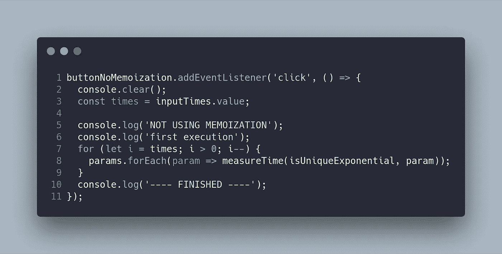
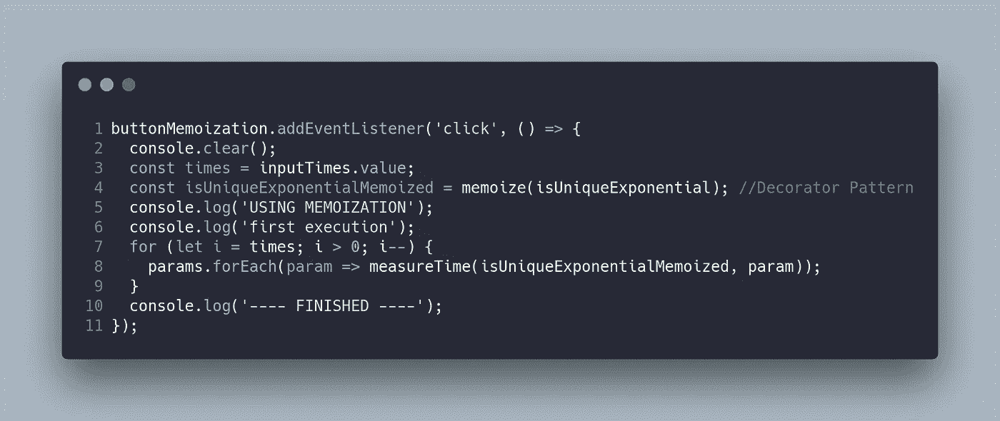
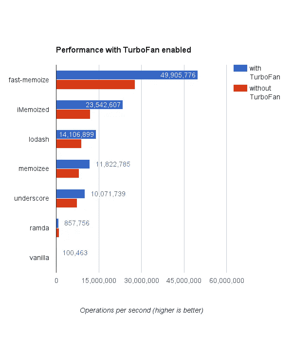

# 了解 JavaScript/TypeScript 记忆

> 原文：<https://betterprogramming.pub/understanding-javascript-typescript-memoization-6e0333b62406>

## JavaScript 和类型脚本教程

# 什么是记忆化？

维基百科对记忆化的定义如下:

> 在计算中，记忆化是一种优化技术，主要用于通过存储昂贵的函数调用的结果并在相同的输入再次出现时返回缓存的结果来加速计算机程序—维基百科

记忆化是一种编程技术，它允许你用空间成本来减少函数的时间成本。也就是说，被记忆的函数由于更高的存储空间利用率而获得速度。

记忆化只能用在纯函数中，所以要知道的第一点就是它是纯函数。

在下面的动画中，你可以看到在我们的代码中应用记忆化的最终结果。

# 什么是纯函数？

纯函数是满足以下标准的函数:

当参数相同时，这个函数总是返回相同的结果。例如，以下函数是不纯的:

*   使用随机数的函数。
*   使用日期时间作为种子来生成结果的函数。

这是一个在应用中不会产生副作用的函数:

*   数据突变或改变应用程序状态。
*   网络请求。
*   数据库或文件请求。
*   获取用户输入。
*   查询 DOM。

# 利益

在 web 开发中使用纯函数有几个好处。虽然，纯函数不仅仅用在 web 开发中。嗯，纯功能的主要好处是:

1.  您的代码更具声明性，它关注的是必须做什么，而不是如何做。此外，这些功能还关注不同的输入与输出之间的关系。
2.  代码可测试性更强，找到 bug 比在不纯的函数中更容易。

但是，在现实生活中有副作用，这是代码的一个很好的部分(例如，当您访问数据库或与不同的服务器通信以请求关于系统的信息时)。

所以，纯函数是代码的一部分，你需要知道什么时候可以使用纯函数，什么时候可以在代码中使用记忆化。

# 纯函数示例

递归函数经常使用纯函数。最经典的递归问题是阶乘。

但是命令式阶乘函数也是纯函数，因为纯函数与输入和输出相关。在这两种情况下，当输入相同时，输出也相同。

纯函数的另一个有趣的例子如下:

# 递归函数的记忆化

记忆化是一种编程技术，它允许你不重新计算纯函数的值。

即，当纯函数具有相同的输入时，它返回相同的值。因此，可以使用任何缓存系统(例如映射或数组)将返回值存储在系统中。

所以，如果你计算了`factorial(1)`的值，你就可以存储返回值`1`，同样的操作可以在每次执行中完成。所以，当你运行阶乘(100)时，第一次需要一段时间，但第二次和以后的其他时间，时间会减少！

在这种情况下，如果你注意到递归阶乘版本，你可以注意到这个版本多次执行函数`factorial`，这可以缓存在我们的系统中(使用 memoization)，但如果你使用命令式阶乘版本，你的性能会更差。

出于这个原因，`memoization`是声明性语言中的一项好技术。

# 记忆示例—实时代码

在这一节中，我将向您展示如何使用`closure`实现记忆化，以及如何使用 JavaScript 实现`decorator`模式。

装饰模式允许您在运行时使用组合而不是层次结构向任何对象添加新特性。模式的目标是避免创建特性的类层次结构。

理解这种模式的一个很好的例子可以在 Addy Osmany 的博客中找到。

因此，JavaScript 中 memoize 装饰器的一个基本实现如下:

1.  定义将存储执行结果的缓存。我们使用一个对象作为`map`来存储这个结果。
2.  装饰器返回一个新函数，它的行为与原始函数相同，但实现了记忆。
3.  键值映射的键是使用来自原始函数的`stringify`和 args 生成的。
4.  新功能的`result`将是:

*   原始函数(`fn(...args)`)的执行，缓存中是否没有存储。
*   存储在缓存中的值(之前是否预先计算过)。

5.`result`返回。

# 如何使用记忆装饰器？

在 JavaScript 中使用这个装饰器的方法非常简单:

在这种情况下，`add`函数是没有记忆化的原始函数，而`addMemoized`函数是使用装饰模式的具有新特性(记忆化)的新函数。

# 使用记忆的真实演示

现在，我将向你们展示一个使用记忆化的真实演示。

想象一个复杂的算法，它向您表明一个`array`是否有一个唯一的值(如`Array.prototype.some`)但是被可怕地编程了。

下面的步骤是运行原始代码和使用 memoization 的代码，并比较每个函数所用的时间。非常重要的一点是，不要修改原始代码，而是添加了记忆功能。

下面的函数用于测量每次执行所用的时间。

这些数组是在脚本开始时生成的:

最后，当用户点击按钮时，功能被执行。

1.  无记忆性:

2.记忆化:

结果如以下动画所示:

# 结论

在使用 TypeScript 或 JavaScript 的 web 开发中，记忆化已经得到了广泛的发展。下面的资源列表应该是在项目中使用它们的起点。

*   [快速记忆](https://github.com/caiogondim/fast-memoize.js)
*   [莫伊泽](https://github.com/planttheidea/moize)
*   [Memoizee](https://github.com/medikoo/memoizee)
*   [装饰工](https://github.com/steelsojka/lodash-decorators)

快速记忆使用此图比较记忆的不同实现:

更多理论:

*   GitHub 项目[。](https://github.com/Caballerog/blog/memoization)